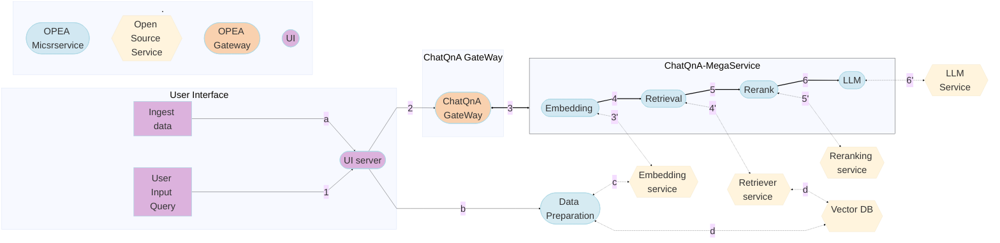

# Contribution Guidelines

Thanks for considering contributing to OPEA project. The contribution process is similar with other open source projects on Github, involving an amount of open discussion in issues and feature requests between the maintainers, contributors and users.


## All The Ways To Contribute

### Contribute a GenAI Component

1. Navigate to [OPEA GenAIComps](https://github.com/opea-project/GenAIComps) and locate the component folder your integration belongs to. If the microservice type already exists, review the [OPEA microservice API](https://opea-project.github.io/latest/developer-guides/OPEA_API.html#opea-micro-service-api) and follow it in your implementation. Otherwise, if you are contributing a brand new microservice type, you need to define and contribute first its API specification. Please start by submitting an RFC to get community feedback.


    ```
    GenAIComps
    ├── comps
    │   ├── __init__.py
    │   ├── agent
    │   ├── animation
    │   ├── asr
    │   ├── chathistory
    │   ├── cores
    |   │   ├── common
    │   │   ├── mega     # orchestrator, gateway, micro_service class code
    │   │   ├── proto    # api protocol
    │   │   └── telemetry
    │   ├── dataprep
    │   ├── embeddings
    │   ├── feedback_management
    │   ├── finetuning
    │   ├── guardrails
    │   ├── image2image
    │   ├── image2video
    │   ├── llms
    │   ├── lvms
    │   ├── prompt_registry
    │   ├── rerankings
    │   ├── retrievers
    │   ├── text2image
    │   ├── text2sql
    │   ├── third_parties  # open microservices (i,e tgi, vllm...)
    │   ├── tts
    │   ├── version.py
    │   └── web_retrievers
    ├── pyproject.toml
    ├── requirements.txt
    ├── setup.py
    └── tests
        ├── agent
        ├── animation
        ├── asr
        ├── chathistory
        ├── cores
        ├── dataprep
        ├── embeddings
        ├── feedback_management
        ├── finetuning
        ├── guardrails
        ├── image2image
        ├── image2video
        ├── llms
        ├── lvms
        ├── prompt_registry
        ├── rerankings
        ├── retrievers
        ├── text2image
        ├── text2sql
        ├── third_parties
        ├── tts
        ├── utils
        └── web_retrievers
    ```

2. Follow the folder structure in the TEI embedding component below:

    ```
    GenAIComps
    ├── comps
    │   └── embeddings
    |   |   ├── deployment
    |   |   │   ├── docker_compose
    |   |   │   │   └── compose.yaml
    |   |   │   └── kubernetes
    |   |   │       ├── README.md
    |   |   │       └── cpu-values.yaml
    |   |   └── src
    |   |       ├── Dockerfile
    |   |       ├── README.md    # could be multiple files for different integrations
    |   |       ├── __init__.py
    |   |       ├── integrations
    |   |       │   ├── __init__.py
    |   |       │   ├── multimodal_bridgetower.py
    |   |       │   ├── predictionguard.py
    |   |       │   └── tei.py
    |   |       ├── opea_embedding_microservice.py
    |   |       ├── opea_multimodal_embedding_microservice.py
    |   |       └── requirements.txt
    |   ├── third_parties
    |   │   ├── bridgetower
    |   │   ├── clip
    |   │   ├── elasticsearch
    |   │   ├── gpt-sovits
    |   │   ├── milvus
    |   │   ├── mongodb
    |   │   ├── nginx
    |   │   ├── opensearch
    |   │   ├── pathway
    |   │   ├── pgvector
    |   │   ├── redis
    |   │   ├── speecht5
    |   │   ├── tei
    |   │   ├── teirerank
    |   │   ├── tgi
    |   │   ├── vdms
    |   │   ├── vllm
    |   │   ├── wav2lip
    |   │   └── whisper
    ├── tests
    │   └── embeddings
    |       ├── test_embeddings_multimodal_bridgetower.sh
    |       ├── test_embeddings_multimodal_bridgetower_on_intel_hpu.sh
    |       ├── test_embeddings_predictionguard.sh
    |       └── test_embeddings_tei.sh
    └── README.md
    ```

    - **File Descriptions**:
      - `deployment/docker_compose` and `deployment/kubernetes`: These folders contain the deployments for the different integrations
      - `src/opea_embedding_microservice.py`: This file defines and registers the microservice. It serves as the entrypoint of the Docker container.
      - `src/integrations/tei.py`: Integrations define how OPEA integrates the third_parties services. 
      - `src/requirements.txt`: This file is used by Docker to install the necessary dependencies for opea component and all integrations
      - `src/Dockerfile`: Used to generate the service container image.
      - `tests/[microservices type]/` : contains end-to-end test for microservices. Please follow naming convention:`test_[microservice type]_[integration type].sh` or `test_[microservice type]_[integration type]_on_[hardware].sh` if hardware specific. This will ensure CICD evaluates components correctly.
      - `README.md`: at minimum it should include: microservice description, build, and start commands and a curl command with expected output.

4. Now you have created all the required files, and validated your service. Last step is to add a `src/README_[interation_type].md` at the component level `GenAIComps/comps/[microservice type]` to list your new component. Now you are ready to file your PR! Once your PR is merged, in the next release the project release maintainers will publish the Docker Image for the same to Docker Hub.

5. After your component has been merged, you are likely interested in building an application with it, and perhaps contributing it also to OPEA! Please continue on to the [Contribute a GenAI Example](#contribute-a-genai-example) guide.

### Contributing A New Vector Database to OPEA
To contribute a new Vector Database to OPEA, you would need to modify minimally the OPEA sub-project [GenAIComps](https://github.com/opea-project/GenAIComps) that covers installation, launch, usage, and tests. For  completeness, submit a PR to the OPEA sub-project [GenAIExamples](https://github.com/opea-project/GenAIExamples) to illustrate customizing the ChatQnA example application. [See the full documentation for greater detail](https://github.com/opea-project/docs/blob/main/community/add_vectorDB.md).

### Contribute a GenAI Example

Each of the samples in OPEA GenAIExamples is a commonly used solution. They each have scripts to ease deployment, and have been tested for performance and scalability with Docker Compose and Kubernetes. When contributing an example, a Docker Compose deployment is the minimum requirement. However, since OPEA is intended for enterprise applications, supporting Kubernetes deployment is highly encouraged. You can find [examples for Kubernetes deployment](https://github.com/opea-project/GenAIExamples/tree/main/ChatQnA/kubernetes/helm#readme) using Helm Charts.

- Navigate to [OPEA GenAIExamples](https://github.com/opea-project/GenAIExamples/tree/main/README.md) and check the catalog of examples. If you find one that is very similar to what you are looking for, you can contribute your variation of it to that particular example folder. If you are bringing a completely new application you will need to create a separate example folder. We recommend submitting an RFC first in this case to the doc sub-project to discuss your new application and potentially get suggestions and collect fellow travellers.

- Before stitching together all the microservices to build your application, let's make sure all the required building blocks are available!. Take a look at this **ChatQnA Flow Chart**:



- Follow the folder structure in the ChatQnA example below:

    ```
    ├── Dockerfile
    ├── Dockerfile.guardrails
    ├── Dockerfile.without_rerank
    ├── README.md
    ├── assets
    │   └── img
    ├── benchmark
    │   ├── accuracy
    │   │   ├── README.md
    │   │   ├── eval_crud.py
    │   │   ├── eval_multihop.py
    │   │   ├── process_crud_dataset.py
    │   │   └── run_acc.sh
    │   └── performance
    │       └── kubernetes
    ├── chatqna.py    # Main application definition (microservices, megaservice, gateway).
    ├── chatqna_wrapper.py
    ├── docker_compose
    │   ├── amd
    │   │   └── gpu
    │   ├── install_docker.sh
    │   ├── intel
    │   │   ├── cpu
    │   │   └── hpu
    │   └── nvidia
    │       └── gpu
    ├── docker_image_build
    │   └── build.yaml
    ├── kubernetes
    │   ├── gmc
    │   │   ├── README.md
    │   │   ├── chatQnA_dataprep_gaudi.yaml
    │   │   ├── chatQnA_dataprep_xeon.yaml
    │   │   ├── chatQnA_gaudi.yaml
    │   │   ├── chatQnA_switch_gaudi.yaml
    │   │   ├── chatQnA_switch_xeon.yaml
    │   │   └── chatQnA_xeon.yaml
    │   └── helm
    │       ├── README.md
    │       ├── cpu-values.yaml
    │       ├── gaudi-values.yaml
    │       ├── gaudi-vllm-values.yaml
    │       ├── guardrails-gaudi-values.yaml
    │       ├── guardrails-values.yaml
    │       ├── norerank-values.yaml
    │       └── nv-values.yaml
    ├── tests
    │   ├── test_compose_guardrails_on_gaudi.sh
    │   ├── test_compose_on_gaudi.sh
    │   ├── test_compose_on_rocm.sh
    │   ├── test_compose_on_xeon.sh
    │   ├── test_compose_pinecone_on_xeon.sh
    │   ├── test_compose_qdrant_on_xeon.sh
    │   ├── test_compose_tgi_on_gaudi.sh
    │   ├── test_compose_tgi_on_xeon.sh
    │   ├── test_compose_without_rerank_on_gaudi.sh
    │   ├── test_compose_without_rerank_on_xeon.sh
    │   ├── test_gmc_on_gaudi.sh
    │   ├── test_gmc_on_xeon.sh
    └── ui

    ```

    - **File Descriptions**:
      - `README.md`: provides the purpose of the example, architecture on how it works, and deployment options. See the [README guidelines](../developer-guides/readme_guidelines_genai_examples.rst).
      - `chatqna.py`: application definition using microservice, megaservice and gateway. There could be multiple .py in the folder based on slight modification of the example application.
      - `docker_build_image/build.yaml`: builds necessary images pointing to the Dockerfiles in the GenAIComp repository.
      - `docker_compose/[vendor]/[device]/compose.yaml`: defines pipeline for  Docker Compose deployment. For naming the Docker Image file please follow the naming convention:
        - Docker Image: `opea/[example name]-[feature name]:latest` all lower case (i,e: opea/chatqna, opea/codegen-react-ui)
      - `kubernetes/helm` and `kubernetes/gmc` : used for K8s deployemnt with helm or [GenAI Microservices Connector (GMC)](https://github.com/opea-project/GenAIInfra/tree/main/microservices-connector#genai-microservices-connectorgmc)
      - `tests/`: at minimum you need to provide an E2E test with Docker Compose. If you are contributing a K8s Helm Chart or GMC yaml, you should also provide tests for those. Please follow this naming convention:
        - Docker compose test: `tests/test_compose_on_[hardware].sh`
        - K8s with GMC test: `tests/test_gmc_on_[hardware].sh`
      - `ui`: (optional)
      - `assets`: nice to have an application flow diagram

#### Additional steps if your contribution is Hardware Specific

You will need additional steps to configure the CI/CD for first testing and then deploying your merged GenAIComp or GenAIExample.

- Connect hardware into OPEA GitHub Actions ([GHA](https://docs.github.com/en/actions)) as a self-hosted runner
- Contribute test scripts for the new hardware
- Dockerfile for the Component (i,e `GenAIComp/comps/llm/text-generation/tgi/Dockerfile.[vendor]_[hardware]` )
- Update the image build yaml for new images
- Update the CI/CD workflow to identify and deploy new test

OPEA maintainer [@chensuyue](mailto://suyue.chen@intel.com) can assist in this process.

### Community Discussions

Developers are encouraged to participate in discussions by opening an issue in one of the GitHub repos at https://github.com/opea-project. Alternatively, they can send an email to [info@opea.dev](mailto://info@opea.dev) or subscribe to [X/Twitter](https://twitter.com/opeadev) and [LinkedIn Page](https://www.linkedin.com/company/opeadev/posts/?feedView=all) to get latest updates about the OPEA project.

### Documentation

The quality of OPEA project's documentation can have a huge impact on its success. We reply on OPEA maintainers and contributors to build clear, detailed and update-to-date documentation for user.

### Reporting Issues

If you run into unexpected behavior, please report it using the `Issues` page under the corresponding GitHub project but first check if there is already a similar existing issue. If not, please follow the Bug Report template and supply as much information as you can. It's helpful if the issue submitter can narrow down the problematic behavior to a minimal reproducible test case.

### Proposing New Features

OPEA communities use the RFC (request for comments) process for collaborating on substantial changes to OPEA projects. The RFC process allows the contributors to collaborate during the design process, providing clarity and validation before jumping to implementation.

*When the RFC process is needed?*

The RFC process is necessary for changes which have a substantial impact on end users, workflow, or user facing API. It generally includes:

- Changes to core workflow.
- Changes with significant architectural implications.
- changes which modify or introduce user facing interfaces.

It is not necessary for changes like:

- Bug fixes and optimizations with no semantic change.
- Small features which doesn't involve workflow or interface change, and only impact a narrow use case.

#### Step-by-Step guidelines

- Follow this RFC Template to propose your idea (found in the docs repo community/rfcs/rfc_template.txt):

  ```{literalinclude} rfcs/rfc_template.txt
  ```

- Submit the proposal to the `Issues` page of the corresponding OPEA GitHub repository.
- Reach out to your RFC's assignee if you need any help with the RFC process.
- Amend your proposal in response to reviewer's feedback.

### Submitting Pull Requests

#### Create Pull Request

If you have improvements to OPEA projects, send your pull requests to each project for review.
If you are new to GitHub, view the pull request [How To](https://help.github.com/articles/using-pull-requests/).

##### Step-by-Step guidelines

- Star this repository using the button `Star` in the top right corner.
- Fork the corresponding OPEA repository using the button `Fork` in the top right corner.
- Clone your forked repository to your pc by running `git clone "url to your repo"`
- Create a new branch for your modifications by running `git checkout -b new-branch`
- Add your files with `git add -A`, commit `git commit -s -m "This is my commit message"` and push `git push origin new-branch`.
- Create a `pull request` for the project you want to contribute.

#### Pull Request Template

When you submit a PR, you'll be presented with a PR template that looks
something like this:

```{literalinclude} pull_request_template.txt
```

#### Pull Request Acceptance Criteria

- At least two approvals from reviewers

- All detected status checks pass

- All conversations solved

- Third-party dependency license compatible

#### Pull Request Status Checks Overview

The OPEA projects use GitHub Action for CI test.

| Test Name          | Test Scope                                | Test Pass Criteria |
|--------------------|-------------------------------------------|--------------------|
| DCO                | Use `git commit -s` to sign off           | PASS               |
| Code Format Scan   | pre-commit.ci [Bot]                       | PASS               |
| Code Security Scan | Bandit/Hadolint/Dependabot/CodeQL/Trellix | PASS               |
| Unit Test          | Unit test under test folder               | PASS               |
| End to End Test    | End to end test workflow                  | PASS               |

- [Developer Certificate of Origin (DCO)](https://en.wikipedia.org/wiki/Developer_Certificate_of_Origin), the PR must agree to the terms of Developer Certificate of Origin by signing off each of commits with `-s`, e.g. `git commit -s -m 'This is my commit message'`.
- Unit Test, the PR must pass all unit tests and without coverage regression.
- End to End Test, the PR must pass all end to end tests.

#### Pull Request Review
You can tag or add reviewers from [the code owners list](https://github.com/opea-project/docs/blob/main/community/codeowner.md) to your PR.

## Support

- Feel free to reach out to [OPEA maintainers](mailto://info@opea.dev) for support.
- Submit your questions, feature requests, and bug reports to the GitHub issues page.

## Contributor Covenant Code of Conduct

This project is intended to be a safe, welcoming space for collaboration, and contributors are expected to adhere to the [Contributor Covenant Code of Conduct](./CODE_OF_CONDUCT.md).
