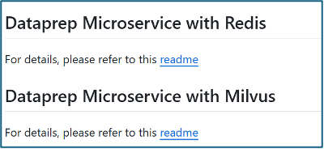

# Contributing A New Vector Database to OPEA

The [Open Platform for Enterprise AI (OPEA)](https://opea.dev) is an open source project under Linux Foundation AI and Data that seeks to reduce the barriers to GenAI adoption in enterprises by bridging AI and cloud native technologies through sample application blueprints, a rich set of microservice components including Vector Databases, deployment options and more. 

To contribute a new Vector Database to OPEA, you would need to modify minimally the OPEA sub-project [GenAIComps](https://github.com/opea-project/GenAIComps) that covers installation, launch, usage, and tests. For  completeness, submit a PR to the OPEA sub-project [GenAIExamples](https://github.com/opea-project/GenAIExamples) to illustrate customizing the ChatQnA example application.  We cover each of these in greater detail below.

## Contributing a new Vector Database to GenAIComps
**The OPEA dataprep service leverages a vector database.**  Currently 10 vector store options are available in OPEA and listed at: [OPEA Index of Vector Database Options](https://github.com/opea-project/GenAIComps/tree/main/comps/dataprep). The options currently include Redis, Milvus, Qdrant, Pinecone, OpenSearch, and Neo4J to name a few. The options differ in features such as their ability to handle large volumes of data, support for multi-modal input, indexing schemes available, ability to auto re-index (in response to underlying  datastore updates), whether open source and/or offered as a commercially supported service.

Your Pull Request (PR) to [GenAIComps](https://github.com/opea-project/GenAIComps) must cover how to:
1.	install your vector database,
2.	launch it, 
3.	determine whether the service is up and running, 
4.	use it, 
5.	and provide test scripts for integration into the OPEA CICD. 

*We indicate below which files need to be provided and in which directories they must land to ensure users and developers can find them easily.*

1.	**Update [OPEA data prep vector database readme file](https://github.com/opea-project/GenAIComps/tree/main/comps/dataprep#readme)** 
Follow the pattern *option name with link to a readme file.*  

2.	**Create a README_\<vector database name\>.md or README_\<vector database name\>_\<toolchain\>.md.** 
Neo4J has two READMEs, one for LangChain and the other for LlamaIndex. 
Here are some examples:
    - [README_redis.md](https://github.com/opea-project/GenAIComps/blob/main/comps/dataprep/src/README_redis.md)
    - [README_qdrant.md](https://github.com/opea-project/GenAIComps/blob/main/comps/dataprep/src/README_qdrant.md)
    - [README_neo4j_llamaindex.md](https://github.com/opea-project/GenAIComps/blob/main/comps/dataprep/src/README_neo4j_llamaindex.md)

3.	**Add the README file to the  vector database readme directory**  [https://github.com/opea-project/GenAIComps/tree/main/comps/dataprep/src](https://github.com/opea-project/GenAIComps/tree/main/comps/dataprep/src)

4.	**The Vector Database README needs to cover:**
    -	**A brief introduction** to the vector database solution including links to its public home and documentation site.  
    -	**Installation and Launch instructions**  
Often there are multiple options to install and launch a vector database and any method is acceptable. For the images themselves, you could provide “build from source instructions” or steps to retrieve prebuilt images from a public or private registry. You may provide a Helm chart or docker file or docker compose file, along with instructions on how to launch the same in a Kubernetes environment
        1.	**Necessary environment variables**
        2.	**Mention any namespace** that needs to be defined and used
        3.	**Image**
            - Or Image download path (repository url, image name, tag)
            - Or build from source instructions 
        4.	**Deployment collateral:** Helm chart or docker file or docker compose file or script.
        5.	**Launch command or script:** docker command line or docker compose command line or helm launch command or Kubernetes kubectl command  or script. 
    - **Instructions to check service availability** 
Provide information on how to verify that the vector database service is up and running
        1.	This could be a Docker ps  or Kubernetes pod list command and what to look for 
        2.	Provide troubleshooting tips if you are aware of common problems (like port in use or a missing dependency or needing a token to access a private registry etc)
    - **Instructions on how to use the service**  
        1.	Share how to obtain the service name and port in a Kubernetes cluster or Docker or other context. 
        2.	Any username and password?
        3.	How to use the service to upload and process documents, mention types of documents it can handle (word, pdf, csv, images, videos, ..)
        4.	How to use the service to retrieve documents
        5.	How to possibly change an indexing scheme and when.
    - **Share examples of service calls**
        1.	Include a link to a sample document (word, pdf, url, image) that the user can upload .. this helps to illustrate/lock down exactly what output is to be expected.
        2.	Curl or other call to upload the document and expected response
        3.	Curl or other call to retrieve similar documents and the  expected response given a fixed prompt.
        4.	Curl or other call to list documents
        5.	Curl or other call to delete documents
    - **Clean up instructions**
        1.	How to delete the service in Docker or Kubernetes
        2.	How to verify that the service is no longer running and that resources are recouped. 

## ChatQnA GenAIExample Vector Database Usage 
The OPEA sub-project [GenAIExamples](https://github.com/opea-project/GenAIExamples) houses multiple GenAI RAG sample applications such as chatbots, document summarization, code generation, and code translation to name a few. The [ChatQnA application](https://github.com/opea-project/GenAIExamples/tree/main/ChatQnA) is the primary example and contains instructions to deploy on a variety of hardware (such as Intel CPUs and Gaudi accelerator and AMD’s ROCm), in environments such as Docker and Kubernetes, including how to customize an application pipeline through the use of different vector database backends.   
1. **Provide ChatQnA docker compose file** 
Navigate to the [GenAIExamples](https://github.com/opea-project/GenAIExamples) OPEA subproject to provide a docker compose file example of the [ChatQnA application](https://github.com/opea-project/GenAIExamples/tree/main/ChatQnA) using your vector database. The directory 
[docker compose files for ChatQnA application variants running on CPUs](https://github.com/opea-project/GenAIExamples/tree/main/ChatQnA/docker_compose/intel/cpu/xeon)  contains docker compose file variants that span, among other things, using different vector database backends. See examples:
    - [chatQnA docker compose using the pinecone vector database](https://github.com/opea-project/GenAIExamples/blob/main/ChatQnA/docker_compose/intel/cpu/xeon/compose_pinecone.yaml)
    - [chatQnA docker compose using the qdrant vector database](https://github.com/opea-project/GenAIExamples/blob/main/ChatQnA/docker_compose/intel/cpu/xeon/compose_qdrant.yaml)

2. **Provide Tests** 
Once again, in the context of OPEA’s main GenAIExample, ChatQnA, if you have provided a compose file to illustrate using your vector database, please ensure that you submit tests for the same in [GenAIExamples ChatQnA Tests](https://github.com/opea-project/GenAIExamples/tree/main/ChatQnA/tests). See the examples:
    - [Test ChatQnA with Pinecone](https://github.com/opea-project/GenAIExamples/blob/main/ChatQnA/tests/test_compose_pinecone_on_xeon.sh)
    - [Test ChatQnA with Qdrant](https://github.com/opea-project/GenAIExamples/blob/main/ChatQnA/tests/test_compose_qdrant_on_xeon.sh)

