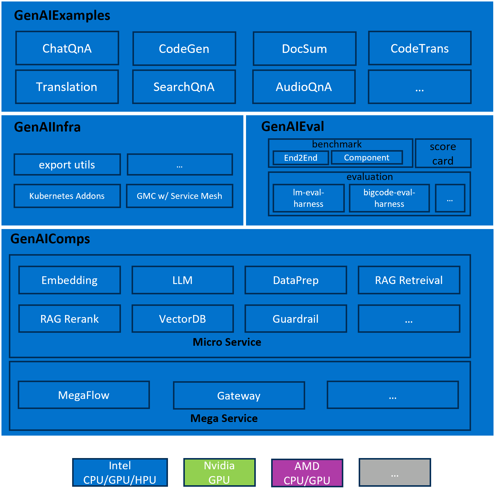
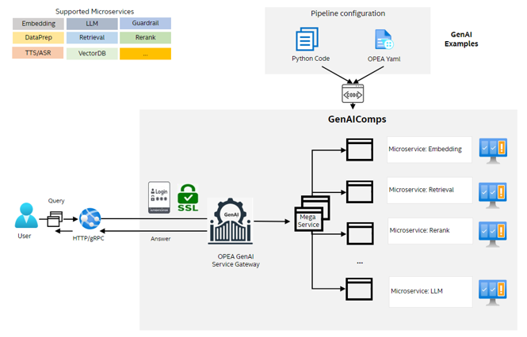

# 24-05-16 OPEA-001 Overall Design

## Author

[ftian1](https://github.com/ftian1), [lvliang-intel](https://github.com/lvliang-intel), [hshen14](https://github.com/hshen14)

## Status

Under Review

## Objective

Have a stable, extensible, secure, and easy-of-use orchestration framework design for OPEA users to quickly build their own GenAI applications.

The requirements include but not limited to:

1. orchestration planner

    have the ability of offer config-based definition or low-code for constructing complex LLM applications.

2. component registry

    allow user to register new service for building complex GenAI applications

3. monitoring

    allow user to trace the working flow, including logging, execution status, execution time, and so on.

4. scalability

    easily scale within K8S or other deployment techs at on-premis and cloud environment.

## Motivation

This RFC is used to present the OPEA overall design philosophy, including overall architecture, working flow, component design, for community discussion.

## Design Proposal

The proposed overall architecture is

1. GenAIComps

    The suite of microservices, leveraging a service composer to assemble a mega-service tailored for real-world Enterprise AI applications.

2. GenAIExamples

    The collective list of Generative AI (GenAI) and Retrieval-Augmented Generation (RAG) examples, targeting for demonstrating the whole orchestration pipeline.

3. GenAIInfra

    The containerization and cloud native suite for OPEA, including artifacts to deploy GenAIExamples in a cloud native way, which can be used by enterprise users to deploy to their own cloud.

4. GenAIEval

    The evaluation, benchmark, and scorecard suite for OPEA, targeting for performance on throughput and latency, accuracy on popular evaluation harness, safety, and hallucination.

The proposed OPEA workflow is

1. Microservice

    Microservices are akin to building blocks, offering the fundamental services for constructing RAG (Retrieval-Augmented Generation) applications. Each microservice is designed to perform a specific function or task within the application architecture. By breaking down the system into smaller, self-contained services, microservices promote modularity, flexibility, and scalability. This modular approach allows developers to independently develop, deploy, and scale individual components of the application, making it easier to maintain and evolve over time. Additionally, microservices facilitate fault isolation, as issues in one service are less likely to impact the entire system.

2. Megaservice

    A megaservice is a higher-level architectural construct composed of one or more microservices, providing the capability to assemble end-to-end applications. Unlike individual microservices, which focus on specific tasks or functions, a megaservice orchestrates multiple microservices to deliver a comprehensive solution. Megaservices encapsulate complex business logic and workflow orchestration, coordinating the interactions between various microservices to fulfill specific application requirements. This approach enables the creation of modular yet integrated applications, where each microservice contributes to the overall functionality of the megaservice.

3. Gateway

    The Gateway serves as the interface for users to access the megaservice, providing customized access based on user requirements. It acts as the entry point for incoming requests, routing them to the appropriate microservices within the megaservice architecture. Gateways support API definition, API versioning, rate limiting, and request transformation, allowing for fine-grained control over how users interact with the underlying microservices. By abstracting the complexity of the underlying infrastructure, gateways provide a seamless and user-friendly experience for interacting with the megaservice.

## Alternatives Considered

n/a

## Compatibility

n/a

## Miscs

- TODO List:

  - [ ] Micro Service specification
  - [ ] Mega Service specification
  - [ ] static cloud resource allocator vs dynamic cloud resource allocator
  - [ ] open telemetry support
  - [ ] authentication and trusted env

