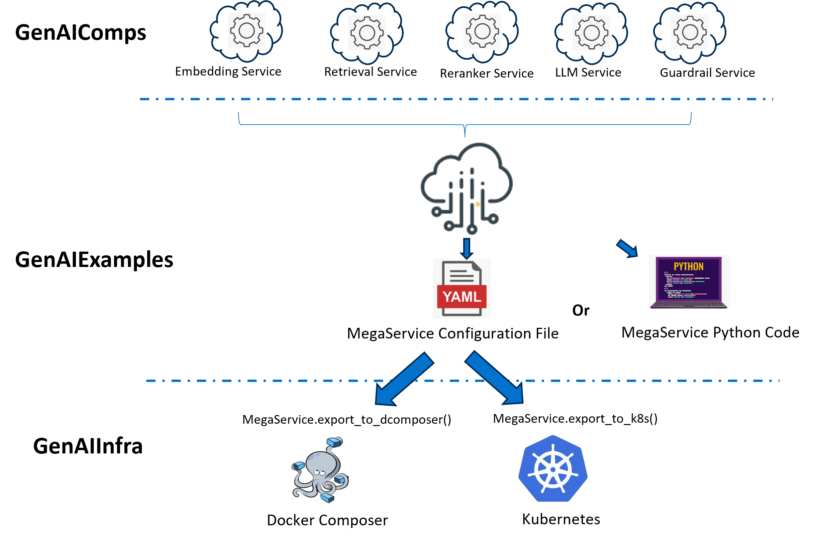
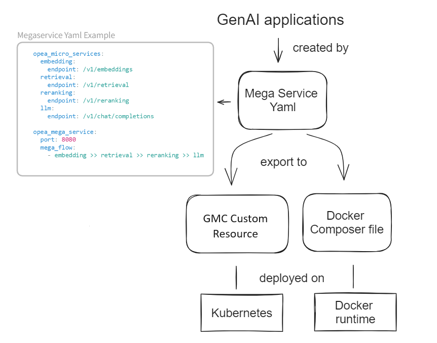

**Author**

[ftian1](https://github.com/ftian1), [lvliang-intel](https://github.com/lvliang-intel), [hshen14](https://github.com/hshen14), [irisdingbj](https://github.com/irisdingbj), [KfreeZ](https://github.com/kfreez), [zhlsunshine](https://github.com/zhlsunshine) **Edit Here to add your id**

**Status**

Under Review

**Objective**

Have a clear and good design for users to deploy their own GenAI applications on docker or Kubernetes environment.


**Motivation**

This RFC is used to present the OPEA deployment related design for community discussion.

**Design Proposal**

The overall architecture please refer to [this](24-05-16-001-OPEA-Overall-Design.md).

The proposed OPEA deployment workflow is

<a target="_blank" href="opea_deploy_workflow.png">
  
</a>

For GenAI applications, we provides two interfaces for deployment

1. Docker deployment by python

    For example, constructing RAG (Retrieval-Augmented Generation) application with python code is something like:

    ```python
    from comps import MicroService, ServiceOrchestrator
    class ChatQnAService:
        def __init__(self, port=8080):
            self.service_builder = ServiceOrchestrator(port=port, endpoint="/v1/chatqna")
        def add_remote_service(self):
            embedding = MicroService(
                name="embedding", port=6000, expose_endpoint="/v1/embeddings", use_remote_service=True
            )
            retriever = MicroService(
                name="retriever", port=7000, expose_endpoint="/v1/retrieval", use_remote_service=True
            )
            rerank = MicroService(
                name="rerank", port=8000, expose_endpoint="/v1/reranking", use_remote_service=True
            )
            llm = MicroService(
                name="llm", port=9000, expose_endpoint="/v1/chat/completions", use_remote_service=True
            )
            self.service_builder.add(embedding).add(retriever).add(rerank).add(llm)
            self.service_builder.flow_to(embedding, retriever)
            self.service_builder.flow_to(retriever, rerank)
            self.service_builder.flow_to(rerank, llm)
    
    ```

2. Kubernetes deployment by yaml

    For example, constructing RAG (Retrieval-Augmented Generation) application with yaml is something like:

    ```yaml
    opea_micro_services:
      embedding:
        endpoint: /v1/embeddings
        port: 6000
      retrieval:
        endpoint: /v1/retrieval
        port: 7000
      reranking:
        endpoint: /v1/reranking
        port: 8000
      llm:
        endpoint: /v1/chat/completions
        port: 9000
     
    opea_mega_service:
      port: 8080
      mega_flow:
        - embedding >> retrieval >> reranking >> llm
    
    ```

When user wants to deploy the GenAI application to Kubernetes environment, such yaml configuration file should be defined and coverted to `docker composer`or [GenAI Microservice Connecto -(GMC)](https://github.com/opea-project/GenAIInfra/tree/main/microservices-connector) Custom Resource files.
A sample GMC Custom Resource is like below:
```yaml
    apiVersion: gmc.opea.io/v1alpha3
    kind: GMConnector
    metadata:
      labels:
        app.kubernetes.io/name: gmconnector
      name: chatqna
      namespace: gmcsample
    spec:
      routerConfig:
        name: router
        serviceName: router-service
      nodes:
        root:
          routerType: Sequence
          steps:
          - name: Embedding
            internalService:
              serviceName: embedding-service
              config:
                endpoint: /v1/embeddings
          - name: TeiEmbedding
            internalService:
              serviceName: tei-embedding-service
              config:
                gmcTokenSecret: gmc-tokens
                hostPath: /root/GMC/data/tei
                modelId: BAAI/bge-base-en-v1.5
                endpoint: /embed
              isDownstreamService: true
          - name: Retriever
            data: $response
            internalService:
              serviceName: retriever-redis-server
              config:
                RedisUrl: redis-vector-db
                IndexName: rag-redis
                tei_endpoint: tei-embedding-service
                endpoint: /v1/retrieval
          - name: VectorDB
            internalService:
              serviceName: redis-vector-db
              isDownstreamService: true
          - name: Reranking
            data: $response
            internalService:
              serviceName: reranking-service
              config:
                tei_reranking_endpoint: tei-reranking-service
                gmcTokenSecret: gmc-tokens
                endpoint: /v1/reranking
          - name: TeiReranking
            internalService:
              serviceName: tei-reranking-service
              config:
                gmcTokenSecret: gmc-tokens
                hostPath: /root/GMC/data/rerank
                modelId: BAAI/bge-reranker-large
                endpoint: /rerank
              isDownstreamService: true
          - name: Llm
            data: $response
            internalService:
              serviceName: llm-service
              config:
                tgi_endpoint: tgi-service
                gmcTokenSecret: gmc-tokens
                endpoint: /v1/chat/completions
          - name: Tgi
            internalService:
              serviceName: tgi-service
              config:
                gmcTokenSecret: gmc-tokens
                hostPath: /root/GMC/data/tgi
                modelId: Intel/neural-chat-7b-v3-3
                endpoint: /generate
              isDownstreamService: true 
```
There should be an available `gmconnectors.gmc.opea.io` CR named `chatqna` under the namespace `gmcsample`, showing below：

```bash
$kubectl get gmconnectors.gmc.opea.io -n gmcsample
NAME     URL                                                      READY     AGE
chatqa   http://router-service.gmcsample.svc.cluster.local:8080   Success   3m
```

And the user can access the application pipeline via the value of `URL` field in above.

The whole deployment process illustrated by the diagram below.

<a target="_blank" href="opea_deploy_process.png">
  
</a>


**Alternatives Considered**

n/a

**Compatibility**

n/a

**Miscs**

- TODO List:

  - [ ] one click deployment on AWS, GCP, Azure cloud
  - [ ] static cloud resource allocator vs dynamic cloud resource allocator
  - [ ] k8s GMC with istio


