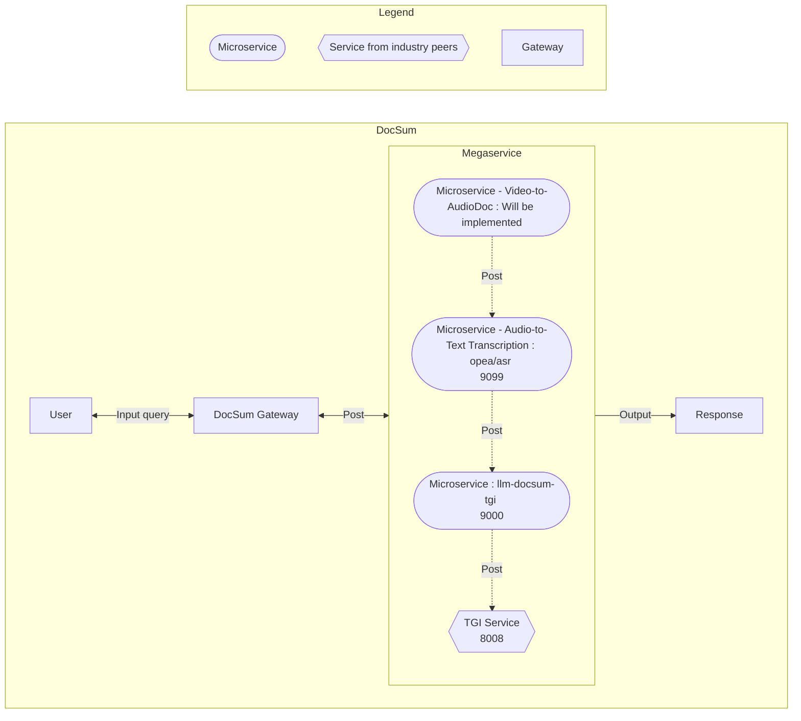

# 24-06-21-OPEA-001-DocSum_Video_Audio
RFC - Expanding Document Summary through Video and Audio

## RFC Content

### Author
[Mustafa Cetin](https://github.com/MSCetin37)

### Status
Under Review

### Objective
This RFC aims to extend the current Document Summarization Application by incorporating video and audio summary features. This enhancement will enable the application to summarize video and audio content in addition to text documents, thereby broadening its utility and applicability.

### Motivation
The motivation for adding video and audio summary features stems from the increasing prevalence of multimedia content in various domains, including education, corporate training, marketing, and entertainment. Videos and audio recordings often contain valuable information that can be time-consuming to digest in their entirety. By summarizing video and audio content, users can quickly grasp the key points, saving time and improving productivity.

Key motivations include:
1. **Enhanced User Experience**: Users can quickly understand the essence of video and audio content without consuming the entire media.
2. **Increased Efficiency**: Summarizing videos and audio can save time for professionals who need to review large amounts of multimedia content.
3. **Broader Applicability**: Extending the application to handle video and audio content makes it more versatile and useful across different industries.
4. **Competitive Advantage**: Offering video and audio summarization can differentiate the application from other text-only summarization tools.

### Design Proposal

#### Workflow of the Deployed Document Summarization Service
The workflow of the Document Summarization Service, from the user's input query to the application's output response, is as follows:



The proposed design for the video and audio summary features involves the following components:

#### 1. DocSum Gateway:
- **User Interface**: Update the user interface to upload video and audio files in various formats to summarize alongside text.

#### 2. Text Transcription, Video, and Audio Ingestion and Preprocessing:
- **Audio Extraction Microservice**: Extract audio from video files for transcription.

    Signature of audio extraction microservice:
    ```python
    @traceable(run_type="tool")
    @register_statistics(names=["opea_service@audio_extraction"])
    def audio_extraction(input: VideoDoc) -> AudioDoc:
    ```
- **Audio-to-Text Transcription**: Use the Audio-Speech-Recognition microservice from OPEA, which aims to generate a transcript for an input audio using an audio-to-text model (Whisper).

    Transcript generation microservice:
    - opea/whisper:latest
    - opea/asr:latest

- **Text Transcription**: Apply existing text summarization techniques that do not require any data preprocessing.

#### 3. Summarization:
- **Text Summarization**: Apply existing text summarization techniques to the generated transcripts.
- **Audio Summarization**: Use audio summarization techniques that extract the Transcription, then use text summarization steps.
- **Visual Summarization**: Use visual summarization techniques that extract the AudioDoc and then use Audio Summarization to create Transcription, then use text summarization steps.

#### 4. Integration and Output:
- **Summary Generation**: Combine text, audio, and visual summaries to create comprehensive document summaries from different document formats.

### Use-case Stories

#### 1. Corporate Training:
**Scenario**: A company conducts regular training sessions and records them as videos. Employees need to review these training videos to stay updated.

**Solution**: The video summary feature can generate concise summaries of training videos, highlighting key points and important segments. Employees can quickly review the summaries to understand the training content without watching the entire video.

#### 2. Educational Content:
**Scenario**: An online education platform offers video lectures on various subjects. Students often need to review these lectures for exams.

**Solution**: The video summary feature can create summaries of video lectures, providing students with a quick overview of the main topicscovered. This helps students to revise efficiently and focus on important concepts.

#### 3. Marketing and Advertising:
**Scenario**: A marketing team produces promotional videos for their products. They need to analyze the effectiveness of these videos.

**Solution**: The video summary feature can generate summaries of promotional videos, highlighting key messages and visual elements. The marketing team can use these summaries to evaluate the impact of their videos and make data-driven decisions.

#### 4. Research and Development:
**Scenario**: Researchers record their experiments and presentations as videos. They need to document and share their findings with colleagues.

**Solution**: The video summary feature can create summaries of research videos, capturing essential information and visual data. Researchers can share these summaries with their peers, facilitating knowledge sharing and collaboration.

#### 5. Podcast and Audio Content:
**Scenario**: A company produces a series of educational podcasts. Employees need to review these podcasts to stay informed about industry trends and best practices.

**Solution**: The audio summary feature can generate concise summaries of podcast episodes, highlighting key points and important segments. Employees can quickly review the summaries to understand the podcast content without listening to the entire episode.

By implementing the video and audio summary features, the Document Summarization Application will become a more powerful and versatile tool, capable of handling both text and multimedia content. This enhancement will significantly improve user experience, efficiency, and applicability across various domains.


