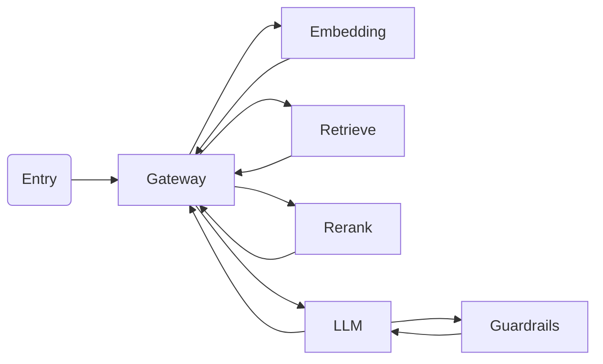
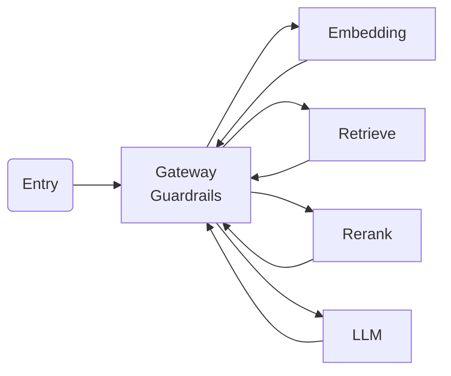
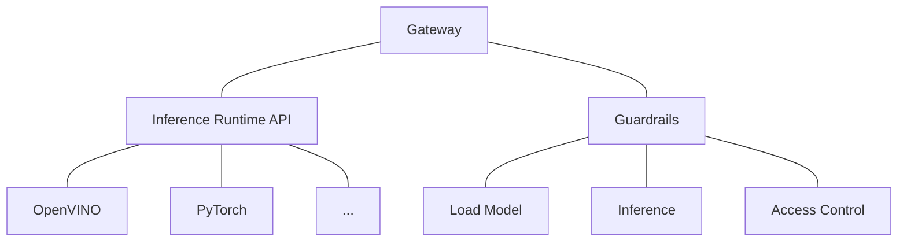
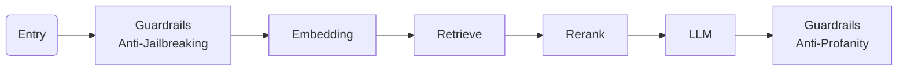
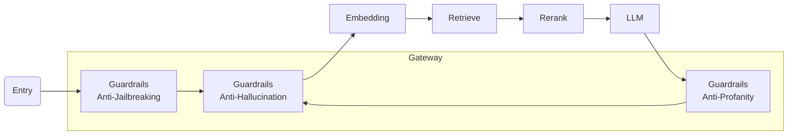
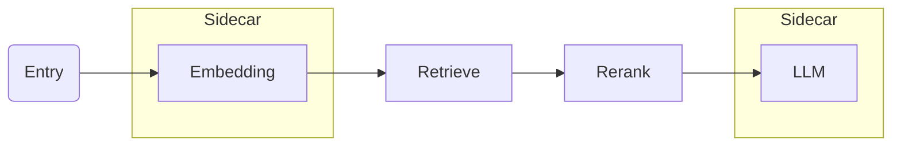
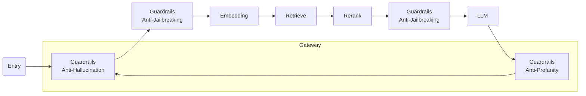

# 24-06-21-OPEA-001-Guardrails-Gateway

Guardrails Gateway

## Author

[zhxie](https://github.com/zhxie), [Forrest-zhao](https://github.com/Forrest-zhao), [ruijin-intel](https://github.com/ruijin-intel)

## Status

Under Review

## Objective

Deploy opt-in guardrails in gateway on deployment environment.

## Motivation

- Reduce latency in network transmission and protocol encoding/decoding.
- Support stateful guardrails.
- Enhance Observability.
- Leverage OpenVINO for AI acceleration instructions including AVX, AVX512 and AMX.

## Design Proposal

### Inference In Place

The LangChain-like workflow is presented below.

All services use RESTful API calling to communicate. There is overhead in network transmission and protocol encoding/decoding. Early studies have shown that each hop adds a 3ms of latency, which can be even longer when mTLS is turned on for security reason in inter-nodes deployment.

The opt-in guardrails in gateway works in the architecture given below.

The gateway can host multiple guardrails without extra network transmission or protocol encoding/decoding. In the real world deployment, there may be many guardrails in all perspectives, and the gateway is the best place to provide guardrails for the system.

The gateway consists of 2 basic components, inference runtime and guardrails.

A unified inference runtime API provides a general interface for inference runtimes. Any inference runtime can be integrated into the system including OpenVINO. The guardrails leverages the inferece runtime and decides if the request/reponse is valid.

### Stateful Guardrails

The traditional workflow from ingress to egress is presented below.

Guardrails service provides certain protection for LLM, such as anti-jailbreaking, anti-poisoning for the input side, anti-toxicity, factuality check for the output side, and PII detection for both input and output side.

Guardrails can also be spliited into 2 types, stateless and stateful. Guardrails including anti-jailbreaking, anti-toxicity and PII detection are considered as stateless guards, since they do not rely on both prompt input and response output, while anti-hallucination is regarded as a stateful guard, it needs both input and ouput for the relativity between.

[Guardrails Microservice](https://github.com/xuechendi/GenAIComps/tree/pii_detection/comps/guardrails) provides certain guardrails as microservice, but due to the limitation microservice, it is not able to track requests for responses, leading to difficulty in providing stateless guard ability.

The opt-in guardrails in gateway works in the architecture given below.

As a alternative choice, the gateway will also provide guardrails ability, no matter stateful or stateless.

### Observability

Envoy is the most popular proxy in cloud native, which contains out-of-box access log, stats and metrics, and can be integrated into observability platform including OpenTelemetry and Prometheus naturally.

Guardrails in gateway will leverages these abilities about observability to meet potential regulartory and compliance needs.

### Multi-Services Deployment

Let's say the embedding and LLM services are AI-powered and require guardrails protection.

The opt-in gateway can be deployed as a gateway or sidecar services.

The gateway can also work with guardrails microservices.

## Alternatives Considered

[Guardrails Microservice](https://github.com/xuechendi/GenAIComps/tree/pii_detection/comps/guardrails): has provided certain guardrails, however it only supports stateless guardrails.

## Compatibility

N/A

## Miscs

- TODO

  - [ ] API definitions for meta service deployment and Kubernetes deployment
  - [ ] Envoy inference framework and guardrails HTTP filter
