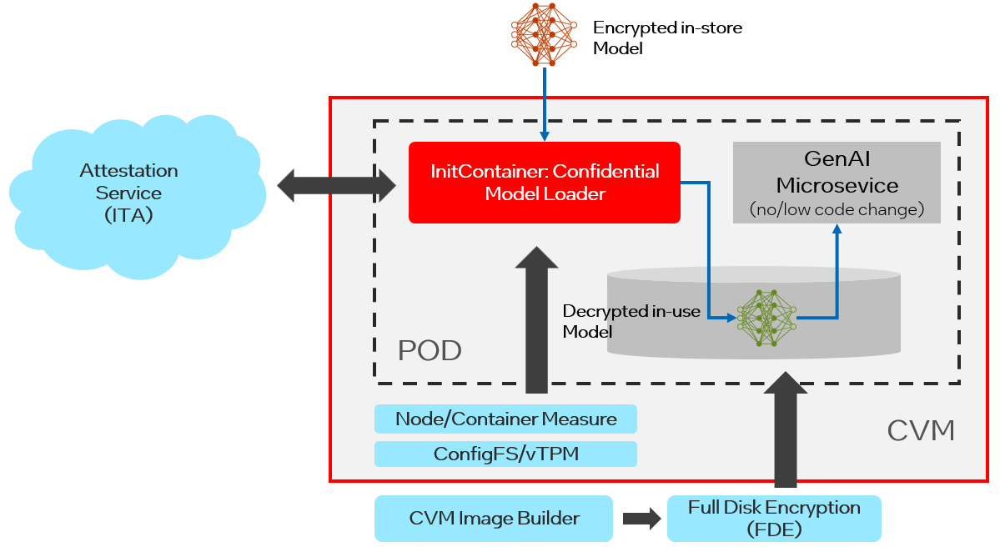

# Author
[kenplusplus](https://github.com/kenplusplus), [dongx1x](https://github.com/dongx1x), [hdxia](https://github.com/hdxia), [mkbhanda](https://github.com/kenplusplus/opea-docs/commits?author=mkbhanda), [ruomengh](https://github.com/ruomengh), [jodh-intel](https://github.com/jodh-intel), [likebreath](https://github.com/likebreath)

# Status
Under Review

# Objective

This RFC aims to introduce the design of "confidential model loader" addressing challenges of the integrity and confidentiality
protection with no/low code for GenAI microservice. It is designed not only to prevent the model's theft and poisoning in
development-time and runtime, but also to prevent disclosure of the sensitive enterprise knowledge fused in fine-tuned
model.

# Motivation

The handling and security of GenAI enterprise models includes model storage and model usage throughout the entire lifecycle from training to inference phase. It requires many different technologies to work together, such as general confidential computing technology reinforced by vendor-specific TEE (such as Intel TDX, AMD SEV/SEV-SNP, etc.), password-less full disk encryption (FDE) technology enhanced by remote attestation. They are very complex for GenAI developers or data scientists. Therefore, "Confidential Model Loader" can be used to protect models transparently to existing GenAI microservices (no/little code changes).

# Design Proposal

According to the threat model mentioned at d at https://owaspai.org/docs/ai_security_overview/, for the model
(including foundation and fine-tune model), it needs integrity protection for model poisoning and
confidentiality protection for model theft. And the whole protection need to be considered from the phase of
model-in-store to model-in-use.

The overall designs are as follows:

The workflows is as follow:

- Model-in-store phase: Models need to be encrypted to protect against the threat of model theft via the following steps:

  In a trusted execution environment (may be enhanced by confidential TEE or TPM):

  1. Create a model key with a key transfer policy, register model key to Key Broker Server/Key Management Server.
  2. Encrypt the model via model key.
  3. Publish the encrypted model into model registry.

- Model-in-use phase: the GenAI microservice need run within a TEE environment, the "confidential model loader"
is designed as initContainer to decrypt the model via the following steps:

  1. Calculate the evidence of both launch time and runtime measurement at Node/Container level from configFS or vTPM.
  2. Get model key via attestation service based on the evidences.
  3. Decrypt the model and put it into RAM disk or the data disk with "Full Disk Encryption".

With this design, the existing GenAI microservices do not need to change their code, thereby reducing the complexity
of protecting the model through confidential computing technology.

# Alternatives Considered
n/a

# Compatibility
n/a

# Miscs

