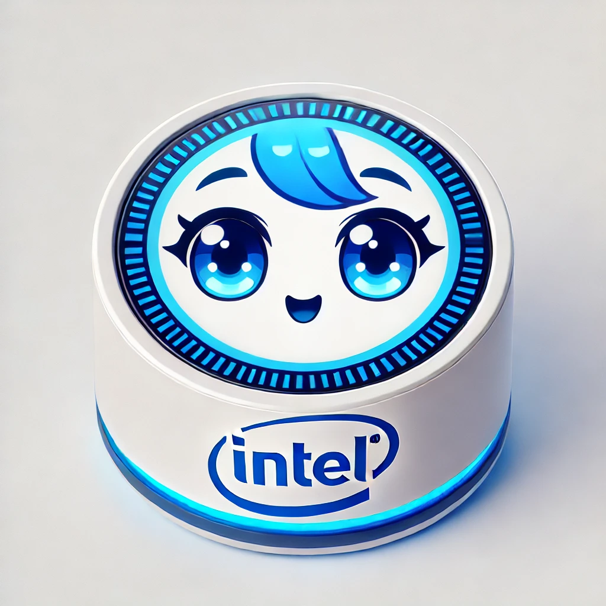
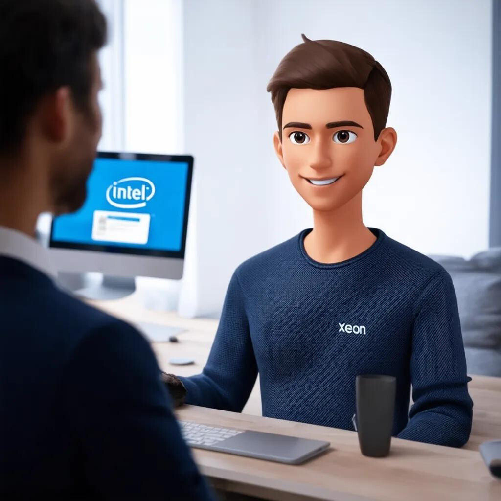
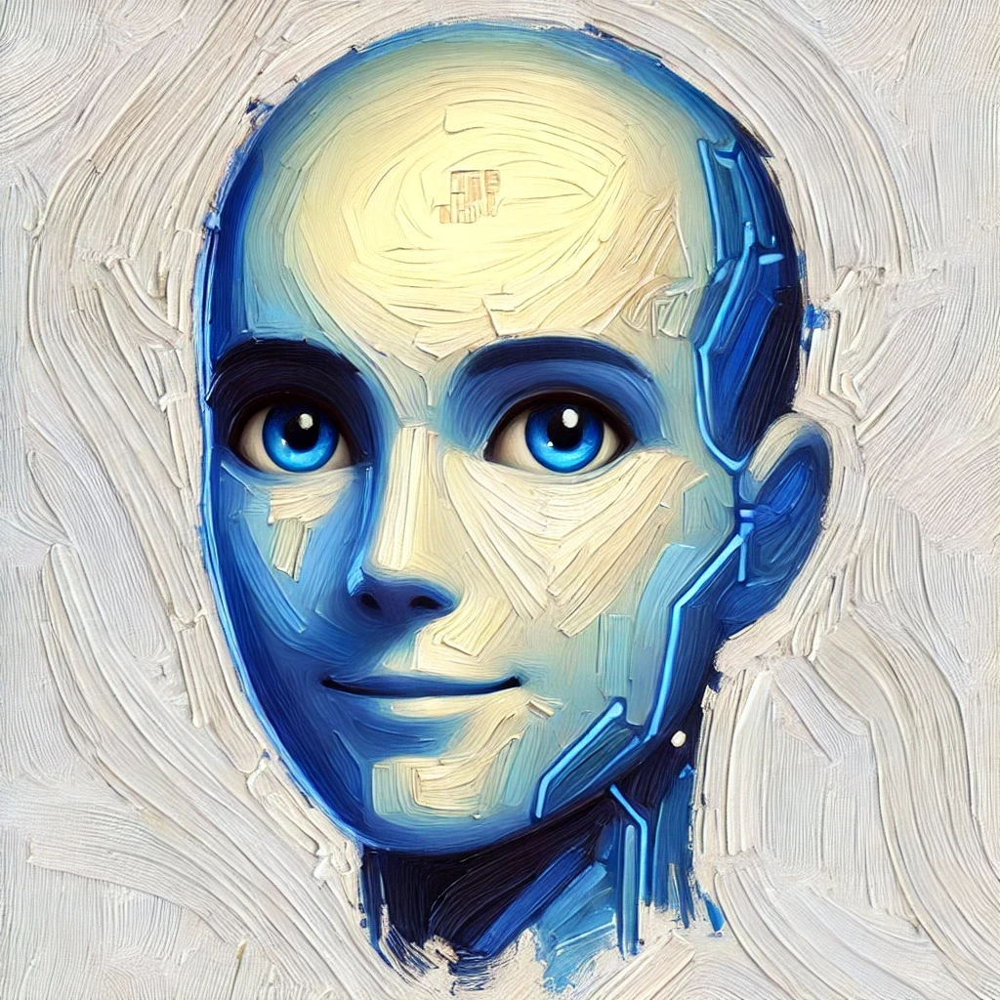
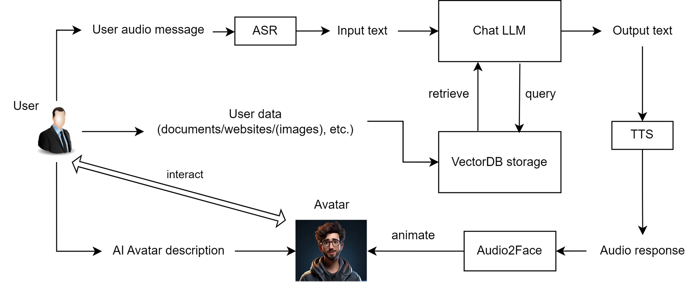
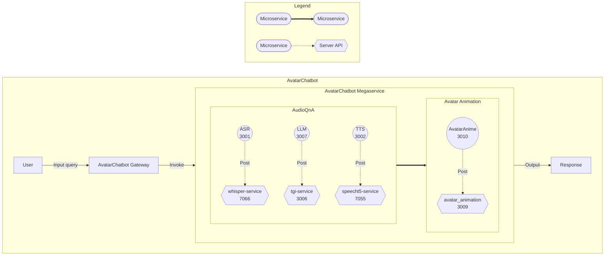

## Title
<!-- The short description of the feature you want to contribute -->
Using OPEA to implement a RAG-Powered Human-Like AI Avatar Audio Chatbot

## Author
<!-- List all contributors of this RFC. -->
[ctao456](https://github.com/ctao456), [alexsin368](https://github.com/alexsin368), [YuningQiu](https://github.com/YuningQiu), [louie-tsai](https://github.com/louie-tsai)

## Status
<!-- Change the PR status to Under Review | Rejected | Accepted. -->
v0.1 - ASMO Team sharing on Fri 6/28/2024

## Objective
<!-- List what problem will this solve? What are the goals and non-goals of this RFC? -->
Currently the OPEA chatbots are on the computer software level, without a human-like appearance. This project carries out a chatbot that can interact with users in a human-like way, with vivid and animated facial and body expressions. 

  
  
  
  
  
  

 

The chatbot will:
* Have an animated avatar frontend that can express emotions and gestures, while interacting with user
* Be able to understand and respond to user text and audio queries, using retrieval-augmented generation workflows.

New microservices include:
* avatar_animation 

New megaservices include:
* AvatarChatbot

## Motivation
<!-- List why this problem is valuable to solve? Whether some related work exists? -->
This RFC aims to provide a more vivid and interactive chatbot experience for users, by adding an animated avatar frontend to the chatbot. This will make the chatbot more engaging and user-friendly, and can be used in various applications, such as customer service, education, and entertainment. The project demonstrates Intel's capability in AI, animation, and human-computer interaction. It also proves Intel® Xeon® and Intel® Gaudi® hardware performance in supporting real-time animation and chatbot services, for enterprises and developers.

Overall, this project adds to the OPEA platform a new microservice block that animates the chatbot appearance, and integrates it with the existing chatbot pipelines ([ChatQnA](https://github.com/opea-project/GenAIExamples/tree/2e312f44edbcbf89bf00bc21d9e9c847405ecae8/ChatQnA), [AudioQnA](https://github.com/opea-project/GenAIExamples/tree/2e312f44edbcbf89bf00bc21d9e9c847405ecae8/AudioQnA), [SearchQnA](https://github.com/opea-project/GenAIExamples/tree/2e312f44edbcbf89bf00bc21d9e9c847405ecae8/SearchQnA), etc.), to build new chatbot megaservices that can interact with users in a more human-like way.

## Design Proposal
<!-- This is the heart of the document, used to elaborate the design philosophy and detail proposal. -->

### Avatar Chatbot design
[Proposal slides](https://intel.sharepoint.com/:p:/s/mlconsultingandsupport/EecmTa5Ca61Pm7ES6vlZtykBtgbJL_fuhipfu_yybIlBig?e=bryPVz)

Flowchart: AvatarChatbot Megaservice  
<!-- Insert Mermaid flowchart here -->

The AvatarChatbot megaservice is a new service that integrates the existing AudioQnA service with the new avatar_animation microservice. The AudioQnA service is a pipeline that takes user audio input, converts it to text, generates an LLM response, and converts the response to audio output. The avatar_animation microservice is a new service that takes the audio response from the AudioQnA service, generates an animated avatar response, and sends it back to the user. The AvatarChatbot Gateway invokes the AvatarChatbot backend megaservice to generate the response.

#### avatar_animation microservice

#### AvatarChatbot megaservice

#### Frontend UI
The frontend UI is Gradio. User is prompted to upload either an image or a video as the avatar source. The user also asks his question verbally through the microphone. The AvatarChatbot backend processes the audio input and generates the response in the form of an animated avatar answering in its unique voice. The response is displayed on Gradio UI.

### Real-time demo
[AI Avatar Chatbot Demo on Intel® Gaudi® 2](https://intel.sharepoint.com/:v:/s/mlconsultingandsupport/ESt9MF6WDvNNm7rPyhyK4UsBC4W3d422Fk5qQMRp5AMtUA?e=SN9cYJ)

## Compatibility
<!-- List possible incompatible interface or workflow changes if exists. -->
The new AvatarChatbot megaservice and avatar_animation microservice are compatible with the existing OPEA GenAIExamples and GenAIComps repos. They are deployable on Intel® Xeon® and Intel® Gaudi® hardware.

## Miscs
<!-- List other information user and developer may care about, such as:
- Performance Impact, such as speed, memory, accuracy.
- Engineering Impact, such as binary size, startup time, build time, test times.
- Security Impact, such as code vulnerability.
- TODO List or staging plan.  -->
End-to-End Inference Time: 

On SPR:  
~30 seconds for AudioQnA on SPR,  
~40-200 seconds for AvatarAnimation on SPR

On Gaudi 2:  
~5 seconds for AudioQnA on Gaudi, 
~10-50 seconds for AvatarAnimation on Gaudi, depending on:  
1) Whether the input is an image or a multi-frame video
1) Animation DL model used: Wav2Lip_only or Wav2Lip+GFPGAN or SadTalker  
2) Resolution and FPS rate of the resulting mp4 video

All latency reportings are as of 7/22/2024.
