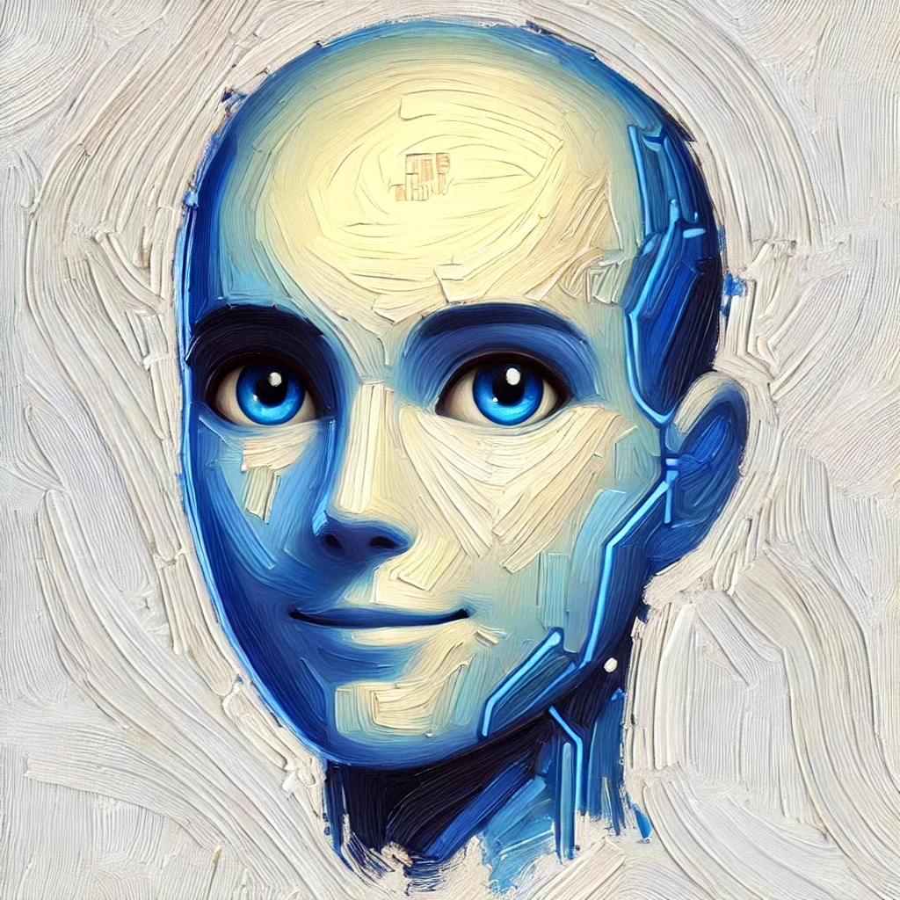

Suggested change
##  A RAG-Powered Human-Like AI Avatar Audio Chatbot integrated with OPEA AudioQnA
<!-- The short description of the feature you want to contribute -->

## Author
<!-- List all contributors of this RFC. -->
[ctao456](https://github.com/ctao456), [alexsin368](https://github.com/alexsin368), [YuningQiu](https://github.com/YuningQiu), [louie-tsai](https://github.com/louie-tsai)

## Status
<!-- Change the PR status to Under Review | Rejected | Accepted. -->
v0.1 - ASMO Team sharing on Fri 6/28/2024  
[GenAIComps pr #400](https://github.com/opea-project/GenAIComps/pull/400) (Under Review)
[GenAIExamples pr #523](https://github.com/opea-project/GenAIExamples/pull/523) (Under Review)

## Objective
<!-- List what problem will this solve? What are the goals and non-goals of this RFC? -->
* "Digital humans will resolutionize industry". Given breakthroughs in LLMs and neural graphics, there emerged a surge in demand for human-computer interaction and conversational AI applications. To meet this demand, we need intent-driven computing where interacting with computers is as natural as interacting with humans. Yet all existing OPEA applications (ChatQnA, AudioQnA, SearchQnA, etc.) are text-based and lack interactive visual elements.

* Also worthnoting, the majority of existing OPEA applications lack multimodal features, i.e., they do not process both audio and visual inputs. Whereas enterprises are increasingly looking for multimodal AI solutions that can process both audio and visual inputs, to build lip-synchronized and face-animated chatbot solutions that are more engaging and human-like.

* Due to above reasons, we're hereby introducing a new microservice, animation, that generates animated avatars from audio and image/video inputs; and a new megaservice, AvatarChatbot, that integrates the animation microservice with the existing AudioQnA service to build a human-like AI audio chatbot.

  
  
  
  
  
  

 

The chatbot will:
* Be able to understand and respond to user text and audio queries, with a backend LLM model
* Synchronize audio response chunks with image/video frames, to generate a high-quality video of the avatar speaking in real-time
* Present the animated avatar response to the user in a user-friendly UI
* Use multimodal retrieval-augmented generation (RAG) to generate more accurate, in-domain responses, in v0.2

New microservices include:
* animation 

New megaservices include:
* AvatarChatbot

## Motivation
<!-- List why this problem is valuable to solve? Whether some related work exists? -->
* Enterprises in medical, finance, education, entertainment, etc. industries are increasingly adopting AI chatbots to improve customer service and user experience. Yet existing OPEA applications (ChatQnA, AudioQnA, SearchQnA, etc.) are text-based and lack interactive visual elements.
* Enterprises look for multimodal AI solutions that can process both audio and visual inputs, to build lip-synchronized and face-animated chatbots that are more engaging and human-like.
* This RFC aims to fill these gaps by introducing a new microservice, animation, that can be integrated seamlessly with existing micro- and mega-services in OPEA, to enhance the platform's capabilities in multimodal AI, human-computer interaction, and digital human graphics.

Overall, this project adds to the OPEA platform a new microservice block that animates the chatbot appearance, and integrates it with the existing chatbot pipelines such as [ChatQnA](https://github.com/opea-project/GenAIExamples/tree/2e312f44edbcbf89bf00bc21d9e9c847405ecae8/ChatQnA), [AudioQnA](https://github.com/opea-project/GenAIExamples/tree/2e312f44edbcbf89bf00bc21d9e9c847405ecae8/AudioQnA), [SearchQnA](https://github.com/opea-project/GenAIExamples/tree/2e312f44edbcbf89bf00bc21d9e9c847405ecae8/SearchQnA), etc., to build new chatbot megaservices that can interact with users in a more human-like way.

Related works include [Nvidia Audio2Face](https://docs.nvidia.com/ace/latest/modules/a2f-docs/index.html), [Lenovo Deepbrain AI Avatar](https://www.deepbrain.io/ai-avatars), [BitHuman](https://www.bithuman.io/), etc.

## Design Proposal
<!-- This is the heart of the document, used to elaborate the design philosophy and detail proposal. -->

### Avatar Chatbot design
[Proposal slides](https://intel.sharepoint.com/:p:/s/mlconsultingandsupport/EecmTa5Ca61Pm7ES6vlZtykBtgbJL_fuhipfu_yybIlBig?e=HDS0VF)

Flowchart: AvatarChatbot Megaservice  
<!-- Insert Mermaid flowchart here -->

The AvatarChatbot megaservice is a new service that integrates the existing AudioQnA service with the new animation microservice. The AudioQnA service is a pipeline that takes user audio input, converts it to text, generates an LLM response, and converts the response to audio output. The animation microservice is a new service that takes the audio response from the AudioQnA service, generates an animated avatar response, and sends it back to the user. The AvatarChatbot Gateway invokes the AvatarChatbot backend megaservice to generate the response.

#### animation microservice
The animation microservice is a new service that generates animated avatar videos from audio and image/video inputs. The animation microservice takes the audio response from the AudioQnA service, synchronizes the audio response mel-spectrogram chunks with image/video frames, and generates a high-quality video of the avatar speaking in real-time. The animation microservice currently uses the [Wav2Lip-GFPGAN](https://github.com/ajay-sainy/Wav2Lip-GFPGAN) model for lip synchronization and face animation.  

User can build their own Docker image with `Dockerfile_hpu` and create a Docker container on Gaudi2 instance to run the animation microservice. They can then validate the service by sending a POST request to the server API, while providing audio and image/video inputs. The animation microservice will generate an animated avatar video response and save it to the specified output path.

Support for alternative SoTA models such as [SadTalker](https://github.com/OpenTalker/SadTalker) and [LivePortrait](https://github.com/KwaiVGI/LivePortraitare) in progress.

#### AvatarChatbot megaservice
The AvatarChatbot megaservice is a new service that integrates the existing microservices that comprise AudioQnA service with the new animation microservice. The AudioQnA service is a pipeline that takes user audio input, converts it to text, generates an LLM response, and converts the response to audio output. The animation microservice is a new service that takes the audio response from the AudioQnA service, generates an animated avatar response, and sends it back to the user. The megaflow is as follows:  
asr -> llm -> tts -> animation

This megaservice is a work in progress.

#### Frontend UI
The frontend UI is Gradio. User is prompted to upload either an image or a video as the avatar source. The user also asks his question verbally through the microphone. The AvatarChatbot backend processes the audio input and generates the response in the form of an animated avatar answering in its unique voice. The response is displayed on Gradio UI.

  
  

### Real-time demo
[AI Avatar Chatbot Demo on Intel® Gaudi® 2, image input](https://intel.sharepoint.com/:v:/s/mlconsultingandsupport/EZa7vjON10ZCpMvE7U-SPMwBRXbVHqe1Ybsa-fmnXayNUA?e=f6FPsl)   
[AI Avatar Chatbot Demo on Intel® Gaudi® 2, video input](https://intel.sharepoint.com/:v:/s/mlconsultingandsupport/ESMIcBseFTdIuqkoB7TZy6ABfwR9CkfV49TvTa1X_Jihkg?e=zMH7O7)

## Compatibility
<!-- List possible incompatible interface or workflow changes if exists. -->
The new AvatarChatbot megaservice and animation microservice are compatible with the existing OPEA GenAIExamples and GenAIComps repos. They are deployable on Intel® Xeon® and Intel® Gaudi® hardware.

## Miscs
<!-- List other information user and developer may care about, such as:
- Performance Impact, such as speed, memory, accuracy.
- Engineering Impact, such as binary size, startup time, build time, test times.
- Security Impact, such as code vulnerability.
- TODO List or staging plan.  -->
End-to-End Inference Time for AvatarChatbot Megaservice (asr -> llm -> tts -> animation): 

On SPR:  
~30 seconds for AudioQnA on SPR,  
~40-200 seconds for AvatarAnimation on SPR

On Gaudi 2:  
~5 seconds for AudioQnA on Gaudi, 
~10-50 seconds for AvatarAnimation on Gaudi, depending on:  
1) Whether the input is an image or a multi-frame, fixed-fps video
1) LipSync Animation DL model used: Wav2Lip_only or Wav2Lip+GFPGAN or SadTalker  
2) Resolution and FPS rate of the resulting mp4 video

All latency reportings are as of 8/2/2024.
