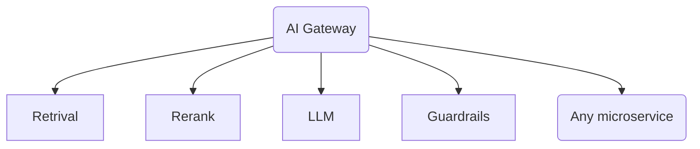
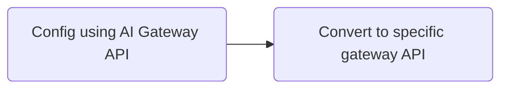

# 24-08-20-OPEA-001-AI Gateway API

AI Gateway API

## Author

[daixiang0](https://github.com/daixiang0), [zhixie](https://github.com/zhxie), [gyohuangxin](https://github.com/gyohuangxin), [Forrest-zhao](https://github.com/Forrest-zhao), [ruijin-intel](https://github.com/ruijin-intel)

## Status

Under Review

## Objective

Design the API for AI Gateway.

## Motivation

- Introduce gateway to do mTLS, traffic control, observability and so on
- Introduce AI Gateway API to use existing gateway sloutions rather than implement our own one.

## Design Proposal

The AI gateway is at the front of all microservices:



### API overall

To make the most of current resources, we choose to follow [Kubernetes Gateway API](https://gateway-api.sigs.k8s.io/) since it is the gateway API standard that all gateways support.

Since AI specific features of Kubernetes Gateway API are still [under discussion](https://docs.google.com/document/d/1FQN_hGhTNeoTgV5Jj16ialzaSiAxC0ozxH1D9ngCVew/edit), We design AI Gateway API including following two parts:

- **Kubernetes Gateway API** for features it already supports
- **Extension API for** all other features

### API workflow



AI Gateway is not a brand-new gateway implementation, only does one thing: Convert.

### Extension API

```yaml
apiVersion: extension.gateway.opea.dev/v1
kind: Gateway
metadata:
  name: extension-exmaple
spec:
  gatewayClassName: envoy
  extensions:
  - name: extension-1
    config:
      extension-1-config: aaa
  - name: extension-2
    config:
      extension-2-config: bbb
```

- gatewayClassName: specific gateway implement
- name: the name of extension feature, support multiple extensions
- config: the content of extension config, following specified gateway API

### Extension API example

```yaml

apiVersion: extension.gateway.opea.dev/v1
kind: Gateway
metadata:
  name: envoy-extension-exmaple
spec:
  gatewayClassName: envoy
  extensions:
  - name: token-ratelimit
    config:
      name: envoy.filters.http.guardrails
      typed_config:
        "@type": type.googleapis.com/envoy.extensions.filters.http.guardrails.v3.Guardrails
        inference:
          runtime: envoy.inference_runtime.openvino
          typed_config:
            "@type": type.googleapis.com/envoy.extensions.inference_runtime.openvino.v3.OpenvinoConfig
            backend: CPU
            plugins:
            - /usr/lib/libopenvino_tokenizers.so
          model_path: /home/zhihao/envoy/.project/openvino/models/OTIS-Official-Spam-Model.xml
        source: RESPONSE
        action: ALLOW
```

**Guardrail** is AI specific feature, here we use Extension API to config Envoy to use CPU to inference with specified model to do response check.

The config field follows the Envoy API.
