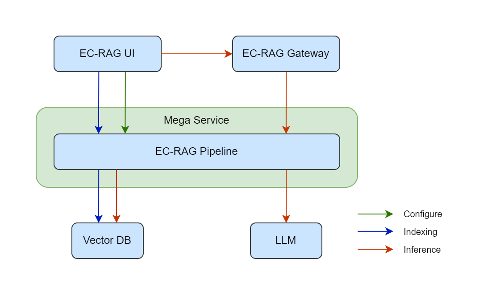
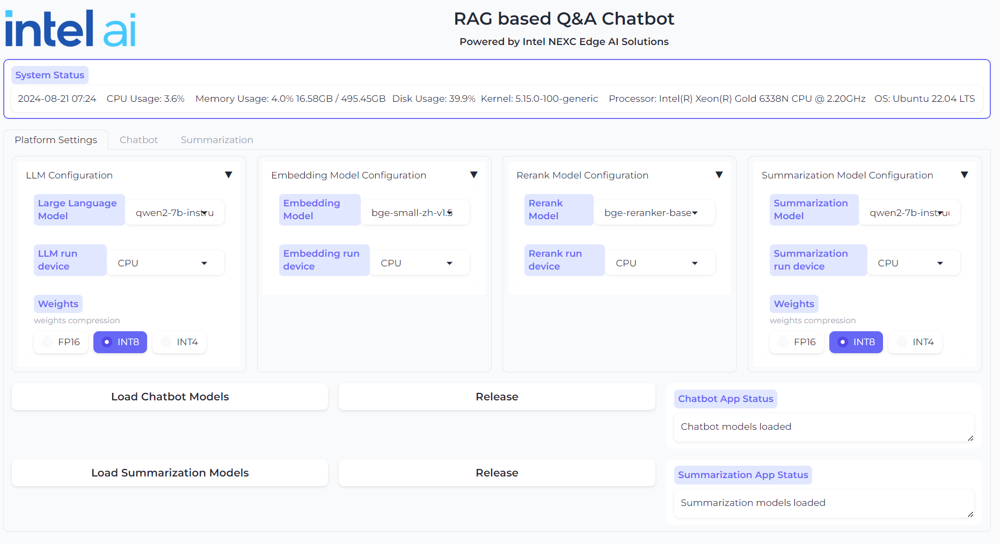
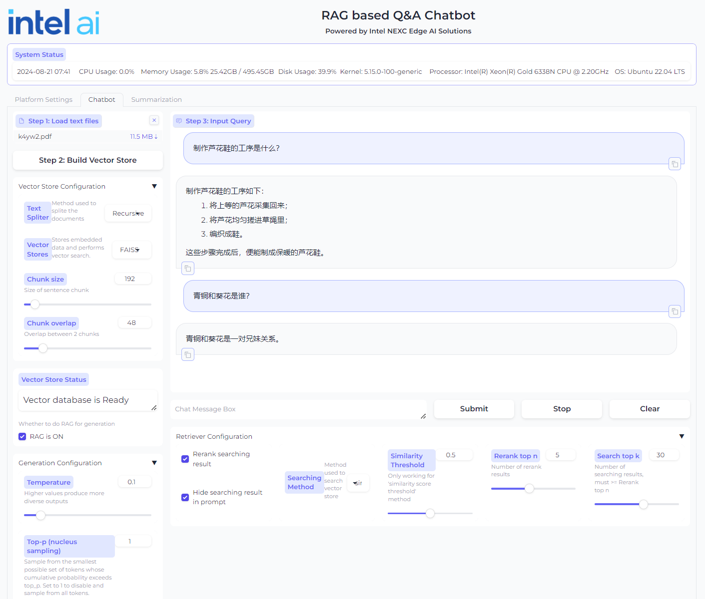

# 24-08-21-GenAIExample-002-Edge Craft RAG

This RFC describes a solution of a tunable RAG for edge scenarios.

## Author

[myqi](https://github.com/myqi)

## Status

Under Review

## Objective

Edge industry users are facing obstacles to build an "out-of-the-box" RAG
application to meet both quality and performance requirements. Total Cost of
Ownership(TCO) and pipeline optimization techniques are the two main reasons
to block this process.

### Total Cost of Ownership

The HW requirement of a typical edge use case is a single host with one of the
following combinations:
- Intel(R) Core(TM) Ultra Processor
- Intel(R) Core(TM) Processor + Intel(R) Iris(R) Xe Graphics
- Intel(R) Core(TM) Processor + Intel(R) Arc(TM) A-Series Graphics
- Intel(R) Xeon(R) Processor + Intel(R) Arc(TM) A-Series Graphics

The scenarios with these hardware options block the edge users from using large
parameter size LLMs on-prem as well as sophisticated RAG pipeline for their data.
Thus, the RAG pipeline at edge needs to be highly curated for underlying hardwares
and suitable models accordingly.

### RAG Pipeline Optimization Techniques

Tuning RAG pipeline is a systematic problem. First, the quality depends on the
result of each stage in the pipeline as well as the end-to-end outcome. Second,
optimization could be a trade-off among the metrics. It is difficult to decide one
answer is better than another if it is slightly not accurate in number but more
relevant to the query. Third, the optimization techniques may not intuitively
reflect to metrics improvements. E.g., recrusive retrieval may contribute to
improving the recall and context relevancy, or may not.

## Motivation

Edge Craft RAG (EC-RAG) is a customizable, tunable and production-ready
Retrieval-Augmented Generation system for edge solutions. It is designed to
curate the RAG pipeline to meet hardware requirements at edge with garanteed
quality and performance.

From quality perspective, EC-RAG is tunable in the indexing, retrieving,
reranking and generation stages for particular edge use cases. From performance
perspective, the pipeline is consolidated in a single service to eliminate the
overhead of inter-service communication on a single host. Meanwhile, the inferencing
stages like embedding, reranking and generation are optimized for Intel(R) Iris(R)
Xe Graphics and Intel(R) Arc(TM) A-Series Graphics.

## Design Proposal

EC-RAG is composed of the following components:
- UI for doc loading and interactive chatbot.
- Gateway
- Mega-service with a single micro-services for the tunable* EC-RAG pipeline.
- LLM serving microservice optimized for Intel(R) Iris(R) Xe Graphics and Intel(R) Arc(TM) A-Series
Graphics
- VectorDB microservice optimized for Intel(R) Iris(R) Xe Graphics and/or Intel(R) Arc(TM) A-Series
- Docker compose file to launch the UI, Mega/Micro-services

> [!NOTE]
> *Advanced tuning EC-RAG will need a tool co-piloting with the pipeline which will be described in
> a separate doc

Below diagram illustrates the overall components of EC-RAG:


The EC-RAG pipeline will expose 3 types of REST API endpoint:
- **/v1/data** for indexing
- **/v1/settings** for configuration
- **/v1/chatqna** for inferencing

### /v1/data

| Description   | Action | Endpoint      | Data Schema        |
| ------------- | ------ | ------------- | ------------------ |
| Upload a file | POST	 | /v1/data      | FastAPI.UploadFile |
| List files	| GET	 | /v1/data	     |                    |
| Remove	    | DELETE | /v1/data/{id} |	                  |

### /v1/settings/pipelines

| Description        | Action | Endpoint                      | Data Schema        |
| ------------------ | ------ | ----------------------------- | ------------------ |
| Setup a pipeline   | POST   | /v1/settings/pipelines        |	Pipeline object    |
| Get/list pipelines | GET    | /v1/settings/pipelines(/{id}) | Pipeline object(s) |               |
| Update pipelines   | PATCH  | /v1/settings/pipelines/{id}   | Pipeline object    |
| Remove a pipeline  | DELETE | /v1/settings/pipelines/{id}   |                    |

### /v1/settings/models

| Description     |	Action | Endpoint                   | Data Schema     |
| --------------- | ------ | -------------------------- | --------------- |
| Load models     |	POST   | /v1/settings/models        | Model object    |
| Get/list models | GET    | /v1/settings/models(/{id}) | Model object(s) |
| Update models   | PATCH  | /v1/settings/models/{id}   | Model object    |
| Remove a model  | DELETE | /v1/settings/models/{id}   |                 |

## Pipeline configuration example

```json
{
    "name": "rag_demo",
    "node_parser" : {
        "chunk_size": 250,
        "chunk_overlap": 48,
        "type": "simple"
    },
    "indexer": {
        "type": "faiss_vector",
        "model": {
            "model_id": "BAAI/bge-small-en-v1.5",
            "model_path": "./bge_ov_embedding",
            "device": "auto"
        }
    },
    "retriever": {
        "type": "vectorsimilarity",
        "top_k": 30
    },
    "postprocessors": [
        {
            "type": "reranker",
            "rerank_top_n": 5,
            "model": {
                "model_id": "BAAI/bge-reranker-large",
                "model_path": "./bge_ov_reranker",
                "device": "auto"
            }
        }
    ],
    "generator": {
        "model": {
            "model_id": "qwen2-7b-instruct",
            "model_path": "./qwen2-7b-instruct/INT4_compressed_weights",
            "device": "auto"
        },
        "prompt_path" : "./data/default_prompt.txt"
    },
    "active": "True"
}
```

### UI

The EC-RAG UI is gradio. The user is able to select the models as well as input
parameters in different stages for the pipeline. The chatbox is also integrated
in the UI.

EC-RAG UI - Model Condiguration


EC-RAG UI - Chatbot with settings


## Compatibility

EC-RAG megaservice and microservice are compatible with the existing OPEA
GenAIExamples and GenAIComps repos. The EC-RAG leverages the LLM microservice
and the VectorDB microservice from GenAIComps.

## Miscellaneous

The EC-RAG will be developed in 2 phases.

### Phase 1

The UI, gateway, and EC-RAG pipeline will be finished without Vector DB as
persistent DB. Instead, FAISS will be used for vector search and keep vector
store in memory.

In this phase, the LLM inferencing will happen in the pipeline until the LLM
serving microservice supports Intel(R) Iris(R) Xe Graphics and Intel(R) Arc(TM)
A-Series Graphics.

### Phase 2

The vector DB will be enabled in this phase as well as LLM inferencing on
Intel(R) Iris(R) Xe Graphics and Intel(R) Arc(TM) A-Series Graphics.
