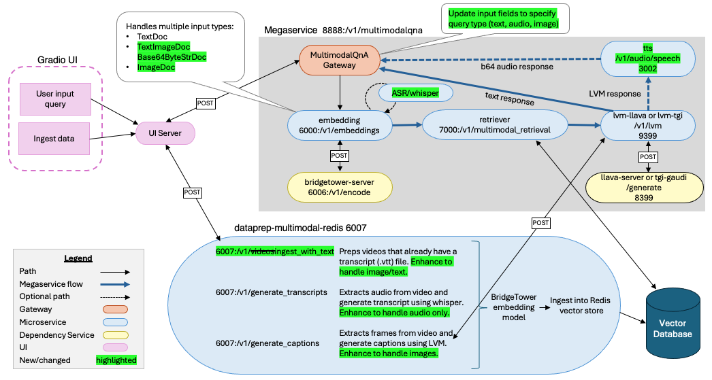
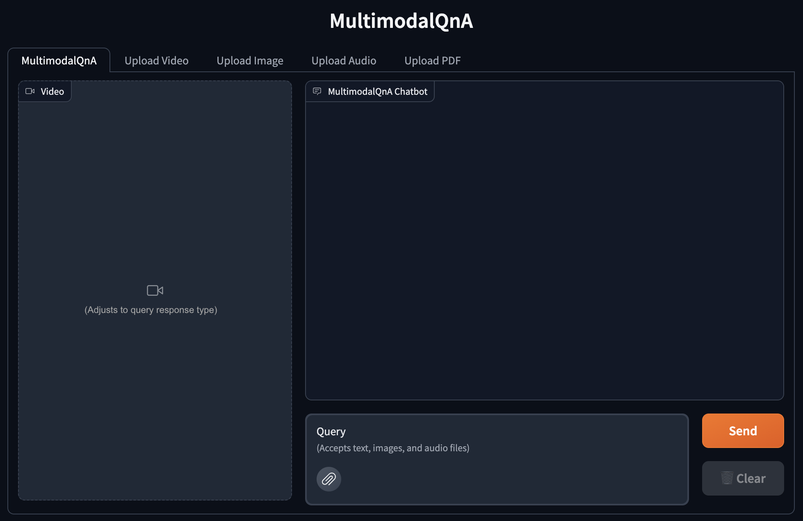
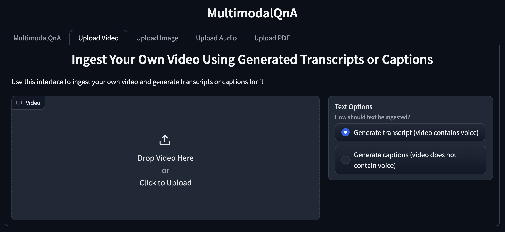
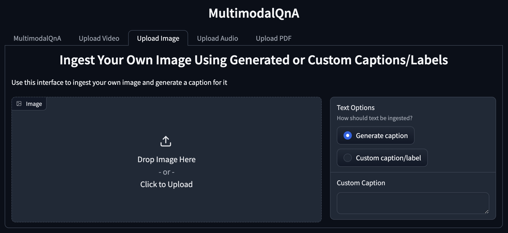
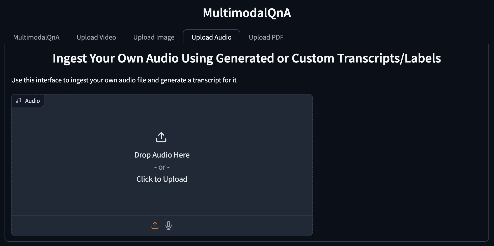
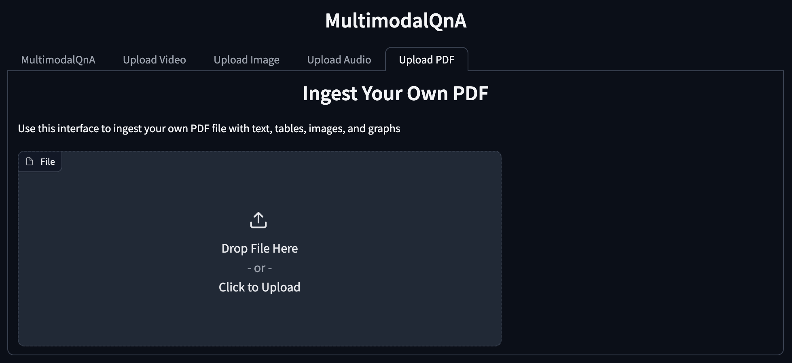

# 24-10-02-GenAIExamples-xxx-Image_and_Audio_Support_in_MultimodalQnA

## Author(s)

[Melanie Buehler](https://github.com/mhbuehler), [Mustafa Cetin](https://github.com/MSCetin37), [Dina Jones](https://github.com/dmsuehir)

## Status

Under review

## Objective

The [MultimodalQnA](https://github.com/opea-project/GenAIExamples/tree/main/MultimodalQnA) megaservice in
[GenAIExamples](https://github.com/opea-project/GenAIExamples) currently supports text queries with a response based on
the context derived from collection of videos. This RFC expands upon that and proposes the addition of images, images
with text, and audio data types for both the ingested data and the user query.

## Motivation

As the [Multimodal RAG RFC](https://github.com/opea-project/docs/blob/01597aabeaf4c5d171bdc8cd9f7bccdd9e64f697/community/rfcs/MM-RAG-RFG.md)
explains, enterprises use multimodal data and the proposed enhancement will increase the variety of use cases that the
MultimodalQnA example will be able to support.

Expanding on the types of supported data types will enable use cases such as:
1. **Voice Query and Response**: A user wants to query and chat with a multimodal data store using speech as input and get responses returned as speech audio output. Supporting this use case would make the application more accessible to those who cannot see or read and safer for those who are driving a vehicle.
1. **QnA with Speech Audio Files**: A user wants to query and chat with a collection of audio files, such as a podcast library.
1. **QnA with Captioned/Labeled Images**: A user would like to populate the database with images that have labels, such as "normal" and “abnormal” radiology images, or user-provided captions, like radiologist's notes, and then query with a new image to find similar ones. After retrieving the most similar image, the system could predict the new image's label (i.e. assist with diagnosis).
1. **QnA with Multimodal PDFs**: A user wants to query and chat with the contents of one or more PDF files, like books, journal articles, business reports, or travel brochures. The PDFs could contain images with or without captions and charts that include titles and descriptions. 

## Design Proposal

There are two phases in the MultimodalQnA example that need to be considered:
* Data ingestion and prep
* User query

Both of these phases are affected by the enhancements in this RFC. The design for expanding the types of multimodal data
for [data ingestion](#data-ingestion-and-prep) and [user queries](#user-query) are outlined in the next couple of
sections.

There is also a Gradio user interface (UI) that allows the user to both upload data for ingestion and submit queries
based on the context in the database. The introduction of different data types will affect the UI design, and the
proposed changes are discussed in the [UI section](#ui).

### Data Ingestion and Prep

In the data ingestion and prep phase, a collection of data is built up to context for the subsequent queries. From a
user's perspective, they will be able to upload:
* Videos with spoken audio (already supported)
* Videos without spoken audio (already supported)
* Videos with transcriptions (already supported)
* Images with text (proposed)
* Images without text (proposed)
* Spoken audio files (proposed)
* PDF files (proposed)

The [BridgeTower model](https://huggingface.co/BridgeTower/bridgetower-large-itm-mlm-gaudi) which is already utilized
by MultimodalQnA merges visual and text data into a unified semantic space. As it works today, the videos being ingested
are preprocessed into a list of frames with their corresponding transcript or captions that were generated based on the
video. Those frames and their metadata are stored in the vector store, which is used as context for the user's queries.
The addition of image and text are analogous to the video frames and transcripts. With some changes to data prep, the
image and text data could be added to the vector store. Similarly, PDF files can be thought of as another form of images
and text. Spoken audio files can be translated to text with using the whisper model, similar to how videos with spoken
audio use the whisper model to generate transcripts for the video. This means that although the user will be able to
upload several different forms of media, once it gets to the embedding model it is all images and text.

The table below lists the endpoints for the multimodal data prep microservice that will be changing with this proposal.

| Endpoint | Data type | Description |
|----------|-----------|-------------|
| `6007:/v1/videos_with_transcripts` becomes `6007:/v1/ingest_with_text` | Videos with transcripts and images with text | For video with transcripts, gets the video file with their corresponding transcript file (.vtt), and then extracts frames and saves annotations. The image with text would be treated like a single frame with transcript. The data and metadata are prepared for ingestion and then added to the Redis vector store. |
| `6007:/v1/generate_transcripts` | Videos with spoken audio and audio only | For videos with spoken audio, data prep extracts the audio from the video and then generates a transcript (.vtt) using the whisper model. For audio only, the transcript would also be generated using the whisper model. The data and metadata are prepared for ingestion and then added to the Redis vector store. |
| `6007:/v1/generate_captions` | Videos without spoken audio (i.e. background music, silent movie) and images without text | For videos, data prep extracts frames from the video and uses the LVM microservice to generate captions for the frames. An image will be treated similarly to a video frame, and the LVM will be used to generate a caption for the image. The data and metadata are prepared for ingestion and then added to the Redis vector store. |
| `6007:/v1/dataprep/get_videos` becomes `6007:/v1/dataprep/get_files` |  Multimodal | Lists names of uploaded files. |
| `6007:/v1/dataprep/delete_videos` becomes `6007:/v1/dataprep/delete_files` |  Multimodal | Deletes all the uploaded files. |

<!-- TODO: Currently, does the 'delete' have an option to do it for a single video, or is it always deleting all videos? -->

### User Query

After the vector database has been populated, the user can then submit a query to the MultimodalQnA megaservice. From
the user's perspective, the query can be:
* Text (already supported)
* Spoken audio files (proposed)
* Image and text (proposed)

The [ASR microservice](https://github.com/opea-project/GenAIComps/blob/main/comps/asr/whisper/README.md) which uses the
whisper convert speech to text provides a clear line of sight for adding support for spoken audio queries. Once the
audio has been converted to text, submitting the query would be no different how the text queries work today.

Changes to the user query flow will involve the following components:
* The MultimodalQnA gateway
* The embedding mircoservice

The details explaining the specific changes to these components are explained in the sections below.

#### MultimodalQnAGateway

Currently, the [MultimodalQnAGateway](https://github.com/opea-project/GenAIComps/blob/main/comps/cores/mega/gateway.py#L688)
class analyzes the input message from the request coming in to determine if it's a first query or a follow up query.
Initial queries have a single prompt string, whereas follow up queries have a list of prompts and images.

When introducing different types of data for user queries, we will need to change the inital query from a string to a
dictionary in order to comprehend data type and handle multiple items (image and text).

#### Embedding Microservice

The [embedding microservice endpoint](https://github.com/opea-project/GenAIComps/blob/main/comps/embeddings/multimodal/multimodal_langchain/mm_embedding_mmei.py#L41)
gets input as a [`MultimodalDoc`](https://github.com/opea-project/GenAIComps/blob/main/comps/cores/proto/docarray.py#L66-L70).
The `MultimodalDoc` is a union of: `TextDoc`, `ImageDoc`, and `TextImageDoc`. In order to accomodate audio input, we
will add `Base64ByteStrDoc` to the union.

If the embedding service gets a `Base64ByteStrDoc` as input, it will assume that this is audio only input, and then use
the [ASR microservice](https://github.com/opea-project/GenAIComps/blob/main/comps/asr/whisper/README.md) microservice to
convert the audio to text using the whisper model. After getting the text, the rest of the embedding micorservice flow
would work the same as if we had a text query.

<!-- TODO: Investigate how image/text queries would work -->

### UI

The existing UI shows two modes of video upload capability - with transcripts and with captions, on different interface tabs - and a main chat tab holding the text QnA conversation, a video clip area populated from the first response of a chat session, a small text box for queries, a submit button, and a clear button. Our proposed changes to the UI aim to achieve three goals:
* Change the existing design as little as possible
* Visually organize and emphasize the enhanced multimodal query and upload options
* Streamline some of the titles and text headings

We list each proposed change in detail below and then provide mockups of the new screens.

#### UI Changes
1. Modify the main chat screen with a dynamic media display area capable of supporting video, image, or audio results and adjusting automatically when a new type is returned by the server.
1. Modify the query text box to allow multimodal file uploads in addition to text (likely with the gradio MultimodalTextBox element), expanding the query input to accept images and audio in addition to text.
1. Simplify the tab titles and screen headings for increased clarity.
1. Combine the two modes of video upload into one tab with radio buttons that enable the user to choose the correct ingestion endpoint for their videos.
1. Add a new tab for image uploads with radio buttons allowing the user to choose between caption generation and custom label/caption, as well as a text box for uploading a custom label/caption.
1. Add a new audio upload tab allowing the user to post audio files. The system will assume that the audio contains speech and generate a transcript by default, but this could be expanded to accommodate non-speech audio and/or optional custom labels in the future.
1. Add a new tab for PDF uploads, which currently is envisioned as one endpoint without any input options.

#### UI Mockups

## Alternatives Considered

The following alternatives can be considered:
* Instead of having the embedding microservice use the ASR microservice, it could directly use the whisper model
  (similar to how the multimodal data prep uses the whisper model to transcribe video audio). Using the whisper model
  directly instead of going through ASR would reduce the number of running containers/services.
* In data prep, we could have separate endpoints for different type of media. For example, instead of having
  `/v1/ingest_with_text`, we could break that out into `/v1/videos_with_transcript` and `/v1/images_with_text`
  separately.

## Compatibility

Interface changes are being made to the following components:
* MultimodalQnA gateway
* Embeddings multimodal langchain
* Dataprep multimodal redis langchain

> TODO: Check if any other examples use these components, otherwise add a note here saying that the changes won't
> affect other examples.

## Miscellaneous

<!--
List other information user and developer may care about, such as:

- Performance Impact, such as speed, memory, accuracy.
- Engineering Impact, such as binary size, startup time, build time, test times.
- Security Impact, such as code vulnerability.
- TODO List or staging plan.
-->

It should be considered that the addition of [ASR](https://github.com/opea-project/GenAIComps/tree/main/comps/asr/whisper)
adds another microservice to MultimodalQnA. This means that the `compose.yaml` files will need to start 2 more
containers (`opea/asr` and `opea/whisper`) and when using Gaudi, the whisper service container will use 1 HPU. If this
is deemed too expensive, the embedding service can use the whipser model directly (without ASR), however this may mean
that the speech-to-text translation is done using CPU, since the embedding service in the Gaudi example currently runs
using CPU.

We have planned the following development phases based on the priority of the features and their development effort:

* Phase 1
  * Data prep and ingestion:
    * Accept image only
    * Accept image and text
    * Accept speech audio only
  * Query enhancements:
    * Accept speech audio only
  * Other enhancements:
    * Allow the user to choose the embedding model and LVM when starting the services <!-- TODO: this needs investigation, does it not already work with env vars? -->
* Phase 2
  * Data prep and ingestion:
    * Accept image and text as a PDF
  * Query enhancements:
    * Accept image and text
    * Accept image and speech audio
* Phase 3
  * Data prep and ingestion:
    * Accept image and speech audio
  * Other enhancements:
    * Support for spoken audio responses (text-to-speech)
* Future ideas:
  * Data prep and ingestion:
    * Accept non-speech audio
    * Accept Powerpoint slides and other file types
  * Query enhancements:
    * Accept speech audio and non-speech audio
