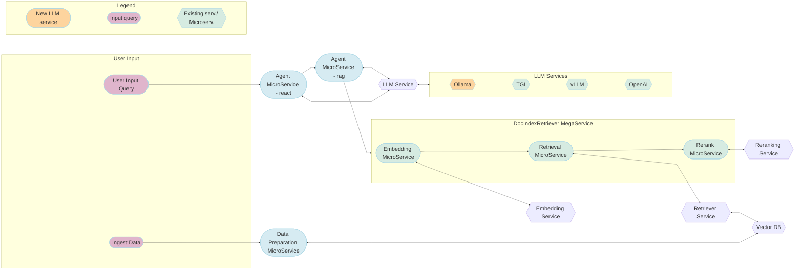

# 24-11-25-GenAIExamples-Ollama_Support_for_CPU_Server

The AgentQnA workflow in GenAIExamples leverages large language models (LLMs) as agents to intelligently manage control flow within the pipeline. Currently, it depends on cloud-hosted, paid APIs for LLM services on the CPU server platform, which incurs significant costs and does not utilize the full computational capabilities of the CPU. This RFC proposes the integration of support for open-source small language models (SLMs) locally deployed on x86 CPU servers using Ollama, thereby enabling LLM computation locally on on-prem CPUs and reducing operational expenses.
## Author(s)

[Pratool Bharti](https://github.com/pbharti0831/)

## Status

 `Under Review`

## Objective

### Problems This Will Solve
- **Access to Open-source SLMs on CPU Servers**: Enables the use of open-source SLMs through Ollama on x86 CPU servers. State-of-the-art open-source SLMs are suitable for less complex agent workflows. A critical task for agents is accurately invoking the correct tools for specific tasks. As demonstrated in the [Berkeley Function-Calling Leaderboard](https://gorilla.cs.berkeley.edu/leaderboard.html), Llama 70B and 8B models perform similarly in tool-calling tasks, indicating that smaller language models can effectively support agent workflows.
- **Cost Reduction**: Eliminates the need for paid cloud-based API services by running open-source SLMs locally on-prem CPUs.
- **Data Privacy**: Ensures data privacy by processing data locally.
- **Compute Efficiency**: Leverages the computational power of x86 CPU servers for efficient LLM execution.
- **Lower Network Latency and Bandwidth Needs**: By processing data locally, the reliance on external cloud services is minimized, resulting in reduced network latency and bandwidth usage. This ensures faster response times and more efficient data handling.

### Goals

- **Local Deployment**: Enable local deployment of open-source SLMs on-prem x86 CPU servers.
- **Integration with Ollama**: Seamless integration of Ollama framework to access open-source SLMs.
- **Maintain Functionality**: Ensure the AgentQnA workflow continues to function effectively with the new setup.
- **Integration of popular serving framework**: Integration of Ollama serving framework in AgentQnA workflow in OPEA.

### Non-Goals

- **New Features**: No new features will be added to the AgentQnA workflow beyond the support for local SLMs as an agent.
- **Support for Non-Xeon Platforms**: This RFC is specific to x86 CPU servers and does not cover other hardware platforms.

## Motivation

### SLMs Performance on CPU
Open-source small language models (SLMs) are optimized to run efficiently on CPU servers, including Intel Xeon processors. These models are designed to balance performance and resource usage, making them suitable for deployment in environments where GPU resources are limited or unavailable. By leveraging the computational capabilities of x86  CPU servers, SLMs can achieve satisfactory performance for various agent tasks within the AgentQnA workflow. Given the right prompt, smaller Llama models are fairly accurate in tool calling which is an essential feature for agents.

### Ollama Popularity and Wide Range of Models
Ollama provides a comprehensive set of libraries and tools to facilitate the deployment and management of open-source language models. These libraries are designed to integrate seamlessly with existing workflows, enabling developers to easily incorporate SLMs into their applications. Ollama's model libraries support a wide range of open-source models, ensuring compatibility and ease of use for different use cases. 

### Ollama vs vLLM
VLLM is an optimized inference engine designed for high-throughput token generation and efficient memory utilization, making it suitable for large-scale AI deployments. Ollama is a lightweight and intuitive framework that facilitates the execution of open-source LLMs on local on-prem hardware. In terms of popularity, the [vLLM](https://github.com/vllm-project/vllm) GitHub repository has 35K stars, while [Ollama](https://github.com/ollama/ollama) has 114K stars.

#### Key Features of Ollama
- **Extensive Model Support**: Ollama supports a variety of open-source large and small language models, including state-of-the-art models that are continuously updated. Additionally, it also hosts embedding and re-ranking models that are critical for RAG applications.
- **Ease of Integration**: The libraries and tools provided by Ollama are designed to integrate smoothly with existing systems, reducing the complexity of adding new models to the workflow.
- **Scalability**: Ollama's tools are built to handle different scales of deployment, from small-scale local setups to larger, more complex environments.
- **Community and Documentation**: Ollama has a strong community and extensive documentation, providing support and resources for developers to effectively use and troubleshoot the tools.

#### Benefits of Using Ollama
- **Flexibility**: Developers can choose from a wide range of models to best fit their specific needs and use cases.
- **Cost Efficiency**: By leveraging open-source models, organizations can reduce costs associated with proprietary solutions.
- **Performance**: Ollama's tools are optimized for performance, ensuring efficient execution of language models on Intel Xeon CPUs.
- **Security**: Local deployment of models through Ollama enhances data security by keeping sensitive information within the organization's infrastructure.

By incorporating Ollama into the AgentQnA workflow, the project can leverage these benefits to enhance the overall performance, security, and cost-efficiency of the system.

### Open-source Models are Getting Better
The landscape of open-source language models is rapidly evolving, with continuous improvements in model architecture, training techniques, and performance. Recent advancements have led to the development of state-of-the-art (SOTA) open-source models that rival proprietary solutions in terms of accuracy and efficiency. By adopting these open-source models, the AgentQnA workflow can benefit from cutting-edge technology while maintaining flexibility and control over the deployment environment.

### Cost Efficiency

By integrating open-source small language models (SLMs) through Ollama, organizations can significantly reduce costs associated with language model services. The reliance on paid APIs, such as those provided by OpenAI, can be eliminated, leading to substantial savings. Open-source models do not incur usage fees, making them a cost-effective alternative for deploying language models on Intel Xeon CPUs. Additionally, the local deployment of these models reduces the need for expensive cloud-based infrastructure, further lowering operational expenses. This cost efficiency allows organizations to allocate resources to other critical areas, enhancing overall productivity and innovation.

### Enhanced Data Security
Processing data locally ensures that sensitive information remains secure and private.

### Open-Source Flexibility
Open-source LLMs provide greater flexibility and customization options compared to proprietary solutions.

## Design Proposal

The workflow for the proposed changes are as follows. As shown below, Ollama serving models will be added as LLM serving engine for the Xeon platform. This will work as an alternative for vLLM, TGI and OpenAI LLM engines. New change is highlighted in orange.

The proposed design for Ollama serving support entails following changes:

### 1. Ollama serving container:
- **Models hosted in Ollama container**: Build and run a container on Xeon platform that hosts Ollama models as an alternative LLM service engine. Hosted models can be accessed by Agent microservice at a given host ip and port. 

### 2. Support for latest open-source SLMs from the Llama family and DeepSeek:
- **Add Llama 3.1, 3.2, and DeepSeek-R1 small models for Xeon**: Small language models (SLMs) from the Llama 3.1 and 3.2 model families, as well as the DeepSeek-R1 model, will be added and validated for the AgentQnA workflow.

### 3. Compatibility

**Compatibility with exisiting services**: Added component will be compatible with the existing components, ensuring seamless integration with the current AgentQnA workflow. Ollama's serving container will work alongside existing LLM services like vLLM, TGI, and OpenAI, maintaining the overall functionality and performance of the system.

## Use-case Stories

1. **Data Privacy and Security**:
   - **Scenario**: A healthcare organization needs to process sensitive patient data for generating medical reports and insights.
   - **Solution**: By using Ollama service on-prem x86 server CPUs, the organization can run LLM agents locally, ensuring that sensitive patient data remains within their secure infrastructure. This preserves privacy and complies with data protection regulations.

2. **Cost Efficiency**:
   - **Scenario**: A startup is developing an AI-driven customer support system but has limited budget for cloud services.
   - **Solution**: Deploying Ollama service on-prem x86 CPU servers allows the startup to run LLM agents locally, reducing dependency on expensive cloud-based APIs like OpenAI, Anthropic, Gemini, etc. This significantly lowers operational costs and makes the solution more affordable.

3. **Low Latency and High Performance**:
   - **Scenario**: A financial institution requires real-time analysis of market data to make quick trading decisions.
   - **Solution**: Running Ollama service locally on-prem CPU servers provides high computational power locally, enabling the institution to achieve low latency and high performance. This ensures timely and accurate analysis without the delays associated with cloud-based services.

4. **Scalability and Control**:
   - **Scenario**: An enterprise wants to scale its AI capabilities across multiple departments while maintaining control over the infrastructure.
   - **Solution**: Deploying Ollama service on Intel Xeon CPUs enables the enterprise to scale LLM agents locally across various departments. This provides better control over the infrastructure and ensures consistent performance and reliability.

5. **Compliance with Regulations**:
   - **Scenario**: A legal firm needs to process confidential client information while adhering to strict regulatory requirements.
   - **Solution**: Running the Ollama service locally ensures that all data processing occurs within the firm's infrastructure, aiding in regulatory compliance and maintaining client confidentiality. This setup ensures that neither prompts nor any proprietary data stored in a vector database need to leave the enterprise.

6. **Enhanced Reliability**:
   - **Scenario**: A manufacturing company relies on AI-driven predictive maintenance to avoid equipment downtime.
   - **Solution**: Running the Ollama service locally ensures that all data processing occurs within the firm's infrastructure, aiding in regulatory compliance and maintaining client confidentiality. This setup ensures that neither prompts nor proprietary data inserted to a vector database need to leave the enterprise.

  
  The proposed design for Ollama serving support on-prem x86 CPU servers integrates Ollama as an additional LLM service alongside existing services like vLLM and TGI. This setup enhances data privacy by keeping processing local, reduces operational costs by leveraging on-premise hardware, and provides flexibility and control over AI deployments. The workflow includes embedding, retrieval, and re-ranking microservices, ensuring efficient and secure handling of user queries and data preparation.
