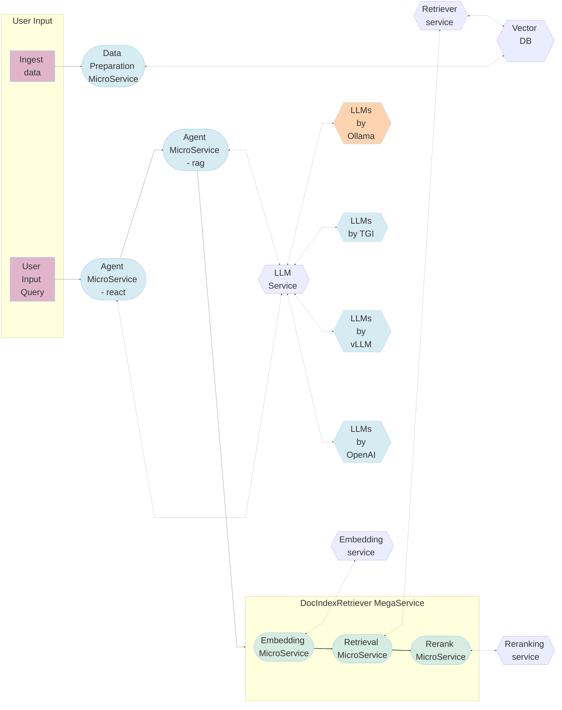

# Adding SLMs support for AgentQnA workflow in GenAIExamples on Intel Xeon platform

The AgentQnA workflow in GenAIExamples uses LLMs as agents to intelligently manage the control flow in the pipeline. Currently, it relies on the OpenAI paid API for LLM services on the Xeon platform, which incurs costs and does not utilize Xeon for LLM computation. This RFC aims to add support for open-source small language models (SLMs) locally deployed on Xeon through Ollama for LLM engines.
## Author(s)

Pratool Bharti

## Status

 `Under Review`

## Objective

### Problems This Will Solve
- **Access to Open-source SLMs on Xeon**: Provides access to open-source SLMs through Ollama on Xeon. SOTA open-source SLMs model work fine for less complex agentic workflow. Given an elaborated prompt, Llama 3.1 and 3.2 small models are fairly accurate for tool calling, an important feature for Agents.
- **Cost Reduction**: Eliminates the need for paid API services by using open-source SLMs.
- **Data Privacy**: Ensures data privacy by processing data locally.
- **Performance Optimization**: Leverages the computational power of Intel Xeon CPUs for efficient LLM execution.

### Goals

- **Local Deployment**: Enable local deployment of open-source SLMs on Intel Xeon CPUs.
- **Integration with Ollama**: Seamless integration of Ollama framework to access open-source SLMs.
- **Maintain Functionality**: Ensure the AgentQnA workflow continues to function effectively with the new setup.
- **Integration of popular serving framework**: Integration of Ollama serving framework in AgentQnA.

### Non-Goals

- **New Features**: No new features will be added to the AgentQnA workflow beyond the support for local SLMs as an agent.
- **Support for Non-Xeon Platforms**: This RFC is specific to Intel Xeon CPUs and does not cover other hardware platforms.

## Motivation

### SLMs Performance on CPU
Open-source small language models (SLMs) are optimized to run efficiently on CPUs, including Intel Xeon processors. These models are designed to balance performance and resource usage, making them suitable for deployment in environments where GPU resources are limited or unavailable. By leveraging the computational capabilities of Xeon CPUs, SLMs can achieve satisfactory performance for various agent tasks within the AgentQnA workflow. Given a right prompt, smaller Llama models are fairly accurate in tool calling which is an essential features for agents.

### Ollama Popularity and Wide Range of Models
Ollama provides a comprehensive set of libraries and tools to facilitate the deployment and management of open-source language models. These libraries are designed to integrate seamlessly with existing workflows, enabling developers to easily incorporate SLMs into their applications. Ollama's model libraries support a wide range of open-source models, ensuring compatibility and ease of use for different use cases.

#### Key Features of Ollama
- **Extensive Model Support**: Ollama supports a variety of open-source language models, including state-of-the-art models that are continuously updated.
- **Ease of Integration**: The libraries and tools provided by Ollama are designed to integrate smoothly with existing systems, reducing the complexity of adding new models to the workflow.
- **Scalability**: Ollama's tools are built to handle different scales of deployment, from small-scale local setups to larger, more complex environments.
- **Community and Documentation**: Ollama has a strong community and extensive documentation, providing support and resources for developers to effectively use and troubleshoot the tools.

#### Benefits of Using Ollama
- **Flexibility**: Developers can choose from a wide range of models to best fit their specific needs and use cases.
- **Cost Efficiency**: By leveraging open-source models, organizations can reduce costs associated with proprietary solutions.
- **Performance**: Ollama's tools are optimized for performance, ensuring efficient execution of language models on Intel Xeon CPUs.
- **Security**: Local deployment of models through Ollama enhances data security by keeping sensitive information within the organization's infrastructure.

By incorporating Ollama into the AgentQnA workflow, the project can leverage these benefits to enhance the overall performance, security, and cost-efficiency of the system.

### Open-source Models are Getting Better
The landscape of open-source language models is rapidly evolving, with continuous improvements in model architecture, training techniques, and performance. Recent advancements have led to the development of state-of-the-art (SOTA) open-source models that rival proprietary solutions in terms of accuracy and efficiency. By adopting these open-source models, the AgentQnA workflow can benefit from cutting-edge technology while maintaining flexibility and control over the deployment environment.

### Cost Efficiency

By integrating open-source small language models (SLMs) through Ollama, organizations can significantly reduce costs associated with language model services. The reliance on paid APIs, such as those provided by OpenAI, can be eliminated, leading to substantial savings. Open-source models do not incur usage fees, making them a cost-effective alternative for deploying language models on Intel Xeon CPUs. Additionally, the local deployment of these models reduces the need for expensive cloud-based infrastructure, further lowering operational expenses. This cost efficiency allows organizations to allocate resources to other critical areas, enhancing overall productivity and innovation.

### Enhanced Data Security
Processing data locally ensures that sensitive information remains secure and private.

### Open-Source Flexibility
Open-source LLMs provide greater flexibility and customization options compared to proprietary solutions.

## Design Proposal

The workflow for the proposed changes are as follows. As shown below, Ollama serving models will be added as LLM serving engine for the Xeon platform. This will work as an alternative for vLLM, TGI and OpenAI LLM engines. New change is highlighted in orange.

The proposed design for Ollama serving support entails following changes:

### 1. Ollama serving container:
- **Models hosted in Ollama container**: Build and run a container on Xeon platform that hosts Ollama models as an alternative LLM service engine. Hosted models can be accessed by Agent microservice at a given host ip and port. 

### 2. Support for latest Llama SLMs:
- **Add Llama 3.1 and 3.2 small models for Xeon**: SLMs from Lllama 3.1 and 3.2 models will be added and validated for the AgentQnA workflow.

## Compatibility

Added component will be compatible with the existing components