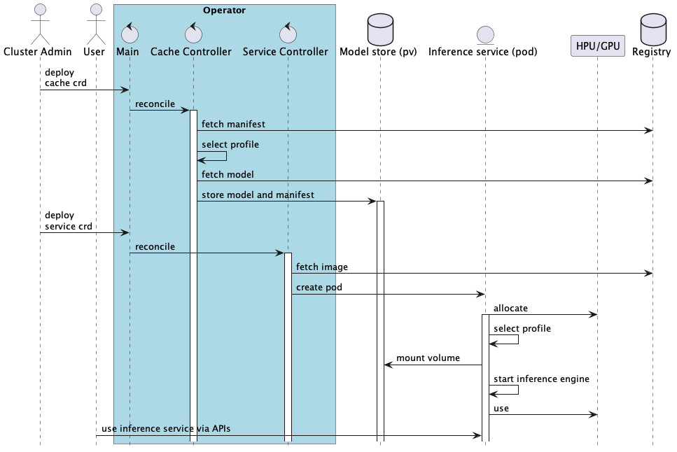

# RFC: OPEA Inference Microservices (OIM)

This RFC talks about creating OPEA inference microservices (OIM) similar to NVIDIA NIMs.

## Author(s)

[Poussa, Sakari](https://github.com/poussa),
[Bhandaru, Malini](https://github.com/mkbhanda),
[Lehtonen, Markus](https://github.com/marquiz),
[Kanevsky, Alexander](https://github.com/kad),
[Lu, Lianhao](https://github.com/lianhao),
[Yang, Yuhan](https://github.com/PeterYang12)

## Status

`Accepted`

## Objective

OPEA seeks to ease enterprise GenAI adoption in a landscape that is fast moving, has skills gaps, and is cost conscious. A look at OPEA's GenAIExamples illustrates the choices a user must make: whether to use Docker or Kubernetes, the model serving framework, whether to optimize for latency or throughput or quantization, in addition to the hardware they want to run on. Can we abstract some of this complexity for inference services?

Nvidia's NIM does just this. It expects a user to only specify a model and what they would like to optimize for, their key performance indicator (KPI) type, be it low latency, high throughput or quantization. Nvidia abstracts away both the need to choose a model serving framework and determining its optimum parameters for the same to achieve the KPIs on provided hardware.

## Motivation

Nvidia delivers this ease of use through tooling that first detects the runtime hardware, which is then used to filter for profiles matching the desired model and KPIs. A profile is a recipe specifying how to launch an inference service.  It specifies not only which model server framework (such as TGI or vLLM or Ollama ) to use but also number of GPU cards, amount of memory, degree of tensor parallelism, batch size etc. Lastly the profile is used to launch the inference service on the given hardware.

The profiles are established through offline experimentation using tools like MLPerf. For a model, one or more model frameworks are explored on different hardware to determine settings providing the best performance for a given KPIs. Constructing profiles is non-trivial, resource intensive work.

## Design Proposal

We seek to offer a similar ease of use experience in OPEA for the inference services. Nvidia’s open source NIM Operator is a tool that eases launching inference services. OPEA plans to extend NIM operator, or similar, to deliver an Operator that provides similar functionality but also supports multi-vendor hardware and shall endeavor to work with Kubernetes and its flavors such as Red Hat OpenShift and SUSE Rancher, and their AI variants by working with our partners and potentially integrating with platforms such as KServe and RayAI.  The first release will provide minimal functionality and over time with community contributions grow richer.  We anticipate providers of AI platforms that operate on a multitude of hardware platforms will find the HW optimized profiles valuable in providing cost-effective performant inference services.

With regard to profiles we shall start with supporting vLLM as the model framework and build profiles for a few popular models. Profiles may also contain more accurate resource usage information for Kubernetes deployments (allowing better Kubernetes scheduling decisions and preventing failures on resource contention). We do anticipate constant enhancements and new offerings in the model serving space and a steady influx of new models.

The following diagram shows example of the operator main use case interactions; model caching, inference service creation and usage.

The work will entail 

1) Auto-detecting hardware type and what is allocated.

2) Taking the user specified model and profile (if not specified using a default profile) to retrieve configurations that are possible on the allocated hardware type and quantity. For instance, a configuration that leverages tensor parallelism is infeasible if only one GPU card is allocated.

3) Automating performance studies to identify optimum settings for a given hardware with various resource allocations for a given model and constructing profile specific configurations. These studies will be repeated to take advantage of new models, frameworks, and other enhancements.

4) Providing an open-source tool, such as [ORAS](https://oras.land/), to discover and list available profiles/configurations for a model.

5) Publishing the profiles and other artifacts to an OCI compatible registry, such as Docker Hub or ghcr.io.

## Alternatives Considered

Creating everything from scratch was rejected because an open-source alternative exists and provides most of the features OPEA project needs.

## Compatibility

OPEA project will try to stay as close as possible with the original APIs and behaviors.
