# 25-03-14-GenAIExamples-001-CodeTrans-with-Agents

## Author(s)

[Han, Letong](https://github.com/letonghan)

## Objective

This RFC proposes the integration of two Agent mechanisms into the CodeTrans Example to enhance the reliability, user experience, and code quality. The goal is to minimize the propagation of erroneous code and improve the feasibility of automated code translation.

- Pre-LLM Agent: Validates the correctness of the input code before it is processed by the LLM. If errors are detected, the agent provides feedback to the user, prompting them to correct their code before proceeding.
- Post-LLM Agent: Executes the translated code after it has been generated by the LLM. If the execution fails, the agent captures the error and sends it back to the LLM for re-generation.

By introducing these agents, the system ensures that only valid code is passed to the LLM and that generated code is verified before reaching the user, thereby improving the overall efficiency and accuracy of the translation process.

## Motivation

The current CodeTrans example relies entirely on an LLM for code translation, but there are some limitations:

1. **User input may contain syntax or logic errors.** Passing faulty code directly to the LLM can result in incorrect or unusable translations.
2. **LLM-generated code isn’t always correct.** Without an automated validation step, users have to manually review and debug the output.
3. **No feedback loop exists.** The LLM doesn't adapt based on execution results, leading to repeated errors.

By introducing Agent mechanisms, we can improve the process in three key ways:

1. **Reduce error propagation**: Ensure that only valid code reaches the LLM, minimizing incorrect translations.
2. **Enhance user experience**: Detect input issues early, providing clear feedback to avoid unnecessary debugging.
3. **Improve code quality**: Automatically verify LLM-generated code and trigger re-generation when needed, increasing overall reliability.

## Use-Cases

### Detecting Errors in Input Code Before Translation

Scenario:

A developer wants to convert a Python script to Java but unknowingly provides code with syntax errors. If the faulty code is passed directly to the LLM, it might generate an incorrect or non-functional Java version.

How the CodeTrans Helps:

- Pre-LLM Agent executes the provided Python code.
- If the code has syntax or runtime errors, the agent stops the process and returns an error message:
    - ❌ "Your input code contains errors. Please review and correct it before proceeding."
- The developer can then fix the issues and resubmit valid code, ensuring that only runnable code is sent to the LLM for translation.

### Validating Generated Code for Accuracy

Scenario:

A developer uses the CodeTrans example to translate Python code into Java. The LLM generates a Java version, but there's no guarantee that it runs correctly. Without validation, the developer would have to manually check for errors, which is time-consuming.

How the CodeTrans Helps:

- Post-LLM Agent executes the translated Java code:
    - ✅ If the code runs successfully, the system returns the output to the user.
    - ❌ If the code fails, the agent captures the error details and sends them back to the LLM.
- The LLM then retries code generation, using the error context to produce a corrected version.

This automated validation ensures that developers receive functional translations without having to manually test and debug every output.

### Preventing Infinite Regeneration Loops

Scenario:

In some cases, the LLM may repeatedly generate faulty code, leading to an endless loop of failed executions and retries. Without a safeguard, this could waste computation resources and frustrate users.

How the CodeTrans Helps:

- Post-LLM Agent tracks retry attempts.
- If the LLM fails to produce a correct version after three attempts (or a configurable limit), the system stops further retries.
- Instead of another faulty translation, the user receives:
    - ❌ "Code generation failed after multiple attempts. Here are possible reasons and debugging suggestions."
- The system provides relevant error logs and hints, helping the developer troubleshoot the issue efficiently.

This prevents the LLM from getting stuck in an infinite loop and improves user control over the process.

These use cases demonstrate how integrating Agents into the CodeTrans example improves input validation, output verification, and error handling. By ensuring only valid code reaches the LLM and automatically validating generated code, the system reduces errors, minimizes manual debugging, and improves translation accuracy. Retry limits and debugging feedback prevent infinite loops, making the process more reliable, efficient, and user-friendly.

## Design Proposal

### Architecture Diagram

```mermaid
graph LR
    %% Colors %%
    classDef blue fill:#ADD8E6,stroke:#ADD8E6,stroke-width:2px,fill-opacity:0.5
    classDef orange fill:#FBAA60,stroke:#ADD8E6,stroke-width:2px,fill-opacity:0.5
    classDef orchid fill:#C26DBC,stroke:#ADD8E6,stroke-width:2px,fill-opacity:0.5
    subgraph User Interface
        %% direction TD
        Frontend[(Frontend Server)]:::orange
        UIQ[User Input Query]:::orchid
        UIQ --> Frontend
    end

    Megaservice[(CodeTrans Megaservice)]:::orange
    
    subgraph CodeTrans Server
        Agent1([Pre-LLM Agent]):::blue
        LLM_MicroService([LLM MicroService]):::blue
        Agent2([Post-LLM Agent]):::blue
    end

    CodeExecutionTool([Code Execution Tool]):::blue

    direction LR
    Frontend -->|Send Request| Megaservice
    Megaservice -->|Send Code| Agent1
    Agent1 -->|Verified Code| LLM_MicroService
    LLM_MicroService -->|Generated Code| Agent2
    Agent2 -->|Re-Generate Request| LLM_MicroService

    Agent1 -->|Validated input code| CodeExecutionTool
    Agent2 -->|Validate genereated code| CodeExecutionTool
```

### Components and Functionality

1. User Interface

    UI Server: Handles user input (code, source language, target language) and sends requests to the CodeTrans megaservice.

    UI Components:
    - Original Code Box – Displays user-provided code.
    - Original Code Execution Result – Shows execution output for the input code.
    - Translated Code Box – Displays the LLM-generated code.
    - Generated Code Execution Result – Shows execution output for the translated code.
    - Code Usage / Debugging Suggestions – Provides insights for troubleshooting and improvements.

2. Backend Servers

    CodeTrans Megaservice: Manages the scheduling of Agents, LLM, and user input/output.

    Pre-LLM Agent:
    - Validates code correctness, structures input/output, executes the code, and evaluates the result.
    - Runs the user-provided code to check for syntax or runtime errors.
    - If errors are detected, the agent returns an error message, requiring the user to fix the code before proceeding.

    LLM Microservice:
    - Uses a large language model (LLM) to translate the input code into the target language.

    Post-LLM Agent:
    - Executes the LLM-generated code and verifies its correctness.
    - If execution is successful, the translated code is returned to the user.
    - If execution fails, the error details are sent back to the LLM for regeneration (up to 3 attempts).

    Code Execution Tool:
    - Provides a secure execution environment (e.g., Docker/Sandbox) to safely run code and prevent malicious execution risks.

## Expected Benefits

| Feature              | Benefits                                       |
|----------------------|-----------------------------------------------|
| Input Code Validation  | Catches errors early, preventing faulty translations. |
| Output Code Validation | Ensures reliable and accurate code conversion. |
| Automated Debug Feedback | Reduces trial-and-error, improving LLM accuracy. |
| Secure Execution Environment | Protects the system from malicious code. |
| Error Classification | Identifies syntax, logic, and runtime errors for better debugging. |

## Comparison with Existing CodeTrans

| Feature              | Current CodeTrans      | With Agents                          |
|----------------------|----------------------|-------------------------------------|
| Input Error Handling | LLM directly translates | Validates first, prompts user to fix errors. |
| Code Accuracy Check  | None                 | Agent 2 automatically verifies output. |
| Code Execution Environment | None | Docker / sandbox execution. |
| Feedback Mechanism   | None                 | Errors are sent back to LLM for regeneration. |

## Potential Risks & Mitigations

| Risk                | Mitigation Strategy                                |
|---------------------|--------------------------------------------------|
| Code Execution Security | Use Docker sandbox to prevent malicious code. |
| LLM Infinite Loop  | Set a max retry limit to avoid endless error regeneration. |
| Performance Issues | Parallelize Agent tasks to improve throughput. |
| User Experience    | Provide debug suggestions to reduce correction effort. |

## Implementation Plan

### Phase 1: Proof of Concept (PoC), target v1.3
- Validate the effectiveness of the Agent mechanism.
- Ensure the code execution environment is securely isolated.

### Phase 2: Core Feature Development, target v1.4
- Develop the Code Execution Tool in Agent to provide a secure execution environment.
- Implement the Pre-LLM Agent for input code validation.
- Optimize the CodeTrans megaservice to automate the scheduling of Agents.
- Improve UI integration by providing a code execution interface and displaying execution results.  

### Phase 3: LLM Integration, target v1.4
- Integrate the LLM MicroService with Agent.
- Implement the Post-LLM Agent for output validation and LLM feedback handling.

### Phase 4: Optimization & Expansion, target v1.4
- Set a maximum retry limit to prevent infinite LLM regeneration loops.
- Provide debugging suggestions to enhance user experience.

## Conclusion

By integrating Agents into the CodeTrans example, we enhance translation accuracy and stability, reduce error propagation, and improve user experience. This RFC outlines the design, architecture, and implementation plan. Future optimizations will focus on error classification, execution security, and feedback mechanisms, enabling a more intelligent and reliable code translation service.  
