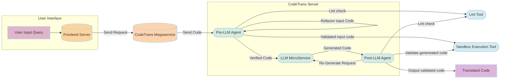

# 25-03-14-GenAIExamples-001-CodeTrans-with-Agents

## Author(s)

[Han, Letong](https://github.com/letonghan)

## Objective

This RFC proposes the integration of two Agent mechanisms into the CodeTrans Example to enhance the reliability, user experience, and code quality. The goal is to minimize the propagation of erroneous code and improve the feasibility of automated code translation.

- Pre-LLM Agent: Validates the correctness of the input code before it is processed by the LLM. If errors are detected, the agent attempts to automatically fix them to ensure the code is executable. If the correction is successful, the modified code proceeds to the LLM.
- Post-LLM Agent: Does lint check and executes the translated code after it has been generated by the LLM. If the execution fails, the agent captures the error and sends it back to the LLM for re-generation.

Moreover, this design introduces a user-configurable **three-step validation pipeline**, allowing users to enable or disable each stage independently via the frontend UI.

* Step 1: **Auto-fix** – Automatically fixe code with syntax errors in agent.
* Step 2: **Lint Check** – Run language-specific lint check to catch style or semantic issues.
* Step 3: **Execution** – Securely run code in a sandbox environment to validate. (Plan to support only `Python` for now)

The Auto-fix step happens in agent service, and the lint check and execution steps are executed by external tools.

By introducing these agents, the system ensures that only valid code is passed to the LLM and that generated code is verified before reaching the user, thereby improving the overall efficiency and accuracy of the translation process.

## Motivation

The current CodeTrans flow has three major issues:

1. **User input may contain syntax or logic errors.** Passing faulty code directly to the LLM can result in incorrect or unusable translations.
2. **LLM-generated code isn’t always correct.** Without an automated validation step, users have to manually review and debug the output.
3. **No feedback loop exists.** The LLM doesn't adapt based on execution results, leading to repeated errors.

By introducing Agent mechanisms, we can improve the process in three key ways:

1. **Reduce error propagation**: Ensure that only valid code reaches the LLM, minimizing incorrect translations.
2. **Enhance user experience**: Detect input issues early, providing clear feedback to avoid unnecessary debugging.
3. **Improve code quality**: Automatically verify LLM-generated code and trigger re-generation when needed, increasing overall reliability.

## Use-Cases

### Detecting Errors in Input Code Before Translation

Scenario:

A developer wants to convert a Java script to Python but unknowingly provides code with syntax errors. If the faulty code is passed directly to the LLM, it might generate an incorrect or non-functional Python version.

How the CodeTrans Helps:

- User selects `Lint Check` in the web UI.
- Pre-LLM Agent does the lint check for the provided Java code.
- If the code has style or semantic issues, the agent will attempt to automatically fix them.
- The developer can review and confirm the fixes or manually adjust the code before resubmitting.

### Validating Generated Code for Accuracy

Scenario:

A developer uses the CodeTrans example to translate Java code into Python. The LLM generates a Python version, but there's no guarantee that it runs correctly. Without validation, the developer would have to manually check for errors, which is time-consuming.

How the CodeTrans Helps:

- User selects both `Lint Check` and `Code Execution` in the web UI.
- Post-LLM Agent does the lint check for the translation Python code.
  - Agent will automatically fix any style/semantic issues.
- Post-LLM Agent executes the translated Python code:
  - ✅ If the code runs successfully, the system returns the output to the user.
  - ❌ If the code fails, the agent captures the error details and sends them back to the LLM.
- The LLM then retries code generation, using the error context to produce a corrected version.

This automated validation ensures that developers receive functional translations without having to manually test and debug every output.

### Preventing Infinite Regeneration Loops

Scenario:

In some cases, the LLM may repeatedly generate faulty code, leading to an endless loop of failed executions and retries. Without a safeguard, this could waste computation resources and frustrate users.

How the CodeTrans Helps:

- Both Pre- and Post-LLM Agents tracks retry attempts.
- If the LLM fails to produce a correct version after configurable number of attempts, the system stops further retries.
- Instead of another faulty translation, the user receives:
  - ❌ "Code generation failed after multiple attempts. Here are possible reasons and debugging suggestions."
- The system provides relevant error logs and hints, helping the developer troubleshoot the issue efficiently.

This prevents the LLM from getting stuck in an infinite loop and improves user control over the process.

These use cases demonstrate how integrating Agents into the CodeTrans example improves input validation, output verification, and error handling. By ensuring only valid code reaches the LLM and automatically validating generated code, the system reduces errors, minimizes manual debugging, and improves translation accuracy. Retry limits and debugging feedback prevent infinite loops, making the process more reliable, efficient, and user-friendly.

## Design Proposal

### Architecture Diagram



### Components and Functionality

#### User Interface

UI Server:

- Handles user input (code, source language, target language)
- Sends requests to the CodeTrans megaservice

UI Components:

- Lint Check Button: Select to do lint check for input/output codes.
- Code Execution Button: Select to execute code for functionality check. (Support Python only)
- Input/output case: if `Code Execution Button` is selected, use will need to provide a set of input/output for this piece of code.
- Code Box – Displays the user-provided and the LLM-generated code.
- Code Translation Result – Shows the translated code, the lint check and execution result if have.

#### Backend Servers

CodeTrans Megaservice:

* Manages the scheduling of Agents, LLM, and user input/output.

Pre-LLM Agent:

- Validates code correctness, structures input/output, executes the code, and evaluates the result.
- Do lint check statically.
  - If semantic errors are detected, LLM will fix it according to lint check report.
- Runs the user-provided code to check for syntax or logical errors.
- If errors are detected, the agent attempts to automatically fix them (within configurable number of attempts).
  - If successfully corrected, the modified code proceeds to the LLM.
  - If the errors cannot be resolved, the agent returns an error message, prompting the user to review and manually fix the code before proceeding.

LLM Microservice:

- Uses a large language model (LLM) to translate the input code into the target language.

Post-LLM Agent:

- Check code statically, executes the LLM-generated code, and verifies its correctness.
  - If execution is successful, the translated code is returned to the user.
  - If execution fails, the error details are sent back to the LLM for regeneration (within configurable number of attempts).

Lint Check Tool:

* Proceed lint check for a snippet of code, support different coding language like `pylint`, `eslint`, `cpplint` and so on.
* Since Lint is static check, it does not require a separate execution environment, so it can be called and executed directly in a python script.

Code Execution Tool:

- Provides a secure execution environment (e.g., Docker/Sandbox) to safely run code and prevent malicious execution risks.
- For reasons of complexity of implementation, only `Python` execution tool will be supported for now.

#### Lint Check Tool

Here's a table of lint tools for different coding languages:

| Coding Language | Lint Tool  | Introduction                                                                                                                                          | Reference                                               |
| --------------- | ---------- | ----------------------------------------------------------------------------------------------------------------------------------------------------- | ------------------------------------------------------- |
| Python          | Pylint     | A tool that checks for errors in Python code, tries to enforce a coding standard and looks for bad code smells.                                       | [link](https://www.pylint.org/)                            |
| JavaScript      | ESLint     | A tool for identifying and reporting on patterns found in ECMAScript/JavaScript code, with the goal of making code more consistent and avoiding bugs. | [link](https://eslint.org/docs/latest/use/getting-started) |
| Java            | Checkstyle | A development tool to help programmers write Java code that adheres to a coding standard.                                                             | [link](https://checkstyle.sourceforge.io/index.html)       |
| C++             | cpplint    | A command-line tool to check C/C++ files for style issues according to[Google&#39;s C++ style guide](http://google.github.io/styleguide/cppguide.html)   | [link](https://github.com/cpplint/cpplint)                 |
| Go              | vet        | Examines Go source code and reports suspicious constructs, such as Printf calls whose arguments do not align with the format string.                  | [link](https://pkg.go.dev/cmd/vet)                         |
| Bash/Shell      | ShellCheck | Point out and clarify typical beginner's syntax issues that cause a shell to give cryptic error messages.                                             | [link](https://github.com/koalaman/shellcheck/#readme)     |

To use these tools to do static checks for different languages, we could save the target code into a temporary file, and execute the lint check command in `bash`.

This is an example script which support all of these languages.

```bash
#!/bin/bash
# usage: ./lint_tool.sh <language> <source_file>

LANGUAGE="$1"
SOURCE_FILE="$2"
REPORT_FILE="lint_report_${LANGUAGE}.txt"

# prepare file paths for Java checkstyle
CHECKSTYLE_JAR="./checkstyle.jar"
CHECKSTYLE_CONFIG="./google_checks.xml"

if [[ ! -f "$SOURCE_FILE" ]]; then
  echo "Source file not found: $SOURCE_FILE"
  exit 1
fi

case "$LANGUAGE" in
  python)
    echo "Running pylint..."
    pylint "$SOURCE_FILE" > "$REPORT_FILE" 2>&1
    ;;

  javascript)
    echo "Running eslint..."
    eslint "$SOURCE_FILE" > "$REPORT_FILE" 2>&1
    ;;

  java)
    echo "Running checkstyle..."
    if [[ ! -f "$CHECKSTYLE_JAR" ]]; then
      echo "Missing checkstyle.jar. Please download it first."
      exit 1
    fi
    java -jar "$CHECKSTYLE_JAR" -c "$CHECKSTYLE_CONFIG" "$SOURCE_FILE" > "$REPORT_FILE" 2>&1
    ;;

  go)
    echo "Running go vet..."
    go vet "$SOURCE_FILE" > "$REPORT_FILE" 2>&1
    ;;

  cpp)
    echo "Running cpplint..."
    cpplint "$SOURCE_FILE" > "$REPORT_FILE" 2>&1
    ;;

  *)
    echo "Unsupported language: $LANGUAGE"
    echo "Supported language: python, javascript, java, go, cpp"
    exit 1
    ;;
esac

echo "Lint check completed. Report saved to $REPORT_FILE"

```

#### Code Execution Tool

Currently we only design to support code execution tool for `Python`.

* Prevent code injection

  * Use Python Abstract Syntax Tree (AST) to detect and block dangerous operations such as `import os`, `exec`, and `__import__`.

    ```python
    import ast

    code = "xxx"
    tree = ast.parse(code)
    # analyze each node in ast tree
    for node in ast.walk(tree):
        # Do import checks
    ```
* Install dependencies automatically

  * Code execution tool need to support extracting and installing dependencies from source code automatically.
  * Use AST here to extract the `import`/`from xxx import xxx` libraries.

    ```python
    import ast

    def extract_imports(code_str):
        tree = ast.parse(code_str)
        imports = set()
        for node in ast.walk(tree):
            if isinstance(node, ast.Import):
                for alias in node.names:
                    imports.add(alias.name.split('.')[0])
            elif isinstance(node, ast.ImportFrom) and node.module:
                imports.add(node.module.split('.')[0])
        return list(imports)
    ```
* Sandbox execution

  * To ensure that the code runs in a fully isolated environment, the tool needs to use container-based sandbox like `Docker`.
  * In the context of resource constraints, the resource limits (including memory, CPU, process numbers) and security policies are needed.
  * Since the dependencies need to be installed first, the network authority will be processed in two stages:
    1. preperation: install the dependencies into a mounted path
       ```bash
       # remove all the capabilities of the container except for needed ones
       docker run --rm --cap-drop ALL --cap-add ${what_is_needed} -v $(pwd)/code:/code \
         sandbox-python:3.10 \
         bash -c "pip install -r /code/requirements.txt -t /code/.deps"
       ```
    2. execution: run codes using mounted dependencies
       ```bash
       docker run --rm --cap-drop ALL --cap-add ${what_is_needed} -v $(pwd):/code --network=none \
         sandbox-python:3.10 \
         python3 -I -E -S /code/user_code.py
       ```
  * After each time of execution, the mounted folder (installed dependencies) will be cleaned up.

## Expected Benefits

| Feature                      | Benefits                                              |
| ---------------------------- | ----------------------------------------------------- |
| Input Code Validation        | Catches errors early, preventing faulty translations. |
| Output Code Validation       | Ensures reliable and accurate code conversion.        |
| Automated Debug Feedback     | Reduces trial-and-error, improving LLM accuracy.      |
| Lint Static Code Check       | Catch bugs early and enforce consistent code quality. |
| Secure Execution Environment | Protects the system from malicious code.              |
| Error Classification         | Identifies syntax, logic errors for better debugging. |

## Risks and Mitigations / User Workarounds

* Node / cluster take over by execution of malicious code
  * Mitigation: automated vetting of the executed code + its strict sandboxing
* Code execution exhausting node resources
  * Mitigation: strict resource usage limits
* Application response taking too long due to dependency install / code execution
  * Mitigation: dependency caching + enforced execution timeouts + error response to user
  * Workaround: user disables linting / code execution
* Users can affect each others' results
  * Mitigation: (dependency) caching is per-user session
* Code execution failing translation due to limits / sandboxing / dependency being offline
  * Workaround: user disables code execution / linting

## Implementation Plan

### Phase 1: Develop Code Execution Tool, target v1.3

- Research on the Code Execution Tool.

### Phase 2: Core Feature Development, target v1.4

- Develop the Lint Check Tool bash script.
- Develop the Code Execution Tool in Agent to provide a secure execution environment.
- Implement the Pre-LLM Agent for input code validation.
- Improve UI integration by providing a code execution interface and displaying execution results.

### Phase 3: Agent Integration, target v1.4

- Integrate the LLM MicroService with Agent.
- Optimize the CodeTrans megaservice to automate the scheduling of Agents.
- Implement the Post-LLM Agent for output validation and LLM feedback handling.

### Phase 4: Optimization & Expansion, target v1.4

- Set a maximum retry limit to prevent infinite LLM regeneration loops.
- Provide debugging suggestions to enhance user experience.
