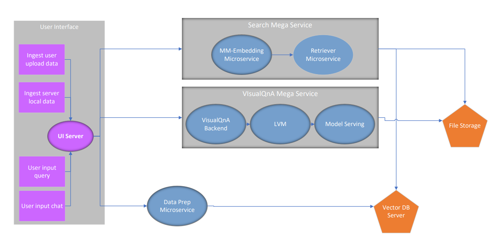
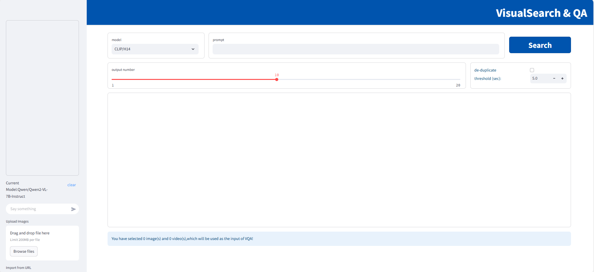
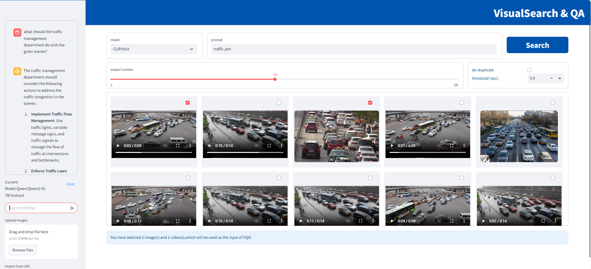

# 25-04-14-GenAIExamples-001-Visual_Search_and_QA.md

The Visual Search and QA application integrates a multi-modal search engine with a visual Q&A assistant. It leverages search results as visual context to generate more accurate answers to user queries.

## Author(s)

[llin60](https://github.com/llin60), [Johere](https://github.com/Johere), [diyaddc](https://github.com/diyaddc)

## Status

Under Review

## Objective

- Develop a new data-prep microservice to process visual data (images and videos).
- Create a new embedding microservice to generate multi-modal embeddings for both images and text using models like CLIP.  
  Support Chinese text embedding with the [Chinese-CLIP](https://github.com/OFA-Sys/Chinese-CLIP) model. The hardware platform will include Intel(R) Core(TM) Processors and Intel(R) Arc(TM) A-Series Graphics, with OpenVINO as the inference engine.
- Enhance the LVM microservice to support Intel(R) Arc(TM) A-Series Graphics, enabling the new Qwen2.5-VL model.
- Introduce a Visual Search and QA example application to demonstrate the usage of these microservices.

## Motivation

In domains like surveillance and smart cities, vast amounts of image and video data are generated daily.  
Analyzing, categorizing, and searching for specific targets (e.g., a particular vehicle) or events (e.g., traffic jams or accidents) in such large datasets requires significant human effort.  

Multi-modal models like CLIP can extract embeddings for both image and text data, mapping them into the same vector space for comparison.  
This capability enables the creation of an application where users can search for events of interest by providing text descriptions as input and retrieve relevant visual data that matches the description.  

After retrieving search results, users can provide these results as visual context to a large visual-language model (e.g., Qwen2.5-VL) for deeper insights. The LVM model can also function independently as a Q&A assistant for user queries.

## Design Proposal

The diagram below illustrates the overall workflow of the Visual Search and QA application:  


### Dataprep

The data-prep microservice processes images and videos, extracts their embeddings using the image encoder from the CLIP model, and stores them in a vector database.  

#### Video Processing:
- Slice long videos into segments to avoid exceeding LVM capabilities.
- Extract frames at configurable intervals.

#### Image/Frame Processing:
- Resize, convert colors, normalize, and apply object detection with cropping.

> **Note:**  
> Object detection and cropping improve retrieval performance for large-scale scene images (e.g., high-resolution surveillance images with multiple objects).  
> Since the image encoder input size is 224x224, resizing may render some objects (e.g., humans, vehicles) unrecognizable.  
> Object detection and cropping preserve these objects as clear targets in separate cropped images. Metadata links the original image to its cropped versions. During retrieval, if a cropped image matches, the original image is returned.

Instead of uploading data, users can specify directories on the host machine as data sources. This approach is more efficient for large datasets, which are common in the application's target scenarios. Assuming the application is self-hosted, users have certain access to the server. Then users know where the files are stored on the host machine, and can provide the file directory as input so that the microservice can process one-after-another or in batches.  

A new endpoint `/v1/dataprep/ingest_host_dir` will allow users to specify directories. Example request:

```
curl -XPOST http://localhost:6007/v1/dataprep/ingest_host_dir -H "Content-Type: application/json" -d '{
"file_directory": "/home/user/data/" }
```


The `get` and `delete` APIs will retain their current functionality.

Currently the existing dataprep microservices all aim to process various formats of data to text, while the visual data needs to be used authentically for this application. A new dataprep component will be registered.

### Search Megaservice

The Search Megaservice consists of a multi-modal embedding microservice and a retriever microservice.  

#### Workflow:
1. The embedding microservice generates text embeddings for input descriptions (e.g., "traffic jam").
2. The retriever microservice searches the vector database for the top-k most similar matches.

The embedding API would be compatible with OpenAI API

```
curl http://localhost:6000/v1/embeddings
-X POST
-d '{"input":"traffic jam"}'
-H 'Content-Type: application/json'
```

The retriever microservice leverages the ones in GenAIComps

```
curl http://localhost:7000/v1/retrieval
-X POST
-d "{"embedding":${text_embedding},"search_type":"similarity", "k":4}"
-H 'Content-Type: application/json'
```


A new endpoint temporarily proposed as `/v1/dbsearch_qna` will be introduced for combined search and Q&A functionality:

```
curl http://localhost:8888/v1/dbsearch_qna
-X POST
-d '{"text":"traffic jam"}'
-H 'Content-Type: application/json'
```


### Visual Q&A Megaservice

The Visual Q&A Megaservice builds on the existing VisualQnA in GenAIExamples, with added support for Intel Arc Graphics and the Qwen2.5-VL model.  
The LVM microservice will be upgraded with a new docker compose file for `intel/gpu/arc`.

Example request:

```
curl http://localhost:9399/v1/lvm -XPOST -d '{"image": "iVBORw0KGgoAAAANSUhEUgAAAAoAAAAKCAYAAACNMs+9AAAAFUlEQVR42mP8/5+hnoEIwDiqkL4KAcT9GO0U4BxoAAAAAElFTkSuQmCC", "prompt":"What is this?"}' -H 'Content-Type: application/json'
```


### User Interface

The UI, built with `streamlit`, allows users to:
- Enter search queries.
- View matched results.
- Interact with the LVM in a chatbox with upload tools.

#### Visual Search and QA UI Initial Interface:


#### Visual Search and QA UI Example:


## Compatibility

The Visual Search and QA application includes its own UI, search megaservice, and visual Q&A megaservice.  
It leverages the retriever microservice from GenAIComps and modifies the LVM microservice based on the existing implementation in GenAIComps.  
Changes to these microservices may impact the application.

## Miscellaneous

- **Performance Impact:** Retrieval speed is critical due to the potential size of the visual database.  
  Initially, open-source vector databases like Milvus will be used. Future optimizations may be introduced.