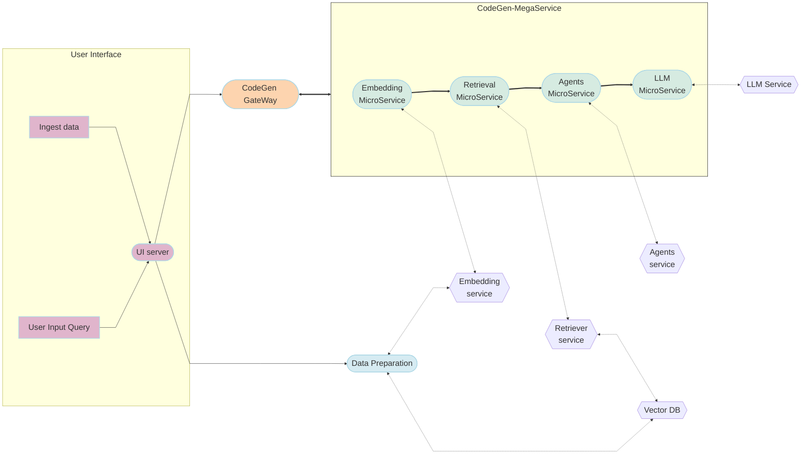

# 25-15-01-GenAIExamples-001-Code-Generation-Using-RAG-and-Agents

## Author(s)

[Mustafa Cetin](https://github.com/MSCetin37), 
[Melanie H. Buehler](https://github.com/mhbuehler),
[Dina Suehiro Jones](https://github.com/dmsuehir),
[Pratool Bharti](https://github.com/pbharti0831),
[Abolfazl Shahbazi](https://github.com/ashahba)


## Objective

The objective of this RFC is to propose the integration of Retrieval-Augmented Generation (RAG) and Agents into our existing code generation example. The goal is to leverage the strengths of RAG and Agents to enhance the efficiency, effectiveness, and quality of code generation. This document outlines the benefits, design proposal, and implementation plan for incorporating RAG and Agents into our code generation process.

## Motivation

The motivation behind this proposal stems from the need to improve the current code generation process by incorporating advanced technologies that can provide more accurate, relevant, and high-quality code generation. The integration of RAG and Agents offers several advantages, including enhanced contextual understanding, access to up-to-date information, improved code quality, time efficiency, scalability, customization, and continuous learning. By leveraging these technologies, we can achieve more robust and maintainable code, ultimately enhancing the overall development process.

## Use-Cases

**Adapting a Codebase to New Coding Standards Using RAG and Agents**

A software architect is responsible for updating an existing codebase to align with newly adopted coding standards. By submitting a code optimization request, the architect utilizes the Vector Database Microservice to gather information on the new standards and best practices. The Agent Microservice ensures that only the most relevant context is used, and the RAG Microservice generates code optimizations that adhere to the new standards. The architect reviews and applies these optimizations, ensuring the codebase is consistent and maintains high quality.

**Accelerating Development of a New Feature Using RAG and Agents**

A software engineer is developing a new feature for an application and needs to ensure efficient implementation while adhering to best practices. By submitting a code generation request, the engineer accesses relevant design patterns and code examples through the Vector Database Microservice. The Agent Microservice filters the information to provide the most pertinent context, and the RAG Microservice generates code tailored to the new feature. The engineer incorporates these code generations, resulting in a high-quality, efficiently developed feature that meets all requirements.

**Optimizing Code for Specific Hardware Using RAG and Agents** 

A software engineer is tasked with optimizing a software application to run efficiently on a new hardware platform. By submitting a code optimization request, the engineer leverages the Vector Database Microservice to retrieve relevant information on hardware-specific optimization techniques and best practices. The Agent Microservice filters and prioritizes the most pertinent information, while the RAG Microservice generates precise code optimizations tailored to the new hardware. The engineer applies these optimizations, resulting in a software application that runs efficiently and takes full advantage of the new hardware's capabilities.

**Optimizing Confidential/Experimental Code Using RAG and Agents** 

A research scientist is working on a confidential and experimental software project that requires highly specialized optimizations. By submitting a code optimization request, the scientist leverages the Vector Database Microservice to retrieve relevant information from a secure and confidential repository. The Agent Microservice ensures that only the most relevant and secure context is used, and the RAG Microservice generates code that adhere to the project's confidentiality and experimental requirements. The scientist reviews and applies these optimizations, resulting in a high-quality, optimized implementation that meets the project's unique needs while maintaining confidentiality.


These use-case stories illustrate how the integration of RAG and Agents can enhance various aspects of the code generation process, including performance improvement, adherence to coding standards, efficient feature development, hardware-specific optimization, and optimization for confidential/experimental implementations.


## Benefits of Using RAG for Code Generation

Using Retrieval-Augmented Generation (RAG) for code generation offers several advantages that can significantly enhance the development process:

**Enhanced Contextual Understanding**: RAG combines the strengths of retrieval-based models and generative models. It retrieves relevant information from a large corpus of documents and uses this information to generate more accurate and contextually relevant code. This approach ensures that the generated code is not only syntactically correct but also aligns with best practices and domain-specific knowledge.

**Access to Up-to-Date Information**: RAG can retrieve the latest information from a vast repository of documents, including recent research papers, documentation, and code repositories. This ensures that the code generation is based on the most current and relevant information, helping you stay ahead of the curve.

**Improved Code Quality**: By leveraging a large corpus of high-quality code examples and best practices, RAG can suggest code generations that improve the overall quality of your code. This includes enhancements in performance, readability, maintainability, and adherence to coding standards.

**Time Efficiency**: RAG can quickly retrieve and generate code, saving you valuable time that would otherwise be spent searching for relevant information and manually writing code. This allows you to focus on more critical aspects of your development process.

**Scalability**: RAG can handle large-scale codebases and complex projects, making it suitable for both small and large development teams. It can provide consistent and reliable code generation across different parts of your project, ensuring uniformity and coherence.

**Customization and Adaptability**: RAG can be fine-tuned to cater to specific coding styles, project requirements, and domain-specific needs. This adaptability ensures that the generated code is tailored to your unique context and preferences.

**Continuous Learning and Improvement**: RAG models can continuously learn and improve from new data, ensuring that the code generation evolves with changing technologies and best practices. This continuous improvement helps maintain the relevance and effectiveness of the optimizations over time.

## Benefits of Using Agents

While similarity scores are a valuable tool for identifying relevant information, they have limitations in capturing the full context and nuances required for high-quality code generation. Agents provide an additional layer of intelligence and adaptability, ensuring that the generated code is not only relevant but also accurate, efficient, and tailored to the specific needs of the development team. By incorporating agents into the code generation process, we can achieve more robust and maintainable code, ultimately enhancing the overall development process.

Using Agents in conjunction with RAG for code generation offers several advantages that can significantly enhance the quality and relevance of the generated code:

**Contextual Relevance**: Agents can filter and prioritize the most relevant context from the retrieved information, ensuring that the generated code is highly relevant to the specific problem at hand. This targeted approach minimizes the inclusion of irrelevant or less pertinent information, leading to more precise and effective code generation.

**Improved Accuracy**: By leveraging Agents to refine the retrieved context, the accuracy of the generated code is significantly improved. Agents can identify and focus on the most critical aspects of the retrieved information, reducing the likelihood of errors or suboptimal suggestions.

**Enhanced Efficiency**: Agents streamline the retrieval process by quickly filtering out unnecessary information and highlighting the most relevant data. This efficiency reduces the time and computational resources required to generate high-quality code, allowing for faster development cycles.

**Dynamic Adaptability**: Agents can dynamically adapt to different coding styles, project requirements, and domain-specific needs. This adaptability ensures that the generated code is tailored to the unique context and preferences of the development team, enhancing overall satisfaction and usability.

**Reduced Cognitive Load**: By automating the filtering and prioritization of relevant context, Agents reduce the cognitive load on developers. This allows developers to focus on more critical and creative aspects of the development process, enhancing productivity and innovation.

**Consistency and Coherence**: Agents ensure that the retrieved context is consistently relevant and coherent, leading to uniform and high-quality code generation. This consistency enhances the overall quality and maintainability of the codebase, reducing the need for extensive manual reviews and corrections.

By incorporating Agents into the code optimization process, we can achieve more accurate, relevant, and efficient code generation. Agents enhance the overall quality and effectiveness of the generated code, ultimately leading to a more robust and maintainable codebase.

## PoC Results

We used the same question and the same LLM model to generate answers. The results are shown below:

- **Question:** "Can you create a Python function example that will read a CSV file?"
- **LLM:** Qwen/Qwen2.5-Coder-7B-Instruct

**Current CodeGen Example**

Received Answer:
```python
import csv

def read_csv_file(filename):
    with open(filename, mode='r') as file:
        reader = csv.reader(file)
        for row in reader:
            print(row)

read_csv_file('example.csv')
```

**Proposed Improvement**

We uploaded the content of these URLs to a vector database, and retrieval results are filtered by agents.

```
urls = [
    "https://modin.readthedocs.io/en/latest/index.html",
    "https://github.com/modin-project/modin/blob/main/examples/tutorial/jupyter/execution/pandas_on_ray/local/exercise_2.ipynb", 
    "https://github.com/intel/neural-compressor/blob/master/examples/notebook/pytorch/Quick_Started_Notebook_of_INC_for_Pytorch.ipynb", 
    "https://python.langchain.com/docs/integrations/llms/weight_only_quantization/", 
    "https://python.langchain.com/api_reference/community/embeddings/langchain_community.embeddings.ipex_llm.IpexLLMBgeEmbeddings.html", 
    "https://huggingface.co/docs/optimum/main/intel/openvino/inference",
    "https://huggingface.co/blog/phi2-intel-meteor-lake", 
    "https://uxlfoundation.github.io/scikit-learn-intelex/2024.6/samples/random_forest_yolanda.html" 
]
```

Received Answer:
```python
import modin.pandas as pd

def read_csv(file_path):
    return pd.read_csv(file_path)
```

Results show that even though we have a generic question, the proposed improvement is able to filter the correct contents and create the desired answer.


## Proposed UI Changes for Enhanced Code Generation with RAG and Agents

To improve the current UI and add the functionality for saving documents or online resources to the vector database, we will introduce a new tab in the existing interface. This new tab will allow users to manage their resources effectively, ensuring a seamless integration with the RAG system.

### Main Interface

The main interface will now include a new tab for managing resources. The existing functionality for submitting direct queries will remain, but with an enhanced layout for better usability. The navigation bar will have two tabs: "Submit Query" and "Manage Resources".

### Submit Query Tab

This tab will retain the existing functionality for submitting direct queries but with an improved layout for better user experience. Additionally, a dropdown menu will be added to allow users to select the database to be used in the RAG process. The default option for the dropdown will be "None".

**Components**:
- **Query Input**: An input box for users to enter their query.
- **Database Selection Dropdown**: A dropdown menu where users can select the database to be used in the RAG process. The default option will be "None".
- **Submit Button**: A button to submit the query.
- **Response Box**: A text box to display the response from the system.

### Manage Resources Tab

This new tab will allow users to save/update documents or online resources to the vector database. Users can upload files or provide URLs, and manage their saved resources. The components of this tab will include:
- **Form**: A form for uploading files or entering URLs.
  - **File Upload**: An option to upload documents.
  - **URL Input**: A textbox to enter URLs of online resources.
  - **Tags Input**: A textbox to add tags for better categorization.
  - **Save/Update Button**: A button to save the resource to the vector database.
- **Saved Resources Table**: A table displaying the list of saved resources.
  - **Name**: Name of the saved resource.
  - **Type**: Type of resource (e.g., Document, URL).
  - **Tags**: Tags associated with the resource.
  - **Actions**: Options to edit or delete the resource.

The proposed UI changes aim to provide a seamless and efficient user experience for submitting direct queries and saving resources to the vector database. The main interface will have a new tab for managing resources, while the existing query submission functionality will be enhanced for better usability. The "Manage Resources" tab will allow users to upload documents or enter URLs, categorize them with tags, and manage their saved resources effectively. This ensures that users can easily access and utilize the new functionalities, enhancing the overall code optimization process with RAG and Agents.

## Design Proposal and Diagram  

The proposed design involves the integration of RAG and Agents into our existing CodeGen examples in OPEA.




### **Components**

#### 1. **User Interface**
   - **Submit Query Tab**: This is where users can input their queries for code generation. It includes a dropdown to select the database to be used in the RAG process.
   - **UI Server**: The backend server that handles user interactions and forwards requests to the appropriate microservices.
   - **Manage Resources**: This section allows users to save documents or online resources to the vector database.

#### 2. **CodeGen-MegaService**
   - **Embedding MicroService**: Responsible for generating vector embeddings of documents and code snippets.
   - **Retrieval MicroService**: Retrieves relevant information based on the query vectors.
   - **Agents MicroService**: Filters and prioritizes the most relevant context from the retrieved information.
   - **LLM MicroService**: Uses a large language model to generate code based on the filtered context.

#### 3. **External Services**
   - **Agents Service**: Provides additional agent functionalities.
   - **Embedding Service**: Generates embeddings for documents and code snippets.
   - **Vector DB**: Stores and retrieves vector representations of documents and code snippets.
   - **Retriever Service**: Retrieves relevant information from the vector database.
   - **LLM Service**: Provides large language model functionalities.

#### 4. **Data Preparation**
   - This component is responsible for preparing data for ingestion into the vector database.

#### 5. **CodeGen Gateway**
   - This gateway handles the communication between the UI server and the CodeGen-MegaService.

### **Interactions**

#### Data Preparation Flow
1. **Ingest Data**: Users can upload documents or enter URLs in the "Manage Resources" section.
2. **UI Server**: The UI server forwards the ingested data to the Data Preparation component.
3. **Data Preparation**: The data is prepared and sent to the Embedding Service for generating vector embeddings.
4. **Vector DB**: The prepared data and embeddings are stored in the vector database.

#### Query Interaction
1. **User Input Query**: Users submit their queries through the "Submit Query Tab".
2. **UI Server**: The UI server forwards the query to the CodeGen Gateway.
3. **CodeGen Gateway**: The gateway communicates with the CodeGen-MegaService to process the query.
4. **Embedding MicroService**: Generates vector embeddings for the query.
5. **Retrieval MicroService**: If vector database is selected from UI, Retrieves relevant information based on the query vectors.
6. **Agents MicroService**: If vector database is selected from UI, Filters and prioritizes the most relevant context from the retrieved information.
7. **LLM MicroService**: Uses a large language model to generate code based on the filtered context.
8. **Response**: The generated code is sent back to the UI server and displayed to the user.


## Implementation Plan

We have planned the following development phases based on the priority of the features and their development effort:

* Phase 1:
   - Implement UI
   - Data prep and ingestion
      - Embedding Service
      - Retrieval Service 
      - Vector Database 

* Phase 2:
   - Implement/Integrate MegaService Items 
      - Integrate Embedding MicroService
      - Integrate Retrieval MicroService

* Phase 3:
   - Implement/Integrate MegaService Items 
      - Integrate Agents MicroService
