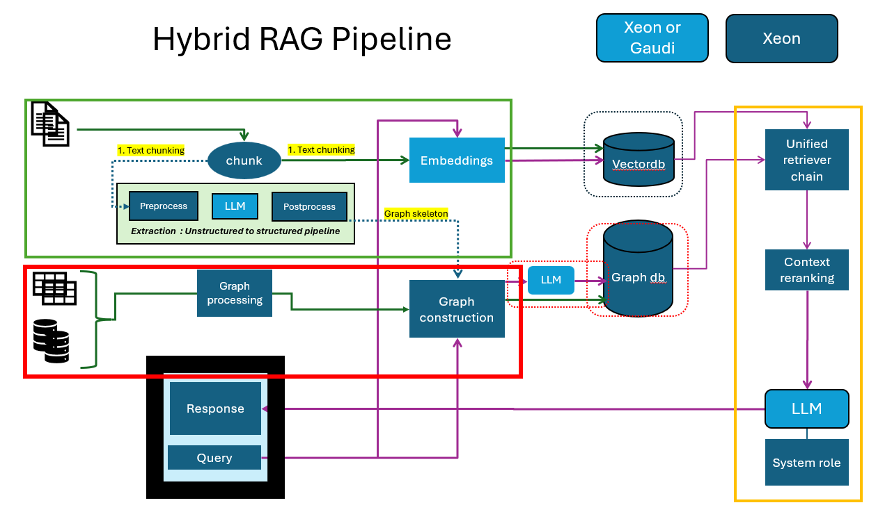

# HybridRAG
This RFC introduces the HybridRAG framework, a novel approach to building advanced question-answering (Q&A) systems. HybridRAG combines two key techniques:
1.	GraphRAG: Utilizes Knowledge Graphs (KGs) for information retrieval
2.	VectorRAG: Employs vector-based retrieval methods

The integration of these techniques has demonstrated superior performance in generating accurate and contextually relevant answers compared to using either method alone.

Key Features of HybridRAG
- Enhances information extraction in Q&A systems
- Combines the strengths of graph-based and vector-based retrieval
- Improves both retrieval accuracy and answer generation quality

Some examples highlight the versatility and potential impact of the HybridRAG framework across different industries and use cases: Personal assistant, Insurance claim processing, Transaction processing, Fraud detection and risk management etc. to name a few.

## Author(s)
[Sharath Raghava] (https://github.com/intelsharath)

[Jean Yu] (https://github.com/jeanyu-habana)

[Siddhi Velankar] (https://github.com/siddhivelankar23)

## Status

Under Review

## Objective
This RFC proposes a Hybrid RAG architecture framework that enhances RAG technology. The input data can be unstructured data or structured data sources. Structured data sources such as CSVs, SQL databases can be used to integrate graph sources. Structured information can also be extracted from unstructured data by extracting nodes and relationships. HybridRAG effectively handles both unstructured and structured data adopting a flexible microservice approach for enterprise AI applications.

We are building and example to showcase Medical Bot personal assistant application with:

- Preloaded database with detailed information on ~100 diseases
- Augmented with structured data on medicines, symptoms, home remedies, and care
- Demonstrates the architecture's capability in handling complex, multi-modal information

This Hybrid RAG approach offers a versatile solution for enterprise applications requiring advanced data retrieval and generation capabilities integrating unstructured and structured data from various sources.

## Motivation

Enterprise AI systems require solutions that handle both structured data (databases, transactions, CSVs, JSON) and unstructured data (documents, images, audio). While traditional VectorRAG excels at semantic search across documents, it struggles with complex queries requiring global context or relationship-aware reasoning. HybridRAG addresses these gaps by combining GraphRAG (knowledge graph-based retrieval) and VectorRAG (vector database retrieval) for enhanced accuracy and contextual relevance.

GraphRAG:

- Uses knowledge graphs to model entities, relationships, and hierarchical clusters from data.
- Enables global context understanding (e.g., identifying indirect connections between entities).

VectorRAG:

- Leverages semantic search for unstructured data retrieval.

Hybrid Integration:

- Simultaneously retrieves context from graph and vector databases during queries.
- Outperforms individual approaches in retrieval accuracy and answer quality.

HybridRAG’s hybrid architecture also supports secure on-premise/cloud deployments, critical for sensitive sectors like healthcare. This approach represents a strategic evolution in enterprise AI, enabling systems to reason across data types while maintaining scalability and compliance.

## Design Proposal
This RFC proposes a Hybrid Retrieval-Augmented Generation (Hybrid-RAG) architecture detailed in the following figure.

The proposed architecture involves the creation of a Hybrid rag mega services. The megaservice functions as the core pipeline, comprising of the following microservices:
Indexing:

- Unstructured data into semantic chunk and loading into vector db.
- Structured data load CSV/SQLdb into graph DB.
- Optional unstructured data processing to extract and generate triplets to load into graphdb.
- Retrieve for vector DB: take query, generate embeddings and look up and extract context
- Retriever for graph DB: take in query, generate triplets (text2cypher) and extract context in graph db.
- Merge this and generate final results.

Proof of Concept: Medical Assistant
- Focused on a subset of common diseases
- Built using Wikidata for unstructured medical knowledge.
- Extracted and built structured dataset from unstructured medical knowledge (diseases, symptoms, treatments, home remedies).
- Designed to provide more precise answers to medical queries

How It Works
- When a query is received, HybridRAG retrieves relevant context from both vector and graph databases
- The system then generates a final answer based on the combined retrieved information
- The indexing for vector and graph

Performance Evaluation
HybridRAG outperforms traditional VectorRAG and GraphRAG techniques when used individually. This superior performance is observed in both:

- Retrieval accuracy
- Answer generation quality

