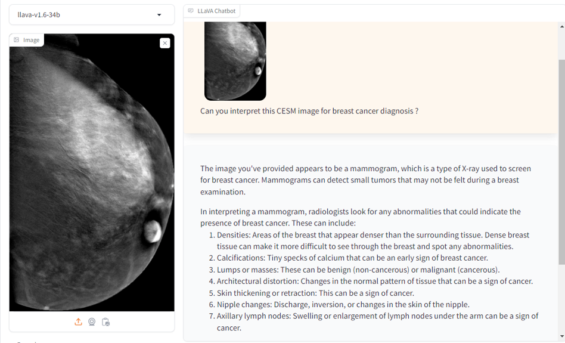

# Multimodal Retrieval-Augmented-Generation (MM-RAG) 

## Author

[Tiep Le](http://https://github.com/tileintel), 
[Siddhi Velankar](https://github.com/siddhivelankar23), 
[Siddhant Jagtap](https://github.com/sjagtap1803), 
[Mustafa Cetin](https://github.com/MSCetin37) 

## Status

Under review

## Objective

This RFC aims to introduce a Multimodal Retrieval-Augmented Generation (MM-RAG) architecture. This architecture advances RAG technology in which it rather leverages multimodal data, including but not limited to video, image, and text data for its in-context learning for complex tasks. This architecture adopting OPEA's microservice approach is flexible for Enterprise AI applications that requires RAG for multimodal data. The architecture is general and MM-RAG based Visual Question and Answering is the first example that we want to apply.

## Motivation

Enterprises use multimodal data (e.g., image, video, text, audio, slide, tabular data, etc...) for their daily work. Unfortunately, existing applications in OPEA cannot handle multimodal data flexibly and productively. In more detail, we observe that:
- Existing ChatQnA application, though featuring a (text-based) RAG architecture, is not able to handle multimodal data (e.g., image, video), thus lacking the ability to leverage multimodal data.
- Existing VisualQnA application, though accepting both image and text as input, produces responses merely based on the input it receives, thus lacking the ability to utilize their in-context learning for complex tasks.
- Current OPEA framework lacks of microservices (i.e., embedding, retrieval, and reranks) that can accept multimodal data. 
- Existing RAG-related microservices in the current OPEA framework mainly make use of langchain framework, thus they follow the interfaces defined in langchain framework that are mainly suitable for text data only. As a results, OPEA framework lacks interfaces for multimodal data such as images, texts, and image-text pairs. 

All of these limitations prevent enterprises from developing AI applications that can comprehend multimodal data For instances, applications that do question and answering on insight information from videos/images.

MM-RAG is critical for OPEA since it will:
1. define new interfaces for OPEA's microservices to work with multimodal data. Such interfaces will not only extend langchain interfaces but also make use of (if-existing) interfaces for multimodal data in popular frameworks such as Huggingface, OpenAI, etc...
2. introduce new microservices that can handle multimodal data.
3. enable new AI applications that enterprises need.

## Design Proposal
This RFC proposes a Multimodal Retrieval-Augmented Generation (MM-RAG) architecture detailed in the following figure. 


The proposed architecture involves the creation of two megaservices. 
- The first megaservice functions as the core pipeline, comprising four microservices: embedding, retriever, reranking, and LVLM. This megaservice exposes a MMRagBasedVisualQnAGateway, allowing users to query the system via the `/v1/mmrag_visual_qna` endpoint.
- The second megaservice manages user data storage in VectorStore and is composed of a single microservice, embedding. This megaservice provides a MMRagDataIngestionGateway, enabling user access through the `/v1/mmrag_data_ingestion` endpoint.
- The third megaservice functions as a helper to extract list of frame-transcript pairs from videos using audio-to-text models (e.g., BLIP2) for transcripting or LVLM model (e.g., LLAVA) for captioning. This megaservice is composed of 2 microservices: transcripting and LVLM. This megaservice provides a MMRagVideoprepGateway, enabling user access through the `/v1/mmrag_video_prep` endpoint.
- **Optional** The fourth megaservice functions as a helper to extract list of image-caption pairs from documents (e.g., research papers & journals). This megaservice provides a MMRagDocprepGateway, enabling user access through the `/v1/mmrag_doc_prep` endpoint.


For this architecture and in order to guarantee the reusability and expansion ability of this architecture for other applications in future, we are going to propose the followings.

### 1. Data Classes

MM-RAG introduces new data classes. In `comps/cores/proto/docarray`:
- `ImageDoc(BaseDoc)` (cf., docarray.documents.ImageDoc) , 
- `VideoDoc(BaseDoc)` (cf., docarray.documents.VideoDoc),
- `AudioDoc(BaseDoc)` (cf., docarray.documents.AudioDoc), 
- `TextAndImageDoc(BaseDoc)` contains information for an image-text pair
- `MultimodalDoc = Union[TextDoc, ImageDoc, TextImageDoc]`
- `SearchedMultimodalDoc(MultimodalDoc)` which is similar to SearchedDoc but for multimodal data

### 2. Interfaces
MM-RAG defines new interfaces used in OPEA's microservices:
#### 2.1 Embeddings
- Interface `MultimodalEmbeddings` that extends the interface langchain_core.embeddings.Embeddings with an abstract method: 
```python 
embed_multimodal_document(self, doc: MultimodalDoc) -> List[float]
``` 
Any class, which implements this interface, serving as an embedder for multimodal data must implement how to produce the embedding of a multimodal data.  

#### 2.2. Vectorstore & Retriever
- Interface `MultimodalVectorstore` that extends langchain_core.vectorstores.VectorStore with abstract methods:
```python 
add_multimodal_docs(self, docs: DocList[MultimodalDoc]) -> List[str]
```
Any class, which implements this interface, serving as an API for works relating to a vectorstore must implement how to add multimodal data to the vector store (i.e., compute the embedding and then add it to the vector store)

The original abstract class langchain_core.vectorstores.VectorStore already implemented a method to transform itself to retrieval `as_retriever`. Thus, we don't need to have new interface for retrieval.

#### 2.3 Reranks
As we approach application MM-RAG based Visual Question and Answer first, for now we can leverage LLM or VLM for interfaces relating to reranks. Thus, we don't need to propose new interface for reranks.

#### 2.4 VLMs
As we approach application MM-RAG based Visual Question and Answer first, for now we can leverage existing VLM interfaces.

### 3. Microservices
#### 3.1 Embedding Microservice
Signature of embeddings microservice
```python
@traceable(run_type="embedding")
@register_statistics(names=["opea_service@embedding_multimodal_langchain"])
def embedding(input: MultimodalDoc) -> EmbedDoc1024:
```

#### 3.2 Retriever Microservice
Signature of retriever microservice
```python
@traceable(run_type="retriever")
@register_statistics(names=["opea_service@multimodal_retriever_redis"])
def retrieve(input: EmbedDoc1024) -> SearchedMultimodalDoc:
```

#### 3.3 Rerank Microservice
**Important Note:** The rerank microservice does not only perform reranking the retrieved multimodal document but also helps to determine whether it should include either the image in the input query or the retrieved image but not both in the output. This facilitates the LVLM model because a major of LVLM models were pretrained for tasks with 1 input image only (e.g., LLaVA)

Signature of rerank microservice
```python
@traceable(run_type="vlm")
@register_statistics(names=["opea_service@reranking_multimodal_data"])
def reranking(input: SearchedMultimodalDoc) -> LVMDoc:
```

#### 3.4 LVLM Microservice
We can use existing LVLM microservice from OPEA in `GenAIComps/comps/lvms/lvm.py`

#### 3.5 Transcription Generation Microservice
This microservice aims to generate a transcript for an input audio using an audio to text model.
Signature of transcript generation microservice
```python
@traceable(run_type="tool")
@register_statistics(names=["opea_service@transcript_generation"])
def transcript_generation(input: AudioDoc) -> str:
```

## Use-case Stories

### 1. Multimodal RAG on Videos 

**Main contributor(s):** Tiep Le, Siddhi Velankar, and Siddhant Jagtap.

In this story, let's an user has a large video corpus (possibly including multiple videos), and she wants to do question answering on it, wants to chat with it, and wants to get insight from all information in the video corpus. 

Initially, the list of frames and their corresponding transcripts or captions will be extracted/generated from the video corpus using the megaservice `mmrag_video_prep`. Such frame and transcript/caption pairs will be ingested to a vector store by the megaservice `mmrag_data_ingestion`. 

Once an user input a text query, MM-RAG system (i.e., the megaservice `mmrag_visual_qna`) is going to retrieve the most appropriate video segment from the vector store that can help answer the user's query. Then the context of retrieved video segment augmented with the user's query is used to answer the query by LVLM. 

The user can have a query/question where the transcript of the video helps answering it. For example:


As a chatbox, the user can have follow-up questions. For example:


The user can have a query/question where the visual cues of the video can help answering it. For example:


### 2. Multimodal RAG for Medical Domain
**Main contributor(s):** Mustafa Cetin

For more detailed information, please checkout the corresponding RFC for Multimodal RAG for Medical Domain [here](https://github.com/opea-project/docs/pull/31/files)

In this scenario, it seeks to leverage accumulated (domain expert) knowledge specifically in medical domain in an offline environment and minimize expert involvement in the medical domain, thereby making the system both efficient and user-friendly for medical professionals and researchers.

Initially, Image-text pairs in which text can include the caption, the description, and/or the diagnosis for things appearing in the image: (1) can be extracted from medical reports and medical research papers/journals using the megaservice `mmrag_doc_prep`; and/or (2) can be elicited from medical doctors.  Such image-text pairs will then be ingested into a vector store by the megaservice `mmrag_data_ingestion`.

Once an user enters a query (image and/or text), MM-RAG will search from the vector store for similar images or texts. Such similar images and texts will then be reranked by reranking microservice to identify which additional information (retrieved image and/or text) is critical to the user's query. This additional information augmented with the user's query is used to answer the query by LVLM. 

**Example 1**
In this scenario, the user aims to interpret a Contrast-Enhanced Spectral Mammography (CESM) image. Initially, the system searches the database for similar images and retrieves relevant diagnostic information associated with those images. This data is then utilized to construct a comprehensive prompt for the Large Multi Model (LVLM). The LVLM, employing advanced AI techniques, processes this prompt and generates a diagnostic interpretation, which is subsequently delivered to the user. This result not only provides an immediate analysis but also includes recommendations for further evaluation or treatment as necessary, ensuring a thorough and informed diagnostic process. Additionally, by running the data and the model on local systems equipped with robust security measures, we enhance the privacy and security of the information, aligning with stringent health data protection standards such as HIPAA and GDPR. This approach minimizes the need for expert involvement, thereby streamlining the analysis and potentially reducing operational costs without compromising diagnostic accuracy.



**Example 2**
In this scenario, the user specifies certain conditions, such as specific diagnostic features or patient demographics, and requests to view CESM images that meet these criteria. Initially, the system searches the database for diagnoses that match these conditions and retrieves the relevant images. These images can either be returned directly to the user or used as inputs for the Large Multi Model (LMM). If the latter option is chosen, the LMM analyzes the images to further validate their relevance to the specified conditions. Additionally, the system provides a justification for why these particular images were selected, ensuring transparency and enhancing user understanding of the process. This approach minimizes the need for expert involvement, thereby streamlining the analysis and potentially reducing operational costs.


### 3. Video RAG QnA
**Main contributor(s):** Tahani Trigui & Sharath Raghava
This application has similar functionalities to the use-case `Multimodal RAG on Videos` above, but it uses a different approach. In particular, this makes use of embeddings of short video segments rather than making use of extracted frame/text pairs in `Multimodal RAG on Videos`. 

For more information please refer to [here](https://github.com/ttrigui/GenAIExamples/pull/5)

## Alternative Considerations
- Possibly, we will need to have two megaservices rather than one `mmrag_visual_qna`. One is for each of the two use-case stories due to differences between them: (1) using different LVLM models (LLAVA vs LLAVA-MED) results in different prompt preparations; and (2) different inputs (text only vs both text and image)

