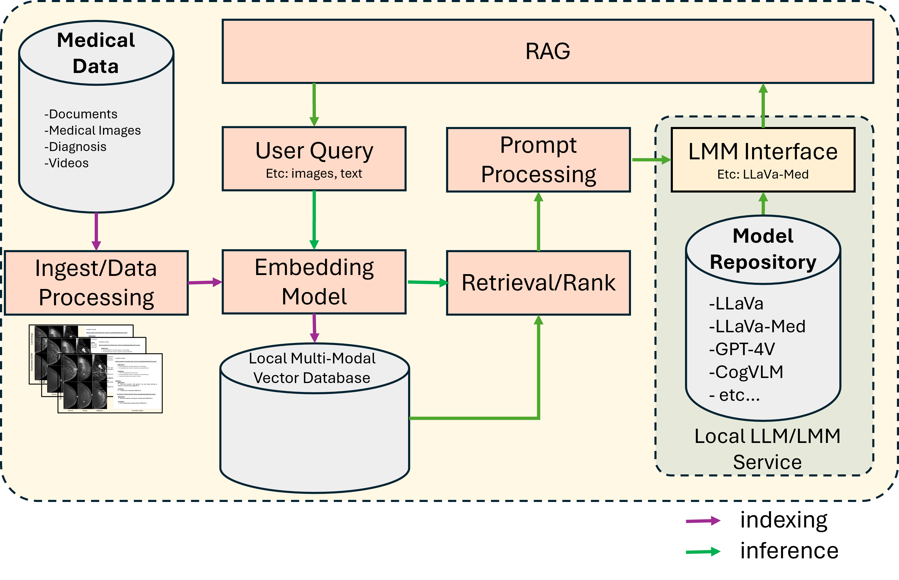

## RFC Title
RFC - Expanding Document Summary through Video and Audio

## RFC Content

### Author

[Mustafa Cetin](https://github.com/MSCetin37) 

### Status

Under Review

### Objective
This RFC aims to extend the current Document Summarization Application by incorporating a video summary feature. This enhancement will enable the application to summarize video content in addition to text documents, thereby broadening its utility and applicability.

### Motivation
The motivation for adding a video summary feature stems from the increasing prevalence of video content in various domains, including education, corporate training, marketing, and entertainment. Videos often contain valuable information that can be time-consuming to digest in its entirety. By summarizing video content, users can quickly grasp the key points, saving time and improving productivity.

Key motivations include:
1.	Enhanced User Experience: Users can quickly understand the essence of video content without watching the entire video.
2.	Increased Efficiency: Summarizing videos can save time for professionals who need to review large amounts of video content.
3.	Broader Applicability: Extending the application to handle video content makes it more versatile and useful across different industries.
4.	Competitive Advantage: Offering video summarization can differentiate the application from other text-only summarization tools.


### Design Proposal

<!--  -->


The proposed design for the video summary feature involves the following components:
#### 1.	Video Ingestion and Preprocessing:
  - Video Upload: Users can upload video files in various formats.
  <!-- - Frame Extraction: Extract frames from the video at regular intervals. -->
  - Audio Extraction Microservice from video: Extract audio from the video for transcription.

    Signature of audio extraction microservice

        ```
        @traceable(run_type="tool")
        @register_statistics(names=["opea_service@audio_extraction"])
        def audio_extraction(input: ViodeDoc) -> AudioDoc:
        ```

#### 2.	Transcription:
- Audio-to-Text Transcription: Use Audio-Speech-Recognition microservice from OPEA which aims to generate a transcript for an input audio using an audio to text model (Whisper). 

  Transcript generation microservice:
    -	opea/whisper:latest
    -	opea/asr:latest

<!-- o	Frame Captioning: Use a visual language model (e.g., BLIP2) to generate captions for the extracted frames. -->

#### 3.	Summarization:
  - Text Summarization: Apply existing text summarization techniques to the generated transcripts.
  - Visual Summarization: Use visual summarization techniques that extract the AudioDoc and Transcription then use text summarization step. 

#### 4.	Integration and Output:
  - Summary Generation: Combine text and visual summaries to create a comprehensive video summary.
  - User Interface: Update the user interface to display video summaries alongside text summaries.

## Use-case Stories
### 1.	Corporate Training:
  
  **Scenario:** A company conducts regular training sessions and records them as videos. Employees need to review these training videos to stay updated.
  
  **Solution:** The video summary feature can generate concise summaries of training videos, highlighting key points and important segments. Employees can quickly review the summaries to understand the training content without watching the entire video.

### 2. Educational Content:
  **Scenario:** An online education platform offers video lectures on various subjects. Students often need to review these lectures for exams.

  **Solution:** The video summary feature can create summaries of video lectures, providing students with a quick overview of the main topics covered. This helps students to revise efficiently and focus on important concepts.
  
### 3.	Marketing and Advertising:
  **Scenario:** A marketing team produces promotional videos for their products. They need to analyze the effectiveness of these videos.

  **Solution:** The video summary feature can generate summaries of promotional videos, highlighting key messages and visual elements. The marketing team can use these summaries to evaluate the impact of their videos and make data-driven decisions.
  
### 4.	Research and Development:
  **Scenario:** Researchers record their experiments and presentations as videos. They need to document and share their findings with colleagues.

  **Solution:** The video summary feature can create summaries of research videos, capturing essential information and visual data. Researchers can share these summaries with their peers, facilitating knowledge sharing and collaboration.

By implementing the video summary feature, the Document Summarization Application will become a more powerful and versatile tool, capable of handling both text and video content. This enhancement will significantly improve user experience, efficiency, and applicability across various domains.


