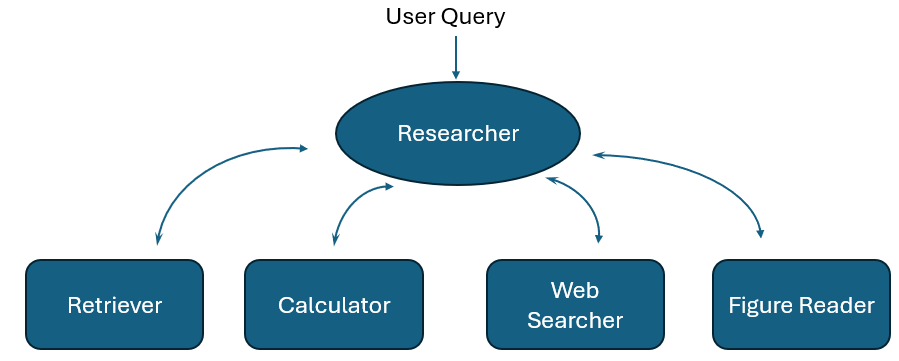
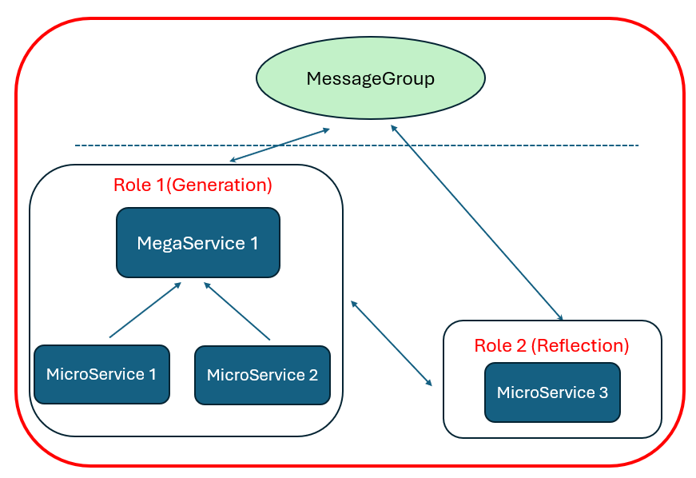
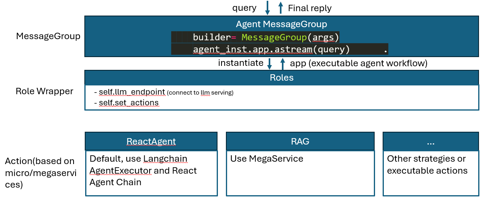
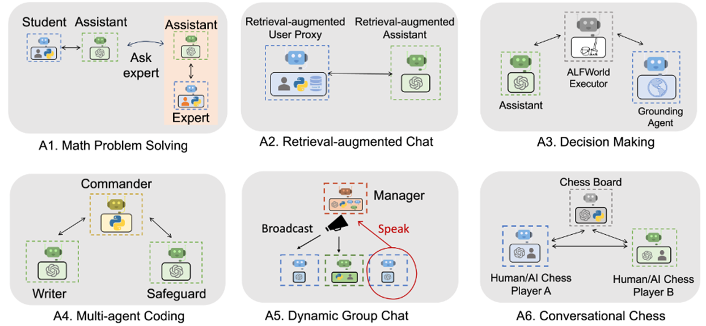

**Author**

[Xuhui Ren](https://github.com/XuhuiRen)

**Status**

Under Review

**Objective**

Advancements in large language models (LLMs) are transforming the development of AI agents, enhancing their natural language understanding capabilities. Despite this, LLMs primarily respond based on the input they receive, lacking the ability to utilize their in-context learning for complex tasks. This RFC introduces a new concept of an "Agent," derived from policy decision-making frameworks, which employs LLMs as planning engines. This approach breaks down complex tasks into a series of simpler "plan-and-execute" steps, becoming increasingly important in business-to-business and business-to-consumer sectors. The document outlines the foundational design architecture and operational pipeline for developing agents capable of handling intricate tasks.

**Motivation**
This RFC aims to enhance the task completion capabilities of LLMs through the use of autonomous agents, improving their reasoning abilities. Starting with the fundamental aspects of agent design—planning, tools, and memory—we conducted an in-depth analysis of existing market products to ensure our design meets diverse agent design requirements effectively.

**Design Proposal**
The traditional approach to developing an AI agent, such as that used by Langchain, typically includes three components: planning, tools, and memory. The process begins with the user's input, which is processed by a planning module to break down into a series of sub-tasks. These are addressed using specific tools to take actions. Observations from these actions feed back into the planning module to facilitate the next interaction cycle. This process often requires multiple rounds of planning and tool interaction to complete a task. A memory module records the intermediate interactions and compiles relevant information to formulate the final response.

Reflecting on existing workflows, some products choose to design tools and agents separately, constructing a logic graph that facilitates data transfer through "edges" or "conditional_edges" during inference. Recently, innovative agent products have conceptualized agent-tool cooperation akin to role-playing games. Here, adherence tothe [Standardized Operating Procedures](https://openreview.net/forum?id=VtmBAGCN7o#:~:text=MetaGPT%20encodes%20Standardized%20Operating%20Procedures,intermediate%20results%20and%20reduce%20errors.) allows users to assemble teams for task completion. Unlike traditional designs that treat tools and agents as distinct entities, this model considers each tool and agent as a virtual team member with specific skills—for example, a "Retriever" specializes in identifying closely related results, while a "Web Searcher" excels in online searches. Each team includes a "Researcher" responsible for coordinating tasks and synthesizing information, ultimately delivering a comprehensive result to the user. This unified approach eliminates the need for separate APIs for tools and agents, streamlining code architecture and reducing development efforts.



Fig.1. The diagram of a Standardized Operating Procedures community

Building on the OPEA project framework and inspired by popular products on the market, our agent is designed to emulate the collaborative teamwork seen among human experts through Standardized Operating Procedures. Moving beyond the conventional microservice-megaservice architecture, we envision each microservice and megaservice as an "Expert" within a "MessageGroup." In this setup, each Expert cooperates seamlessly to tackle assigned tasks, reflecting a unified and efficient approach to problem-solving.

```python
builder = MessageGroup()
builder.add_role("generation", generation_node)
builder.add_role("reflection", reflection_node)
builder.set_entry_role("generate")

builder.add_conditional_edges("generate", should_continue)
builder.add_edge("reflect", "generate")
graph = builder.compile()
```



Fig.2. The relation connection inside a message group

In a "MessageGroup", specific "Roles" utilize "MegaServices" and "Microservices" to perform targeted "Actions". A designated "Role" acts as a wrapper, establishing the "MessageGroup" environment and orchestrating the use of both "MicroServices" and "MegaServices" to execute actions.

Consequently, it is essential to clearly define the "Roles" and "Actions" within a "MessageGroup". The design of a "Role" involves detailing the "Actions" and setting up link relationships between services. We can develop a series of "Microservices" or "MegaServices" to serve as the potential "Actions". These services are connected through edges that can be either unidirectional or bidirectional, allowing each "Role" to sequentially execute commands.

Fig.2 presents a toy demonstration of a reflective agent featuring two roles: "Generation" and "Reflection". The "Generation" role, constructed from mega and microservices, takes user input to produce a response. Subsequently, the "Reflection" role observes this output, providing critical feedback on the results. This feedback is relayed back to the "Generation" role to refine the initial output.

To achieve this architecture, we need to define a wrapper "Role" that integrates and manages the micro/mega-services effectively.
```python
from coms.roles import Role
class SimpleReviewer(Role):
    name: str = "Charlie"
    profile: str = "SimpleReviewer"

    def __init__(self, **kwargs):
        super().__init__(**kwargs)
        self.set_actions([SimpleWriteReview])
```

```python
builder.add_conditional_edges(
    "call_tool",
    # Each agent node updates the 'sender' field
    # the tool calling node does not, meaning
    # this edge will route back to the original agent
    # who invoked the tool
    lambda x: x["sender"],
    {
        "SimpleReviewer": "SimpleReviewer",
        "SimpleWriter": "SimpleWriter",
    },
)
```
This wrapper should avoid the single direction limitation and can pass the information within the "MessageGroup".

Via `set_actions`, we can set the execuatable functions for a given role.
```python
from coms.actions import Action
class SimpleWriteReview(Action):
    PROMPT_TEMPLATE: str = """
    Write a review that can {instruction}.
    Return the specific review with NO other texts,
    your review:
    """
    name: str = "SimpleWriteReview"

    async def run(self, instruction: str):
        prompt = self.PROMPT_TEMPLATE.format(instruction=instruction)

        response = await request.post(prompt)

        review_text = format(rsp)

        return code_text
```




#### Single Agent 
In our single agent design, we concentrate on two classic models: "ReAct" and "Reflection". From an architectural standpoint, the planning role can be implemented as either a microservice or a megaservice. The initial step in compiling the MessageGroup involves activating the available microservices, followed by constructing the MessageGroup based on the connections between Roles.

As previously demonstrated with the "Reflection" agent, which includes "generation" and "reflection" functions, we begin by integrating all roles into the MessageGroup and setting the primary entry role. Next, we establish link connection relationships among the roles using either "conditional_edges" or "edges".

Each role, whether it operates as an LLM-based tool, a Retrieval-Augmented Generation (RAG) system, or a web search engine, can be developed as a series of microservices within frameworks like OPEA/Comps.

##### Functional microservices
Inside a functional microservices, we should write the specific functional code to describe what we want this microservice to to,
```python
class Role1(Action):
    name: str = "SimpleWriteReview"
    prompt = ChatPromptTemplate.from_messages(
    [
        (
            "system",
            "You are an essay assistant tasked with writing excellent 5-paragraph essays."
            " Generate the best essay possible for the user's request."
            " If the user provides critique, respond with a revised version of your previous     attempts.",
        ),
        MessagesPlaceholder(variable_name="messages"),
    ]
    )
    async def run(self, instruction: str):
        
        response = await request.post(prompt)

        or

        llm = ChatFireworks(
            model="accounts/fireworks/models/mixtral-8x7b-instruct",
            model_kwargs={"max_tokens": 32768},
        )
        response = prompt | llm

        return response
```

All these functional microservices can accept the text-based instruction from other components as the input, and then execute a specific functional call to complete the small task. Finially, it will output a string/dict-type result.

##### LLM
LLM in the agent design performs a dominative effect for the task planning and tool scheduling. It can be prelaunched by the TGI LLM microservice. This model should carefully selected or finetuned. 

The available options: mixtral 8*7B v0.2, llama3-70b, openai.

Otherwise, we should make data distillation from GPT4 or some other strong LLM to construct the instruction following dataset and finetune the decision model.

##### Roles
Distinguish from the conventional concept of Tool, we can regard all execuatable tools as a virtual Role for helping complete a specific task. We can utlize the Tools in Langchain to extract powerful ecosystem suport.

The current available tools: github, google, GraphQL, reddit_search, vectorstore, walframe, wikipedia. The extended domain based api should be self-developed by python code in a langchain-based/OPEA-based repo.
```python
class BaseTool(RunnableSerializable[Union[str, Dict], Any]):
  ...
```
The new created tools should be registered before using. For example:
```python
@tool
def scrape_webpages(urls: List[str]) -> str:
    """Use requests and bs4 to scrape the provided web pages for detailed information."""
    loader = WebBaseLoader(urls)
    docs = loader.load()
    return "\n\n".join(
        [
            f'<Document name="{doc.metadata.get("title", "")}">\n{doc.page_content}\n</Document>'
            for doc in docs
        ]
    )
```

##### Prompt
Each role should have a single prompt template to complete the given task. We can adopt the same/exaple prompt template in [langchain agent](https://github.com/langchain-ai/langchain/blob/master/libs/langchain/langchain/agents/react/textworld_prompt.py)

#### Multi Agent
The multi-agent design is more complex than the single agent working flow. But in our cases, the multiagent can be regarded as a group of Roles in a same messagegroup. The single agent design could be regarded as a cooperation of "Planning" role and some execuation role. The multiagent design will introduce more roles as shown in Fig.3. in the message group to complete a specific task.



Fig.4. The role community to build complex agent type.

**Alternatives Considered**

#### Langchain/Langgraph-based
While Langchain-based resources offer user-friendly APIs for constructing single or multi-agent systems, they operate under the assumption that agent connections are strictly sequential. This design only supports single-node connections and does not accommodate tree-based or more complex agent architectures. Moreover, the environment's connection information must be predefined by the user, and individual agents cannot autonomously observe the internal state of the environment. These limitations hinder adaptation to rapidly evolving agent designs, such as those used in role-play and debate scenarios.

#### MetaGPT
MetaGPT integrates Standardized Operating Procedures (SOPs) into prompt sequences, creating more efficient workflows and allowing agents to emulate human-like expertise in various domains. This method enables agents to verify intermediate results and minimize errors. Utilizing an assembly-line approach, MetaGPT assigns diverse roles to different agents, effectively breaking down complex tasks into manageable subtasks carried out by a collaborative team.

The design flow within MetaGPT primarily encompasses three elements: "Action", "Role", and "Team". Each "Action" defines the executable function assigned to a role, facilitating a structured approach to task completion.
```python
from metagpt.actions import Action
class SimpleWriteCode(Action):
    PROMPT_TEMPLATE: str = """
    Write a python function that can {instruction}.
    Return ```python your_code_here ``` with NO other texts,
    your code:
    """
    name: str = "SimpleWriteCode"

    async def run(self, instruction: str):
        prompt = self.PROMPT_TEMPLATE.format(instruction=instruction)

        rsp = await self._aask(prompt)

        code_text = parse_code(rsp)

        return code_text
```

The "Role" define the "Action" and the observed intermediate state:
```python
from metagpt.roles import Role
class SimpleReviewer(Role):
    name: str = "Charlie"
    profile: str = "SimpleReviewer"

    def __init__(self, **kwargs):
        super().__init__(**kwargs)
        self.set_actions([SimpleWriteReview])
        self._watch([SimpleWriteTest])
```

Finially, create a "Team" and add the member:
```python
from metagpt.team import Team
team = Team()
team.hire(
    [
        SimpleCoder(),
        SimpleTester(),
        SimpleReviewer(is_human=add_human),
    ]
)

team.invest(investment=investment)
team.run_project(idea)
await team.run(n_round=n_round)
```

MetaGPT provides a flexiable and comprehensive solution for multi-agent design. However, it doesn't have the sufficient tools like Langchain to used in the agent flow. It more care about the environment building to excite the LLM inherent ability. So, it may requires to design some tools for fulfill the agent design. 

**Compatibility**


**Miscs**


