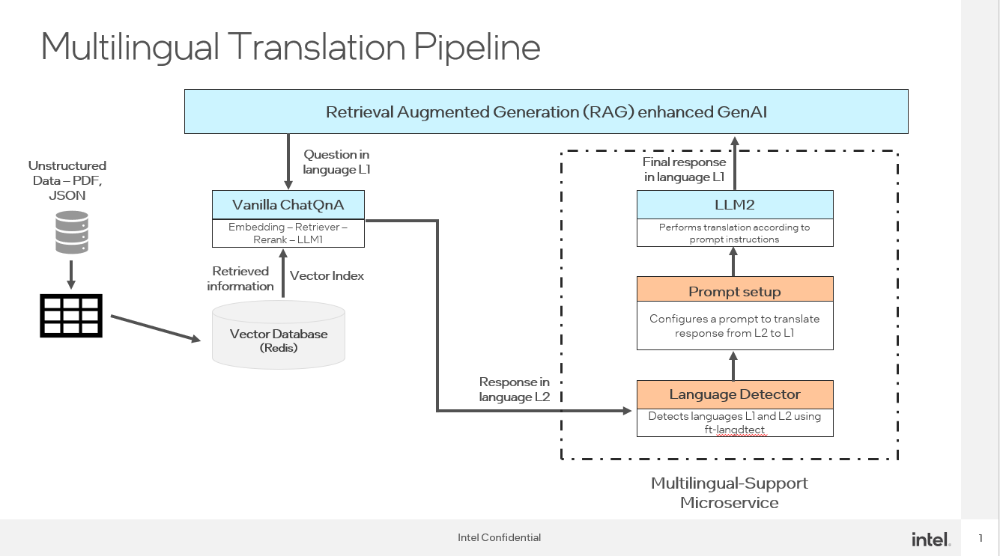

# Multilingual-support microservice 

## Author

[Siddhi Velankar](https://github.com/siddhivelankar23)

## Status

Under review

## Objective

The objective of this RFC is to propose the creation of a separate multilingual-support microservice to handle translation that can be seamlessly used with other microservices. Currently, translation exists as a separate megaservice, which makes it difficult to integrate with other standalone microservices or applications. This proposal aims to simplify and standardize the process of multilingual support by creating a dedicated, scalable, and easily integrable microservice that can seamlessly interact with other services within the system architecture. The goal is to provide a flexible, centralized approach to translation and enhancing the user experience across various languages.

## Motivation

In the current system, translation is managed by a monolithic megaservice,  which is challenging to integrate with other microservices. 
By introducing multilingual support as a standalone microservice, we aim to decouple the translation functionality from other services, making it easier to scale and manage.


## Design Proposal




The proposed architecture involves the creation of a new microservice called multilingual-support. 
This microservice does the following -
1. Detects the language of the user's query as well as the response from the first llm microservice. 
2. Configures a translation prompt to convert the answer from the response language to the query language. 
3. This prompt is sent to the second llm microservice to generate the final answer. 

This ensures seamless, accurate communication across different languages in real time.


Signature of multilingual-support microservice
```python
@traceable(run_type="multilingual-support")
@register_statistics(names=["opea_service@multilingual_support"])
def multilingual(input: LLMParamsDoc) -> Union[LLMParamsDoc, ChatCompletionRequest, SearchedDoc]:
```
