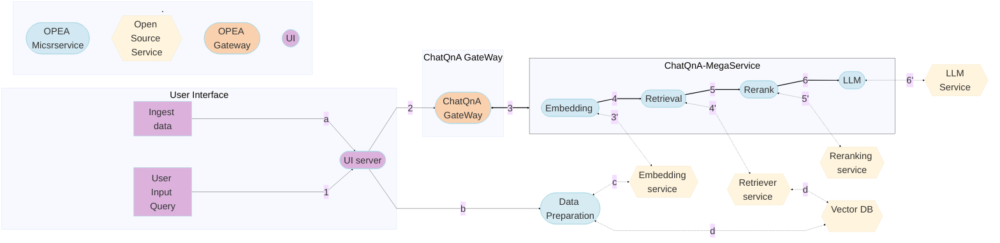

# Посібник із здійснення внесків

Дякуємо, що розглядаєте можливість долучитися до проєкту OPEA. Процес участі подібний до інших проєктів з відкритим вихідним кодом на Github, що передбачає відкрите обговорення проблем і запитів на доопрацювання між супровідниками, дописувачами і користувачами.


## Всі способи зробити внесок

### Запропонувати компонент GenAI

1. Перейдіть до [OPEA GenAIComps] (https://github.com/opea-project/GenAIComps) і знайдіть папку компонентів, до якої належить ваша інтеграція. Якщо тип мікросервісу вже існує, перегляньте [OPEA microservice API](https://opea-project.github.io/latest/developer-guides/OPEA_API.html#opea-micro-service-api) і дотримуйтесь його у своїй реалізації. В іншому випадку, якщо ви створюєте абсолютно новий тип мікросервісу, вам потрібно спочатку визначити і внести його специфікацію API. Будь ласка, почніть з подання RFC, щоб отримати зворотній зв'язок від спільноти.


    ```
    GenAIComps
    ├── comps
    │   ├── agent
    │   ├── asr
    │   ├── chathistory
    │   ├── cores
    │   │   ├── mega     #orchestrator, gateway, micro_service class code
    │   │   ├── proto    #api protocol
    │   │   └── telemetry
    │   ├── dataprep
    │   ├── embeddings
    │   ├── feedback_management
    │   ├── finetuning
    │   ├── guardrails
    │   ├── intent_detection
    │   ├── knowledgegraphs
    │   ├── llms
    │   ├── lvms
    │   ├── nginx
    │   ├── prompt_registry
    │   ├── ragas
    │   ├── reranks
    │   ├── retrievers
    │   ├── tts
    │   ├── vectorstores
    │   └── web_retrievers
    └── tests
        ├── agent
        ├── asr
        ├── chathistory
        ├── cores
        ├── dataprep
        ├── embeddings
        ├── feedback_management
        ├── finetuning
        ├── guardrails
        ├── intent_detection
        ├── llms
        ├── lvms
        ├── nginx
        ├── prompt_registry
        ├── reranks
        ├── retrievers
        ├── tts
        ├── vectorstores
        └── web_retrievers
    ```

2. Дотримуйтесь структури папок у компоненті вбудовування TEI:

    ```
    GenAIComps
    ├── comps
    │   └── embeddings
    │       ├── __init__.py
    │       └── tei     #vendor name or serving framework name
    │           ├── langchain
    │           │   ├── Dockerfile
    │           │   ├── Dockerfile.amd_gpu
    │           │   ├── Dockerfile.nvidia_gpu
    │           │   ├── embedding_tei.py    # definition and registration of microservice
    │           │   ├── README.md
    │           │   └── requirements.txt
    │           └── llama_index
    │               └── . . .
    ├── tests
    │   └── embeddings
    │       ├── test_embeddings_tei_langchain.sh
    │       ├── test_embeddings_tei_langchain_on_amd_gpu.sh
    │       └── test_embeddings_tei_llama_index.sh
    └── README.md

    ```

    - **Описи файлів**:
      - `embedding_tei.py`: Цей файл визначає та реєструє мікросервіс. Він слугує точкою входу до контейнера Docker. Зверніться до [whisper ASR](https://github.com/opea-project/GenAIComps/tree/main/comps/asr/whisper/README.md) для простого прикладу або [TGI](https://github.com/opea-project/GenAIComps/blob/main/comps/llms/text-generation/tgi/llm.py) для більш складного прикладу, який вимагав адаптації до OpenAI API.
      - `requirements.txt`: Цей файл використовується Docker для встановлення необхідних залежностей.
      - `Dockerfile`: Використовується для створення зображення службового контейнера. Будь ласка, дотримуйтесь правил іменування:
        - Dockerfile: `Dockerfile.[vendor]_[hardware]`, vendor and hardware in lower case (i,e Dockerfile.amd_gpu)
        - Docker Image: `opea/[microservice type]-[microservice sub type]-[library name]-[vendor]-[hardware]:latest` all lower case (i,e opea/llm-vllm-intel-hpu, opea/llm-faqgen-tgi-intel-hpu-svc)

      - `tests/[microservices type]/` : містить наскрізний тест для мікросервісів Зверніться до прикладу [test_asr_whisper.sh](https://github.com/opea-project/GenAIComps/blob/main/tests/asr/test_asr_whisper.sh). Будь ласка, дотримуйтесь правил іменування: `test_[microservice type]_[microservice sub type]_[library name]_on_[vendor]_[hardware].sh`
      - `tests/cores/` : cзберігає модульні тести (UT) для основних компонентів python (оркестратор, шлюз...). Будь ласка, дотримуйтесь правил іменування:`test_[core component].sh`

      - `README.md`: Як мінімум, він повинен містити: опис мікросервісу, команди збірки та запуску, а також команду curl з очікуваним результатом.

4. Тепер ви створили всі необхідні файли і перевірили ваш сервіс. Останнім кроком буде зміна файлу `README.md` на рівні компонента `GenAIComps/comps/[тип мікросервісу]`, щоб перерахувати ваш новий компонент. Тепер ви готові подати свій PR! Після того, як ваш PR буде об'єднано, у наступному випуску супровідники проекту опублікують Docker-образ для нього на Docker Hub.

5. Після того, як ваш компонент буде об'єднано, ви, ймовірно, зацікавитесь створенням програми на його основі, і, можливо, також внесете його до OPEA! Будь ласка, перейдіть до посібника [Contribute a GenAI Example] (#contribute-a-genai-example).

### Вклад в GenAI Example

Кожен із прикладів в OPEA GenAIExamples є поширеним рішенням, що часто використовується. Кожен з них має скрипти для полегшення розгортання і був протестований на продуктивність і масштабованість за допомогою Docker compose і Kubernetes. Мінімальною вимогою при наданні прикладу є розгортання Docker Compose. Однак, оскільки OPEA призначено для корпоративних додатків, підтримка розгортання Kubernetes настійно рекомендується. Ви можете знайти [приклади розгортання Kubernetes](https://github.com/opea-project/GenAIExamples/tree/main/README.md#deploy-examples) за допомогою маніфестів, діаграм Helms та [GenAI Microservices Connector (GMC)](https://github.com/opea-project/GenAIInfra/tree/main/microservices-connector/README.md). GMC пропонує додаткові корпоративні функції, такі як можливість динамічного налаштування конвеєрів на Kubernetes (наприклад, перемикання на інший LLM на льоту, додавання захисних екранів), складання конвеєрів, які включають зовнішні сервіси, розміщені в публічній хмарі або локально через URL, а також підтримку послідовних, паралельних і умовних потоків в конвеєрах.

- Перейдіть до [OPEA GenAIExamples] (https://github.com/opea-project/GenAIExamples/tree/main/README.md) і перегляньте каталог прикладів. Якщо ви знайдете приклад, який дуже схожий на той, що ви шукаєте, ви можете додати свій варіант до цієї папки з прикладами. Якщо ви приносите абсолютно нову програму, вам потрібно буде створити окрему папку з прикладами.

- Перш ніж з'єднати всі мікросервіси для створення вашого додатку, давайте переконаємося, що всі необхідні будівельні блоки доступні! Погляньте на цю блок-схему **ChatQnA Flow Chart**:



- OPEA використовує шлюзи для обробки запитів і перенаправлення їх до відповідних мегасервісів (якщо у вас немає агента, який виконує функцію шлюзу). Якщо ви вносите невеликі зміни до програми, наприклад, замінюєте одну БД на іншу, ви можете повторно використовувати існуючий шлюз, але якщо ви створюєте абсолютно нову програму, вам потрібно буде додати клас шлюзу. Перейдіть до [OPEA GenAIComps Gateway] (https://github.com/opea-project/GenAIComps/blob/main/comps/cores/mega/gateway.py) і визначте, як шлюз повинен обробляти запити для вашої програми. Зауважте, що реалізація шлюзу буде перенесена до GenAIExamples у майбутньому випуску.

- Дотримуйтесь структури папок у прикладі ChatQA нижче:

    ```
    ├── assets
    ├── benchmark     # optional
    ├── chatqna.py    # Main application definition (microservices, megaservice, gateway).
    ├── chatqna.yaml  # starting v1.0 used to generate manifests for k8s w orchestrator_with_yaml
    ├── docker_compose
    │   ├── intel
    │   │   ├── cpu
    │   │   │   └── xeon
    │   │   │       ├── compose.yaml
    │   │   │       ├── README.md
    │   │   │       └── set_env.sh  #export env variables
    │   │   └── hpu
    │   │       └── gaudi
    │   │           ├── compose.yaml
    │   │           ├── how_to_validate_service.md    #optional
    │   │           ├── README.md
    │   │           └── set_env.sh
    │   └── nvidia
    │       └── gpu
    │           ├── compose.yaml
    │           ├── README.md
    │           └── set_env.sh
    ├── Dockerfile
    ├── docker_image_build
    │   └── build.yaml
    ├── kubernetes
    │   ├── intel
    │   │   ├── cpu
    │   │   │   └── xeon
    │   │   │       ├── gmc
    │   │   │       │   └── chatQnA_xeon.yaml
    │   │   │       └── manifest
    │   │   │           └── chatqna.yaml
    │   │   └── hpu
    │   │       └── gaudi
    │   │           ├── gmc
    │   │           │   └── chatQnA_gaudi.yaml
    │   │           └── manifest
    │   │               └── chatqna.yaml
    │   ├── amd
    │   │   ├── cpu
    │   │   │   ├── gmc
    │   │   │   └── manifest
    │   │   └── gpu
    │   │       ├── gmc
    │   │       └── manifest
    │   ├── README_gmc.md  # K8s quickstar
    │   └── README.md      # quickstart
    ├── README.md
    ├── tests
    │   ├── test_compose_on_gaudi.sh  #could be more tests for different flavors of the app
    │   ├── test_gmc_on_gaudi.sh
    │   ├── test_manifest_on_gaudi.sh
    └── ui

    ```

    - **Описи файлів**:
      - `chatqna.py`: визначення додатків з використанням мікросервісу, мегасервісу та шлюзу. У теці може бути декілька .py-файлів на основі невеликої модифікації прикладу програми.
      - `docker_build_image/build.yaml`: збирає необхідні образи, вказуючи на Docker-файли у репозиторії GenAIComp.
      - `docker_compose/vendor/device/compose.yaml`: визначає конвеєр для розгортання Docker compose. Для вибору імені образу докера, будь ласка, дотримуйтесь правил іменування:
        - Docker Image: `opea/[example name]-[feature name]:latest` всі нижчі кейси (i.e: opea/chatqna, opea/codegen-react-ui)
      - `kubernetes/vendor/device/manifests/chatqna.yaml`: використовується для розгортання K8
      - `kubernetes/vendor/device/gmc/chatqna.yaml`: (опціонально) використовується для розгортання з GMC
      - `tests/`: Як мінімум, вам потрібно забезпечити E2E-тест з Docker compose. Якщо ви вносите зміни до маніфестів K8s та GMC yaml, ви також повинні надати тест для них. Будь ласка, дотримуйтесь правил іменування:
        - Docker compose test: `tests/test_compose_on_[hardware].sh`
        - K8s test: `tests/test_manifest_on_[hardware].sh`
        - K8s with GMC test: `tests/test_gmc_on_[hardware].sh`
      - `ui`: (опціонально)
      - `assets`: приємно мати схему роботи програми

#### Додаткові кроки, якщо ваш внесок стосується конкретного обладнання

Вам знадобляться додаткові кроки для налаштування CI/CD, щоб спочатку протестувати, а потім розгорнути об'єднаний GenAIComp або GenAIExample.

- Підключіть обладнання до OPEA GitHub Actions ([GHA](https://docs.github.com/en/actions)) як саморозміщений пускач
- Створення тестових скриптів для нового обладнання
- Докер-файл для компонента (i,e `GenAIComp/comps/llm/text-generation/tgi/Dockerfile.[vendor]_[hardware]` )
- Оновлення yaml збірки зображень для нових зображень
- Оновлення робочого процесу CI/CD для визначення та розгортання нового тесту

Супровідник OPEA [@chensuyue] (mailto://suyue.chen@intel.com) може допомогти в цьому процесі.

### Обговорення в спільноті

Розробники можуть взяти участь в обговоренні, відкривши тему в одному з репозиторіїв GitHub за адресою https://github.com/opea-project. Крім того, вони можуть надіслати електронного листа на адресу [info@opea.dev](mailto://info@opea.dev) або підписатися на [X/Twitter](https://twitter.com/opeadev) та [LinkedIn Page](https://www.linkedin.com/company/opeadev/posts/?feedView=all), щоб отримувати останні новини про проект OPEA.

### Документація

Якість документації проекту OPEA може мати величезний вплив на його успіх. Ми закликаємо супровідників і дописувачів OPEA створювати чітку, детальну й актуальну документацію для користувачів..

### Звітування про проблеми

Якщо користувач OPEA зіткнувся з якоюсь несподіваною поведінкою, найкраще повідомити про проблему на сторінці `Issues` у відповідному проекті на github. Будь ласка, переконайтеся, що у списку проблем немає подібної проблеми. Будь ласка, дотримуйтесь шаблону повідомлення про помилку і надайте якомога більше інформації, а також будь-які додаткові відомості, які ви можете мати. Буде корисно, якщо автор проблеми зможе звузити проблемну поведінку до мінімального відтворюваного тестового кейсу.

### Пропонування нових функцій

Спільноти OPEA використовують процес RFC (запит на коментарі) для спільної роботи над суттєвими змінами до проектів OPEA. Процес RFC дозволяє учасникам співпрацювати під час процесу розробки, забезпечуючи ясність і перевірку перед тим, як переходити до реалізації.

*Коли потрібен процес RFC?*

Процес RFC необхідний для внесення змін, які мають значний вплив на кінцевих користувачів, робочий процес або API, орієнтований на користувача. Зазвичай він включає в себе:

- Зміни в основному робочому процесі.
- Зміни зі значними архітектурними наслідками.
- зміни, які модифікують або впроваджують інтерфейси, орієнтовані на користувача.

Це не обов'язково для таких змін, як:

- Виправлення помилок і оптимізація без семантичних змін.
- Невеликі функції, які не передбачають зміни робочого процесу або інтерфейсу, і впливають лише на вузьке коло користувачів.

#### Покрокові інструкції

- Щоб запропонувати свою ідею, використовуйте цей шаблон RFC (знаходиться в docs repo community/rfcs/rfc_template.txt):

  ```
  {literalinclude} rfcs/rfc_template.txt
   ```

- Подати пропозицію на сторінку `Issues` відповідного репозиторію OPEA на github.
- Якщо вам потрібна допомога з процесом створення RFC, зверніться до його правонаступника.
- Внести зміни у вашу заявку у відповідь на відгуки рецензента.

### Подання pull-запитів

#### Створення Pull-запитів

Якщо у вас є ідеї щодо покращення проектів OPEA, надсилайте свої запити до кожного проекту на розгляд.
Якщо ви новачок на GitHub, перегляньте запит [Як це зробити](https://help.github.com/articles/using-pull-requests/).

##### Покрокові інструкції

- Поставте "зірку" цьому репозиторію використовуючи кнопку `Star` в верхньому правому кутку.
- Зробіть форк відповідного репозиторію OPEA за допомогою кнопки `Fork` у верхньому правому кутку.
- Клонуйте ваш форкований репозиторій на ваш ПК, виконавши `git clone "url to your repo"`.
- Створіть нову гілку для ваших змін, виконавши `git checkout -b new-branch`.
- Додайте файли командою `git add -A`, зафіксуйте `git commit -s -m "Це моє повідомлення про фіксацію"` і проштовхніть `git push origin new-branch`.
- Створіть "pull request" для проекту, до якого ви хочете долучитися.

#### Шаблон Pull-запиту

Коли ви подаєте PR, вам буде представлений шаблон PR, який виглядає
приблизно так:

```
{literalinclude} pull_request_template.txt
```

#### Критерії прийняття Pull-Запиту

- Щонайменше два схвалення від рецензентів

- Проходження всіх виявлених перевірок стану

- Всі розмови вирішені

- Сумісність із ліцензіями сторонніх розробників

#### Огляд перевірок стану Pull-Запиту

Проєкти OPEA використовують GitHub Action для тестування CI.

| Назва тесту          | Сфера тестування                               | Критерії проходження тесту |
|--------------------|-------------------------------------------|--------------------|
| DCO                | Use `git commit -s` to sign off           | PASS               |
| Code Format Scan   | pre-commit.ci [Bot]                       | PASS               |
| Code Security Scan | Bandit/Hadolint/Dependabot/CodeQL/Trellix | PASS               |
| Unit Test          | Unit test under test folder               | PASS               |
| End to End Test    | End to end test workflow                  | PASS               |

- [Developer Certificate of Origin (DCO)](https://en.wikipedia.org/wiki/Developer_Certificate_of_Origin), PR повинен погодитися з умовами Developer Certificate of Origin, підписавши кожну з коммітів за допомогою `-s`, наприклад,

   `git commit -s -m 'This is my commit message'`.
- Юніт-тест, PR повинен пройти всі юніт-тести і без регресії покриття.
- Наскрізний тест, PR повинен пройти всі наскрізні тести.

#### Огляд pull-запиту
Ви можете додати рецензентів зі [списку власників коду](../codeowner.md) до свого PR.

## Підтримка

- Не соромтеся звертатися за підтримкою до [супровідників OPEA](mailto://info@opea.dev).
- Надсилайте свої запитання, запити на розробку та повідомлення про помилки на сторінку проблем GitHub.

## Кодекс поведінки учасника Угоди про вклад

Цей проєкт має на меті стати безпечним, гостинним простором для співпраці, і очікується, що його учасники дотримуватимуться наступних правил [Contributor Covenant Code of Conduct](./CODE_OF_CONDUCT.md).
