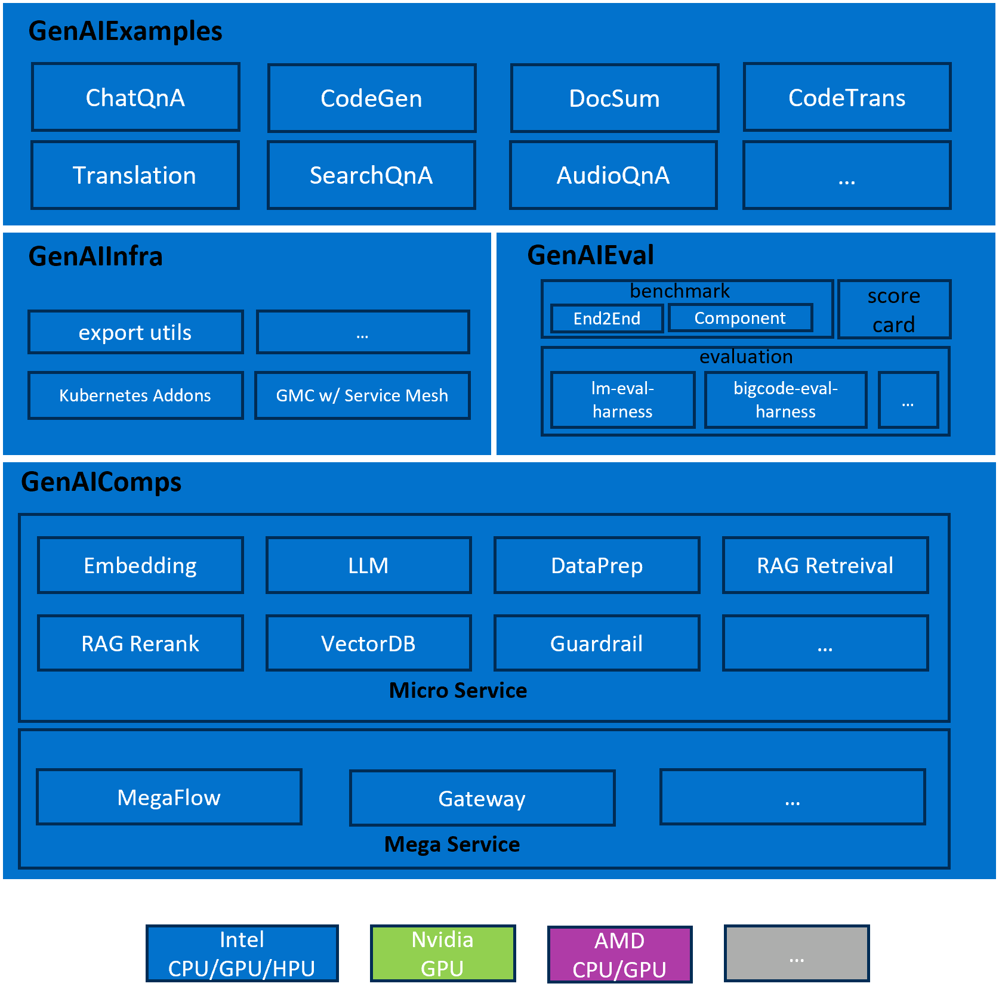

# 24-05-16 OPEA-001 Overall Design

## Автори

[ftian1](https://github.com/ftian1), [lvliang-intel](https://github.com/lvliang-intel), [hshen14](https://github.com/hshen14)

## Статус

На розляді

## Мета

Стабільний, розширюваний, безпечний і простий у використанні фреймворк оркестрування, що дозволяє користувачам OPEA швидко створювати власні додатки GenAI.

Вимоги включають, але не обмежуються:

1. планувальник оркестрування

    має можливість запропонувати визначення на основі конфігурації або низькорівневий код для побудови складних LLM-додатків.

2. реєстр компонентів

    дозволяє користувачеві зареєструвати новий сервіс для створення складних GenAI-додатків

3. моніторинг

   дозволяє користувачеві відстежувати робочий процес, включаючи ведення журналу, статус виконання, час виконання тощо.

4. масштабованість

    легко масштабувати за допомогою K8S або інших технологій розгортання в локальному та хмарному середовищі.

## Мотивація

Цей RFC використовується для представлення загальної філософії проектування OPEA, включаючи загальну архітектуру, робочий процес, дизайн компонентів, для обговорення спільнотою.

## Design Proposal

Запропонована загальна архітектура виглядає наступним чином

1. GenAIComps

    Набір мікросервісів, що використовує композитор сервісів для створення мегасервісу, пристосованого до реальних застосунків корпоративного штучного інтелекту.

2. GenAIExamples

    Колективний список прикладів генеративного ШІ (GenAI) і генерації з розширенням пошуку (RAG), призначений для демонстрації всього трубопроводу оркестрування.

3. GenAIInfra

    Набір для контейнеризації та хмарного розгортання для OPEA, включаючи артефакти для розгортання GenAIExamples у хмарному середовищі, які можуть бути використані корпоративними користувачами для розгортання у власній хмарі.

4. GenAIEval

    Набір оцінок, критеріїв і показників для OPEA, орієнтований на продуктивність, пропускну здатність і затримку, точність на популярних засобах оцінки, безпеку і галюцинації.

Пропонований робочий процес OPEA виглядає наступним чином

1. Мікросервіс

    Мікросервіси подібні до будівельних блоків, пропонуючи фундаментальні послуги для побудови додатків RAG (Retrieval-Augmented Generation). Кожен мікросервіс призначений для виконання певної функції або завдання в архітектурі програми. Розбиваючи систему на менші, автономні сервіси, мікросервіси сприяють модульності, гнучкості та масштабованості. Такий модульний підхід дозволяє розробникам самостійно розробляти, розгортати та масштабувати окремі компоненти програми, що полегшує її підтримку та розвиток з часом. Крім того, мікросервіси полегшують ізоляцію несправностей, оскільки проблеми в одному сервісі з меншою ймовірністю вплинуть на всю систему.

2. Мегасервіс

    Мегасервіс - це архітектурна конструкція вищого рівня, що складається з одного або декількох мікросервісів і надає можливість збирати наскрізні додатки. На відміну від окремих мікросервісів, які зосереджені на конкретних завданнях або функціях, мегасервіс організовує кілька мікросервісів для надання комплексного рішення. Мегасервіси інкапсулюють складну бізнес-логіку та організацію робочих процесів, координуючи взаємодію між різними мікросервісами для виконання конкретних вимог додатків. Такий підхід дозволяє створювати модульні, але інтегровані додатки, де кожен мікросервіс робить свій внесок у загальну функціональність мегасервісу.

3. Шлюз

    Шлюз слугує інтерфейсом для доступу користувачів до мегасервісу, забезпечуючи персоналізований доступ на основі вимог користувача. Він діє як точка входу для вхідних запитів, спрямовуючи їх до відповідних мікросервісів в рамках архітектури мегасервісу. Шлюзи підтримують визначення API, версіювання API, обмеження швидкості та трансформацію запитів, що дозволяє тонко контролювати взаємодію користувачів з базовими мікросервісами. Абстрагуючись від складності базової інфраструктури, шлюзи забезпечують безперебійну та зручну взаємодію з мегасервісом.

## Розглянуті альтернативи

n/a

## Сумісність

n/a

## Miscs

- Список справ:

  - [ ] Специфікація мікросервісу
  - [ ] Специфікація мегасервісу
  - [ ] статичний розподільник хмарних ресурсів проти динамічного розподільника хмарних ресурсів
  - [ ] підтримка відкритої телеметрії
  - [ ] автентифікація та довірене середовище

