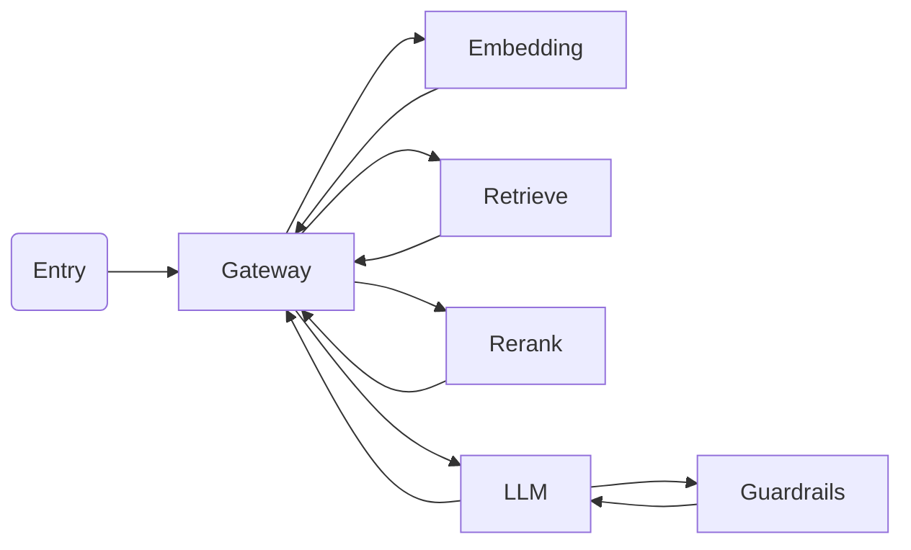
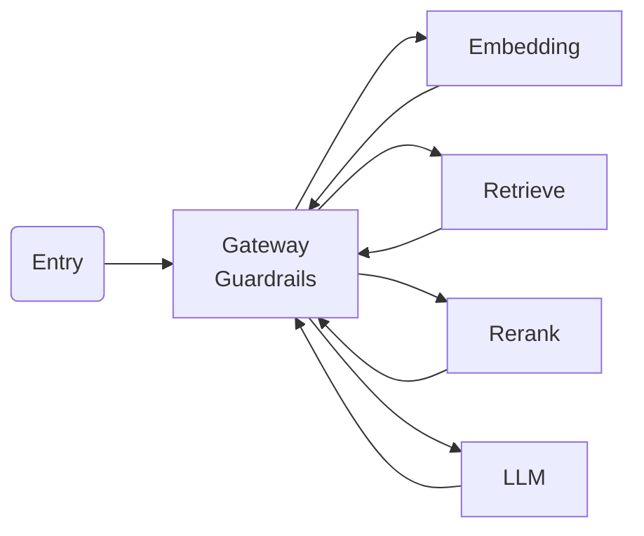
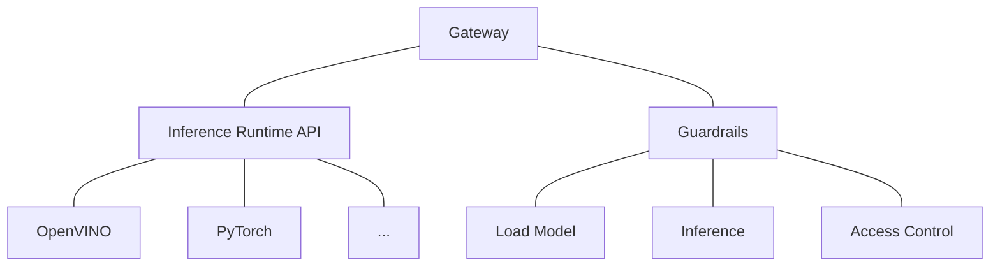
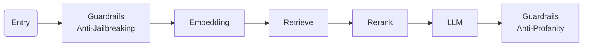
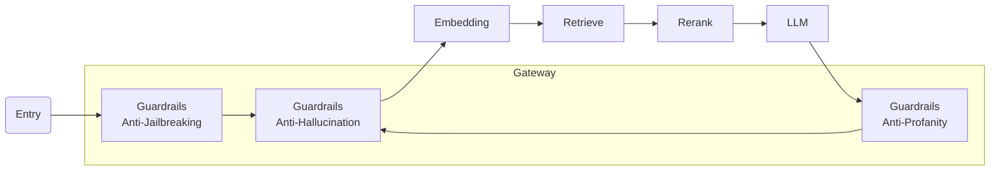
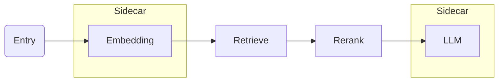
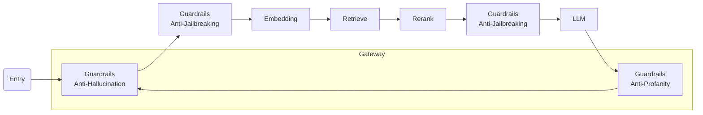

# 24-06-21-OPEA-001-Guardrails-Gateway

Guardrails Gateway

## Автори

[zhxie](https://github.com/zhxie), [Forrest-zhao](https://github.com/Forrest-zhao), [ruijin-intel](https://github.com/ruijin-intel)

## Статус

Під розглядом

## Мета

Розгортання опціональних захисних екранів на шлюзі в середовищі розгортання.

## Мотивація

- Зменшити затримки при передачі даних мережею та кодуванні/декодуванні протоколів.
- Підтримати бар'єри з підтримкою стану (stateful guardrails).
- Покращення спостережливості.
- Використовуйте OpenVINO для інструкцій з прискорення ШІ, включаючи AVX, AVX512 і AMX.

## Проектна пропозиція

### Висновок на місці

Робочий процес, подібний до LangChain, представлений нижче.

Всі сервіси використовують RESTful API виклики для зв'язку. Існують накладні витрати на мережеву передачу та кодування/декодування протоколів. Попередні дослідження показали, що кожне перемикання додає 3 мс затримки, яка може бути ще більшою, якщо mTLS увімкнено з міркувань безпеки при розгортанні між вузлами.

Бар'єри, що вмикаються, в шлюзах працюють в архітектурі, наведеній нижче.

Шлюз може розміщувати кілька захисних бар'єрів без додаткової передачі даних по мережі або кодування/декодування протоколів. У реальних умовах розгортання може бути багато меж безпеки з усіх точок зору, і шлюз є найкращим місцем для забезпечення меж безпеки системи.

Шлюз складається з 2 основних компонентів, часу виконання виводу та захисних бар'єрів.

Уніфікований API середовища виконання виводу надає загальний інтерфейс для середовищ виконання виводу. Будь-яке середовище виконання виводу може бути інтегроване у систему, включаючи OpenVINO. Бар'єри використовують середовище виконання виводу і вирішують, чи є запит/відповідь дійсними.

### Бар'єри з підтримкою стану

Традиційний робочий процес від входу до виходу представлений нижче.

Бар'єрний сервіс забезпечує певний захист для LLM, наприклад, захист від злому, отруєння для вхідної сторони, антитоксичність, перевірку фактів для вихідної сторони та виявлення PII як для вхідної, так і для вихідної сторони.

Охоронні бар'єри також можна розділити на 2 типи: без та з підтримкою стану. Бар'єри, що включають в себе захист від втечі з в'язниці, антитоксичність і виявлення PII, вважаються без підтриски стану, оскільки вони не покладаються на швидкий вхід і вихід відповіді, в той час як захист від галюцинацій вважається з підтримкою стану, він потребує як входу, так і виходу для забезпечення відносності між ними.

[Guardrails Microservice](https://github.com/xuechendi/GenAIComps/tree/pii_detection/comps/guardrails) надає певні засоби захисту як мікросервіс, але через обмеження мікросервісу він не може відстежувати запити на відповіді, що призводить до труднощів у впровадженні охорони без підтримки стану.

Бар'єри, що вмикаються, в шлюзах працюють в архітектурі, наведеній нижче.

В якості альтернативного варіанту, шлюз також впроваджує  охоронну зданність, незалежно від того, чи є він з або без підтримки стану.

### Спостережливість

Envoy - найпопулярніший хмарний проксі-сервер, який містить вбудований журнал доступу, статистику та метрики, а також може бути інтегрований у платформу спостереження, включаючи OpenTelemetry і Prometheus, місцево.

Бар'єри в шлюзі будуть використовувати ці можливості спостереження для задоволення потенційних нормативних вимог і вимог до відповідності.

### Розгортання мультисервісів

Припустимо, сервіси вбудовування та LLM працюють на основі ШІ і потребують бар'єрного захисту.

Опціональний шлюз може бути розгорнутий як шлюз або як додаткова послуга.

Шлюз також може працювати з мікросервісами бар'єрів.

## Розглянуті альтернативи

[Guardrails Microservice](https://github.com/xuechendi/GenAIComps/tree/pii_detection/comps/guardrails): передбачив певні засоби захисту, однак він підтримує лише засоби захисту без підтримки стану.

## Сумісність

N/A

## Miscs

- Зробити

  - [ ] Визначення API для розгортання мета-сервісів і розгортання Kubernetes
  - [ ] Фреймворк виводу Envoy і захисні екрани HTTP-фільтр
