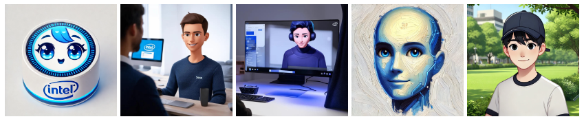
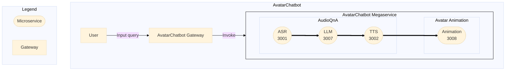
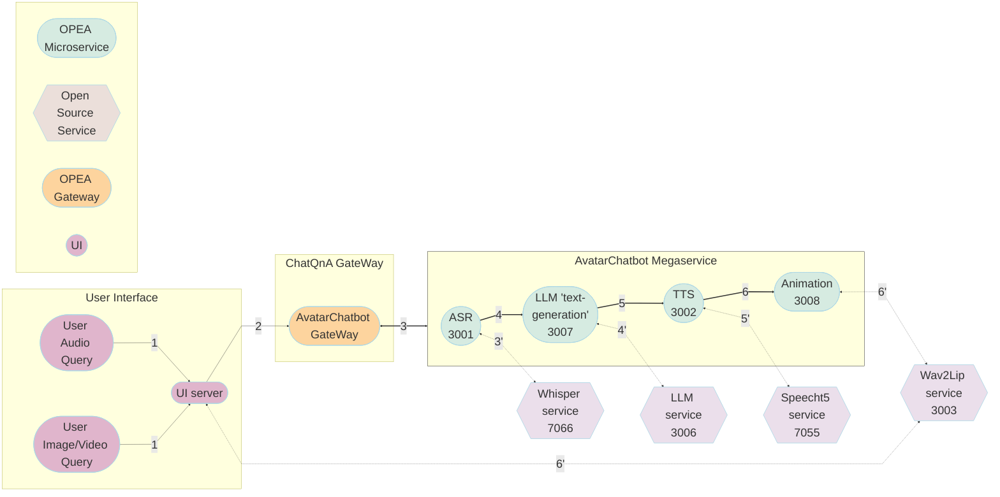
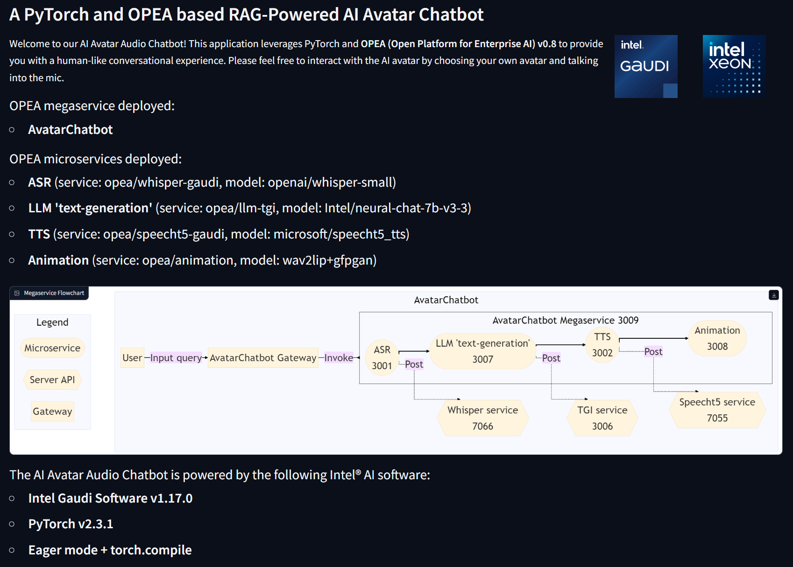
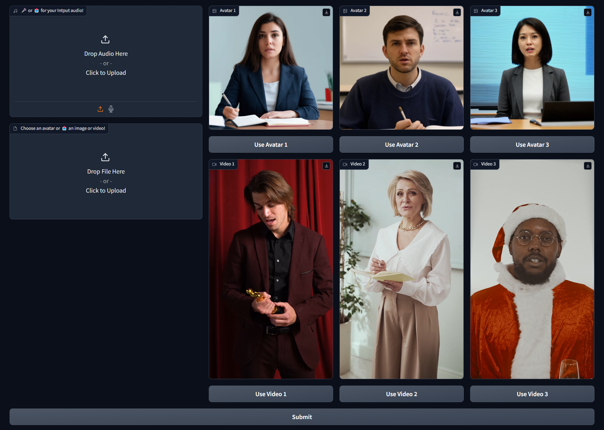
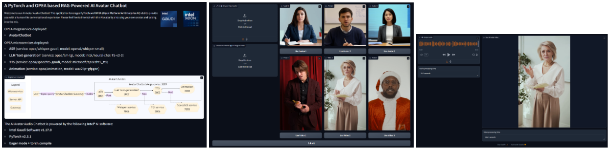

# 24-08-02-OPEA-AIAvatarChatbot

Людиноподібний чат-бот зі штучним інтегрованим інтелектом RAG, інтегрований з OPEA AudioQnA
<!-- The short description of the feature you want to contribute -->

## Автори
<!-- List all contributors of this RFC. -->
[ctao456](https://github.com/ctao456), [alexsin368](https://github.com/alexsin368), [YuningQiu](https://github.com/YuningQiu), [louie-tsai](https://github.com/louie-tsai)

## Статус
<!-- Change the PR status to Under Review | Rejected | Accepted. -->
v0.1 - Команда ASMO поділилася 28 червня 2024 р.  
[GenAIComps pr #400](https://github.com/opea-project/GenAIComps/pull/400) (на розгляді)  
[GenAIExamples pr #523](https://github.com/opea-project/GenAIExamples/pull/523) (на розгляді)

## Мета
<!-- List what problem will this solve? What are the goals and non-goals of this RFC? -->
* "Цифрові люди стануть вирішальною силою в індустрії". З огляду на прориви в галузі ШІ та нейронної графіки, різко зріс попит на людино-комп'ютерну взаємодію та розмовні додатки ШІ. Щоб задовольнити цей попит, нам потрібні обчислення, керовані намірами, де взаємодія з комп'ютером буде такою ж природною, як і взаємодія з людиною. Проте всі існуючі програми OPEA (ChatQnA, AudioQnA, SearchQnA тощо) є текстовими і не містять інтерактивних візуальних елементів.

* Варто також зазначити, що більшості існуючих програм OPEA бракує мультимодальних функцій, тобто вони не обробляють аудіо- та візуальні дані. У той час як підприємства все частіше шукають мультимодальні рішення зі штучним інтелектом, які можуть обробляти як аудіо, так і візуальні дані, щоб створювати чат-ботів із синхронізацією губ та обличчям, які будуть більш привабливими та схожими на людей.

* У зв'язку з вищезазначеними причинами, ми представляємо новий мікросервіс, анімацію, який генерує анімовані аватари з аудіо та зображень/відео; і новий мегасервіс, AvatarChatbot, який інтегрує мікросервіс анімації з існуючим сервісом AudioQnA для створення людиноподібного аудіо чат-бота зі штучним інтелектом.

<!--

  
  
  
   -->
  <!--  -->
  <!-- 

 -->

Чат-бот буде:
* Вміти розуміти та відповідати на текстові та аудіо запити користувачів, використовуючи бекенд модель LLM
* Синхронізувати фрагменти аудіо-відповіді з кадрами зображення/відео, щоб створити високоякісне відео, на якому аватар розмовляє в режимі реального часу
* Представляти відповіді користувача у вигляді анімованого аватара у зручному для користувача інтерфейсі
*Використовувати мультимодальне генерування з доповненим пошуком (RAG) для генерування більш точних відповідей у доменній області у версії 0.2

Нові мікросервіси включають:
* анімацію 

Нові мегасервіси включають:
* AvatarChatbot

## Мотивація
<!-- List why this problem is valuable to solve? Whether some related work exists? -->
* Підприємства в медичній, фінансовій, освітній, розважальній та інших галузях все частіше використовують чат-боти зі штучним інтелектом для покращення обслуговування клієнтів та якості обслуговування. Проте існуючі програми OPEA (ChatQnA, AudioQnA, SearchQnA тощо) є текстовими і не містять інтерактивних візуальних елементів.
* Підприємства шукають мультимодальні рішення ШІ, які можуть обробляти як аудіо, так і візуальні дані, щоб створювати чат-ботів із синхронізованою мімікою та обличчям, які будуть більш привабливими та схожими на людей.
* Цей RFC має на меті заповнити ці прогалини шляхом введення нового мікросервісу, анімації, який може бути легко інтегрований з існуючими мікро- і мегасервісами в OPEA, щоб розширити можливості платформи в області мультимодального ШІ, взаємодії людини з комп'ютером і цифрової людської графіки.

Загалом, цей проект додає до платформи OPEA новий блок мікросервісів, який анімацію зовнішнього вигляду чат-бота, та інтегрує його з існуючими трубопроводами чат-ботів, такими як [ChatQnA](https://github.com/opea-project/GenAIExamples/tree/2e312f44edbcbf89bf00bc21d9e9c847405ecae8/ChatQnA), [AudioQnA](https://github.com/opea-project/GenAIExamples/tree/2e312f44edbcbf89bf00bc21d9e9c847405ecae8/AudioQnA), [SearchQnA](https://github.com/opea-project/GenAIExamples/tree/2e312f44edbcbf89bf00bc21d9e9c847405ecae8/SearchQnA), тощо, створювати нові мегасервіси з чат-ботами, які можуть взаємодіяти з користувачами у більш людський спосіб.

Схожі роботи включають [Nvidia Audio2Face](https://docs.nvidia.com/ace/latest/modules/a2f-docs/index.html), [Lenovo Deepbrain AI Avatar](https://www.deepbrain.io/ai-avatars), [BitHuman](https://www.bithuman.io/) тощо.

## Проектна пропозиція
<!-- This is the heart of the document, used to elaborate the design philosophy and detail proposal. -->

### Дизайн Avatar Chatbot
<!-- Removed PPT slides -->

Наразі у вищезгаданому дизайні відсутня функція RAG з використанням мікросервісів `embedding` та `dataprep`, включаючи завантаження відповідних документів/посилань, зберігання їх у базі даних та їх вилучення для моделі LLM. Ці функції будуть додані у версії 0.2.  

Блок-схема: AvatarChatbot Мегасервіс  
<!-- Insert Mermaid flowchart here -->

Мегасервіс AvatarChatbot - це новий сервіс, який інтегрує існуючий сервіс AudioQnA з новим мікросервісом анімації. Сервіс AudioQnA - це конвеєр, який приймає аудіовхід користувача, перетворює його на текст, генерує відповідь LLM і перетворює відповідь на аудіовихід. Мікросервіс анімації - це новий сервіс, який приймає аудіо-відповідь від служби AudioQnA, генерує відповідь у вигляді анімованого аватара і надсилає її назад користувачеві. Шлюз AvatarChatbot викликає внутрішній мегасервіс AvatarChatbot для створення відповіді.

#### анімаційний мікросервіс
Мікросервіс анімації - це новий сервіс, який генерує анімовані відеоролики аватарів з аудіо та зображення/відео вхідних даних. Мікросервіс анімації отримує звуковий відгук від сервісу AudioQnA, синхронізує фрагменти мелоспектрограми звукового відгуку з кадрами зображення/відео і генерує високоякісне відео, на якому аватар розмовляє в реальному часі. Мікросервіс анімації наразі використовує модель [Wav2Lip](https://github.com/Rudrabha/Wav2Lip) для синхронізації губ та модель [GFPGAN](https://github.com/TencentARC/GFPGAN) для відновлення обличчя.

Користувач може створити власний Docker-образ за допомогою `Dockerfile_hpu` і створити Docker-контейнер на екземплярі Gaudi2 для запуску анімаційного мікросервісу. Потім вони можуть перевірити роботу сервісу, надіславши POST-запит до API сервера, надаючи при цьому аудіо та зображення/відео вхідні дані. Мікросервіс анімації згенерує анімовану відео-відповідь аватара і збереже її у вказаному вихідному шляху.

В розробці підтримка альтернативних моделей SoTA, таких як [SadTalker] (https://github.com/OpenTalker/SadTalker) та [LivePortrait] (https://github.com/KwaiVGI/LivePortrait).

#### Мегасервіс AvatarChatbot
Мегасервіс AvatarChatbot - це новий сервіс, який об'єднує існуючі мікросервіси, що входять до складу сервісу AudioQnA, з новим мікросервісом анімації. Сервіс AudioQnA - це конвеєр, який приймає вхідний аудіосигнал користувача, перетворює його на текст, генерує відповідь LLM і перетворює відповідь на вихідний аудіосигнал. Мікросервіс анімації - це новий сервіс, який приймає аудіо-відповідь від служби AudioQnA, генерує відповідь у вигляді анімованого аватара і надсилає її назад користувачеві. Мегапотік виглядає наступним чином:  
asr -> llm -> tts -> animation

#### Кінцевий Інтерфейс користувача
Інтерфейс користувача - Gradio. Користувачеві пропонується завантажити зображення або відео як джерело аватара. Користувач також задає своє питання усно через мікрофон, натиснувши на кнопку "запис". Бекенд AvatarChatbot обробляє вхідний аудіосигнал і генерує відповідь у вигляді анімованого аватара, який відповідає своїм унікальним голосом. Відповідь відображається в інтерфейсі Gradio. Користувач може бачити анімований аватар, який промовляє відповідь в режимі реального часу, і може взаємодіяти з аватаром, ставлячи додаткові запитання.

<!-- 

  
  
  

 -->

### Демонстрація в реальному часі
Демонстрація чат-бота AI Avatar на Intel® Gaudi® 2, введення зображення (вгорі) та відеовведення (внизу)
<!-- [AI Avatar Chatbot Demo on Intel® Gaudi® 2, image input](https://intel.sharepoint.com/:v:/s/mlconsultingandsupport/EZa7vjON10ZCpMvE7U-SPMwBRXbVHqe1Ybsa-fmnXayNUA?e=f6FPsl)   
[AI Avatar Chatbot Demo on Intel® Gaudi® 2, video input](https://intel.sharepoint.com/:v:/s/mlconsultingandsupport/ESMIcBseFTdIuqkoB7TZy6ABfwR9CkfV49TvTa1X_Jihkg?e=zMH7O7) -->
<!-- 

  <video src="assets/demo_latest_image.mpg" controls style="width: 49%;"></video>
  <video src="assets/demo_latest_video.mpg" controls style="width: 49%;"></video>

 -->

## Сумісність
<!-- List possible incompatible interface or workflow changes if exists. -->
Новий мегасервіс AvatarChatbot і мікросервіс анімації сумісні з існуючими репозиторіями OPEA GenAIExamples і GenAIComps. Їх можна розгорнути на апаратному забезпеченні Intel® Xeon® і Intel® Gaudi®.

## Miscs
<!-- List other information user and developer may care about, such as:
- Performance Impact, such as speed, memory, accuracy.
- Engineering Impact, such as binary size, startup time, build time, test times.
- Security Impact, such as code vulnerability.
- TODO List or staging plan.  -->
Час наскрізного виведення для AvatarChatbot Megaservice (asr -> llm -> tts -> animation): 

На SPR:

 ~30 секунд для AudioQnA на SPR,

 ~40-200 секунд для AvatarAnimation на SPR

На Gaudi 2:  
~5 секунд для AudioQnA на Gaudi, 
~10-50 секунд для AvatarAnimation на Gaudi, залежно від:  
1) Незалежно від того, чи є вхідними даними зображення або багатокадрове відео з фіксованою частотою кадрів
2) Використано модель LipSync Animation DL: Wav2Lip_only або Wav2Lip+GFPGAN або SadTalker 
3) Роздільна здатність і частота кадрів в секунду отриманого відео в форматі mp4

Всі звіти про затримки станом на 2 серпня 2024 р.
