# Проєкт Рамкової пропозиції щодо відкритої платформи для корпоративного штучного інтелекту (OPEA)

Rev 0.5     April 15, 2024

Початковий проект розроблений корпорацією Intel. Контакти для зв'язку - Ке Дінг (ke.ding@intel.com ), Гаді Зінгер (gadi.singer@intel.com)

Будь ласка, надішліть відгук на info@opea.dev

## 1.Резюме

OPEA (Open Platform for Enterprise AI) - це фреймворк, який дозволяє створювати та оцінювати відкриті, багатопрофільні, надійні та комбіновані рішення GenAI, які використовують найкращі інновації в екосистемі.

OPEA - це екосистемна програма в рамках Linux Foundation Data & AI, яка має на меті
прискорити впровадження комплексних рішень GenAI на підприємствах і підвищити їхню цінність для бізнесу. OPEA допоможе
спростити впровадження комплексних рішень GenAI корпоративного рівня, включаючи Пошуковий Розширений Генеративний ШІ (RAG). Платформа покликана сприяти ефективній інтеграції безпечних,
продуктивних і економічно ефективних робочих процесів GenAI у бізнес-системи та керувати їх розгортанням.

Визначення цієї платформи включатиме архітектурний план, повний набір компонентів для систем GenAI, а також набір специфікацій, як для окремих компонентів, так і для цілих систем. Вона також включатиме інструменти для побудови, налаштування та оцінки наскрізних робочих процесів GenAI. Ці визначення будуть
розглядати такі ключові аспекти, як продуктивність, набір функцій, надійність (безпека і прозорість) і готовність до використання в додатках корпоративного рівня. Специфікації також включатимуть набір еталонних потоків
та демонстраційні приклади, які можна буде легко відтворити та адаптувати.

Рисунок 1-1: Основні цінності OPEA

\*Зверніть увагу - Термін «специфікація» використовується в цьому проекті технічного документу і додатку як широкий робочий термін, що загалом стосується детального опису систем та їхніх компонентів. Однак, важливо зазначити, що цей термін може бути замінений або оновлений на основі більш точного опису і застосування міркувань ліцензування Фонду Linux.

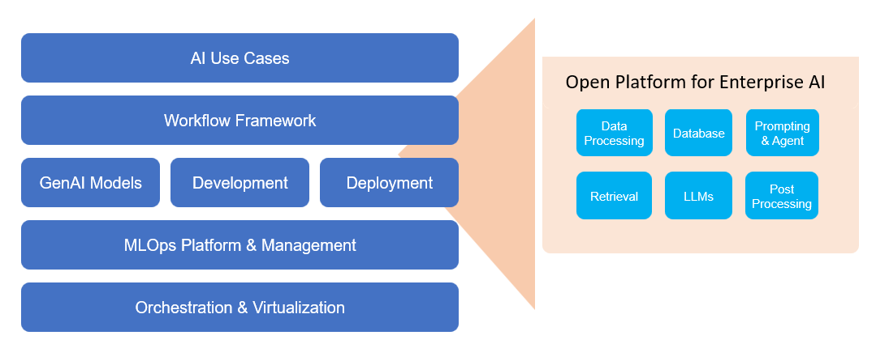

Рисунок 1-2 OPEA - пропонована структура побудови і оцінки рішень для штучного інтелекту

Ми живемо в епоху, коли алгоритми та моделі штучного інтелекту, які спочатку розроблялися в дослідницьких, а згодом впроваджені в середовище, орієнтоване на споживача, тепер переходять до широкого впровадження на підприємствах. Цей перехід дає можливість партнерам використовувати десятиліттями напрацьовані знання про обчислення, безпеку, надійність та інтеграцію центрів обробки даних, серед іншого, щоб прискорити впровадження штучного інтелекту та розкрити його потенційну цінність.

## 2. Введення

Останнім часом практика розробки АІ-рішень зазнала значної трансформації. Замість того, щоб розглядати модель штучного інтелекту (наприклад, GenAI LLM) як повноцінне рішення, ці моделі тепер інтегруються в більш комплексні наскрізні АІ-рішення. Ці рішення складаються з багатьох компонентів, включаючи підсистеми пошуку з вбудованими агентами, векторну базу даних для ефективного зберігання та пошуку, а також швидкісні механізми, серед іншого. Цей зсув призвів до появи фреймворків композиції (таких як LangChain або Haystack), які використовуються для об'єднання цих компонентів у наскрізні потоки GenAI, такі як RAG-рішення, для розробки та розгортання рішень для ШІ.

Екосистема пропонує ряд фреймворків для композиції, деякі з яких мають відкритий вихідний код (наприклад, LangChain і LlamaIndex), а інші - закритий і поставляються в комплекті з професійними сервісами (наприклад,
ScaleAI). Крім того, деякі з них пропонуються постачальниками хмарних послуг (наприклад, AWS) або постачальниками апаратного/програмного забезпечення
(наприклад, NVIDIA). Однак станом на 2 квартал 2024 року вони представляють індивідуальні перспективи і пропозиції для вирішення складного завдання побудови комплексного рішення зі штучного інтелекту.

### 2.1 Основні можливості

OPEA запропонує ключові можливості як для побудови, так і для оцінки комплексних композитних рішень GenAI, створених за допомогою пошукової аугментації. Як платформа для створення, OPEA дозволить створювати ШІ-рішення на основі RAG безпосередньо або за допомогою таких композиційних інструментів, як LangChain і Haystack. Як система оцінки, OPEA надасть засоби для оцінки та класифікації наскрізних композитних рішень GenAI за аспектами, що випливають з чотирьох областей - продуктивність, функції, надійність і готовність до впровадження на рівні підприємства.

#### 2.1.1 Побудова рішень GenAI, включаючи доповнення пошуку

Створити комплексне рішення зі штучного інтелекту (включно з доповненням пошуку) можна, об'єднавши моделі та модулі від різних постачальників.

OPEA пропонуватиме або посилатиметься на набір будівельних блоків - моделей і модулів, які можна викликати в потоці для досягнення завдання або послуги ШІ. Моделі та модулі можуть бути частиною репозиторію OPEA або опубліковані у стабільному відкритому репозиторії (наприклад, Hugging Face), або бути власним / закритим кодом і дозволені до використання за результатами оцінки OPEA.

* Моделі GenAI - великі мовні моделі (LLM), великі моделі бачення (LVM), мультимодальні моделі тощо.
* Інші модулі - компоненти системи ШІ (крім LLM/LVM моделей), включаючи
  Модуль поглинання/обробки даних, вбудовані моделі/сервіси, векторні бази даних
  (також відомі як індексація або сховища графічних даних), механізми підказок, системи пам'яті тощо.

Кожен модуль системи буде охарактеризований очікуваною функціональністю та атрибутами. Ці характеристики
будуть оцінюватися для кожного конкретного варіанту реалізації (див. наступний розділ про оцінку). Для кожного модуля та моделі буде запропоновано кілька варіантів від різних постачальників, щоб забезпечити вибір та різноманітність.

Ця платформа складається з набору композиційних можливостей, які дозволяють створювати кастомні агенти, налаштовувати асистентів ШІ та створювати повний наскрізний потік GenAI, що включає розширення пошуку та інші функціональні можливості, коли це необхідно. Платформа також включатиме інструменти для тонкого налаштування та оптимізації, а також посилання на них, оптимізації (наприклад, квантування) для підтримки створення ефективних, надійних рішень, які можна буде запускати локально в цільових обчислювальних середовищах підприємств. Подібно до будівельних блоків, можливості композиції можуть бути частиною репозиторію OPEA, або опубліковані у стабільному відкритому репозиторії (наприклад, Hugging Face) або пропонуватися екосистемою (наприклад, LangChain, LlamaIndex та Haystack).

Важливою частиною композиційної пропозиції буде набір перевірених довідкових потоків, готових до завантаження та відтворення в середовищі користувачів. Серед безлічі готових довідкових потоків будуть і незалежні від домену потоки (наприклад, потік RAG для мовних запитань і відповідей, або мультимодальний потік для взаємодії з зображеннями і відео), які були налаштовані для різних провайдерів HW і налаштувань. Будуть також специфічні для домену потоки, такі як наскрізний потік фінансових послуг або консультант з питань харчування, які іноді називають мікросервісами.

Існує загальна мова візуалізації, яка використовується для зображення компонента кожного потоку посилань, що надається.

#### 2.1.2 Оцінка рішень GenAI, включаючи доповнення пошуку

OPEA надаватиме засоби та послуги для повного оцінювання та класифікації компонентів і комплексних рішень GenAI у чотирьох сферах - продуктивність, функціональність, надійність та готовність до роботи на підприємстві.
Оцінка може бути проведена для потоку, створеного в рамках OPEA, або створеного в іншому місці, але з проханням оцінити його за допомогою платформи.

Деякі з інструментів оцінювання будуть частиною репозиторію OPEA, тоді як інші будуть посиланнями на окремі бенчмарки, запропоновані екосистемою.

OPEA пропонуватиме тести для самооцінки, які можуть виконувати користувачі. Крім того, він матиме технічне оснащення і персонал для проведення оцінювання за запитом.

Оцінки OPEA можна переглянути на наступних рівнях:

* Оцінювання - детальні тести або бенчмарки, проведені для певних модулів або
  атрибутів наскрізного потоку. Оцінювання буде детальним і конкретним,
  з перевіркою функціональності та характеристик, визначених для цього модуля
  або потоку.
* Градація - об'єднання індивідуальних оцінок в оцінку за кожною з чотирьох сфер
  чотирьох доменів - Продуктивність, Функціональність, Надійність і
  Готовність до роботи на підприємстві. Сукупна оцінка за кожну область може бути L1 Початковий рівень; L2 Ринковий рівень; або L3 Просунутий рівень.
* Сертифікація - ще не вирішено, чи буде запропонована сертифікація
  в рамках OPEA.  Однак, проект пропозиції для розгляду полягає в тому, щоб дозволити сертифікацію в рамках OPEA, яка буде визначатися шляхом забезпечення мінімального рівня 2 в усіх чотирьох сферах.

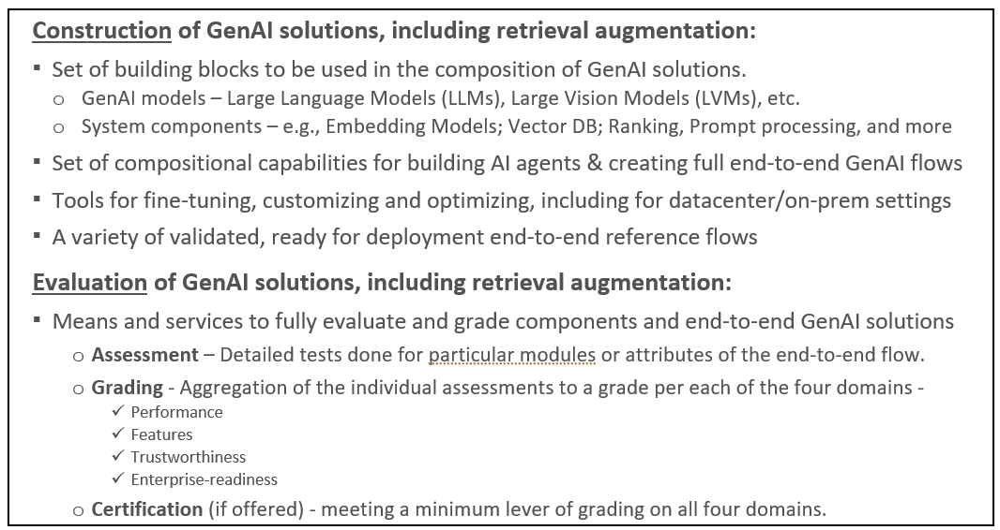

Рисунок 2-1 Основні можливості, які надає OPEA

Додаток А до цього документу є попереднім проєктом запропонованої специфікації та зразків еталонних потоків.

## 3. Компоненти фреймворку, архітектура і потік

Визначення OPEA (див. Додаток А) включає характеристику компонентів сучасного стану (SotA) композитних систем, включаючи пошук-доповнення, та їх архітектуру у вигляді потоку та стеку SW.

У Додатку А є шість розділів, які стануть відправною точкою для більш детального та
спільної роботи над визначенням OPEA:

* A1: Компоненти системи - перелік компонентів, з яких складається система, разом  з їх ключовими характеристиками. Деякі системи, які будуть оцінюватися, можуть включати лише підмножину цих компонентів.
* A2: Архітектура SW - Діаграма, що показує рівень компонентів у стеку SW
* A3: Потоки системи - Діаграма(и), що ілюструє(ють) потік наскрізної операції  через відповідні компоненти.
* A4: Вибір специфікацій на рівні системи і компонентів
* A5: Градація - класифікація систем, що оцінюються на основі продуктивності, функцій, надійності та готовності до роботи на рівні підприємства.
* A6: Еталонні потоки - список еталонних потоків, які демонструють ключові випадки використання і дозволяють завантажувати і реплікувати їх для швидшого створення екземплярів потоку.

Припущення для розробки розділів OPEA включають:

* OPEA є зразком композиційних фреймворків і не має на меті конкурувати з популярними фреймворками. Він покликаний допомогти оцінити плюси і мінуси різних рішень і покращити інтероперабельність компонентів.
* У виробництві, ймовірно, багато клієнтів будуть використовувати власні власні трубопроводи.
* Ця концептуальна схема є додатковою і призначена для заохочення сумісності компонентів системи, а також додавання спеціалізованих можливостей, таких як оптимізація з урахуванням вимог до гігієни, доступ до інноваційних функцій і різноманітних мікроасистентів. різноманітних помічників і мікросервісів.
* Гнучкість і можливість легко підключати і замінювати моделі та інші компоненти. Можливість заміни компонентів є важливим фактором швидкого розвитку галузі.
* Забезпечення середовища для експериментів з різними варіантами рішень - наприклад, який вплив (продуктивність системи E2E) при заміні загального компонента переранжування на компонент ранжування конкретного постачальника.

Слід зазначити, що остаточне формування компонентів структури, архітектури і потоків буде спільно визначено технічним комітетом після того, як буде створено повне визначення OPEA і структуру управління буде створено. Очікується також, що специфікація буде регулярно оновлюватися, щоб відображати
швидко мінливого стану справ у просторі.

## 4. Оцінка компонентів і потоків GenAI

Однією з важливих переваг для екосистеми від розвитку та широкого використання OPEA є структурований набір оцінок, який може забезпечити надійний зворотний зв'язок щодо потоків GenAI - незалежно від того, чи вони створені в рамках OPEA, чи деінде, але мають видимість і доступ, що дозволяє проводити оцінювання.
Оцінювання може здійснюватися шляхом аналізу окремих компонентів або повних комплексних рішень GenAI.
Оцінювання в контексті OPEA стосується оцінки окремих аспектів рішення - наприклад, його затримки або точності відповідно до визначеного набору тестів. Оцінки розглядаються в цьому розділі. Градація - це сукупність оцінок, і вона розглядається в наступному розділі.

Компоненти і цілі наскрізні потоки будуть оцінюватися в чотирьох сферах - продуктивність, функціональність, надійність і корпоративна готовність.

Продуктивність можна оцінити на рівні компонентів - наприклад, затримку векторної бази даних на заданому великому індексованому наборі даних або затримку і пропускну здатність моделі LLM. Крім того, продуктивність потрібно 
оцінювати для наскрізних рішень, які виконують визначені завдання. Термін «продуктивність» стосується аспектів швидкості (наприклад, затримки), пропускної здатності (наприклад, пам'яті або розміру контексту), а також точності або результатів.

OPEA може використовувати існуючі специфікації оцінювання, такі як ті, що використовуються системами SotA RAG, та інші стандартні бенчмарки, де це можливо (наприклад, MMLU). Що стосується функціональності, існують еталони та набори даних доступні для оцінки конкретної цільової функціональності, наприклад, багатомовності (як FLORES) або коду поколінь (наприклад, Human-Eval).

Для оцінки достовірності/безпеки галюцинацій специфікація буде використовувати існуючі бенчмарки, такі як RGB-бенчмарк / Truthful QA, де це можливо.

Деякі оцінки готовності підприємства включають аспекти масштабованості (наскільки великий набір даних може обробляти система, розмір векторного сховища, розмір і тип моделей), готовність інфраструктури (хмарна чи «голий метал») і простота розгортання програмного забезпечення (будь-які кроки після OPEA, необхідні для широкого розгортання). Одним із показників, які можна оцінити в цій категорії, є загальна вартість/сукупна вартість володіння повним наскрізним потоком GenAI.

Якщо для деяких аспектів композитних рішень GenAI немає у вільному доступі надійних еталонів або тестів, будуть докладені зусилля для забезпечення їх створення. Оскільки багато з поточних (на початок 2024 року) тестів зосереджені на продуктивності та функціях, будуть докладені зусилля, щоб доповнити їх за необхідності для оцінювання надійності та готовності підприємства.

При розробці оцінок слід використовувати досвід аналогічних оцінок, якщо такий є. Наприклад, посилаючись на оцінку RAG, проведену Нільсом Реймерсом з Coere.  Детальніше див. тут:

* Людські уподобання
* Середня точність E2E
* Багатомовність
* Довготривалий контекст «Голки в стозі сіна»
* Специфіка домену

Розробка оцінок розпочнеться з зосередження уваги на основних сценаріях використання потоку РАВ, таких як Open Q&A.  Це дозволить порівняти їх із загальноприйнятими промисловими оцінками (див. Cohere, GPT-4)

## 5. Структура оцінювання

Структура оцінювання OPEA відноситься до конкретних тестів і контрольних показників як до «оцінок» - див. попередній розділ для деталей. «Градація» - це частина оцінювання OPEA, яка об'єднує декілька індивідуальних оцінок в один з трьох рівнів оцінок на одному з трьох рівнів у кожній з чотирьох сфер оцінювання - ефективність, характеристики, надійність і готовність підприємства.

Наступний проект системи оцінювання наведено лише для ілюстрації та обговорення. Система оцінювання повинна бути визначена і впроваджена на основі обговорень в органі технічної експертизи і будь-якого іншого механізму управління, який буде визначений для OPEA.

Для забезпечення того, щоб композиційні системи вирішували широкий спектр проблем, пов'язаних з розгортанням підприємства, система класифікації має чотири категорії:

* Продуктивність - Орієнтована на загальну продуктивність системи та ефективність/TCO
* Функції - обов'язкові та додаткові можливості компонентів системи
* Надійність - здатність гарантувати якість, безпеку і надійність. При цьому враховується відповідна державна або інша політика.
* Готовність підприємства - можливість використання у виробництві в умовах підприємства.

Сьогодні спільноти та промисловість добре розуміють можливості Продуктивності та Функцій, в той час як надійність і готовність підприємства все ще перебувають на ранній стадії аналізу й оцінки, коли мова йде про рішення GenAI. Тим не менш, всі сфери є важливими для забезпечення ефективних, безпечних, надійних рішень, що враховують конфіденційність і готові до широкого розгортання.

Система оцінювання не призначена для додавання будь-яких конкретних тестів або критеріїв. Всі індивідуальні тести повинні бути частиною оцінювання. Скоріше, мета системи оцінювання полягає в тому, щоб надати загальний рейтинг щодо продуктивності, функціональності, надійності та корпоративної готовності потоку GenAI на основі безлічі індивідуальних оцінок. Очікується, що вона надасть абстраговане і спрощене уявлення про потік GenAI, що оцінюється. Буде зроблена спроба відповісти на два основні питання - яким є рівень можливостей потоку GenAI порівняно з іншими потоками, що оцінюються на той час, а також оцінити деякі необхідні вимоги (наприклад, щодо безпеки і готовності підприємства) для надійного розгортання рішень GenAI в масштабі. A система оцінювання встановлює механізм для оцінки різних побудованих рішень ШІ (наприклад, конкретних потоків RAG) в контексті структури OPEA.

Для кожної категорії буде встановлено 3 рівні оцінювання:

* L1 - Початковий рівень - обмежені можливості. Рішення може розглядатися як менш  просунутим або продуктивним порівняно з іншими рішеннями, оціненими для подібних завдань. Воно може зіткнутися з проблемами при розгортанні (якщо є недоліки в надійності або  готовності підприємства).
* L2 – Ринковий - Відповідає потребам ринку. Рішення представляє середній діапазон  систем, що розглядаються та оцінюються. Його можна безпечно розгортати у виробничих корпоративних середовищах і, як очікується, відповідатиме поширеним стандартам безпеки та прозорості. 
* L3 - Просунутий - Перевищує середні ринкові потреби. Рішення представляє найвищий рівень компонентів або наскрізних потоків GenAI, що розглядаються та оцінюються на даний момент. Воно відповідає або перевищує всі вимоги щодо безпеки, конфіденційності, прозорості та розгортання в масштабі.

Система оцінювання може бути використана користувачами GenAI, щоб переконатися, що рішення, яке оцінюється, відповідає очікуванням екосистеми в галузі, яка розвивається надзвичайно швидко. Вона може виділити виняткові рішення або вказати на проблемні області. Структурований підхід у чотирьох сферах гарантує, що сукупний досвід екосистеми в будь-який момент часу відображається у зворотному зв'язку з потенційними користувачами конкретного рішення GenAI. Природно, що цільові пости того, що визначається як L1/L2/L3 повинні регулярно оновлюватися, оскільки галузь штовхає GenAI до найсучасніших досягнень.

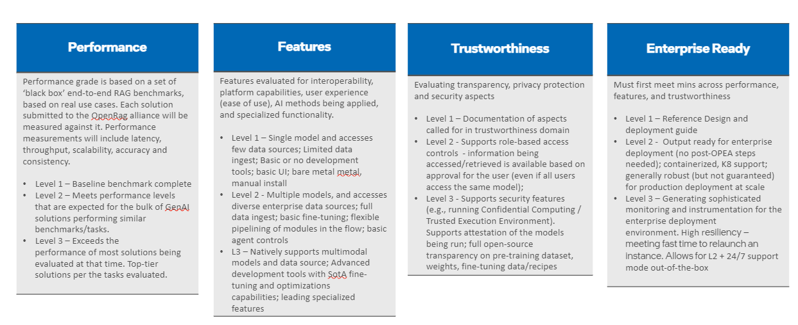

Рисунок 5-1 Загальний вигляд системи оцінювання в чотирьох сферах

Система оцінювання може відігравати різну роль для постачальників моделей, будівельних блоків (модулів) і повних комплексних рішень GenAI. Постачальники можуть отримати структурований і неупереджений відгук про сильні та слабкі сторони їхньої пропозиції порівняно з рештою ринку. Очікується, що формулювання всіх ключових сфер для розгортання на підприємствах допоможе провайдерам забезпечити більш надійну і повну доставку та постійне вдосконалення для широкого розгортання на підприємствах. Це також допоможе виділити видатні рішення, забезпечивши їм попутні вітри в сьогоденні та диференціюючи їхні пропозиції.

Якщо і коли сертифікація стане частиною структури (обговорення та рішення будуть прийняті на більш пізньому етапі), передбачається, що система повинна бути принаймні на рівні L2 для кожного аспекту, щоб бути «сертифікованою OPEA».
Така сертифікація може підвищити впевненість як постачальників, так і користувачів у тому, що рішення GenAI, яке оцінюється, є конкурентоспроможним і готовим до широкого розгортання, не надаючи при цьому жодних гарантій.

Набори оціночних тестів і пов'язане з ними оцінювання дозволять постачальникам ІТ-послуг і галузевим компаніям, які впроваджують рішення, мати можливість самотестуватися, оцінювати та класифікувати себе за різними показниками. Набір тестів складатиметься з відповідних тестів/бенчмарків, які наразі доступні у спільноті, а за відсутності стандартних бенчмарків, будуть розроблені нові тести. Для кожної з цих метрик ми матимемо механізм оцінювання, щоб зіставити певні діапазони балів до L1, L2 або L3 на цей час. Ці діапазони будуть періодично оновлюватися, щоб відображати прогрес у цій галузі.

Рисунок 5-2 ілюструє деякі з аспектів, що підлягають оцінці в чотирьох сферах. Приклади, виділені жовтим кольором, показують мінімальні оцінки, необхідні для кожної з областей. Приклади, виділені синім кольором, показують наступний рівень оцінок, які вказують на більш високі можливості конвеєра RAG. Наступний і найвищий рівні оцінок позначені текстом без кольору.

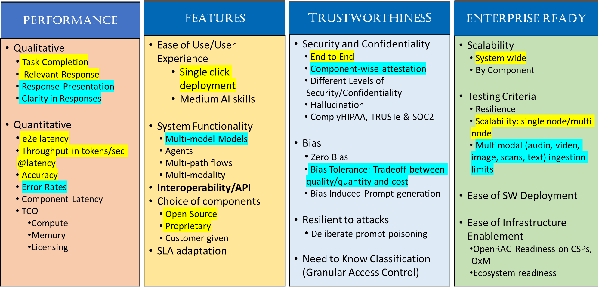

Рисунок 5-2 Можливості та етапи тестування

## 6. Референтні потоки

Референтні потоки - це наскрізні екземпляри кейсів використання в рамках OPEA. Вони являють собою конкретний вибір сумісних компонентів для створення ефективної реалізації рішення GenAI. Документація та посилання на еталонні потоки повинні містити вичерпну інформацію необхідну користувачам фреймворку для відтворення та виконання потоку, відтворюючи результати, про які повідомляється для потоку.  Документація еталонного потоку повинна містити посилання на необхідні компоненти (які можуть надходити від різних постачальників), а також на необхідні скрипти та інше програмне забезпечення, необхідне для їх запуску.

Кілька потоків будуть зосереджені виключно на відкритих моделях та інших компонентах, забезпечуючи повну прозорість коли це необхідно. Інші потоки можуть включати пропрієтарні компоненти, які можна викликати/активувати в рамках цих потоків. Однак компоненти, на які посилаються в довідковому потоці, повинні бути доступними для користувачів OPEA - незалежно від того, чи є вони відкритими або пропрієтарними, безкоштовними для використання або платними.

Референтні потоки мають кілька основних цілей:

* Продемонструвати репрезентативні приклади: В рамках OPEA, еталонні потоки демонструють потоки демонструють конкретне використання та завдання. Враховуючи притаманну системі гнучкість, можливі різні комбінації компонентів, що забезпечує максимальну гнучкість. Еталонні потоки демонструють, як конкретні шляхи та комбінації можуть бути ефективно реалізовані в рамках комбінації можуть бути ефективно реалізовані в рамках фреймворку.
* Підкреслити потенціал фреймворку: Пропонуючи оптимізовані потоки посилань які вирізняються високою продуктивністю, функціональністю, надійністю та корпоративною готовністю, користувачі можуть отримати уявлення про те, чого можна досягти. Досвід слугує цінним навчальним інструментом для досягнення цілей розгортання ШІ та планування.
* Сприяти легкому розгортанню: Еталонні потоки розроблені таким чином, щоб бути доступними і легко інстанціювати з відносно невеликими зусиллями. Це дозволяє реплікувати функціональний потік у своєму середовищі з мінімальними зусиллями, що дозволяє подальші модифікації за потреби.
* Заохочувати інновації та експерименти: Дозвольте користувачам в екосистемі експериментувати та впроваджувати інновації з широким набором потоків і максимізувати цінність для їх наскрізних сценаріїв використання.

OPEA розгорне і розвиватиме мову візуалізації для відображення потоків проекту (наприклад, базовий потік для чату RAG/питання-відповіді), а також для документування вибору, зробленого для кожного еталонного потоку. Візуалізація має легенду (див. Рисунок 6-1), яка ілюструє ключові рішення в еталонному потоці (наприклад, послідовність функцій або контейнеризація) (див. Рисунок 6-2), а також рішення щодо реалізації для конкретної моделі та модулів (див. Додаток А, розділ А6).

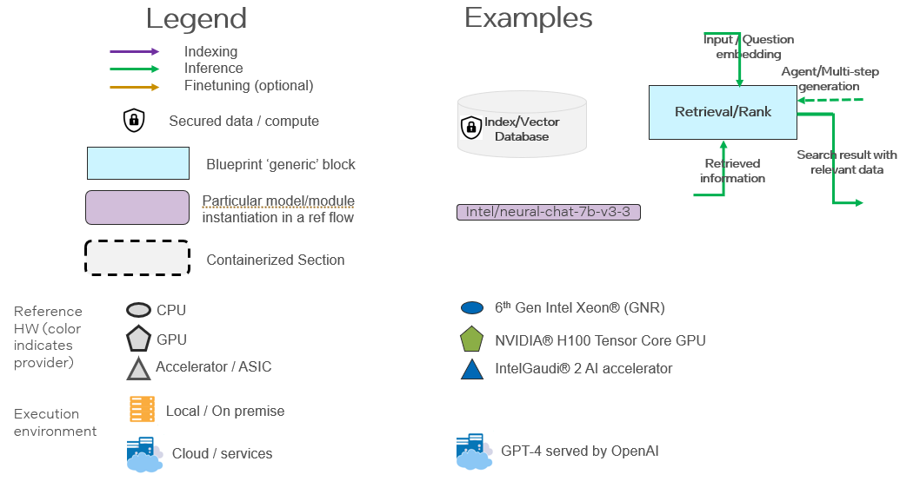

Рисунок 6-1 Умовні позначення для схеми та еталонних потоків

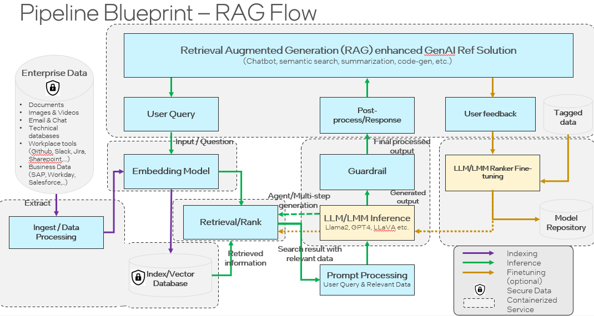

Рисунок 6-2 Приклад схеми потоку RAG

Розділ «Еталонні потоки» специфікації (Розділ A6 у Додатку A) містить початковий каталог еталонних потоків, що демонструє загальні завдання та різноманітні комбінації апаратних засобів і компонентів ШІ. Оскільки ця колекція еталонних потоків розширюється, з'являється різноманітний набір постачальників рішень
постачальників і варіацій апаратного забезпечення (Intel, NVIDIA та інші), а також моделей, модулів і конструкцій.

## Додаток А - Проект Специфікацій OPEA

**Rev 0.1     April 15, 2024**

Проект специфікацій призначений для ілюстрації та обговорення. Додаток складається з шести розділів:

* A1: Компоненти системи - список компонентів, що входять до складу системи,
  разом з їх ключовими характеристиками.
* A2: Архітектура SW - Діаграма, що показує рівень компонентів у стеку SW
* A3: Потоки системи - Діаграма(и), що ілюструє(ють) потік наскрізної операції
  через відповідні компоненти.
* A4: Вибір специфікацій на рівні системи та компонентів
* A5: Градація - Класифікація систем, що оцінюються, на основі продуктивності, функцій, надійності та готовності до роботи на рівні підприємства.
* A6: Референтні потоки - Список референтних потоків, які демонструють ключові випадки використання і дозволяють завантажувати та реплікувати їх для швидшого створення власної інстанції потоку.

Це попередній проект рамкової специфікації ОЕА. Він дає початкове уявлення про зміст і, як очікується, буде суттєво розширений у майбутніх редакціях.

Зауваження - Термін «специфікація» використовується в цьому проекті технічної записки та додатку як широкий робочий термін, що загалом відноситься до детального опису систем та їх компонентів. Однак, важливо зазначити, що цей термін може бути замінений або оновлений на основі більш точного опису та застосування ліцензійних міркувань Linux Foundation.

### A1: Компоненти системи

| Компоненти | Опис | OSS Приклади | Пропрієтарні приклади |
| ---------- | ----------- | ------------ | -------------------- |
| Agent framework | Оркестрове програмне забезпечення для побудови та розгортання робочих процесів, що поєднує компоненти пошуку інформації з LLM для створення агентів ШІ з контекстною інформацією | Langchain, LlamaIndex, Haystack, Semantic Kernel
| Ingest/Data Processing | Програмні компоненти, які можна використовувати для покращення даних, що індексуються для пошуку. Наприклад: обробка, очищення, нормалізація, вилучення інформації, розбиття на частини, токенізація, покращення метаданих.  | NLTK, spaCY, HF Tokenizers, tiktoken, SparkNLP
| Embedding models/service | Моделі або сервіси, які перетворюють фрагменти тексту на вектори вбудовування для зберігання у векторній базі даних | HF Transformers, S-BERT | HF TEI, OpenAI, Cohere, GCP, Azure embedding APIs, JinaAI
| Indexing/Vector store | Програмне забезпечення для індексування інформації (розрідженої/векторної) та пошуку за запитом | Elasticsearch, Qdrant, Milvus, ChromaDB, Weaviate, FAISS, Vespa, HNSWLib, SVS, PLAID | Pinecone, Redis
| Retrieval/Ranking | Компонент SW, який може переоцінювати порядок релевантності існуючих контекстів | S-BERT, HF Transformers, Bi/Cross-encoders, ColBERT | Cohere
| Prompt engine | Компонент, який створює підказки для конкретних завдань відповідно до запитів і контексту, відстежує сеанси користувачів (зберігає історію/пам'ять) | Langchain hub
| Memory | Історія розмов у пам'яті та/або постійній базі даних | Langchain Memory module, vLLM (automatic prefix caching)
| LLM engine/service | Механізм логічного висновку LLM, який генерує текстові відповіді на основі заданих підказок і знайдених контекстів | vLLM, Ray, TensorRT-LLM | HF TGI, Deci Infery
| LLM Models | Моделі з відкритим і закритим кодом. | LLama2-7B,13B, Falcon 40B, Mixtral-7b, Gemma etc. | LLama2-70B, OpenAI, Cohere, Gemini, etc.
| Guardrails | Програмний компонент для забезпечення відповідності, фільтрації, безпечного реагування | LLM Guard | Purple llama, OpenAI safety control, NEMO-Guardrails
| Evaluation | Методи оцінки відповідності, продуктивності, точності, частоти помилок відповіді LLM | Recall, MAP, MTEB, MTBench, MMLU, TriviaQA, TruthfulQA…

Таблиця A1.1 Перелік ключових компонентів.

### A2: Архітектура SW

Підтримує вибір моделі та інтеграцію даних у популярних фреймворках, орієнтованих на користувача. Використовує популярні агентські фреймворки (також відомі як оркестрові фреймворки або платформи для побудови штучного інтелекту) для підвищення продуктивності розробників і доступності оптимізації платформи.

Тюнінг рішень використовує оптимізацію платформи за допомогою популярних доменних фреймворків, таких як екосистема Hugging Face, щоб зменшити складність для розробників і забезпечити гнучкість на різних платформах.

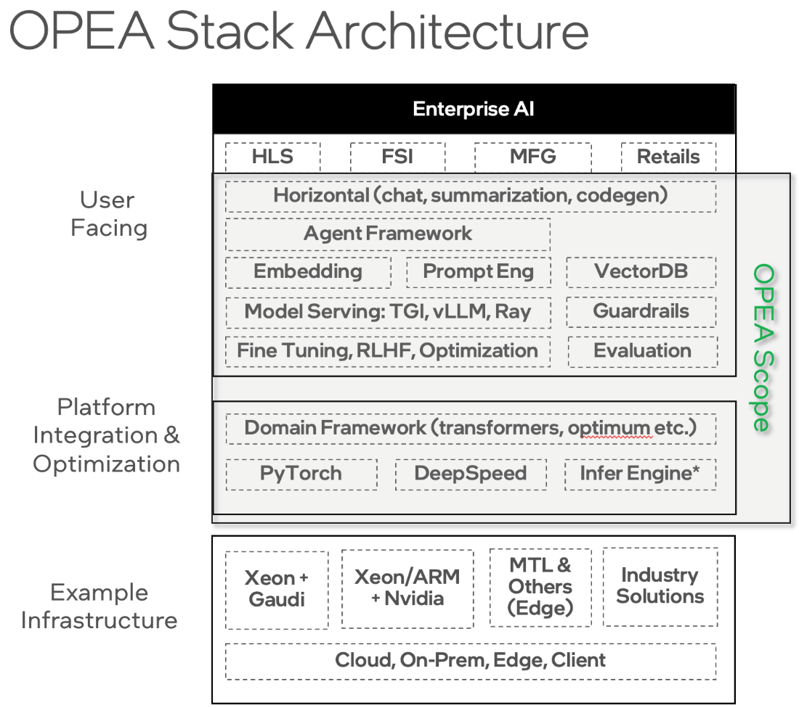

Рисунок A2.1 - Стек рішень для OPEA.

### A3: Системні потоки

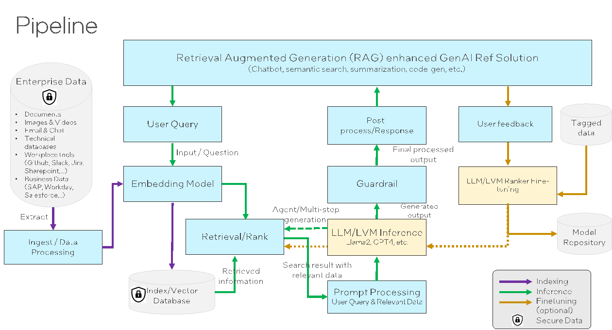

Рисунок A3.1 - Основні потоки RAG в системі OPEA.

### A4: Вибір специфікацій

Оцінювання складеної генеративної системи штучного інтелекту вимагає як комплексного бачення можливостей, так і оцінки окремих компонентів.

#### A4.1 Наскрізне оцінювання

Нижче наведено кілька прикладів оцінок, що стосуються чотирьох сфер - продуктивності, функцій, надійності та готовності підприємства.

##### Продуктивність
* Загальна продуктивність системи
  * Затримка (затримка першого токена, середня затримка токена, потоковий і не потоковий вивід)
  * Пропускна здатність
  * За умови фіксованої комбінації різних компонентів RAG (конкретний екземпляр постачальника для кожного компонента), загальна продуктивність системи.
  * Для конкретного завдання/домену перерахуйте комбінацію, яка забезпечить найкращу продуктивність системи.
* Оцінка Q&A (точність)
  * Завдання: Відкрите Q&A
  * Бази даних: NQ, TriviaQA і HotpotQA
  * Метрика: Середня точність
  * Індексація: KILT Wikipedia

##### Функції / Функціональність

* Функціональність
  * Функції - мультимодальні, Multi-LLM, кілька варіантів моделей вбудовування, кілька вбудованих БД, довжина контексту
  * Контекстна релевантність (точність/відповідність контексту)
  * Заземленість/вірність
  * Релевантність відповіді
* Багатокрокова аргументація
  * Завдання: 3-кратні багатозахідні агенти REACT
  * Бази даних: Вікіпедія (HotPotQA), Інтернет (Bamboogle)
  * Метрика: Точність
  * Тестові набори: Reflexion, Ofir Press
* Багатомовність
  * Завдання: Семантичний пошук
  * Якість пошуку
  * Метрика: nDCG @10
  * 18 мов
  * Бенчмарк: MIRCAL
* Багатомовність
  * Завдання: Багатомовний MMLU, машинний переклад
  * Метрика: Точність, BLEU
  * Французька, іспанська, італійська, німецька, португальська, японська, корейська, арабська і китайська
  * Бенчмарк: FLORES, MMLU
* Діалоговий агент і виклик функцій
  * Завдання: діалогове використання інструментів і можливість виклику функцій одним поворотом
  * Бенчмарк-1: Microsoft’s ToolTalk
  * Бенчмарк-2: Berkeley's Function Calling Leaderboard (BFCL)
  * Метрика використання інструментів: коефіцієнт успіху софта
  * Виклики функцій: Швидкість проходження функції
* Довідка про випадки використання RAG на підприємстві
  * Домени: Підтримка клієнтів, Підтримка на робочому місці (Тех), Асистент на робочому місці (Медіа), FAQ по техніці
  * Метрика: Коефіцієнт виграшу проти Mixtral

##### Готовність підприємства

Оцінка готовності підприємства включає в себе оцінку наступних аспектів:

1. Масштабованість
2. Можливість розгортання на виробництві
3. Оновлюваність
4. Спостережуваність/налагоджуваність

Масштабованість пов'язана зі здатністю системи RAG масштабувати розмір/розміри різних компонентів, таких як наведені нижче приклади метрик:
* Розмір векторної DB
* Розмірність ретрівера (значення K у top-K документах)
* Максимальна довжина контексту, яку підтримує генератор
* Розмір параметрів генератора моделей
* Розмір для вбудовування

Готовність до виробничого розгортання  включає в себе різні можливості, такі як
* Ефективна подача висновків
* Інтеграція з різними корпоративними системами, такими як Slack/workday/SAP/Databases
* Можливості RAS на рівні підприємства
* Угоди про рівень обслуговування (SLA) щодо фактичності, можливості перевірки та забезпечення виконання

Оновлюваність включає в себе можливість
* Постійне оновлення
* Оновлення онлайн
* Оновлення на рівні компонентів

Спостережуваність/налагоджуваність включає в себе можливість для
* Виявлення помилок і віднесення їх до компонента
* Раннє виявлення деградації компонентів
* Відстеження генерації для налагодження збоїв (функціональних і продуктивності)
* Простежуваність кожного проміжного кроку (підказки для ланцюгових LLM)

Прикладами спостережуваності є таблиці виводу Databricks Inference Tables/Phoenix Open Inference Traces або функції спостережуваності/моніторингу Langsmith.

#### A4.2 Оцінка окремих компонентів

Оцінка окремих компонентів (модулів) буде включати в себе:
* Трубопровід попередньої обробки даних
* Вбудовування - якість/зберігання/час обробки
* Чанкер, ретривер і ре-ранкер
* Генератор LLM - якість/затримка/довжина контексту/здатність до міркувань/виклик функцій/використання інструментів
* Автоматична оцінка проти ручної оцінки
* Спостережуваність
* Охоронні бар'єри
* Спонукання
* Генерація виводу - структурований/граматика/типи виводу(json/текст)

Ранній приклад наступного рівня формулювання метрик, очікуваних за кожним основним компонентом.

Назва компонента: Ретривер
* Метрика:  Normalized Discounted Cumulative Gain@10 з BEIR benchmark datasets або иншими QA наборами даних
* Метрика: Context Recall@k
* Метрика: Context Precision@k
* Метрика: Hit Rate

Назва компонента: LLM/Генерація
* Метрика: Вірність - Наскільки фактично правильною є згенерована відповідь (обчислюється як метрика ragas від 0 до 1)
* Метрика: Релевантність відповіді - наскільки згенерована відповідь відповідає запиту (обчислюється як метрика ragas від 0 до 1)

### A5: Градація

Для забезпечення того, щоб композиційні системи вирішували широкий спектр проблем, пов'язаних з розгортанням підприємства, система класифікації має чотири категорії:

* Продуктивність - Орієнтована на загальну продуктивність системи та ефективність/витрати на одиницю продукції
* Функції - обов'язкові та додаткові можливості компонентів системи
* Надійність - здатність гарантувати якість, безпеку і надійність.
* Готовність підприємства - можливість використання у виробництві в умовах підприємства.

Для кожної категорії буде встановлено 3 рівні оцінювання
* L1 - Початковий рівень - обмежені можливості. Рішення прийнятне для PoC, але не для виробництва.
* L2 - Ринковий - Відповідає потребам ринку. Може бути впроваджений у виробництво.
* L3 – Просунутий - Перевищує потреби ринку.

Частково рекомендація стосується процесу сертифікації (якщо і коли він стане частиною системи). Передбачається, що система повинна бути щонайменше на рівні 2 для кожного аспекту, щоб бути «сертифікованою за стандартом OPEA».

#### A5.1 Оцінювання продуктивності

Оцінка продуктивності ґрунтується на виконанні наскрізних вертикальних сценаріїв використання для всієї системи і фіксації відповідних метрик під час виконання.

* E2E / Системний вигляд
  * Постачальники мають гнучкість для інновацій/диференціації своїх реалізацій в рамках "чорної скриньки"
* Запуск фіксованого набору кейсів використання
  * Покриття різних вертикальних сценаріїв
  * Мінімальний рівень точності та надійності
* Вхідні набори даних для бенчмарку
  * Відкриті/загальнодоступні
  * Автоматичне генерування
* Масштабні фактори
  * Підтримує різні розміри вхідної величини
* Метрики
  * Затримка першого звернення, загальна затримка, пропускна здатність, вартість, узгодженість
  * Формула для агрегування метрик для остаточного результату
  * Вертикально-специфічні метрики

##### Рівень продуктивності
Оцінка ефективності базується на наборі наскрізних тестів RAG «чорної скриньки», що базуються на реальних прикладах використання кейсів. Кожне рішення, подане до альянсу OpenRag, буде оцінюватися за цим критерієм. Продуктивність включатиме затримку, пропускну здатність, масштабованість, точність і узгодженість.

* Рівень 1 - Базовий бенчмарк завершено
* Рівень 2 - Відповідає рівням продуктивності, які очікуються для більшості рішень GenAI, що виконують подібні бенчмарки/завдання.
* Level 3 – Перевершує продуктивність більшості рішень, що оцінюються на той час. Першокласні  рішення для оцінюваних завдань.

#### A5.2 Градація функцій

Оцінка функцій складається з запуску функціональних тестів для перевірки можливостей системи в ряді різних доменів. Кожна область буде мати свій власний бал.

* Функціональна сумісність/API
  * Функціональні тести для кожного інтерфейсу
  * Різні рівні деталізації для компонентів
  * Відкриті інтерфейси для сторонніх джерел даних
  * Повинні підтримувати різні типи джерел даних
* Можливості платформи і методи ШІ
  * Поглинання, висновки, тонке налаштування
  * Gen AI і навчання з підкріпленням
* Досвід користувача
  * Простота використання
  * Інструменти управління - єдина панель, між постачальниками
  * Вимоги до графічного інтерфейсу
  * Інструменти для розробників
* Моделі впровадження
  * Оркестрування
  * K8, hypervisor
* Відповідність
  * Потенційна сертифікація (якщо і коли вона стане частиною фреймворку) на основі функціонального тестування

##### Градація Функцій

Функції оцінюються на предмет сумісності, можливостей платформи, користувацького досвіду (простота використання), методів штучного інтелекту, що застосовуються, і спеціалізованої функціональності.

* Рівень 1 - Одинична модель і доступ до кількох джерел даних; обмежений доступ до даних;
  Базові інструменти розробки або їх відсутність; базовий інтерфейс; «голий метал», ручне встановлення.
* Рівень 2 - Кілька моделей і доступ до різних джерел даних підприємства; повне
  повне введення даних; базове тонке налаштування; гнучка конвеєризація модулів у потоці;  базове управління агентами.
* Рівень 3 - Природна підтримка мультимодальних моделей і джерел даних; розширені
  інструменти розробки з можливостями тонкого налаштування й оптимізації SotA;
  провідні спеціалізовані функції

#### A5.3 Оцінювання надійності

Надійність і відповідальність ШІ розвиваються в оперативному сенсі. Дивіться надійний і відповідальний ШІ від NIST та Закон ЄС про ШІ. Поки ці зусилля розвиваються, ми пропонуємо класифікувати надійність рішень за осями безпеки, надійності, прозорості та впевненості:

* Прозорість
  * Відкриті вихідні моделі та код. Це забезпечує видимість фактично працюючого коду, можливість перевірки версій і підписаних двійкових файлів.
  * Відкриті стандарти, повторне використання існуючих стандартів.
  * Набори даних, які використовуються для навчання моделі, що дозволяє проаналізувати розподіл даних і будь-які упередження в них. Наприклад, якщо модель виявлення раку навчалася на популяціях, які є дуже різноманітними - етнічно (геном) або за умовами навколишнього середовища (вплив канцерогенів), вона несе в собі ризик застосовності при використанні для осіб, які не є репрезентативними для навчальної множини.
  * Посилання на джерела/документи, використані при формуванні відповідей, захист від галюцинацій. Одна з головних переваг RAG.
  * Відповідність нормативним вимогам, таким як ISO27001, HIPAA і FedRAMP.
* Безпека:
  * Контроль доступу на основі ролей, сегментований доступ за ролями користувачів незалежно від використання однієї моделі. Це може бути етап попередньої або наступної обробки, який відфільтровує дані на основі доступу користувачів до різної інформації. Наприклад, виконавче керівництво може мати доступ до доходів компанії, фінансової звітності та списків клієнтів на відміну від інженера.
  * Рішення, які працюють з мінімально необхідними привілеями процесу, щоб запобігти використанню експлойтів та підвищенню привілеїв, якщо додаток буде зламано.
  * Запуск у довірених середовищах виконання, тобто апаратно-підтримуваних конфіденційних обчислювальних середовищах, які захищають використовувані дані, забезпечуючи конфіденційність і цілісність від привілейованих та інших процесів, що виконуються в тій самій інфраструктурі. Цінно особливо в хмарі.
  * Атестація двійкових файлів, що використовуються, будь то моделі або програмне забезпечення.
  * Перевірка логів, які вказують, коли і які оновлення були застосовані до моделей або іншого програмного забезпечення, включаючи патчі безпеки.
  * Забезпечення того, що результати, проміжні та кінцеві, зберігаються лише на зашифрованих носіях і передаються кінцевим користувачам через безпечний транспорт.
* Надійність
  * Надає однакову відповідь за інших однакових умов, коли підказки схожі, але відрізняються використанням синонімів.
  * Повертає правильні відповіді для кожного тесту.
  * Впевненість
  * У сценаріях надання відповідей на запитання усвідомлення якості та актуальності даних, використаних у RAG, а також надання цієї інформації разом із відповіддю допомагає кінцевому користувачеві визначити, наскільки він може бути впевненим у відповіді.
  * Посилання на джерела відповідей. Метадані можуть також використовуватися, щоб показати, наскільки актуальною є вхідна інформація.
  * Що стосується завдань діагностики/класифікації, таких як виявлення раку, відхилення тестового об'єкта від навчального набору даних є показником ризику застосовності, впевненості у відповіді (про що згадувалося вище в розділі «Прозорість даних»).

##### Градація надійності

Оцінка аспектів прозорості, захисту приватності та безпеки
* Рівень 1 - Документування аспектів, що вимагаються у сфері довіри
* Рівень 2 - Підтримує контроль доступу на основі ролей - інформація, до якої здійснюється доступ/вилучення, є  доступна на основі дозволу користувача (навіть якщо всі користувачі мають доступ до тієї самої моделі);
* Рівень 3 - підтримує функції безпеки (наприклад, запуск конфіденційних обчислень / довіреного середовища виконання). Підтримує атестацію моделей, що запускаються; прозорість вихідного коду для набору даних для попереднього навчання, вагових коефіцієнтів, даних/рецептів точного налаштування.

#### A5.4 Градація готовності до роботи на підприємствах

Оцінка готовності підприємства складається з оцінки здатності загального рішення до розгортання у виробничому середовищі підприємства. До уваги беруться наступні критерії:

* Можливість локального і хмарного розгортання
  * Щонайменше два типи екземплярів рішення (локальна інсталяція, хмарна, гібридний варіант)
  * Готовність до хмарних / периферійних технологій (зверніться до процесу/рекомендацій CNCF)
* Готовність до безпеки для підприємств
  * Багаторівневий контроль доступу і реагування (включаючи можливість інтеграції з внутрішніми інструментами)
  * Захист даних і моделей (наприклад, включаючи GDPR)
  * Управління життєвим циклом, включаючи оновлення безпеки, виправлення помилок тощо
  * Рішення, упаковані у вигляді контейнерних додатків, які не запускаються від імені користувача root або мають більше можливостей, ніж потрібно. Найкращі практики використання контейнерів OWASP.
  * Переконайтеся, що побічні продукти/проміжні результати, якщо вони зберігаються на диску, зберігаються після шифрування.
* Впевненість в якості
  * Метрики точності та невизначеності для специфічних завдань підприємства
  * Документація
* Високий рівень доступності
  * Реплікація і захист даних/екземплярів
  * Стійкість - час перезапуску екземпляра, якщо він згорів до нуля.
  * Надає підтримку та інструменти для підтримки підприємств у режимі 24/7
* Модель ліцензування та розповсюдження SW
  * Масштабування від малих до великих клієнтів
  * Можливість налаштування під конкретні потреби підприємства

##### Ступінь готовності підприємства

Має відповідати мінімальним вимогам щодо продуктивності, функцій та надійності
* Рівень 1 - Еталонний проєкт та посібник з розгортання
* Рівень 2 - Вихідні дані готові до розгортання на підприємстві (не потребують етапів після OPEA); контейнерний, підтримка K8; загалом надійний (але не гарантований) для виробництва розгортання в масштабі
* LРівень 3 - Створення складного моніторингу та інструментарію для підприємства середовища розгортання. Висока відмовостійкість - швидкий час перезапуску екземпляр. Забезпечує режим підтримки L2 + 24/7 "з коробки".

### A6: Референтні потоки

Цей розділ містить опис референтних потоків, які будуть доступні для завантаження та відтворення

Потоки посилань слугують чотирьом основним цілям:

* Продемонструвати репрезентативні приклади: В рамках OPEA, референтні потоки демонструють конкретне використання і завдання. Враховуючи притаманну системі гнучкість, можливі різні комбінації компонентів, що забезпечує максимальну гнучкість. Референтні потоки демонструють, як конкретні шляхи і комбінації можуть бути ефективно реалізовані в рамках  фреймворку.
* Підкресліть потенціал фреймворку: Пропонуючи оптимізовані потоки посилань які вирізняються високою продуктивністю, функціональністю, надійністю і готовностю підприємства, користувачі можуть отримати уявлення про те, чого можна досягти. Досвід слугує цінним навчальним інструментом для досягнення цілей розгортання ШІ та планування.
* Сприяють легкому розгортанню: Референтні потоки розроблені таким чином, щоб бути доступними і легко інстанціювати з відносно меншими зусиллями. Це дозволяє реплікувати функціональний потік  у своєму середовищі з мінімальними зусиллями, що дозволяє подальші модифікації за потреби.
* Заохочуйте інновації та експерименти: Дозвольте користувачам в екосистемі експериментувати та впроваджувати інновації з широким набором потоків і максимізувати цінність для їх наскрізних сценаріїв використання.

Поточні приклади референтних потоків наведено для ілюстрації. Очікується, що набір референтних потоків буде розширюватися і охоплюватиме різні комбінації компонентів HW і SW/AI від різних постачальників.

Описи референтних потоків повинні забезпечувати високу чіткість щодо того, що і як можна відтворити, а також відтворити результати в середовищі користувача OPEA. Всі референтні потоки повинні мати візуалізацію, яка пояснює, які компоненти конкретизуються і як вони пов'язані в потоці. Для всіх зображень референтних потоків буде використовуватися графічна легенда, описана на Рисунку 6.1.

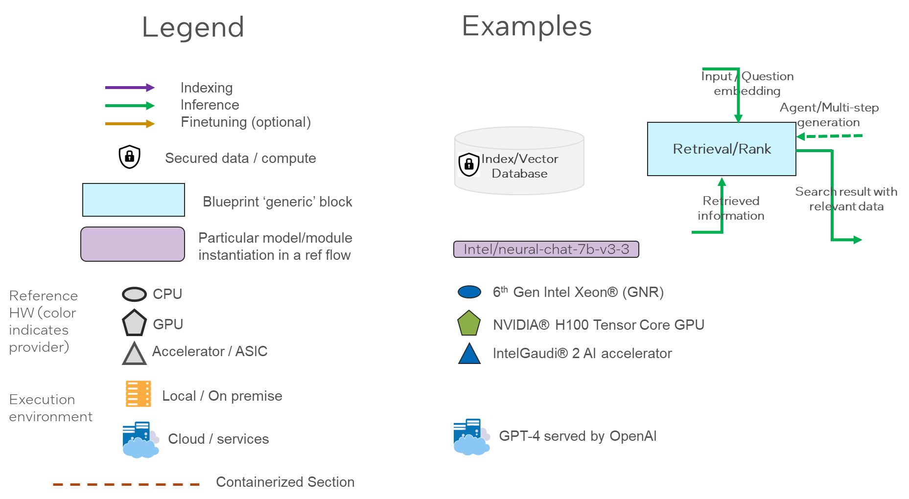

Рисунок A6.1 - Візуалізація потоків еталонного проекту - легенда

#### A6.1 – Xeon + Gaudi2 LLM RAG потік для чату QnA

Референсний потік, який ілюструє потік RAG LLM підприємства, що працює на Xeon (GNR) з векторною базою даних і моделлю вбудовування, а також з бекендом Gaudi2, що обслуговує виведення моделі LLM.

Референсний потік демонструє додаток RAG, який надає асистенту ШІ такі можливості
можливість отримання інформації із зовнішнього джерела для покращення контексту, який надається LLM. Асистент ШІ має доступ до зовнішньої бази знань, що складається з текстових і PDF-документів і веб-сторінок, доступних через пряме завантаження за URL-адресою.
Потік дозволяє користувачам взаємодіяти з LLM і запитувати інформацію, яка невідома LLM, або, наприклад, складається з власних джерел даних.

Референсний потік складається з наступного детального процесу: сховище даних, яке використовується модулем
модуль пошуку для отримання релевантної інформації за запитом користувача. Запит і зовнішні дані зберігаються в кодованому векторному форматі, що дозволяє покращити семантичний пошук. Модуль retriever
кодує запит і надає процесору підказок знайдений контекст і запит для створення розширеної підказки для LLM. LLM отримує розширену підказку і генерує обґрунтовану
і дає користувачеві обґрунтовану та коректну відповідь.

Потік складається з наступних компонентів:
* Потік надходження даних, який використовує платформу, що обслуговує модель вбудовування (TEI) та модель вбудовування (BGE-base) для кодування тексту та запитів у семантичні представлення (вектори), які зберігаються в індексі (векторна база даних Redis), обидві працюють на Intel Gen6 Xeon GNR для зберігання s пошуку даних.
* Потік обслуговування висновків LLM, що використовує TGI-Gaudi для моделі LLM, що обслуговується на Gaudi2, який икористовується для генерації відповідей шляхом введення підказок, які комбінують отримані релевантні документи з векторної бази даних Redis та запит користувача.
* Фреймворк оркестрування на основі LangChain, який ініціалізує трубопровід з вищезгаданими компонентами та організовує обробку даних від користувача (запит), кодування тексту, пошук, генерація підказок і виведення LLM.

Повна еталонна реалізація цього потоку доступна у прикладі ChatQnA у репозиторії прикладів Intel's GenAI.

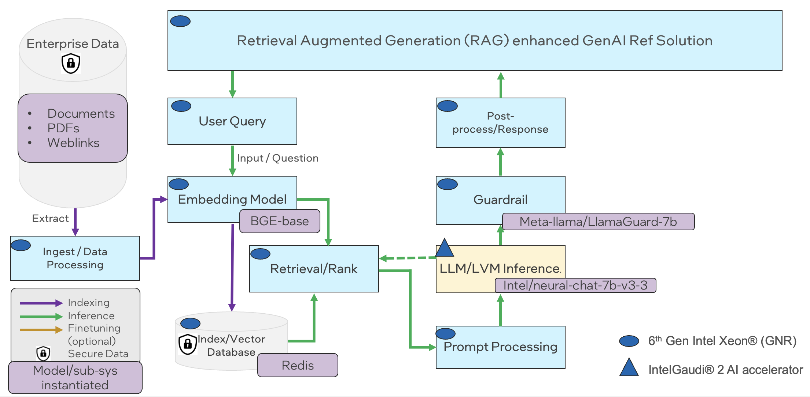

Рисунок A6-1.2 Потік Xeon + Gaudi2 LLM RAG для чату QnA

Демонстраційний користувацький інтерфейс виглядає так, як показано нижче, що також показує різницю з RAG і без нього.

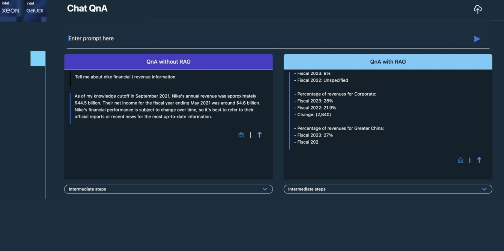

Рисунок A6-1.3 Потік Xeon + Gaudi2 LLM RAG для чату QnA - демонстраційний екран

#### A6.2 - Мультимодальний чат через зображення і відео

Цей потік посилань демонструє мультимодальний конвеєр RAG, який використовує модель мови зору BridgeTower від Intel Labs для індексування і LLaVA для виведення, обидві працюють на прискорювачах Intel Gaudi AI.
Цей довідковий потік дозволяє чат-асистенту зі штучним інтелектом отримувати і розуміти мультимодальні контекстні документи, такі як зображення і відео. Наприклад, користувач може поставити ШІ-помічнику запитання, які вимагають міркувань над зображеннями та відео, що зберігаються на його комп'ютері. Це рішення
надає такі можливості, отримуючи зображення та відеокадри, що відповідають запиту користувача, і надаючи їх як додатковий контекст для великої моделі мови зору (LVLM), яка потім відповідає на запитання користувача.

Зокрема, це еталонне рішення приймає зображення та відеофайли як вхідні дані. Вхідні дані кодуються в спільному мультимодальному просторі вбудовування BridgeTower, який є трансформатором мови технічного зору з відкритим вихідним кодом.
Детальні інструкції та документація для цієї моделі доступні на сайті Hugging Face. Потім мультимодальні вбудовування індексуються та зберігаються у векторній базі даних Redis.

Під час виведення BridgeTower вбудовує запит користувача і використовує його для отримання найбільш релевантних зображень і відео з векторної бази даних. 
Отримані контексти потім додаються до запиту користувача і передаються LLaVA для генерації відповіді. Детальні інструкції та документація для
LLaVA доступні на сайті Hugging Face.

Для цього референтного потоку потрібні прискорювачі Intel Gaudi AI для моделі вбудовування та для генерації відповідей за допомогою LVLM. Всі інші компоненти референсного потоку можуть виконуватися на центральному процесорі. Повна наскрізна реалізація цього еталонного потоку з відкритим вихідним кодом доступна через Multimodal Cognitive AI.

Малюнок A6-2.1 Мультимодальний чат за допомогою зображень і відео референсного потоку.

Нижче наведено ілюстрацію користувацького інтерфейсу, створеного для цього довідкового потоку, який було продемонстровано на виставці Intel Vision:

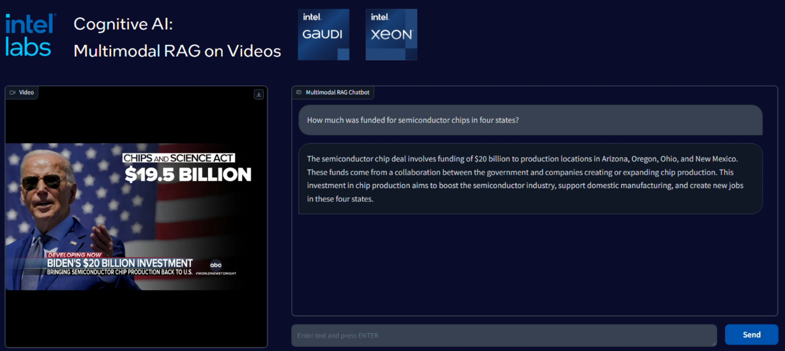

Малюнок A6.2.2 Мультимодальний чат через зображення та відео - демонстраційний екран

#### A6.3 – Оптимізований текстовий та мультимодальний трубопровід RAG

Наведений нижче референсний потік демонструє оптимізований конвеєр текстових і мультимодальних RAG, який може бути використаний корпоративними клієнтами на процесорах Intel Xeon.

Цей потік демонструє потік виведення RAG на неструктурованих даних і зображень на процесорах Intel 4-го та 5-го поколінь Xeon з використанням Haystack. Він базується на fastRAG для оптимізації пошуку.

Першим кроком є створення індексу для векторної бази даних (у цьому випадку Qdrant). Для неструктурованих текстових даних використовуються речення-трансформери. Для зображень використовується BridgeTower для кодування вхідних даних.

Після налаштування векторної бази даних наступним кроком буде розгортання чату виведення. Моделі LLM та LMM, що використовуються для виведення - це моделі Llama-2-7b-chat-hf, Llama-2-13b-chat-hf та LLaVa відповідно.

На діаграмі нижче показано наскрізний потік для цього оптимізованого текстового і мультимодального чату з RAG.

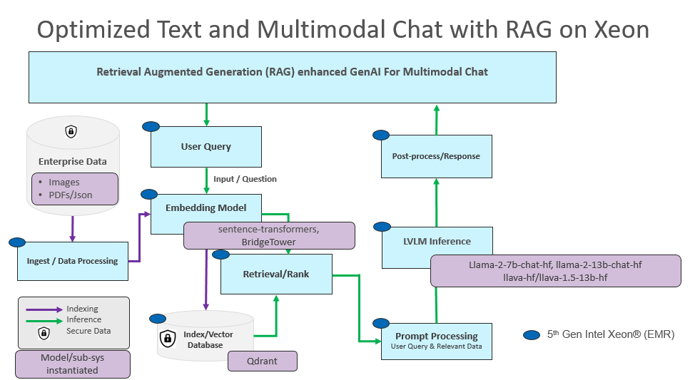

Рисунок A6-3.1 Референсний потік оптимізованого текстового та мультимодального трубопроводу RAG

Нижче наведено візуальний знімок чату, реалізованого за допомогою цього потоку. Він показує, як чат-бот з підтримкою RAG на рисунку A6-3.2 покращує відповідь на запит про Суперкубок порівняно з реалізацією без RAG на рисунку A6-3.3.

Малюнок A6-3.2: Чат-бот без RAG: Запит про Суперкубок

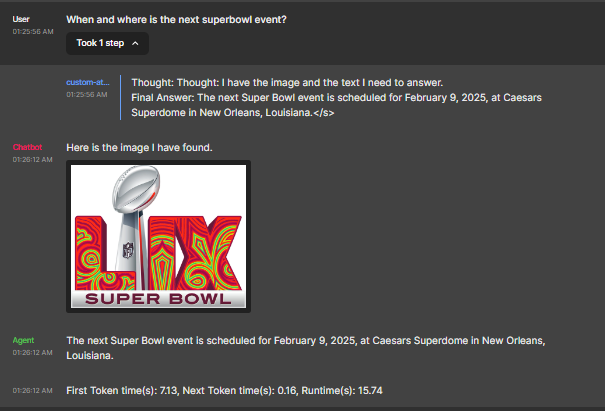

Малюнок A6-3.3: Чат-бот з підтримкою RAG - запит про Суперкубок

