# Open Platform for Enterprise AI (OPEA) Framework Draft Proposal

Rev 0.5     April 15, 2024

Initial draft by Intel. Contacts for content – Ke Ding (ke.ding@intel.com ), Gadi Singer
(gadi.singer@intel.com)

Feedback welcome at info@opea.dev

## 1. Summary

OPEA (Open Platform for Enterprise AI) is a framework that enables the creation and evaluation of
open, multi-provider, robust and composable GenAI solutions that harness the best innovation across
the ecosystem.

OPEA is an ecosystem-wide program within the Linux Foundation Data & AI framework that aims to
accelerate enterprise adoption of GenAI end-to-end solutions and realize business value. OPEA will
simplify the implementation of enterprise-grade composite GenAI solutions, including Retrieval
Augmented Generative AI (RAG). The platform is designed to facilitate efficient integration of secure,
performant, and cost-effective GenAI workflows into business systems and manage its deployments.

This platform’s definition will include an architectural blueprint, a comprehensive set of components for
GenAI systems, and a suite of specifications\* for both individual components and entire systems. It will
also include tools for building, tuning, and evaluating end-to-end GenAI workflows. These definitions will
address key aspects such as performance, feature set, trustworthiness (security and transparency), and
readiness for enterprise-grade applications. The specifications will also include a set of reference flows
and demos that can be easily reproduced and adopted.

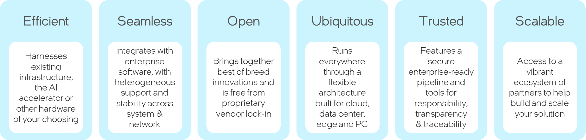

Figure 1-1: OPEA’s Core Values

\*Disclaimer – The term ‘specification’ is used throughout this draft whitepaper and appendix as a broad
working term, referring generally to a detailed description of systems and their components. However, it
is important to note that this term might be replaced or updated based on more precise characterization
and applying the Linux Foundation licensing considerations.

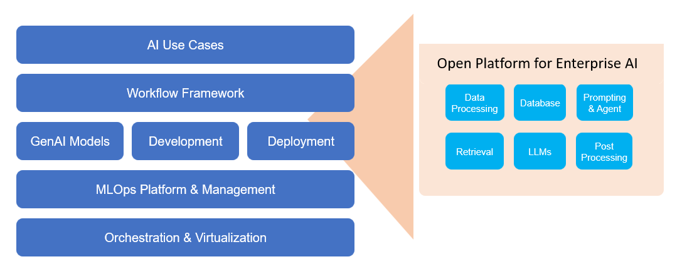

Figure 1-2 OPEA – proposed Construction and Evaluation Framework for AI Solutions

We are now in an era where AI algorithms and models, that were initially developed in research
environments and later introduced into consumer-focused settings, are now transitioning to widespread
enterprise deployment. This transition provides an opportunity for partners to leverage decades of
insights into enterprise-scale computing, security, trustworthiness, and datacenter integration, among
other areas, to accelerate AI adoption and unlock its potential value.

## 2. Introduction

Recently, the practices for developing AI solutions have undergone significant transformation. Instead of
considering AI model (e.g., a GenAI LLM) as the complete solution, these models are now being
integrated into more comprehensive end-to-end AI solutions. These solutions consist of multiple
components, including retrieval subsystems with embedding agents, a Vector Database for efficient
storage and retrieval, and prompt engines, among others. This shift has led to the emergence of
Composition Frameworks (such as LangChain or Haystack), which are used to assemble these
components into end-to-end GenAI flows, like RAG solutions, for the development and deployment of AI
solutions.

The ecosystem offers a range of composition frameworks, some are open-source (e.g., LangChain and
LlamaIndex), while others are closed-sourced and come bundled with professional services (e.g.,
ScaleAI). Additionally, some are offered by cloud service providers (e.g. AWS) or hardware/software
providers (e.g., NVIDIA). However, as of Q2 2024 these represent individual perspectives and offerings
for the intricate task of building an end-to-end AI solution.

### 2.1 Key capabilities

OPEA will offer key capabilities in both the Construction and Evaluation of end-to-end composite GenAI
solutions, that are built with retrieval augmentation. As a construction platform, OPEA will enable
creation of RAG-enabled AI solutions directly or through the use of compositional tools such as
LangChain and Haystack. As an evaluation framework, OPEA will provide the means to assess and grade
end-to-end composite GenAI solutions on aspects derived from four domains – performance, features,
trustworthiness and Enterprise-readiness.

#### 2.1.1 Construction of GenAI solutions, including retrieval augmentation

Composing an end-to-end AI solution (including retrieval augmentation) can be done by combining
models and modules from multiple providers.

OPEA will offer or refer to a set of building blocks – models and modules – that can be called in a flow to
achieve an AI task or service. The models and modules can be part of OPEA repository, or published in
stable open repository (e.g., Hugging Face), or proprietary / closed source and cleared for use by an
OPEA assessment.

* GenAI models – Large Language Models (LLMs), Large Vision Models (LVMs), multimodal models, etc.
* Other modules - AI system components (other than LLM/LVM models) including
  Ingest/Data Processing module, Embedding Models/Services, Vector Databases
  (aka Indexing or Graph data stores), Prompt Engines, Memory systems, etc.

Each module for the system will be characterized with its expected functionality and attributes. Those
will be evaluated for every particular implementation choice (see following evaluation section). There
will be multiple options offered from various providers for each module and model, to allow for choice
and diversity.

This platform consists of a set of compositional capabilities that allow for building custom agents,
customizing AI assistants, and creating a full end-to-end GenAI flow that includes retrieval augmentation
as well as other functionality when needed. The platform will also include or reference tools for fine-
tuning as well as optimization (like quantization assists) to support creation of performant, robust
solutions that can run locally on target enterprise compute environments. Similar to building blocks, the
composition capabilities could be part of OPEA repository, or published in stable open repository (e.g.,
Hugging Face) or offered by the ecosystem (like LangChain, LlamaIndex and Haystack).

An important part of the compositional offering will be a set of validated reference flows that are ready
for downloading and recreation in the users’ environment. In the multitude of provided ready reference
flows, there will be domain-independent flows (like a RAG flow for language-based Q&A, or a
multimodal flow to interact with one’s images and videos) that were tuned for different HW providers
and settings. There will also be domain-specific flows like financial service end-to-end flow or nutrition
adviser, which are sometimes called microservices.

There is a common visualizing language that is used to depict the component of each reference flow
being provided.

#### 2.1.2 Evaluation of GenAI solutions, including retrieval augmentation:

OPEA will provide means and services to fully evaluate and grade components and end-to-end GenAI
solutions across four domains – performance, functionality, trustworthiness and enterprise-readiness.
The evaluation can be done on a flow created within OPEA, or created elsewhere but requesting to be
assessed through the platform.

Some of the evaluation tools will be part of the OPEA repository, while others will be references to
selected benchmarks offered by the ecosystem.

OPEA will offer tests for self-evaluation that can be done by the users. Furthermore, it will have the
engineering setup and staffing to provide evaluations per request.

The OPEA evaluations can be viewed at the following levels:

* Assessment – Detailed tests or benchmarks done for particular modules or
  attributes of the end-to-end flow. Assessments will be elaborate and specific,
  checking for the functionality and characteristics specified for that module
  or flow.
* Grading - Aggregation of the individual assessments to a grade per each of the
  four domains – Performance, Features, Trustworthiness and
  Enterprise-readiness. The aggregate grade per domain could be L1 Entry Level;
  L2 Market Level; or L3 Advanced Level.
* Certification – It has not yet been decided if certification will be offered
  as part of OPEA.  However, the draft proposal for consideration is to allow
  for OPEA Certification that will be determined by ensuring a minimum of Level
  2 grading is achieved on all four domains.

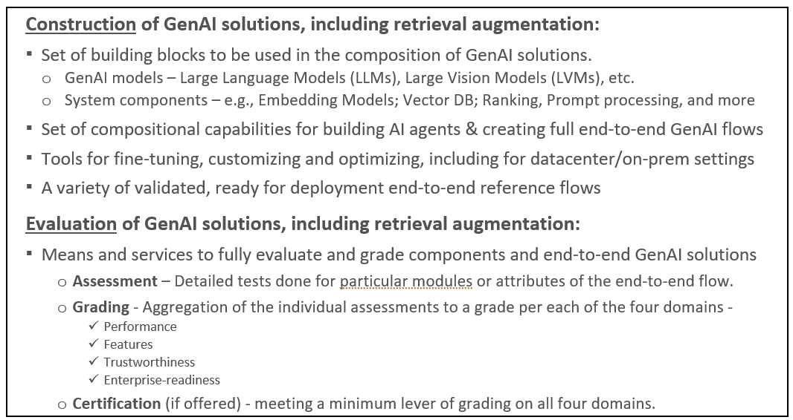

Figure 2-1 Key capabilities provided by OPEA

Appendix A of this document is an early draft of the proposed specification and sample reference flows.

## 3. Framework Components, Architecture and Flow

The OPEA definition (see Appendix A) includes characterization of components of State-of-the-Art (SotA)
composite systems including retrieval-augmentation and their architecture as a flow and SW stack.

There are six sections in the Appendix A which will provide a starting point for a more detailed and
elaborate joint OPEA definition effort:

* A1: System Components - List of ingredients that comprise a composed system,
  along with their key characteristics. Some systems that will be evaluated may
  only include a subset of these components.
* A2: SW architecture - Diagram providing the layering of components in a SW stack
* A3: System flows – Diagram[s] illustrating the flow of end-to-end operation
  through the relevant components.
* A4: Select specifications at system and component level
* A5: Grading – Grading of systems being evaluated based on performance,
  features, trustworthiness and enterprise-grade readiness.
* A6: Reference Flows – List of reference flows that demonstrate key use-cases
  and allow for downloading and replication for a faster path to create an
  instantiation of the flow.

Assumptions for the development of OPEA sections include:

* OPEA is a blueprint for composition frameworks and is not set to compete with
  the popular frameworks. It is set to help assess the pros and cons of various
  solutions and allow for improved interoperability of components.
* In production, it is likely that many customers will deploy their own proprietary pipelines.
* This framework blueprint is complementary and is intended to encourage
  interoperability of system components as well as addition of specialized value
  such as HW-aware optimizations, access to innovative features, and a variety
  of assistants and microservices.
* Flexible and allows easy pluggable and replaceable models and other
  components. Ability to exchange components is an important factor in the fast
  progression of the field.
* Providing an environment to experiment with solution variations - e.g. What is
  the impact (E2E system performance) when replacing a generic re-ranking
  component with a particular provider’s re-ranking component.

It should be noted that the final shaping of the framework components, architecture and flows will be
jointly defined by a technical committee as the full OPEA definition and governance structure is
established. It is also expected that there will be a regular cadence of updates to the spec to reflect the
rapidly shifting State-of-the-Art in the space.

## 4. Assessing GenAI components and flows

One of the important benefits to the ecosystem from the development and broad use of OPEA is a
structured set of evaluation that can provide trusted feedback on GenAI flows – whether composed
within OPEA, or composed elsewhere but has the visibility and access that allows for evaluations.
Evaluations can be done by assessing individual components or complete end-to-end GenAI solutions.
Evaluations in the OPEA context refer to assessment of individual aspects of a solution – like its latency
or accuracy per defined suite of tests. Assessments are covered in this section. Grading is an aggregation
of assessments and is covered in the next section.

Components and entire end-to-end flows will be evaluated in four domains – performance, features,
trustworthiness and enterprise-readiness.

Performance can be evaluated at the component level - e.g., Vector Database latency over a given large,
indexed dataset, or latency and throughput of an LLM model. Moreover, performance needs to be
evaluated for end-to-end solutions that perform defined tasks. The term ‘performance’ refers to aspects
of speed (e.g., latency), capacity (e.g., memory or context size) as well as accuracy or results.

OPEA can utilize existing evaluation specs like those used by SotA RAG systems and other standard
benchmarks wherever possible (e.g., MMLU). As for functionality, there are benchmarks and datasets
available to evaluate particular target functionality such as multi-lingual (like FLORES) or code
generations (e.g., Human-Eval).

For evaluating trustworthiness/Hallucination safety the spec will leverage existing benchmarks such
as  RGB benchmark/Truthful QA where possible.

Some assessment of enterprise readiness would include aspects of scalability (how large of data set the
system can handle, size of vector store, size and type of models), infrastructure readiness (cloud vs bare
metal), and software ease of deployment (any post-OPEA steps required for broad deployment). One of
the measures that could be assessed in this category is overall Cost/TCO of a full end-to-end GenAI flow.

When aspects of composite GenAI solutions are not freely available, reliable benchmarks or tests,
efforts will be made to ensure creation of such. As many of the current (early 2024) benchmarks are
focusing on performance and features, there will be an effort to complement those as needed for
assessing trustworthiness and enterprise-readiness.

The development of assessments should use learnings from similar evaluations when available. For
example, referring to RAG evaluation as reported by Cohere’s Nils Reimers.  See more details here:

* Human preference
* Average accuracy of an E2E
* Multi-lingual
* Long-context “Needles in Haystack”
* Domain specific

The assessments development will be starting with focus on primary use-cases for RAG flow, such as
Open Q&A. It will allow for comparison with common industrial evaluations (see Cohere, GPT-4)

## 5. Grading Structure

OPEA evaluation structure refers to specific tests and benchmarks as ‘assessments’ – see previous
section for details. ‘Grading’ is the part of OPEA evaluation that aggregates multiple individual
assessments into one of three levels, in each of the four evaluation domains – performance, features,
Trustworthiness and Enterprise readiness.

The following draft of a grading system is for illustration and discussion purposes only. A grading
system should be defined and deployed based on discussions in the technical review body and any other
governance mechanism that will be defined for OPEA.

To ensure that compositional systems are addressing the range of care-abouts for enterprise
deployment, the grading system has four categories:

* Performance – Focused on overall system performance and perf/TCO
* Features- Mandatory and optional capabilities of system components
* Trustworthiness – Ability to guarantee quality, security, and robustness. This
  will take into account relevant government or other policies.
* Enterprise Readiness – Ability to be used in production in enterprise environments.

The Performance and Features capabilities are well understood by the communities and industry today,
while Trustworthiness and Enterprise Readiness are still in their early stage for assessment and
evaluation when it comes to GenAI solutions. Nevertheless, all domains are essential to ensure
performant, secure, privacy-aware, robust solutions ready for broad deployment.

The grading system is not intended to add any particular tests or benchmarks. All individual tests are to
be part of the assessments. Rather, the grading system goal is to provide an overall rating as to the
performance, functionality, trustworthiness and enterprise readiness of a GenAI flow over a multitude
of individual assessments. It is expected to provide an abstracted and simplified view of the GenAI flow
under evaluation. It will attempt to address two basic questions – what is the level of capabilities of a
flow relative to other flows evaluated at that time, as well as evaluate some necessary requirements
(such as for security and enterprise readiness) for robust deployment of GenAI solutions at scale. A
grading system establishes a mechanism to evaluate different constructed AI solutions (such as
particular RAG flows) in the context of the OPEA framework.

For each category, the assessments will be set with 3 levels:

* L1 – Entry Level – Limited capabilities. The solution might be seen as less
  advanced or performant relative to other solutions assessed for similar tasks.
  It might encounter issues in deployment (if deficiencies in trustworthiness or
  enterprise readiness).
* L2 – Market – Meets market needs. The solution represents that mid-range of
  systems being reviewed and assessed. It can be safely deployed in production
  enterprise environments and is expected to meet prevalent standards on
  security and transparency.
* L3 – Advanced – Exceeds average market needs. The solution represents the
  top-range of components or end-to-end GenAI flows being reviewed and assessed
  at the time. It meets or exceeds all security, privacy, transparency and
  deployment-at-scale requirements.

The grading system can be used by GenAI users to ensure that the solution being evaluated is meeting
the ecosystem expectations in a field that is moving exceptionally fast. It can highlight exceptional
solutions or point out areas of concern. The structured approach across the four domains ensures that
the combined learnings of the ecosystem at any given time are being reflected in the feedback to the
prospective users of a particular GenAI solution. Naturally, the goal posts of what is defined as L1/L2/L3
need to be updated on regular basis as the industry pushes GenAI State-of-the-Art forward.

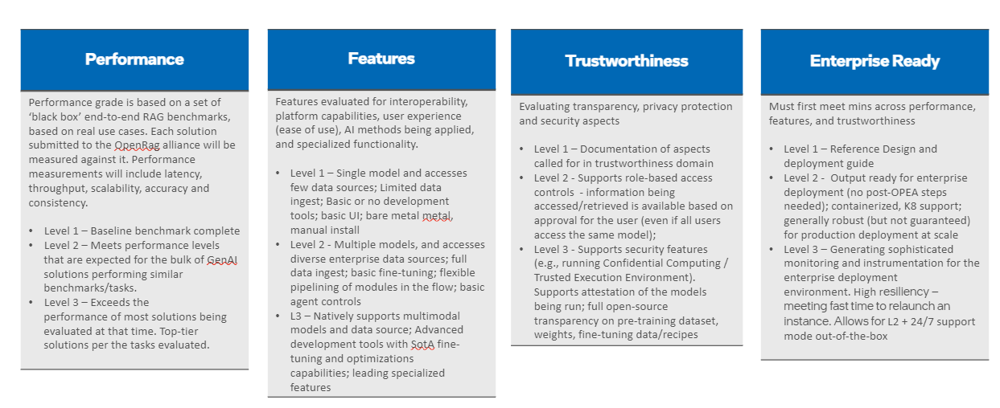

Figure 5-1 Overall view of the grading system across four domains

The grading system can play a different role for the providers of models, building blocks (modules), and
complete end-to-end GenAI solutions. Providers can get structured and impartial feedback on the
strengths and weaknesses of their offering compared with the rest of the market. An articulation of all
key areas for enterprise deployment is expected to guide providers towards a more robust and
complete delivery and continuous improvement for broad enterprise deployment. It also serves to
highlight outstanding solutions, providing them tailwinds as the present and differentiate their offering.

If and when certification becomes part of the framework (discussion and decisions to be made at a later
stage) it is assumed that a system needs to be at least at Level 2 for every aspect to be “OPEA Certified”.
Such certification can increase the confidence of both providers and users that the GenAI solution being
evaluated is competitive and ready for broad deployment – stopping short of promising a guarantee of
any sort.

The assessment test suites and associated grading will allow for ISVs and industry solution adopters to
self-test, evaluate and grade themselves on the various metrics. The test suite will be comprised of
applicable tests/benchmarks currently available in the community and where no standard benchmarks
exist, new tests will be developed. For each of these metrics we will have a grading mechanism to map
particular score ranges to L1, L2 or L3 for that time. These ranges will be updated periodically to reflect
the advancements in the field.

Figure 5-2 illustrates some of the aspects to be evaluated in the four domains. Yellow highlighted
examples show the minimal assessments needed for each of the domains. The blue highlighted
examples show the next level of assessments that indicate higher level capabilities of the RAG pipeline.
The next level and the highest level of assessments are indicated by text with no color.

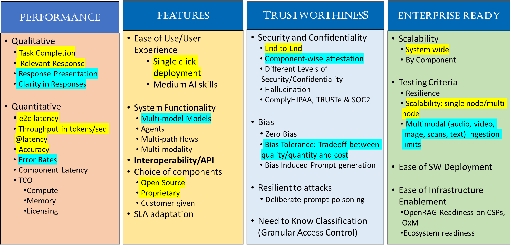

Figure 5-2 Capabilities and Testing Phases

## 6. Reference flows

Reference flows are end-to-end instantiations of use cases within the OPEA framework. They represent
a specific selection of interoperable components to create an effective implementation of a GenAI
solution. Reference flows documentation and links need to include comprehensive information
necessary for users of the framework to recreate and execute the flow, reproducing the results reported
for the flow.  The reference flow documentation will provide links to the required components (which
may come from multiple providers) and the necessary script and other software required to run them.

Several flows will exclusively focus on open models and other components, providing full transparency
when necessary. Other flows may include proprietary components that can be called/activated within
those flows. However, the components being referred to in a reference flow must be accessible to OPEA
users – whether they are open source or proprietary, free to use or fee-based.

Reference Flows serve several primary objectives:

* Demonstrate representative instantiations: Within OPEA framework, reference
  flows showcase specific uses and tasks. Given the framework’s inherent
  flexibility, various combinations of components are possible allowing for
  maximum flexibility. Reference flows demonstrate how specific paths and
  combinations can be effectively implemented within the framework.
* Highlight the framework’s potential: By offering optimized reference flows
  that excel in performance, features, trustworthiness, and enterprise
  readiness, users can gain insight into what can be achieved. The experience
  serves as valuable learning tools towards achieving their AI deployment goals
  and planning.
* Facilitate easy deployment: Reference flows are designed to be accessible and
  easy to instantiate with relatively low effort. It allows replicating a
  functional flow within their environment with minimal effort, allowing
  subsequent modifications as needed.
* Encourage innovation and experimentation: Allow users in the ecosystem to
  experiment with and innovate with a broad set of flows and maximize the value
  for their end-to-end use cases.

OPEA will deploy and evolve a visualization language to capture the blueprint flows (e.g., a base flow for
RAG chat/Q&A) as well as to document the choices made for every reference flow. The visualization has
a legend (see Figure 6-1) that illustrates the key choices in the reference flow (e.g., sequence of
functions or containerization) (see Figure 6-2) as well as the implementation choices for particular
model and modules (See Appendix A section A6).

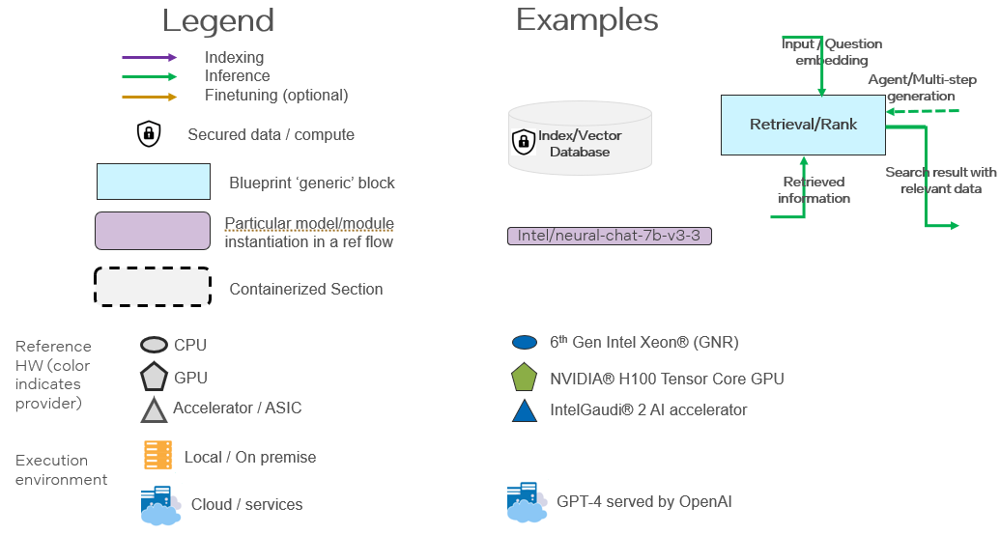

Figure 6-1 Legend for Blueprint and Reference Flows

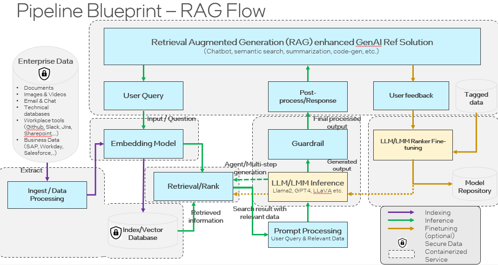

Figure 6-2 Example of blueprint RAG flow

The Reference flows section of the specification (Section A6 in Appendix A) provides an initial catalog of
reference flows, demonstrating common tasks and diverse combinations of hardware and AI
components. As this collection of reference flows is extended, there will be diverse set of solution
providers and variations of HW (Intel, NVIDIA and others) as well as AI models, modules and
construction.

## Appendix A – Draft OPEA Specifications

**Rev 0.1     April 15, 2024**

The draft specifications are intended for illustration and discussion purposes. The appendix has six
sections:

* A1: System Components - List of ingredients that comprise a composed system,
  along with their key characteristics.
* A2: SW architecture - Diagram providing the layering of components in a SW stack
* A3: System flows – Diagram[s] illustrating the flow of end-to-end operation
  through the relevant components.
* A4: Select specifications at system and component level
* A5: Grading – Grading of systems being evaluated based on performance,
  features, trustworthiness and enterprise-grade readiness.
* A6: Reference Flows – List of reference flows that demonstrate key use-cases
  and allow for downloading and replication for a faster path to create an
  instantiation of the flow.

This is an early draft of OPEA framework specification. It provides an initial view of the content and is
expected to be substantially expanded in future revisions.

Disclaimer – The term ‘specification’ is used throughout this draft whitepaper and appendix as a broad
working term, referring generally to a detailed description of systems and their components. However, it
is important to note that this term might be replaced or updated based on more precise characterization
and applying the Linux Foundation licensing considerations.

### A1: System Components

| Components | Description | OSS Examples | Proprietary Examples |
| ---------- | ----------- | ------------ | -------------------- |
| Agent framework | Orchestration software for building and deploying workflows combining information retrieval components with LLMs for building AI agents with contextualized information | Langchain, LlamaIndex, Haystack, Semantic Kernel
| Ingest/Data Processing | Software components that can be used to enhance the data that is indexed for retrieval. For example: process, clean, normalization, information extraction, chunking, tokenization, meta data enhancement.  | NLTK, spaCY, HF Tokenizers, tiktoken, SparkNLP
| Embedding models/service | Models or services that convert text chunks into embedding vectors to be stored in a vector database | HF Transformers, S-BERT | HF TEI, OpenAI, Cohere, GCP, Azure embedding APIs, JinaAI
| Indexing/Vector store | A software for indexing information (sparse/vector) and for retrieving given a query | Elasticsearch, Qdrant, Milvus, ChromaDB, Weaviate, FAISS, Vespa, HNSWLib, SVS, PLAID | Pinecone, Redis
| Retrieval/Ranking | A SW component that can re-evaluate existing contexts relevancy order | S-BERT, HF Transformers, Bi/Cross-encoders, ColBERT | Cohere
| Prompt engine | A component that creates task specific prompts given queries and contexts, tracks user sessions (maintain history/memory) | Langchain hub
| Memory | Conversation history in memory and/or persistent database | Langchain Memory module, vLLM (automatic prefix caching)
| LLM engine/service | LLM inference engine that generate text responses based on given prompts and contexts retrieved | vLLM, Ray, TensorRT-LLM | HF TGI, Deci Infery
| LLM Models | Open-source and close-source models. | LLama2-7B,13B, Falcon 40B, Mixtral-7b, Gemma etc. | LLama2-70B, OpenAI, Cohere, Gemini, etc.
| Guardrails | A software component for enforcing compliance, filtering, safe responses| LLM Guard | Purple llama, OpenAI safety control, NEMO-Guardrails
| Evaluation | Methods to evaluate compliance, Performance, Accuracy, Error rate of the LLM response | Recall, MAP, MTEB, MTBench, MMLU, TriviaQA, TruthfulQA…

Figure A1.1 List of key components.

### A2: SW Architecture

Support model selection and data integration across popular user-facing frameworks. It leverages
popular agent frameworks (aka orchestration frameworks or AI Construction Platforms) for developer
productivity and availability of platform optimization.

Tuning of the solutions leverage platform optimizations via popular domain frameworks such as Hugging
Face ecosystem to reduce developer complexity and provide flexibility across platforms.

  * Throughput
  * Given a fixed combination of various components of RAG (specific vendor instance for each component), overall system performance.
  * For a specific task/domain, list the combination that would give the best system performance.
* Q&A evaluation (accuracy)
  * Task: Open Q&A
  * Databases: NQ, TriviaQA and HotpotQA
  * Metric: Average Accuracy
  * Indexing: KILT Wikipedia

##### Features / Functionality

* Functional
  * Features – multimodal, Multi-LLM, Multiple embedding model choices, multiple Embedding DBs, context length
  * Context Relevance (context precision/recall)
  * Groundedness/faithfulness
  * Answer Relevance
* Multi-step reasoning
  * Task: 3-shot multi-hop REACT agents
  * Databases: Wikipedia (HotPotQA), Internet (Bamboogle)
  * Metric: Accuracy
  * Test sets: Reflexion, Ofir Press
* Multi-lingual
  * Task: Semantic Search
  * Search Quality
  * Metric nDCG @10
  * 18 languages
  * Benchmark: MIRCAL
* Multi-lingual
  * Tasks: Multilingual MMLU, Machine Translation
  * Metric: Accuracy, BLEU
  * French, Spanish, Italian, German, Portuguese, Japanese, Korean, Arabic, and Chinese
  * Benchmark: FLORES, MMLU
* Conversational agent and Function calling
  * Task: conversational tool-use and single-turn function-calling capabilities
  * Benchmark-1: Microsoft’s ToolTalk
  * Benchmark-2: Berkeley's Function Calling Leaderboard (BFCL)
  * Tool-use Metric: Soft Success rate
  * Function calls: Function Pass rate
* Human reference on enterprise RAG use cases
  * Domains: Customer support, Workplace support (Tech), Workplace Assistant (Media), Tech FAQ
  * Metric: Win ratio vs. Mixtral

##### Enterprise readiness

Enterprise Readiness Assessment involving assessing for the following:

1. Scalability
2. Production deployability
3. Updatability
4. Observability/Debuggability

Scalability is associated with the ability of RAG system to scale the size/dimensions of different components such as the following example metrics:
* Vector DB size
* Dimensionality of retriever (the value of K in top-K documents)
* Maximum context length supported by the generator
* Parameter size of the generator models
* Embedding dimension size

Production deploy-ability Readiness includes various capabilities such as
* Efficient inference serving
* Integrations with different enterprise systems such as Slack/workday/SAP/Databases
* Enterprise grade RAS capabilities
* Service Level Agreements (SLAs) on factuality, verifiability, performance enforceability

Updatability includes capability for
* Rolling upgrade
* Online upgrade
* Component level upgrade

Observability/Debuggability includes capability for
* Error detection and attribution to component
* Early detection of component degradation
* Trace generation to debug failures (functional and performance)
* Traceability of each intermediate step (prompts for chained LLMs)

Examples for observability include Databricks Inference Tables/Phoenix Open Inference Traces or
Langsmith Observability/monitoring features.

#### A4.2 Individual Components Assessment

Evaluation of individual components (modules) will include:
* Data preprocessing pipeline
* Embedding – Quality/Storage/Processing time
* Chunker, Retriever & Re-ranker
* Generator LLM – quality/latency/context length/reasoning ability/function calling/tool usage
* Auto evaluation vs Manul evaluation
* Observability
* Guardrails -
* Prompting
* Output Generation – structured/grammar/output types(json/text)

Early example of next level articulation of metrics expected per each major component.

Component Name: Retriever
* Metric:  Normalized Discounted Cumulative Gain@10 with BEIR benchmark datasets or other QA datasets
* Metric: Context Recall@k
* Metric: Context Precision@k
* Metric: Hit Rate

Component Name: LLM/Generation
* Metric: Faithfulness – How factually correct is the generated answer (computed as a ragas metrics between 0 and 1)
* Metric: Answer Relevance – how relevant generated answer to the query
  (computed as a ragas metrics between 0 and 1)

### A5: Grading

To ensure that compositional systems are addressing the range of care-abouts for enterprise
deployment, the grading system has four categories:

* Performance – Focused on overall system performance and perf/TCO
* Features- Mandatory and optional capabilities of system components
* Trustworthiness – Ability to guarantee quality, security, and robustness.
* Enterprise Ready – Ability to be used in production in enterprise environments.

For each category, the assessments will be set with 3 levels
* L1 – Entry Level – Limited capabilities. Solution acceptable for PoC, but not production.
* L2 – Market – Meets market needs. Can be deployed in production.
* L3 – Advanced – Exceeds market needs.

Part of the recommendation is to have a certification (if and when it becomes part of the framework)
process. It is assumed that a system needs to be at least at Level 2 for every aspect to be “OPEA
Certified”.

#### A5.1 Performance Grading

Performance grading is based on running a set of vertical-specific end-to-end use cases on full system
and capturing the relevant metrics during the run.

* E2E/System View
  * Vendors have flexibility to innovate/differentiate their implementations within the black box
* Running a fixed set of use cases
  * Covering different vertical scenarios
  * Minimum level of accuracy and reliability
* Input Datasets for benchmark
  * Open/publicly available
  * Automatic generation
* Scale factors
  * Supports different input magnitude size
* Metrics
  * First-token latency, overall latency, throughput, cost, consistency
  * Formula to aggregate metrics for final score
  * Vertical-specific metrics

##### Performance Grade
Performance grade is based on a set of ‘black box’ end-to-end RAG benchmarks, based on real use
cases. Each solution submitted to the OpenRag alliance will be measured against it. Performance
measurements will include latency, throughput, scalability, accuracy and consistency.

* Level 1 – Baseline benchmark complete
* Level 2 – Meets performance levels that are expected for the bulk of GenAI solutions performing
  similar benchmarks/tasks.
* Level 3 – Exceeds the performance of most solutions being evaluated at that time. Top-tier
  solutions per the tasks evaluated.

#### A5.2 Features Grading

Feature grading consists of running functional tests to test system capabilities in a number of different
domains. Each domain will have its own score.

* Interoperability/API
  * Functional tests for each interface
  * Different granularity levels for components
  * Open interfaces for 3rd party data sources
  * Should enable multiple types of data sources
* Platform capabilities and AI methods
  * Ingest, inference, fine tuning
  * Gen AI and reinforcement learning
* User experience
  * Ease of Use
  * Management tools – single pane, inter-vendor
  * GUI requirements
  * Developer tools
* Deployment models
  * Orchestration
  * K8, hypervisor
* Compliance
  * Potential certification (if and when it becomes part of the framework) based on functional testing

##### Features Grade

Features evaluated for interoperability, platform capabilities, user experience (ease of use), AI
methods being applied, and specialized functionality.

* Level 1 – Single model and accesses few data sources; Limited data ingest;
  Basic or no development tools; basic UI; bare metal, manual install.
* Level 2 - Multiple models, and accesses diverse enterprise data sources; full
  data ingest; basic fine-tuning; flexible pipelining of modules in the flow;
  basic agent controls.
* Level 3 – Natively supports multimodal models and data source; Advanced
  development tools with SotA fine-tuning and optimizations capabilities;
  leading specialized features

#### A5.3 Trustworthiness Grading

Trustworthiness and responsible AI are evolving in an operational sense. See NIST trustworthy and
responsible AI  and the EU AI Act. While these efforts are evolving, for the interim, we propose grading
solution trustworthiness along the axes of security, reliability, transparency, and confidence:

* Transparency
  * Open Source Models and Code. This provides visibility into the actual code running, being able to verify versions and signed binaries.
  * Open standards, reusing existing standards.
  * Data sets used in model training, which allows analysis of data distribution and any biases therein. For instance, if a cancer detection model was trained on populations that are very diverse - ethnically (genome), or environments (exposure to carcinogens), it carries with a risk of applicability when used for individuals that are not representative of the training set.
  * Citing sources/documents used in generating responses, protecting from hallucinations. One of the chief benefits of RAG.
  * Meeting regulatory requirements such as ISO27001, HIPAA, and FedRAMP as appropriate.
* Security:
  * Role-based access control, segmented access per user-role regardless of same model use. This could be a pre or post processing step that filters out data based on user access to different information. For instance, executive leadership may have access to company revenues, financials and customer lists versus an engineer.
  * Solutions that run at the minimum necessary process privilege to prevent exploits form escalation of privileges should the application be hacked.
  * Running in trusted execution environments, that is hardware supported confidential compute environments that protect data in use – providing confidentiality and integrity from privileged and other processes running on the same infrastructure. Valuable particularly in the cloud.
  * Attesting binaries in use, be it models or software.
  * Audit logs that indicate when and what updates were applied either to models or other software, including security patches.
  * Ensuring that results, intermediate and final are persisted only on encrypted storage and shared with end users through secure transport.
* Reliability
  * Provide the same answer, all else remaining the same, when prompts are similar, differing in their use of synonyms.
  * Returns correct answers, per tests.
  * Confidence
  * In question answering scenarios, awareness of the quality and how current/up-to-date data used in RAG and providing that information along with the response helps an end user in determining how confident they can be with a response.
  * Cites sources for responses. Meta data can also be used to indicate how up-to-date the input information is.
  * With respect to diagnosis/classification tasks, such as cancer detection, the divergence of the test subject from the training dataset is an indicator of applicability risk, confidence in the response (alluded to in data transparency above).

##### Trustworthiness Grade

Evaluating transparency, privacy protection and security aspects
* Level 1 – Documentation of aspects called for in trustworthiness domain
* Level 2 - Supports role-based access controls  - information being accessed/retrieved is
  available based on approval for the user (even if all users access the same model);
* Level 3 - Supports security features (e.g., running Confidential Computing / Trusted
  execution Environment). Supports attestation of the models being run; full open-
  source transparency on pre-training dataset, weights, fine-tuning data/recipes

#### A5.4 Enterprise-Ready Grading

Grading enterprise-readiness consists of evaluating the ability of the overall solution to be deployed in
production in an enterprise environment. The following criteria will be taken into account:

* Ability to have on-prem and cloud deployments
  * At least two types of solution instances (on-premise installation, cloud, hybrid option)
  * Cloud/Edge-native readiness (refer to CNCF process/guidelines)
* Security-ready for enterprise
  * Multi-level Access Control & Response (including ability to integrate with internal tools)
  * Data & Model Protection (e.g. including GDPR)
  * Lifecycle management including security updates, bug fixes, etc
  * Solutions that are packaged as containerized applications that do not run as root or have
    more capabilities than necessary. OWASP container best practices.
  * Ensure by-products/interim results if saved to disk are done so after encrypting.
* Quality assurance
  * Accuracy & Uncertainty Metrics for domain-specific enterprise tasks
  * Documentation
* High availability
  * Replication & Data/Instance Protection
  * Resiliency – time to relaunch an instance when burned down to zero.
  * Provides support and instrumentation for enterprise 24/7 support
* Licensing model and SW Distribution
  * Scalable from small to large customers
  * Ability to customize for specific enterprise needs

##### Enterprise Readiness Grade

Must first meet mins across performance, features, and trustworthiness
* Level 1 – Reference Design and deployment guide
* Level 2 - Output ready for enterprise deployment (no post-OPEA steps needed);
  containerized, K8 support; generally robust (but not guaranteed) for production
  deployment at scale
* Level 3 – Generating sophisticated monitoring and instrumentation for the enterprise
  deployment environment. High resiliency – meeting fast time to relaunch an
  instance. Allows for L2 + 24/7 support mode out-of-the-box

### A6: Reference Flows

This section includes descriptions of reference flows that will be available for loading and reproducing
with minimal effort.

Reference flows serve four primary objectives:

* Demonstrate representative instantiations: Within OPEA framework, reference
  flows showcase specific uses and tasks. Given the framework’s inherent
  flexibility, various combinations of components are possible allowing for
  maximum flexibility. Reference flows demonstrate how specific paths and
  combinations can be effectively implemented within the framework.
* Highlight the framework’s potential: By offering optimized reference flows
  that excel in performance, features, trustworthiness, and enterprise
  readiness, users can gain insight into what can be achieved. The experience
  serves as valuable learning tools towards achieving their AI deployment goals
  and planning.
* Facilitate easy deployment: Reference flows are designed to be accessible and
  easy to instantiate with relatively lower effort. It allows replicating a
  functional flow within their environment with minimal effort, allowing
  subsequent modifications as needed.
* Encourage innovation and experimentation: Allow users in the ecosystem to
  experiment with and innovate with a broad set of flows and maximize the value
  for their end-to-end use cases.

Current examples of reference flows are provided for illustration purposes. The set of reference flows is
expected to grow and cover various combinations of HW and SW/AI components from multiple
providers.

The reference flow descriptions need to provide high clarity as to what and how they can be recreated
and results reproduced at an OPEA user setting. All reference flows will have a visualization that clarifies
which components are being instantiated and how they are connected in the flow. The graphics legend
described in Figure 6.1 will be used for all reference flow depictions.

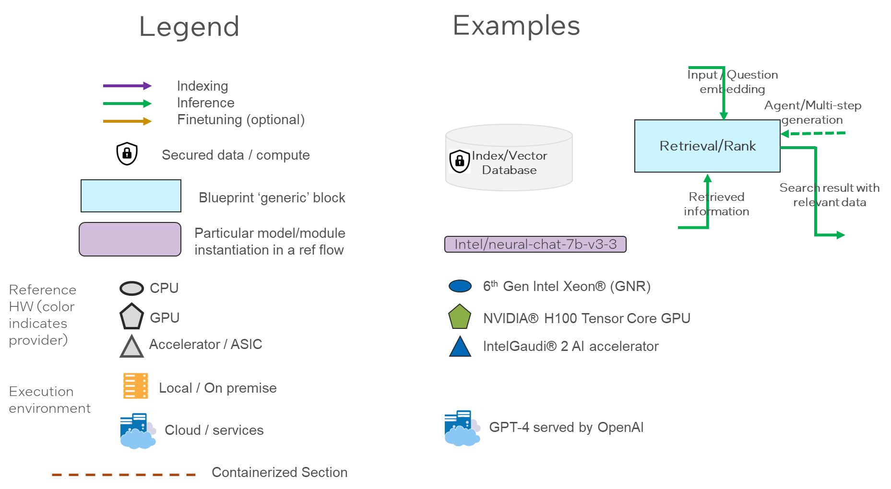

Figure A6.1 - Reference Design Flows Visualization - legend

#### A6.1 – Xeon + Gaudi2 LLM RAG flow for Chat QnA

A reference flow that illustrates an LLM enterprise RAG flow that runs on Xeon (GNR) with vector
database and an embedding model, and with a Gaudi2 serving backend for LLM model inference.

The reference flow demonstrates a RAG application that provides an AI assistant experience with
capability of retrieving information from an external source to enhance the context that is provided to
an LLM. The AI assistant is provided with access to an external knowledge base, consisting of text and
PDF documents and web pages available via direct URL download.
The flow enables users to interact with LLMs and query about information that is unknown to the LLMs,
or for example, consists of proprietary data sources.

The reference flow consists of the following detailed process: a data storage which is used by a
retrieving module to retrieve relevant information given a query from the user. The query and external
data are stored in an encoded vector format that allows for enhance semantic search. The retriever
module encodes the query and provides the prompt processor the retrieved context and the query to
create an enhanced prompt to the LLM. An LLM receives the enhanced prompt generates a grounded
and correct response to the user.

The flow contains the following components:
* A data ingest flow that uses an embedding model serving platform (TEI) and an
  embedding model (BGE-base) for encoding text and queries into semantic
  representations (vectors) which are stored in an index (Redis vector
  database), both running on Intel Gen6 Xeon GNR for storing and retrieving
  data.
* A LLM inference serving flow utilizing TGI-Gaudi for LLM model serving on
  Gaudi2 platform, which is used generating answers by inputting prompts that
  combine retrieved relevant documents from Redis vector database and the user
  query.
* An orchestration framework based on LangChain that initializes a pipeline with
  the components above and orchestrates the data processing from the user
  (query), text encoding, retrieval, prompt generation and LLM inference.

A complete reference implementation of this flow is available in the ChatQnA example in Intel’s GenAI
examples repository.

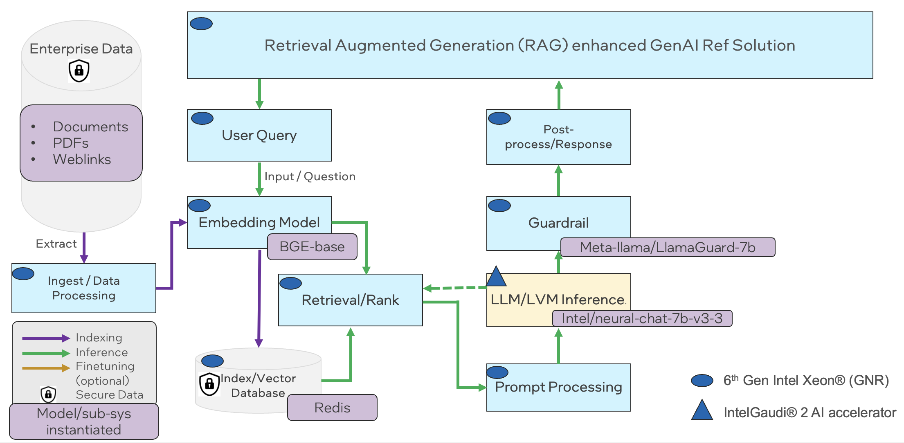

Figure A6-1.2 Xeon + Gaudi2 LLM RAG flow for Chat QnA

A demo user Interface looks like below, which also shows the difference with and without RAG.

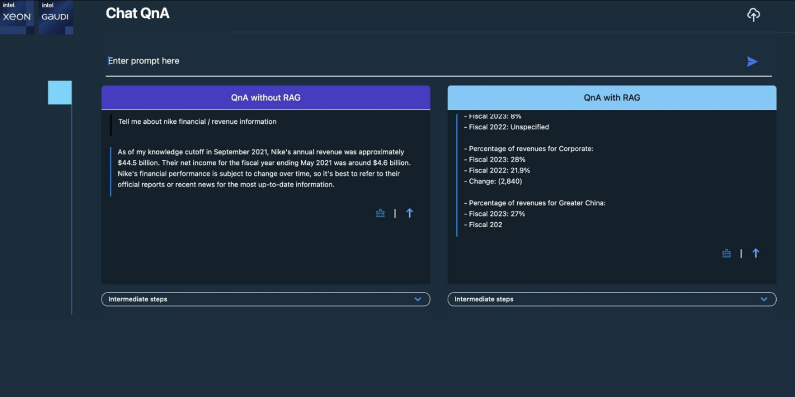

Figure A6-1.3  Xeon + Gaudi2 LLM RAG flow for Chat QnA – demo screen

#### A6.2 - Multimodal Chat Over Images and Videos

This reference flow demonstrates a multimodal RAG pipeline which utilizes Intel Labs’ BridgeTower
vision-language model for indexing and LLaVA for inference, both running on Intel Gaudi AI accelerators.
The use case for this reference flow is enabling an AI chat assistant to retrieve and comprehend
multimodal context documents such as images and videos. For example, a user may wish to ask an AI
assistant questions which require reasoning over images and videos stored on their PC. This solution
enables such capabilities by retrieving images and video frames relevant to a user’s query and providing
them as extra context to a Large Vision-Language Model (LVLM), which then answers the user’s
question.

Specifically, this reference solution takes images and video files as input. The inputs are encoded in a
joint multimodal embedding space by BridgeTower, which is an open-source vision-language
transformer. Detailed instructions and documentation for this model are available via Hugging Face. The
multimodal embeddings are then indexed and stored in a Redis vector database.

At inference time, a user’s query is embedded by BridgeTower and used to retrieve the most relevant
images & videos from the vector database. The retrieved contexts are then appended to the user’s
query and passed to LLaVA to generate an answer. Detailed instructions and documentation for the
LLaVA model are available via Hugging Face.

This reference flow requires Intel Gaudi AI Accelerators for the embedding model and for generating
responses with the LVLM. All other components of the reference flow can be executed on CPU. A
complete end-to-end open-source implementation of this reference flow is available via Multimodal
Cognitive AI.

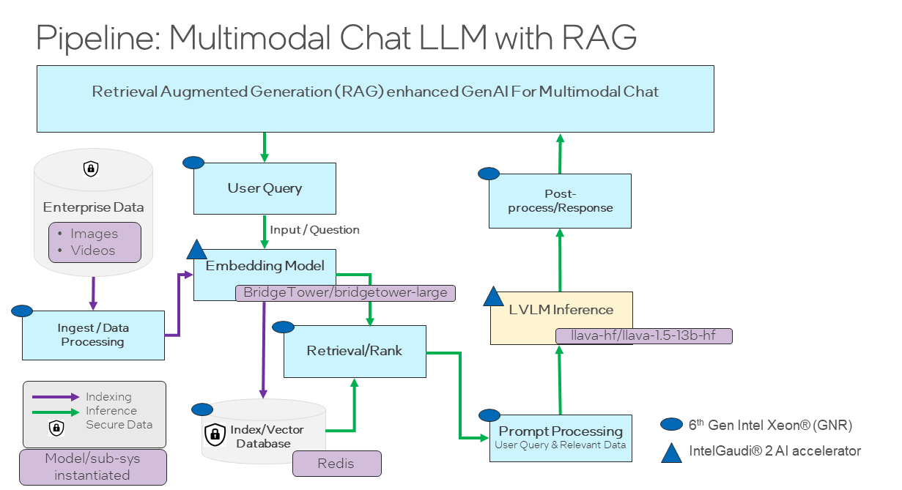

Figure A6-2.1 Multimodal Chat Over Images and Videos Reference Flow

Below is an illustration of a user interface constructed for this reference flow, which was showcased at
Intel Vision:

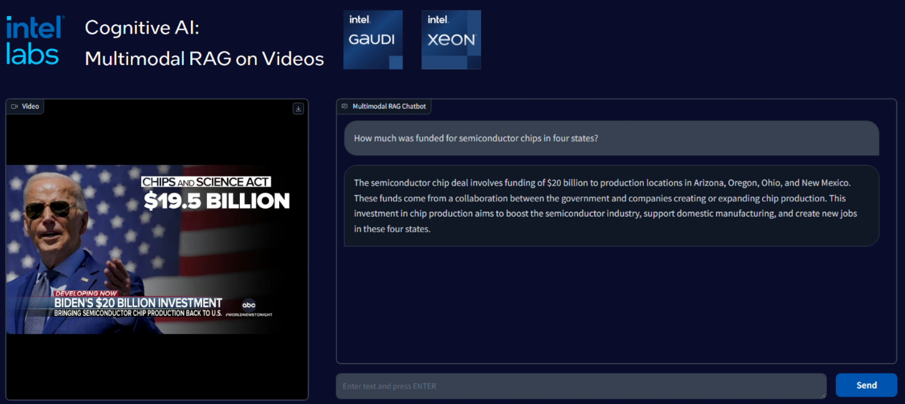

Figure A6.2.2 Multimodal Chat Over Images and Videos – demo screen

#### A6.3 – Optimized Text and Multimodal RAG pipeline

The reference flow below demonstrates an optimized Text and Multimodal RAG pipeline which can be
leveraged by Enterprise customers on Intel Xeon processor.

This flow demonstrates RAG inference flow on unstructured data and images with 4th and 5th Gen Intel
Xeon processor using Haystack. It is based on fastRAG for optimized retrieval.

The first step is to create index for the vector database (i.e. Qdrant in this case). For unstructured text
data, sentence-transformers  is used. For images, BridgeTower is used to encode the inputs.

Once the vector database is set up, next step is to deploy inference chat. The LLM and LMM models
used for inference are Llama-2-7b-chat-hf, Llama-2-13b-chat-hf and LLaVa models respectively.

The below diagram shows the end-to-end flow for this optimized text and multimodal chat with RAG.

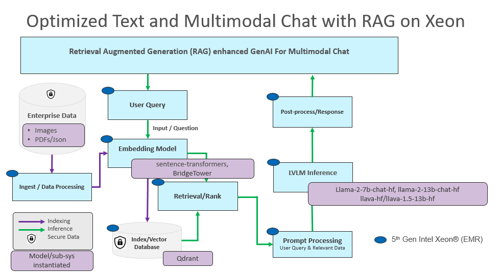

Figure A6-3.1 Optimized Text and Multimodal RAG pipeline Reference Flow

Below is a visual snapshot of the chat implemented using this flow. It shows how a RAG-enabled chatbot
in Figure A6-3.2 improves the response for a Superbowl query over a non-RAG implementation in Figure
A6-3.3.

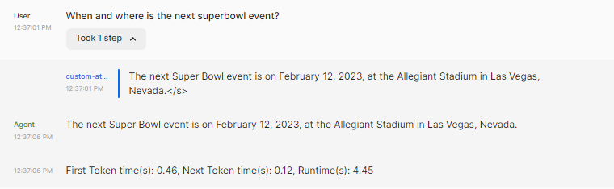

Figure A6-3.2: Non-RAG chatbot: Super Bowl Query

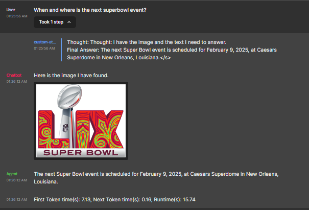

Figure A6-3.3: RAG enabled chatbot - Super Bowl query

