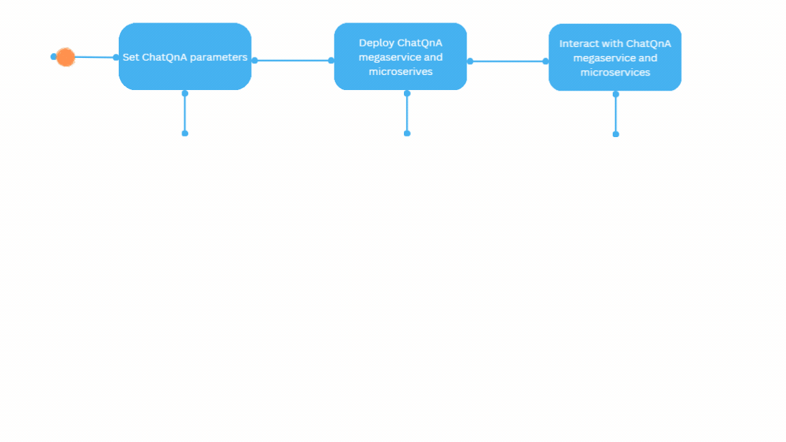

# Getting Started with OPEA

## Prerequisites

To get started with OPEA you need the right hardware and basic software setup.

Hardware Requirements: For the hardware configuration, If you need Hardware Access visit the Intel Tiber Developer Cloud to select from options such as Xeon or Gaudi processors that meet the necessary specifications.
Software Requirements: Please refer to the Support Matrix[ Hyper link needed]  to ensure you have the required software components in place.

## Understanding OPEA's Core Components

Before moving forward, it's important to familiarize yourself with two key elements of OPEA: GenAIComps and GenAIExamples.
1.	GenAIComps: GenAIComps is a collection of microservice components that form a service-based toolkit. This includes a variety of services such as llm (language learning models), embedding, and reranking, among others.
2.	GenAIExamples: While GenAIComps offers a range of microservices, GenAIExamples provides practical, deployable solutions to help users implement these services effectively. Examples include ChatQnA and DocSum, which leverage the microservices for specific applications. 

## Visual Guide to Deployment
To illustrate, here's a simplified visual guide on deploying a ChatQnA GenAIExample, showcasing how you can set up this solution in just a few steps. 



## Setup ChatQnA Parameters
To deploy ChatQnA services, follow these steps:

```
git clone https://github.com/opea-project/GenAIExamples.git
cd GenAIExamples/ChatQnA
```

### Set the required environment variables:
```
# Example: host_ip="192.168.1.1"
export host_ip="External_Public_IP"
# Example: no_proxy="localhost, 127.0.0.1, 192.168.1.1"
export no_proxy="Your_No_Proxy"
export HUGGINGFACEHUB_API_TOKEN="Your_Huggingface_API_Token"
```

If you are in a proxy environment, also set the proxy-related environment variables:
```
export http_proxy="Your_HTTP_Proxy"
export https_proxy="Your_HTTPs_Proxy"
```

Set up other specific use-case environment variables by choosing one of these options, according to your hardware:

```
# on Xeon
source ./docker_compose/intel/cpu/xeon/set_env.sh
# on Gaudi
source ./docker_compose/intel/hpu/gaudi/set_env.sh
# on Nvidia GPU
source ./docker_compose/nvidia/gpu/set_env.sh
```

### Deploy ChatQnA Megaservice and Microservices
Select the compose.yaml file that matches your hardware.
```
#xeon
cd docker_compose/intel/cpu/xeon/
#gaudi
cd docker_compose/intel/hpu/gaudi/
#nvidia
cd docker_compose/nvidia/gpu/
```
Now we can start the services
```
docker compose up -d
```
It will automatically download the docker image on docker hub:
- docker pull opea/chatqna:latest
- docker pull opea/chatqna-ui:latest
In following cases, you will need to build docker image from source by yourself.

1. Failed to download the docker image.
2. Use the latest or special version.

Please refer to the ['Build Docker Images'](/examples/ChatQnA/deploy) section from the file that matches your hardware.

### Interact with ChatQnA Megaservice and Microservice 
```
curl http://${host_ip}:8888/v1/chatqna \
    -H "Content-Type: application/json" \
    -d '{
        "messages": "What is the revenue of Nike in 2023?"
    }'
```
This command will provide the response as a stream of text. You can modify the message parameter in the curl command and interact with the ChatQnA service.

### What’s Next:

1. Try  [GenAIExamples](/examples/index.rst) in-detail starting with [ChatQnA](/examples/ChatQnA/ChatQnA_Guide.html) example.
 
2. Try [GenAIComps](/microservices/index.rst) to build microservices.
 
3. Interested in contributing to OPEA? Refer to [OPEA Community](/community/index.rst) and [Contribution Guides](/community/index.rst#contributing-guides).
 

