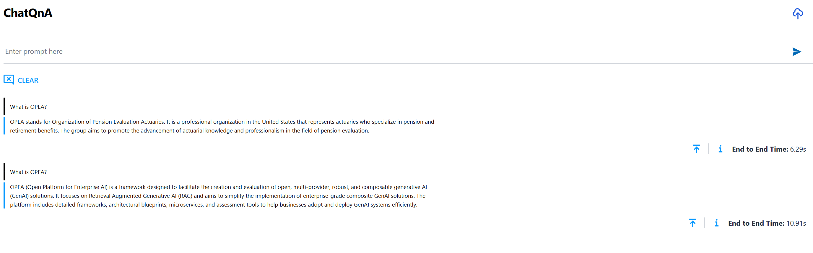

# Getting Started with OPEA
In this document, we provide a tailored guide to deploying the ChatQnA application in OPEA GenAI Examples across multiple cloud platforms, including Amazon Web Services (AWS), Google Cloud Platform (GCP), IBM Cloud, Microsoft Azure and Oracle Cloud Infrastructure, enabling you to choose the best fit for your specific needs and requirements. For additional deployment targets, see the [ChatQnA](/tutorial/ChatQnA/ChatQnA_Guide.rst).

## Understanding OPEA's Core Components

Before moving forward, it's important to familiarize yourself with two key elements of OPEA: GenAIComps and GenAIExamples.

- GenAIComps is a collection of microservice components that form a service-based toolkit. This includes a variety of services such as llm (large language models), embedding, and reranking, among others.
- GenAIExamples provides practical and deployable solutions to help users implement these services effectively. Examples include ChatQnA and DocSum, which leverage the microservices for specific applications.


## Prerequisites

## Create and Configure a Virtual Server

::::{tab-set}
:::{tab-item} Amazon Web Services
:sync: AWS

**Step 1: Create Your Virtual Server**

1. Open the [AWS console](https://console.aws.amazon.com/console/home) and search for **EC2** in the search bar. 

2. Select **Launch instance** to start creating a virtual server.

3. Under **Name and tags**, name your virtual server in the **Name** field.

4. Under **Quick Start**, choose Ubuntu (`ami-id : ami-04dd23e62ed049936`) as the base OS.

5. In **Instance type**, select an instance for your Intel processor.

   >**Note**: We recommend `m7i.4xlarge` or larger instance for an Intel® 4th Gen Xeon© Scalable Processor. For more information on virtual servers on AWS, visit the [AWS and Intel page](https://aws.amazon.com/intel/).

6. Create a new key pair for SSH access by naming it, or select an existing key pair from the dropdown list.

7. Under **Network Settings**:

   -  Choose an existing security group, or
   -  Select **Create security group** and enable **Allow SSH traffic** and **Allow HTTP traffic**.

8. In **Storage**, set the size to 100 GiB.

9. Select **Launch instance** to launch your virtual server. A **Success** banner confirms the launch.

**Step 2: Connect and Configure Your Virtual Server**

1. Select **Connect**, and connect using your preferred connection method.

2. Search for **Security Groups** in the search bar and select the security group used when creating the instance.

3. Select **Edit inbound rules** on the right side of the window.

4. To add a rule, select **Add rule** and enter the following:

   -  Type: Custom TCP
   -  Port Range: 80
   -  Source: 0.0.0.0/0 

   >**Note**: To learn more, see [editing inbound or outbound rules](https://docs.aws.amazon.com/finspace/latest/userguide/step5-config-inbound-rule.html) from AWS documentation.

5. Select **Save rules** to commit your changes.

:::
:::{tab-item} Google Cloud Platform
:sync: GCP

1. Navigate to [GCP console](https://console.cloud.google.com/) – Click the "Create a VM" button.

2. Provide a name to the VM.

3. Select the base OS as `Ubuntu 24.04 LTS` from Marketplace .

4. Select an Instance type that is based on Intel hardware.

> **Note:**   We recommend selecting a `c4-standard-32` or larger instance with an Intel(R) 4th Gen Xeon(C) Scalable Processor, and the minimum supported c3 instance type is c3-standard-8 with 32GB memory. For more information, visit [virtual servers on GCP](https://cloud.google.com/intel).

5. Under Firewall settings select “Allow HTTP traffic” to access ChatQnA UI web portal.

6. Change the Boot disk to 100 GiB and click "Create".

7. Use any preferred SSH method such as "Open in browser window" to connect to the instance.

:::
:::{tab-item} IBM Cloud
:sync: IBM Cloud

1. Navigate to [IBM Cloud](https://cloud.ibm.com). - Click the "Create resource" button at the top right of the screen. Select "Compute" from the options available and select "Virtual Server for VPC"

2. Select a location for the instance. Assign a name to it.

3. Under Stock Images, select Ubuntu 24.04 (`ibm-ubuntu-24-04-6-minimal-amd64-1`)

4. Select a virtual server.

> **Note:** We recommend selecting a 3-series instance with an Intel(R) 4th Gen Xeon(C) Scalable Processor, such as `bx3d-16x80` or above. For more information on virtual servers on IBM cloud visit [Intel® solutions on IBM Cloud®](https://www.ibm.com/cloud/intel).

5. Add an SSH key to the instance, if necessary, create one first.

6. Click on "Create virtual server".

7. Once the instance is running, create and attach a "Floating IP" to the instance. For more information visit [this](https://cloud.ibm.com/docs/vpc?topic=vpc-fip-working&interface=ui) site

8. Under "Infrastructure" in the left pane, go to Network/Security groups/<Your Security Group>/Rules

9. Select "Create"

10. Enable inbound traffic for port 80. For more information on editing inbound/outbound rules, click [here](https://cloud.ibm.com/docs/vpc?topic=vpc-updating-the-default-security-group&interface=ui)

11. ssh into the instance using the floating IP (`ssh -i <key> ubuntu@<floating-ip>`)

:::
:::{tab-item} Microsoft Azure
:sync: Azure

1. Navigate to [Microsoft Azure](portal.azure.com) – Select the "Skip" button on the bottom right to land on the service offerings page. Search for "Virtual Machines" in the search bar and select it. Click the "Create" button and select "Azure Virtual Machine".

2. Select an existing "Resource group" from the drop down or click "Create" for a new Resource group and give it a name. If you have issues refer to [cannot create resource groups](https://learn.microsoft.com/en-us/answers/questions/1520133/cannot-create-resource-groups).

3. Provide a name to the VM and select the base OS as `Ubuntu 24.04 LTS`

4. Select x64 in VM architecture.

5. Select an Instance type that is based on Intel hardware.

>**Note**: We recommend selecting a `Standard_D16ds_v5` instance or larger with an Intel(R) 3rd/4th  Gen Xeon(C) Scalable Processor. You can find this family of instances in the (US) West US Region. Visit for more information [virtual machines on Azure](https://azure.microsoft.com/en-us/partners/directory/intel-corporation).

6. Select Password as Authentication type and create username and password for your instance.

7. Choose the Allow selected ports in Inbound port rule section and select HTTP.

8. Click "Next: Disk" button and select OS disk size as 128GiB.

9. Click on "Review + Create" to launch the VM.

10. Click Go to resource -> Connect -> Connect -> SSH using Azure CLI. Accept the terms and then select "Configure + connect"

>**Note**: If you have issues connecting to the instance with SSH, you could instead access the same via the Bastion host with your username and password.

:::
:::{tab-item} Oracle Cloud Infrastructure
:sync: OCI

1. Login to [Oracle Cloud Console](https://www.oracle.com/cloud/sign-in.html?redirect_uri=https%3A%2F%2Fcloud.oracle.com%2F) – Then navigate to [Compute Instances](https://cloud.oracle.com/compute/instances). Click the "Create Instance" button.

2. Provide a name to the VM and select the placement in the availability domains.

3. In Image and Shape section click "Change Image" > "Ubuntu" and then select `Canonical  Ubuntu 24.04`. Submit using the "Select  Image"  button at the bottom.

4. Click the "Change Shape"   >  "Bare Metal Machine"  then select the `BM.Standard3.64`. Submit using the "Select Shape" button at the bottom.

5. Select the VCN and the public subnet that the server needs to reside in.  If a new VCN/Subnet needs to be created then select the "Create new virtual cloud network"  and the "Create new public subnet" to create a subnet that is exposed to the internet.

6. Next, save a private key by or upload an existing public key.

7. Specify a boot volume size of 100 GiB with 30 VPU units of performance.

8. Click Create to launch the instance.

9. Note the public IP address of the machine once its launched.

10. Once the instance is launched, click on the subnet in the Primary VNIC section. Then click on the "Default Security List for vcn-xxxxxxxx-xxxx" , click on the "Add Ingress Rules".  Add the following information:
    - Source CIDR: **0.0.0.0/0**
    - Source Port Range: **All**
    - Destination Port Range: **80**
    - Click on "Save"

11. Connect using ssh (`ssh -i <private_key>  ubuntu@<public_ip_address>`).

:::
:::{tab-item} Intel® Tiber™ AI Cloud
:sync: ITAC

1. Sign up to create an account or log in to [Intel® Tiber™ AI Cloud](https://ai.cloud.intel.com/). Check if you have sufficient cloud credits and purchase or redeem a coupon if needed. Go to the "Compute" tab on the left and click on "Instances". In the center of the screen, click on the "Launch instance" button.

2. Select your instance configuration, instance type, and machine image which will be Ubuntu.

>**Note**: It is recommended to use the `VM-SPR-LRG` powered by 4th Generation Intel® Xeon® Scalable processors with 64GB of memory and 64GB of disk or more if you wish to use a CPU to run an 8B-parameter model. Click [here](https://console.cloud.intel.com/compute/reserve?backTo=catalog) to request the recommended VM instance. You can request a single VM to do a single node docker deploy or obtain a kubernetes cluster of one or more nodes.

3. Fill out the rest of the form such as giving your instance a name and answering any additional quesitons.

4. Add your public key for SSH. You can select a key you have previously uploaded or upload a key. The "Upload Key" button also provides instructions on how to create a new SSH key.

5. Click "Launch instance" to start your machine.

6. Go back to the "Compute" tab and under "Instances", note down the private IP address of your new VM.

7. If you wish to make the UI accessible to others, proceed to the next step to create a load balancer. Otherwise, skip to Step 10 which will explain how to connect to your VM with port forwarding.

8. Create a load balancer. This can be found in Compute->Load Balancers. Click on "Launch Load Balancer". Ignore any messages about signing up for access and close any pop-up windows if any. Fill out the form with the following info:
   - Name: **Name for your load balancer**
   - Source IP: **The private IP address of your VM in Step 6**
   - Listener Port: **80**
   - Instance Port: **80**
   - Monitor Type: **HTTP**
   - Mode: **Round Robin**
   - Instances: **Select the name of the VM you created**

   >**Note**: The port used is 80 because this is the NGINX port for the GenAI Examples.

   Click "Launch".

9. Go back to Compute->Load Balancers to see your new load balancer. Note down the virtual IP address. This is what you will use to access the UI of your GenAI Example on a web browser.

10. Connect to your VM using ssh and port forward port 80 if needed (`ssh -i <private_key> -J guest@<proxy_jump_ip_address> -L 80:localhost:80 ubuntu@<private_ip_address_of_vm`). If you are using a load balancer, you do not need to include `-L 80:localhost:80`.

:::
::::


## Deploy the ChatQnA Solution
Use the command below to install docker:
```bash
wget https://raw.githubusercontent.com/opea-project/GenAIExamples/refs/heads/main/ChatQnA/docker_compose/install_docker.sh
chmod +x install_docker.sh
./install_docker.sh
```
Configure Docker to run as a non-root user by following these [instructions](https://docs.docker.com/engine/install/linux-postinstall/)

Clone the repo. It is recommended to checkout a specific release version (i.e. 1.0, 1.1, 1.2, etc):
```bash
export RELEASE_VERSION=<your-release-version>
git clone https://github.com/opea-project/GenAIExamples.git
cd GenAIExamples
git checkout tags/v${RELEASE_VERSION}
```

Set the required environment variables:
```bash
export host_ip="localhost"
export HUGGINGFACEHUB_API_TOKEN="Your_Huggingface_API_Token"
```

Set up proxies if you are behind a firewall:
```bash
export no_proxy=${your_no_proxy},$host_ip
export http_proxy=${your_http_proxy}
export https_proxy=${your_http_proxy}
```

Set up other specific use-case environment variables in `set_env.sh` before running it. For example, this is where you can change the model(s) to run with.
```bash
cd ChatQnA/docker_compose/intel/cpu/xeon/
source set_env.sh
```

Now we can start the services:
```bash
docker compose -f compose.yaml up -d
```
>**Note**: It takes a few minutes for the services to start. Check the logs for the services to ensure that ChatQnA is running before proceeding further.

For example to check the logs for the `vllm-service`:

```bash
docker logs vllm-service | grep Complete
```
Proceed further **only after** the output shows `Application startup complete.` as shown:
```bash
INFO:     Started server process [1]
INFO:     Waiting for application startup.
INFO:     Application startup complete.
INFO:     Uvicorn running on http://0.0.0.0:80 (Press CTRL+C to quit)
```

Run `docker ps -a` as an additional check to verify that all the services are running as shown. Notice the version of the docker images matches the RELEASE_VERSION you specified.

```bash
| CONTAINER ID | IMAGE                                                 | COMMAND                 | CREATED     | STATUS     | PORTS                                                                                 | NAMES                        |
|--------------|--------------------------------------------------------|------------------------|--------------|-------------|------------------------------------------------------------------------------------------|------------------------------|
| d992b34fda27 | opea/nginx:1.2                                         | "/docker-entrypoint.…" | 6 days ago | Up 6 days | 0.0.0.0:80->80/tcp, :::80->80/tcp                                                     | chatqna-xeon-nginx-server    |
| 2d297d595650 | opea/chatqna-ui:1.2                                    | "docker-entrypoint.s…" | 6 days ago | Up 6 days | 0.0.0.0:5173->5173/tcp, :::5173->5173/tcp                                             | chatqna-xeon-ui-server    |
| 0b9b2be1feef | opea/chatqna-without-rerank:1.2                        | "python chatqna.py -…" | 6 days ago | Up 6 days | 0.0.0.0:8888->8888/tcp, :::8888->8888/tcp                                             | chatqna-xeon-backend-server    |
| b64ba100723c | opea/dataprep:1.2                                      | "sh -c 'python $( [ …" | 6 days ago | Up 6 days | 0.0.0.0:6007->5000/tcp, [::]:6007->5000/tcp                                             | dataprep-redis-server    |
| a9b93207988d | opea/retriever:1.2                                     | "python opea_retriev…" | 6 days ago | Up 6 days | 0.0.0.0:7000->7000/tcp, :::7000->7000/tcp                                             | retriever-redis-server    |
| 4bf653d83cba | redis/redis-stack:7.2.0-v9                             | "/entrypoint.sh"       | 6 days ago | Up 6 days | 0.0.0.0:6379->6379/tcp, :::6379->6379/tcp, 0.0.0.0:8001->8001/tcp, :::8001->8001/tcp   | redis-vector-db    |
| b2774012be67 | ghcr.io/huggingface/text-embeddings-inference:cpu-1.5  | "text-embeddings-rou…" | 6 days ago | Up 6 days | 0.0.0.0:6006->80/tcp, [::]:6006->80/tcp                                             | tei-embedding-server    |
| 6407712b6f9b | opea/vllm:1.2                                          | "python3 -m vllm.ent…" | 6 days ago | Up 6 days | 0.0.0.0:9009->80/tcp, [::]:9009->80/tcp                                             | vllm-service    |
```

### Interact with ChatQnA

You can interact with ChatQnA via a browser interface:

* To view the ChatQnA interface, open a browser and navigate to the UI by inserting your public facing IP address in the following: `http://{public_ip}:80’.

>**Note:** For users running on ITAC, open a browser to localhost:80 if you are using port forwarding OR the virtual IP address of your load balancer.

We can go ahead and ask a sample question, say 'What is OPEA?'.

A snapshot of the interface looks as follows:


Given that any information about OPEA was not in the training data for the model, we see the model hallucinating and coming up with a response. We can upload a document (PDF) with information and observe how the response changes.

> **Note:** this example leverages the OPEA document for its RAG based content. You can download the [OPEA document](assets/what_is_opea.pdf) and upload it using the UI.



We observe that the response is relevant and is based on the PDF uploaded. See the [ChatQnA](/tutorial/ChatQnA/ChatQnA_Guide.rst)
to learn how you can customize the example with your own content.

## What’s Next

- Try [GenAIExamples](/examples/index.rst) in-detail starting with mores example.
- Try [GenAIComps](/microservices/index.rst) to build microservices.

### Get Involved

Have you ideas and skills to build out genAI components, microservices, and solutions? Would you like  to be a part of this  evolving technology in its early stages? Welcome!
* Register for our mailing list:
    * [Mailing List](https://lists.lfaidata.foundation/g/OPEA-announce)
    * [Technical Discussions](https://lists.lfaidata.foundation/g/OPEA-technical-discuss)
* Subscribe to the working group mailing lists that interest  you
    * [End user](https://lists.lfaidata.foundation/g/OPEA-End-User)
    * [Evaluation](https://lists.lfaidata.foundation/g/OPEA-Evaluation)
    * [Community](https://lists.lfaidata.foundation/g/OPEA-Community)
    * [Research](https://lists.lfaidata.foundation/g/OPEA-Research)
    * [Security](https://lists.lfaidata.foundation/g/OPEA-Security)
* Go to the Community Section of the OPEA repo for [Contribution Guidelines](https://opea-project.github.io/latest/community/CONTRIBUTING.html) and step by step instructions.
* Attend any of our community events and hackathons. https://wiki.lfaidata.foundation/display/DL/OPEA+Community+Events

Current GenAI Examples
- Simple chatbot that uses retrieval augmented generation (RAG) architecture. [ChatQnA](/tutorial/ChatQnA/ChatQnA_Guide.rst)
- Code generation, from enabling non-programmers to generate code to improving productivity with code completion of complex applications. [CodeGen](https://opea-project.github.io/latest/GenAIExamples/CodeGen/README.html)
- Make your applications more flexible by porting to different languages. [CodeTrans](https://opea-project.github.io/latest/GenAIExamples/CodeTrans/README.html)
- Create summaries of news articles, research papers, technical documents, etc. to streamline content systems. [DocSum](https://opea-project.github.io/latest/GenAIExamples/DocSum/README.html)
- Mimic human behavior by iteratively searching, selecting, and synthesizing information across large bodies of content. [SearchQnA](https://opea-project.github.io/latest/GenAIExamples/SearchQnA/README.html)
- Provide critical content to your customers by automatically generating Frequently Asked Questions (FAQ) resources. [FaqGen](https://opea-project.github.io/latest/GenAIExamples/FaqGen/README.html)
- Provide text descriptions from pictures, enabling your users to inquire directly about products, services, sites, etc. [VisualQnA](https://opea-project.github.io/latest/GenAIExamples/VisualQnA/README.html)
- Reduce language barriers through customizable text translation systems. [Translation](https://opea-project.github.io/latest/GenAIExamples/Translation/README.html)

