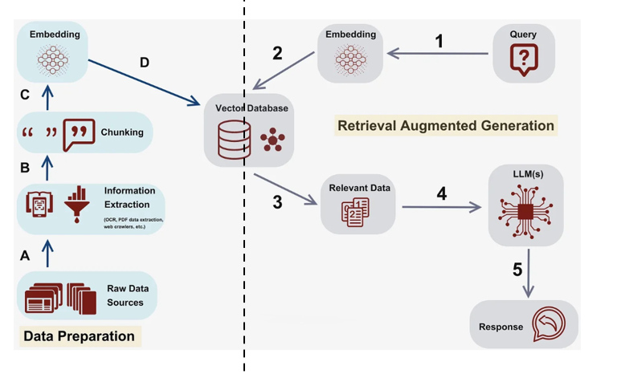
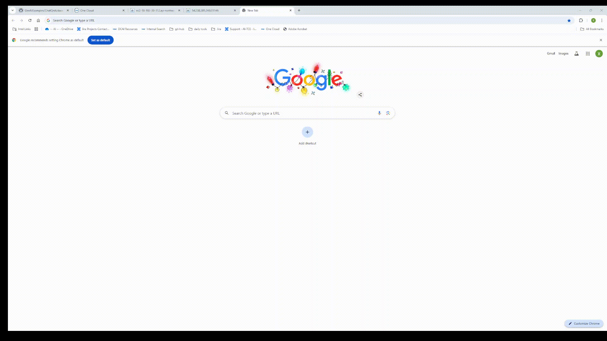
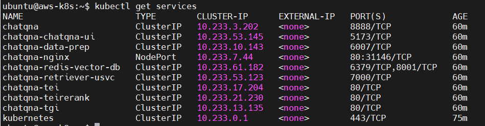
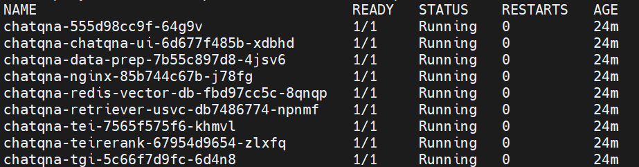

# Build Your ChatBot with Open Platform for Enterprise AI

## Generative AI: A Transformational Force for Enterprises

Generative AI demonstrates immense potential in enhancing productivity and driving innovation across various industries. Its ability to address enterprise challenges by offering innovative and efficient solutions makes it a powerful tool for businesses seeking a competitive edge.

Here are several ways in which generative AI can assist enterprises:

* **Data Analysis and Insights**: By analyzing vast amounts of enterprise data, generative AI can uncover patterns, provide actionable insights, and support better decision-making processes.

* **Document Management**: Generative AI streamlines the organization, summarization, and retrieval of documents, enhancing efficiency in knowledge management systems.

* **Customer Support and Chatbots**: AI-driven chatbots can provide 24/7 customer service, respond to inquiries, and even handle complex issues by understanding user intents and offering personalized solutions.

* **Code Generation and Software Development**: AI models can write code snippets, debug software, and even recommend solutions to programming challenges, accelerating the software development lifecycle.

* **Fraud Detection and Risk Management**: By analyzing transaction patterns and detecting anomalies, generative AI helps enterprises identify and mitigate potential risks or fraudulent activities.

* **Healthcare and Well-being**: In enterprises with healthcare initiatives, generative AI can support mental health programs by generating therapeutic content or helping manage employee well-being through tailored recommendations.

By leveraging generative AI in these areas, enterprises can not only solve existing problems but also unlock new opportunities for innovation and growth.

In this blog, we introduce the Open Platform for Enterprise AI (OPEA), a powerful GenAI framework to help you build your GenAI applications. First, we explore the features and attributes of OPEA, and then we show you how to build your ChatBot with OPEA step by step.

## Open Platform for Enterprise AI

Open Platform for Enterprise AI (OPEA) is an open platform project that allows you to create open, multi-provider, robust, and composable GenAI solutions that harness the best innovations across the ecosystem.

OPEA platform includes:

* Detailed framework of composable building blocks for state-of-the-art generative AI systems including LLMs, data stores, and prompt engines.
* Architectural blueprints of retrieval-augmented generative AI component stack structure and end-to-end workflows.
* A four-step assessment for grading generative AI systems around performance, features, trustworthiness, and enterprise-grade readiness.

OPEA is designed with the following considerations:

**Efficient**
Infrastructure Utilization: Harnesses existing infrastructure, including AI accelerators or other hardware of your choosing.
OPEA supports a wide range of hardware, including Intel Xeon, Gaudi Accelerator, Intel Arc GPU, Nvidia GPU, and AMD RoCm.

**Seamless**
Enterprise Integration: Seamlessly integrates with enterprise software, providing heterogeneous support and stability across systems and networks.

**Open**
Innovation and Flexibility: Brings together best-of-breed innovations and is free from proprietary vendor lock-in, ensuring flexibility and adaptability.

**Ubiquitous**
Versatile Deployment: Runs everywhere through a flexible architecture designed for cloud, data center, edge, and PC environments.

**Trusted**
Security and Transparency: Features a secure, enterprise-ready pipeline with tools for responsibility, transparency, and traceability.

**Scalable**
Ecosystem and Growth: Access to a vibrant ecosystem of partners to help build and scale your solution.

## Build Your ChatBot with OPEA

OPEA [GenAIExamples](https://github.com/opea-project/GenAIExamples) are designed to give developers an easy entry into generative AI, featuring microservice-based samples that simplify the processes of deploying, testing, and scaling GenAI applications.
All examples are fully compatible with Docker and Kubernetes, supporting a wide range of hardware platforms such as Gaudi, Xeon, and NVIDIA GPU, and other hardwares, ensuring flexibility and efficiency for your GenAI adoption.

In this section, we deploy a GenAIExample, ChatQnA, on Amazon Web Services (AWS) in two different ways: **Docker** and **Kubernetes**.

ChatQnA is a Retrieval-Augmented Generation (RAG) chatbot, which integrates the power of retrieval systems to fetch relevant, domain-specific knowledge with generative AI to produce human-like responses. ChatQnA dataflow is shown in Figure 1.

RAG chatbots can address various use cases by providing highly accurate and context-aware interactions, which can be used in customer support, internal knowledge management, finance and accounting, and technical support.


<div align="center">
Figure 1. ChatQnA Dataflow
</div>

### Prerequisites

**Hardware**

* CPU: the 4th (and later) Gen Intel Xeon with Intel (Advanced Matrix Extension) AMX
* Minimum Memory Size: 64G 
* Storage: 100GB disk space

The recommended configurations are Amazon EC2 c7i.8xlarge and c7i.16xlarge instance types. These instances are Intel Xeon with AMX, to leverage 4th Generation (and later) Intel Xeon Scalable processors that are optimized for demanding workloads.

**Software**

* OS: Ubuntu 22.04 LTS

**Required Models:**

By default, the embedding, reranking, and LLM models are set to the following values:

|Service	| Model|
|-----------|---------------------------|
|Embedding	|   BAAI/bge-base-en-v1.5   |
|Reranking  |   BAAI/bge-reranker-base  |
|  LLM	    | Intel/neural-chat-7b-v3-3 |

### Deploy by Docker on AWS EC2 Instance

Here are the steps to deploy ChatQnA using Docker

1. Download code and set up the environment variables.
2. Run docker compose.
3. Consume the ChatQnA service.

#### 1. Download Code and Setup Environment Variable

Follow these steps to download the code and set up environment variables:

```
git clone https://github.com/opea-project/GenAIExamples.git
```

Set the required environment variables:
```
cd GenAIExamples/ChatQnA/docker_compose/intel/cpu/xeon
export HUGGINGFACEHUB_API_TOKEN="Your_Huggingface_API_Token"
source set_env.sh
```

#### 2. Start Docker Container

```
docker compose up -d
```
This command automatically downloads the following Docker images from Docker Hub and starts the Docker container.
|Image name	| tag |
|-----------|---------------------------|
| redis/redis-stack |7.2.0-v9 |
| opea/dataprep-redis | latest|
|  ghcr.io/huggingface/text-embeddings-inference |cpu-1.5|
|  opea/retriever-redis | latest |
|  ghcr.io/huggingface/text-embeddings-inference |cpu-1.5|
|  ghcr.io/huggingface/text-generation-inference |sha-e4201f4-intel-cpu|
|  opea/chatqna |  latest  |
|  opea/chatqna-ui |  latest  |
|  opea/nginx | latest  |

#### Check Docker Container Status

Run this command to check the Docker container status
`docker ps -a`

Make sure all the Docker containers are `UP` as shown below:

```
CONTAINER ID   IMAGE                                                           COMMAND                  CREATED         STATUS          PORTS                                                                                  NAMES
ef155b97ef13   opea/nginx:latest                                               "/docker-entrypoint.…"   3 minutes ago   Up 3 minutes    0.0.0.0:80->80/tcp, :::80->80/tcp                                                      chatqna-xeon-nginx-server
79173ee7a359   opea/chatqna-ui:latest                                          "docker-entrypoint.s…"   3 minutes ago   Up 3 minutes    0.0.0.0:5173->5173/tcp, :::5173->5173/tcp                                              chatqna-xeon-ui-server
bdb99b1263cd   opea/chatqna:latest                                             "python chatqna.py"      3 minutes ago   Up 3 minutes    0.0.0.0:8888->8888/tcp, :::8888->8888/tcp                                              chatqna-xeon-backend-server
7e5c3f8c2bba   opea/retriever-redis:latest                                     "python retriever_re…"   3 minutes ago   Up 3 minutes    0.0.0.0:7000->7000/tcp, :::7000->7000/tcp                                              retriever-redis-server
7e8254869ee4   opea/dataprep-redis:latest                                      "python prepare_doc_…"   3 minutes ago   Up 3 minutes    0.0.0.0:6007->6007/tcp, :::6007->6007/tcp                                              dataprep-redis-server
135e0e180ce5   ghcr.io/huggingface/text-generation-inference:2.4.0-intel-cpu   "text-generation-lau…"   3 minutes ago   Up 41 seconds   0.0.0.0:9009->80/tcp, [::]:9009->80/tcp                                                tgi-service
ffefc6d4ada2   ghcr.io/huggingface/text-embeddings-inference:cpu-1.5           "text-embeddings-rou…"   3 minutes ago   Up 3 minutes    0.0.0.0:6006->80/tcp, [::]:6006->80/tcp                                                tei-embedding-server
17b22a057002   ghcr.io/huggingface/text-embeddings-inference:cpu-1.5           "text-embeddings-rou…"   3 minutes ago   Up 3 minutes    0.0.0.0:8808->80/tcp, [::]:8808->80/tcp                                                tei-reranking-server
cf91b1a4f5d2   redis/redis-stack:7.2.0-v9                                      "/entrypoint.sh"         3 minutes ago   Up 3 minutes    0.0.0.0:6379->6379/tcp, :::6379->6379/tcp, 0.0.0.0:8001->8001/tcp, :::8001->8001/tcp   redis-vector-db

```

#### Check TGI Service Is Ready

It takes a few minutes for the TGI service to download LLM models and perform warm-up inference.

Check the TGI service log to ensure it is ready.

Run this command to check the log:
`docker logs tgi-service | grep Connected`

The following log indicates TGI service is ready.
```
2024-09-03T02:47:53.402023Z  INFO text_generation_router::server: router/src/server.rs:2311: Connected
```

#### Consume the ChatQnA Service

 Please wait until the **tgi-service is ready** before consuming the ChatQnA service

Open the following URL in your browser:

```
http://{Public-IPv4-address}:80
```
Make sure to access the AWS EC2 instance through the `Public-IPv4-address`.


<div align="center">
Figure 2. Access ChatQnA 
</div>


### Deploy by Kubernetes on AWS EC2 Instance

Assume you have set up Kubernetes on the EC2 instance. Please refer to [k8s_install_kubespray](https://github.com/opea-project/docs/blob/main/guide/installation/k8s_install/k8s_install_kubespray.md) to set up Kubernetes.

Here are the steps to deploy ChatQnA using Kubernetes:

1. Download code and set up the environment variables.
2. Start kubernetes Services 
3. Consume the ChatQnA service.

#### 1. Download Code and Setup Environment Variable

Follow these steps to download the code and set up environment variables:

(Skip this if you have already downloaded the code)
```
git clone https://github.com/opea-project/GenAIExamples.git
```

Set the required environment variables:
```
cd GenAIExamples/ChatQnA/kubernetes/intel/cpu/xeon/manifest
export HUGGINGFACEHUB_API_TOKEN="YourOwnToken"
sed -i "s|insert-your-huggingface-token-here|${HUGGINGFACEHUB_API_TOKEN}|g" chatqna.yaml
```
#### 2. Start Kubernetes Services

```
kubectl apply -f chatqna.yaml
```
##### Check Kubernetes Status

1. Check the services status to get the port number to access ChatQnA:
```
kubectl get services
```


<div align="center">
Figure 3. Kubernetes Service
</div>
The nginx nodeport is **31146**.

2. Check the pod status
```
kubectl get pods
```
Make sure all pods are in the ready state

<div align="center">
Figure 4. Kubernetes Pod Status
</div>

#### Consume the ChatQnA Service

Open the following URL in your browser:
```
http://{Public-IPv4-address}:31146
```

The port number `31146` is from the Kubernetes service `chatqna-nginx` exposed port shown in Figure 2.

For ChatQnA example interaction, please refer to the [consume service section](#Consume-the-ChatQnA-Service) for details.
