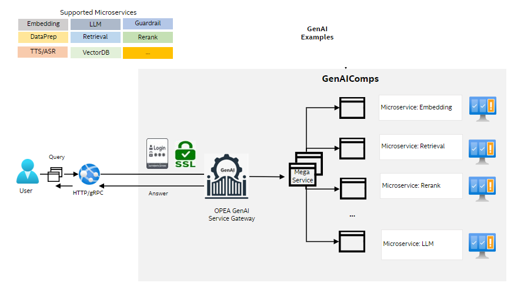
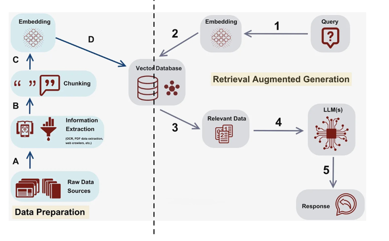
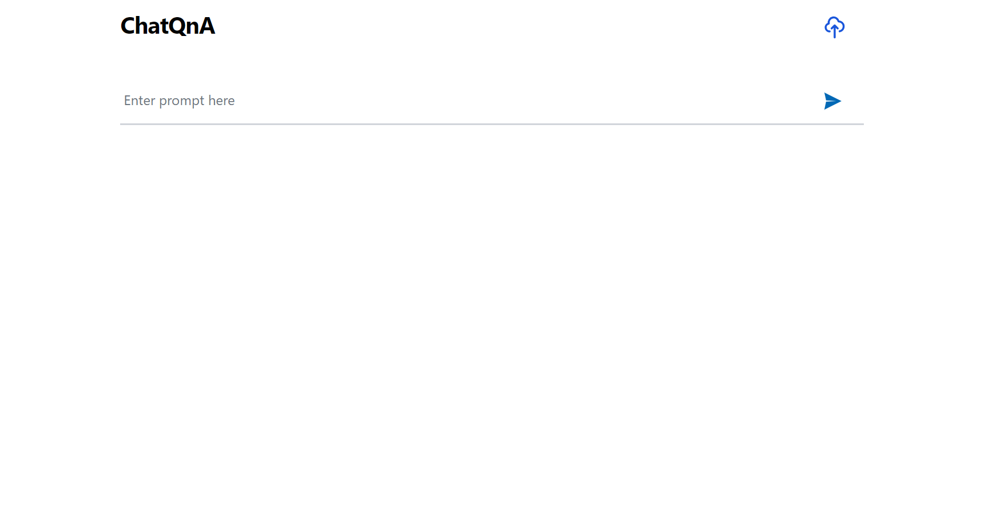

# Build Your ChatBot with Open Platform for Enterprise AI

## Generative AI: A Transformational Force for Enterprises

Generative AI demonstrates immense potential in enhancing productivity and driving innovation across various industries. Its ability to address enterprise challenges by offering innovative and efficient solutions makes it a powerful tool for businesses seeking a competitive edge.

Here are several ways in which generative AI can assist enterprises:

* Data Analysis and Insights: By analyzing vast amounts of enterprise data, generative AI can uncover patterns, provide actionable insights, and support better decision-making processes.

* Document Management: Generative AI streamlines the organization, summarization, and retrieval of documents, enhancing efficiency in knowledge management systems.

* Customer Support and Chatbots: AI-driven chatbots can provide 24/7 customer service, respond to inquiries, and even handle complex issues by understanding user intents and offering personalized solutions.

* Code Generation and Software Development: AI models can write code snippets, debug software, and even recommend solutions to programming challenges, accelerating the software development lifecycle.

* Fraud Detection and Risk Management: By analyzing transaction patterns and detecting anomalies, generative AI helps enterprises identify and mitigate potential risks or fraudulent activities.

* Employee Training and Development: AI-powered platforms can create personalized training programs, simulate real-world scenarios, and evaluate employee performance, enhancing skill-building initiatives.

* Healthcare and Well-being: In enterprises with healthcare initiatives, generative AI can support mental health programs by generating therapeutic content or helping manage employee well-being through tailored recommendations.

* Decision-Making Support: Beyond traditional analytics, generative AI can simulate scenarios, model potential outcomes, and offer strategic recommendations to assist leaders in making informed decisions.

By leveraging generative AI in these areas, enterprises can not only solve existing problems but also unlock new opportunities for innovation and growth.

In this blog, we introduce a powerful GenAI framework - Open Platform for Enterprise AI (OPEA) to help you build you GenAI Applications.

First to explore the features and attributes of OPEA and then we show you how to build your ChatBot with OPEA step by step.

## Open Platform for Enterprise AI

Open Platform for Enterprise AI (OPEA) is an open platform project that lets you create open, multi-provider, robust, and composable GenAI solutions that harness the best innovations across the ecosystem.

OPEA platform includes:

* Detailed framework of composable building blocks for state-of-the-art generative AI systems including LLMs, data stores, and prompt engines
* Architectural blueprints of retrieval-augmented generative AI component stack structure and end-to-end workflows
* A four-step assessment for grading generative AI systems around performance, features, trustworthiness, and enterprise-grade readiness

OPEA are desgined with following consideration:

**Efficient**
Infrastructure Utilization: Harnesses existing infrastructure, including AI accelerators or other hardware of your choosing.
It supports a wide range of hardware, including Intel Xeon, Gaudi Accelerator, Intel Arc GPU, Nvidia GPU, and AMD RoCm.

**Seamless**
Enterprise Integration: Seamlessly integrates with enterprise software, providing heterogeneous support and stability across systems and networks.

**Open**
Innovation and Flexibility: Brings together best-of-breed innovations and is free from proprietary vendor lock-in, ensuring flexibility and adaptability.

**Ubiquitous**
Versatile Deployment: Runs everywhere through a flexible architecture designed for cloud, data center, edge, and PC environments.

**Trusted**
Security and Transparency: Features a secure, enterprise-ready pipeline with tools for responsibility, transparency, and traceability.

**Scalable**
Ecosystem and Growth: Access to a vibrant ecosystem of partners to help build and scale your solution.

### OPEA Framework Components

In Figure 1, [GenAIExampls](https://github.com/opea-project/GenAIExamples), the end to end applications, are implemented as MegaService instance. And a Gateway serves as the interface for users to access the Megaservice.


<div align="center">
Figuire 1. GenAIExample Dataflow
</div>

MegaService is a higher-level architectural construct composed of one or more Microservices. Microservice is designed to perform a specific function or task within the application architecture. Microservices are akin to building blocks, offering the fundamental services for constructing AI applications. 

[GenAIComps](https://github.com/opea-project/GenAIComps) provides a suite of microservices, leveraging a service composer to assemble a mega-service tailored for real-world Enterprise AI applications. All the microservices are containerized, allowing cloud native deployment.

GenAICompos micro-service covered Embedding, Retriver, Reranking, Large Language Modle (LLM) Data-prepration,Text2Image, Image2Video, Agent, intent detection, texttosql, Text2Speech(TTS), Automatic Speech Recognition (ASR) etc.
You can find all the [comps](https://github.com/opea-project/GenAIComps/tree/main/comps) here.
~~supports Intel Xeon Data Center CPU, Gauid Accelatator, Intel Arc GPU, AIPC, Nivdia GPU and AMD RoCm GPU.~~

## Build Your ChatBot with OPEA
A Retrieval-Augmented Generation (RAG) chatbot (Figure 2) integrates the power of retrieval systems to fetch relevant, domain-specific knowledge with generative AI to produce human-like responses.


<div align="center">
Chatbot Dataflow
</div>

RAG chatbots can address various use cases by providing highly accurate and context-aware interactions. RAG Chatbot 
used in customer support and service, internal knowledge management, Finance and Accounting as well as technical support etc.

### Prerequisites

**Hardware**

* 4th (and later) Gen Intel Xeon with Intel AMX

  We recommened Amazon EC2 M7i or M7i-flex instance type to leverage 4th Generation Intel Xeon Scalable processors that are optimized for demanding workloads.

**Software**

* OS Ubuntu 22.04 LTS

**Required Models:**

By default, the embedding, reranking and LLM models are set to a default value as listed below:

|Service	| Model|
|-----------|---------------------------|
|Embedding	|   BAAI/bge-base-en-v1.5   |
|Reranking  |	BAAI/bge-reranker-base    |
|  LLM	    | Intel/neural-chat-7b-v3-3 |

### Quick Start Deployment Steps:

1. Download code and set up the environment variables.
2. Run docker compose.
3. Consume the ChatQnA service.

#### Download Code and Setup Environment Variable

To download code set up environment variables for deploying ChatQnA services, follow these steps:

```
git clone https://github.com/opea-project/GenAIExamples.git
cd GenAIExamples/ChatQnA/docker_compose/intel/cpu/xeon
```

Set the required environment variables:
```
# Example: host_ip="10.1.1.1"
export host_ip="External_Public_IP"
export HUGGINGFACEHUB_API_TOKEN="Your_Huggingface_API_Token"

source set_env.sh
```

#### Run Docker Compose

```
docker compose up -d
```

It will auto matically download following docker images from docker hub and start up docker container.
|Image name	| tag |
|-----------|---------------------------|
| redis/redis-stack |7.2.0-v9 |
| opea/dataprep-redis | latest|
|  ghcr.io/huggingface/text-embeddings-inference |cpu-1.5|
|  opea/retriever-redis | latest |
|  ghcr.io/huggingface/text-embeddings-inference |cpu-1.5|
|  ghcr.io/huggingface/text-generation-inference |sha-e4201f4-intel-cpu|
|  opea/chatqna |  latest  |
|  opea/chatqna-ui |  latest  |
|  opea/nginx | latest  |

#### Check TGI Service Is Ready

It takes TGI service minutes to download LLM models and warm up inference.

Check the TIG service log: 
`docker logs tgi-service | grep Connected`

**Consume ChatQnA service until you get the TGI response like below:**

```
2024-09-03T02:47:53.402023Z  INFO text_generation_router::server: router/src/server.rs:2311: Connected
```

#### Consume the ChatQnA Service.

Open the following URL in your browser: http://{host_ip}:80.


<div align="center">
Chatbot UI Examples
</div>
