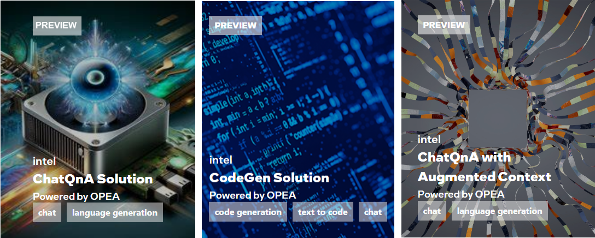

.. _OPEA_GSG:

Getting Started with OPEA
#########################

The OPEA ecosystem consists of several complete :ref:`GenAI Examples <GenAIExamples>`
put together using building-block like :ref:`GenAI microservices <GenAIMicroservices>`.
You can run these examples as provided, and then customize them to your own
implementation needs. You can also build your own solutions from scratch
using these microservices.

See these and other Powered by OPEA solutions in action on the
`AI Explorer`_ site, hosted by Intel:

.. _AI Explorer: https://aiexplorer.intel.com/explore

-----

.. contents::
   :local:
   :depth: 1

Get Started
***********

Prerequisites
=============

* Python
* Docker
* HuggingFace API Token
* Prometheus and Grafana (optional, needed for evaluation purposes)

1. **Determine where you will run your solution.**

   a. Basic deployment options suitable for proof of concept using a single
      node:

      * An AI enabled PC with adequate memory, using a single container engine
        such as Docker or Podman.
      * A virtual machine or physical server, which could be local or in a Cloud
        Service Provider (CSP) environment

      We have tested using Intel Xeon servers that are X86-based, Intel Gaudi2,
      and Nvidia H100.

   b. Production ready environments are typically multi-node to handle scale and
      resiliency.

      * Onprem or cloud based cluster environments running Kubernetes as the
        orchestrator

      We have tested using Kubernetes environments.

2. **Deploy a simple chatbot application using the OPEA ChatQnA example into your
   environment.**

3. **Customize the chatbot with your own data (RAG model)**.

4. **Evaluate the performance and accuracy of your chatbot project.**

   * A four-step assessment for grading generative AI systems around
     performance, features, trustworthiness, and enterprise-grade readiness.

Next Steps
==========

* Explore additional :ref:`GenAI Examples <GenAIExamples>`
* Build your own solution using :ref:`GenAI microservices <GenAIMicroservices>`
* Get involved and contribute to the :ref:`OPEA open source community <OPEA_community>`

Like What You See? Get Involved!
********************************

Do you have ideas and skills to build out GenAI component microservices and
solutions, their evaluation, or support? Want to be part of this evolving
technology in its early stages? Get involved!

Get Involved
============

Register to join our mailing lists that interest you:
  * General: https://lists.lfaidata.foundation/g/OPEA-announce
  * Technical Discussions: https://lists.lfaidata.foundation/g/OPEA-technical-discuss

Subscribe to working group mailing lists
  * End user https://lists.lfaidata.foundation/g/OPEA-End-User
  * Evaluation https://lists.lfaidata.foundation/g/OPEA-Evaluation
  * Community https://lists.lfaidata.foundation/g/OPEA-Community
  * Research https://lists.lfaidata.foundation/g/OPEA-Research
  * Security https://lists.lfaidata.foundation/g/OPEA-Security

Visit the :ref:`OPEA_Community` documentation for Contribution Guidelines and
step by step instructions.

Attend any of our community events and hackathons found at our
`Community Events <https://opea.dev/community-events>`_ page and register to
stay updated.

Want to Go Deeper?
==================

Are you ready to partner with members of the OPEA community on new initiatives
and GenAI technologies based on new use cases or segment specific
implementations?

Current GenAI Examples
----------------------

.. list-table::

   * - :doc:`/GenAIExamples/ChatQnA/README`
     - Simple chatbot that uses retrieval augmented generation (RAG) architecture.
   * - :doc:`/GenAIExamples/CodeGen/README`
     - Code generation, from enabling non-programmers to generate code to
       improving productivity with code completion of complex application.
   * - :doc:`/GenAIExamples/CodeTrans/README`
     - Make your applications more flexible by porting to different languages.
   * - :doc:`/GenAIExamples/DocSum/README`
     - Create summaries of news articles, research papers, technical documents,
       etc. to streamline content systems.
   * - :doc:`/GenAIExamples/SearchQnA/README`
     - Mimic human behavior by iteratively searching, selecting, and
       synthesizing information across large bodies of content.
   * - :doc:`/GenAIExamples/FaqGen/README`
     - Provide critical content to your customers by automatically generating
       Frequently Asked Questions (FAQ) resources.
   * - :doc:`/GenAIExamples/VisualQnA/README`
     - Provide text descriptions from pictures, enabling your users to inquire
       directly about products, services, sites, etc.
   * - :doc:`/GenAIExamples/Translation/README`
     - Reduce language barriers through customizable text translation systems.

