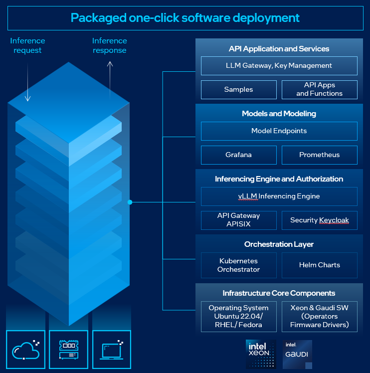
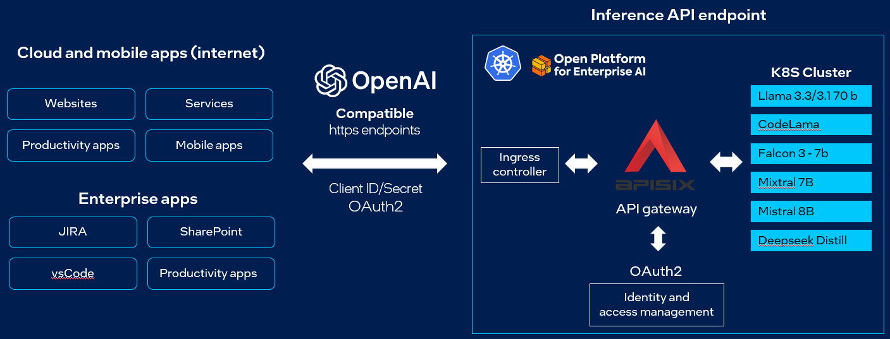

.. _EnterpriseInference_Guide:

Enterprise Inference Guide
##########################

Overview
********
`Intel® AI for Enterprise Inference <https://www.intel.com/content/www/us/en/products/docs/accelerator-engines/enterprise-ai.html>`_ is aimed to streamline and enhance the deployment and management of AI inference services on Intel hardware. 
Utilizing the power of Kubernetes Orchestration, this solution automates the deployment of LLM models to run faster inference, provision compute resources, and configure the optimal settings to minimize the complexities and reduce manual efforts.

It supports a broad range of Intel hardware platforms, including Intel® Xeon® Scalable processors and Intel® Gaudi® AI Accelerators, ensuring flexibility and scalability to meet diverse enterprise needs.

Intel® AI for Enterprise Inference, powered by OPEA, is compatible with OpenAI standard APIs, enabling seamless integration to enterprise applications both on-premises and in cloud-native environments. 
This compatibility allows businesses to leverage the full capabilities of Intel hardware while deploying AI models with ease. 
With this suite, enterprises can efficiently configure and evolve their AI infrastructure, adapting to new models and growing demands effortlessly.

How It Works
************
With a single click, Intel® AI for Enterprise Inference leverages several key components to streamline AI inference deployment and management:

- **Kubernetes**: Acts as the backbone of the solution, providing container orchestration to automate the deployment, scaling, and management of AI inference services. Kubernetes ensures high availability and efficient resource utilization across the cluster.

- **Intel Gaudi Base Operator**: For deployments utilizing Intel® Gaudi® AI Accelerators, this operator manages the lifecycle of Habana AI resources within the Kubernetes cluster. It optimizes the utilization of Gaudi hardware for AI workloads, ensuring peak performance. (Applicable only to Gaudi-based deployments.)

- **Ingress NGINX Controller**: Serves as a high-performance reverse proxy and load balancer, routing incoming requests to the appropriate services within the cluster. This ensures seamless access to deployed AI models and efficient traffic management.

- **Keycloak**: Provides robust identity and access management capabilities, enabling secure authentication and authorization for accessing AI services and resources within the cluster.

- **APISIX**: Functions as a cloud-native API gateway, handling API traffic with advanced features such as caching and authentication. It ensures efficient and secure access to deployed AI models.

- **Observability**: Offers comprehensive monitoring and visibility into the performance, health, and resource utilization of deployed applications and cluster components. It provides metrics, visualization, and alerting capabilities to maintain operational excellence.

- **Model Deployments**: Automates the deployment and management of AI LLM models within the Kubernetes inference cluster. This enables scalable and reliable AI inference capabilities, allowing enterprises to adapt to growing demands and new models effortlessly.

After deployment, the models can be accessed using an OpenAI API with an https endpoint. This endpoint and API key are all that is needed to do inference with these deployed models.

Setting Up a Remote Server or Cluster
*************************************
The first step is to get access to the hardware platform of choice:
    - Intel® Gaudi® AI Accelerators
    - Intel® Xeon® Scalable processors

This can be an on-premises machine or from a cloud service provider. All options for deployment can be found `here <https://www.intel.com/content/www/us/en/products/docs/accelerator-engines/enterprise-ai.html>`_.

Note down the HTTPS endpoint and generate an access token or API key. 
The HTTPS endpoint may look something like this: https://api.example.com.
This access token will be used as the API key to securely access the deployed models.

Using Remote Endpoints on OPEA GenAIExamples
********************************************
OPEA GenAIExamples by default will download and deploy the models on the hardware platform locally.
To use remote endpoints on OPEA GenAIExamples, configure the application to instead interact with models deployed on a remote server or cluster by specifying the HTTPS endpoint and providing the API key.

For all GenAIExamples, set the following environment variables:
    - `REMOTE_ENDPOINT` is the HTTPS endpoint of the remote server with the model of choice (i.e. https://api.example.com/<your-deployed-model>). The name of the deployed model can be found by finding the APISIX route with `kubectl get apisixroutes`. **Note:** If using LiteLLM, the model does not need to be specified. LiteLLM is not used by default.
    - `API_KEY` is the access token or key to access the model(s) on the server.

.. code-block:: bash

    export REMOTE_ENDPOINT=<your-http-endpoint>
    export API_KEY=<your-api-key>

Depending on the GenAIExample, the next steps may be different. For each section, see the list for the GenAIExample of interest.

1. Endpoints with Megaservices
++++++++++++++++++++++++++++++
This section applies to the following GenAIExamples:
    - AudioQnA
    - ChatQnA
    - CodeGen
    - CodeTrans
    - DocSum
    - Productivity Suite

Set additional environment variable(s):
    - `LLM_MODEL_ID` is the model card which may need to be overwritten depending on what it is set to `set_env.sh`.

.. code-block:: bash

    export LLM_MODEL_ID=<model-id-deployed-on-remote-server>

Run *docker compose* for the example using *compose_remote.yaml* **instead** of the default *compose.yaml*:

.. code-block:: bash

    docker compose -f compose_remote.yaml up -d

2. Endpoints with Microservices
+++++++++++++++++++++++++++++++
This section applies to the following GenAIExamples:
    - AgentQnA
    - FinanceAgent
    - WorkflowExecAgent

Set additional environment variable(s) depending on the example:

.. list-table:: Environment Variables for GenAIExamples
    :header-rows: 1

    * - GenAIExample
      - Environment Variable(s)
    * - AgentQnA
      - export model=<model-card>
    * - FinanceAgent
      - export OPENAI_LLM_MODEL_ID=<model-card>

Run *docker compose* for the example by **appending** the *compose_remote.yaml* file to the original command:

.. code-block:: bash

    docker compose -f compose_openai.yaml -f compose_remote.yaml up -d

Next Steps
**********
Go back to the GenAIExample's tutorial or README to access the UI and interact with it. 
The LLM text generation is now handled on a remote server, reducing the burden and resources used on the hardware platform hosting the application. 
Consider trying other models and using these remote endpoints to power other and multiple GenAI applications simultaneously.
