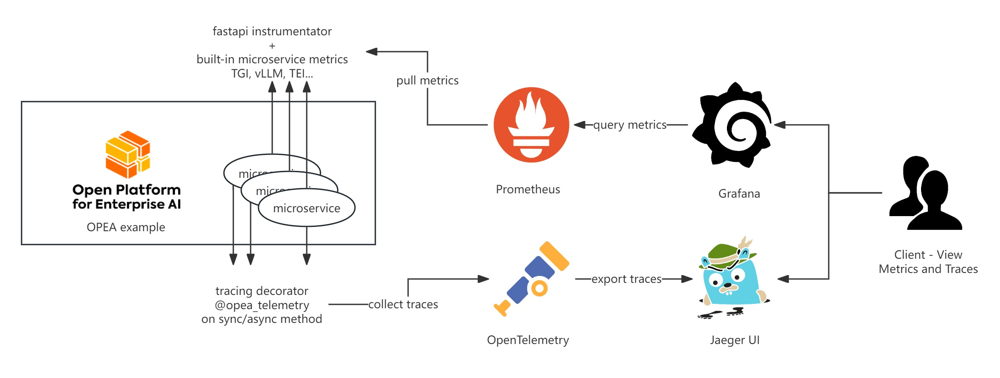
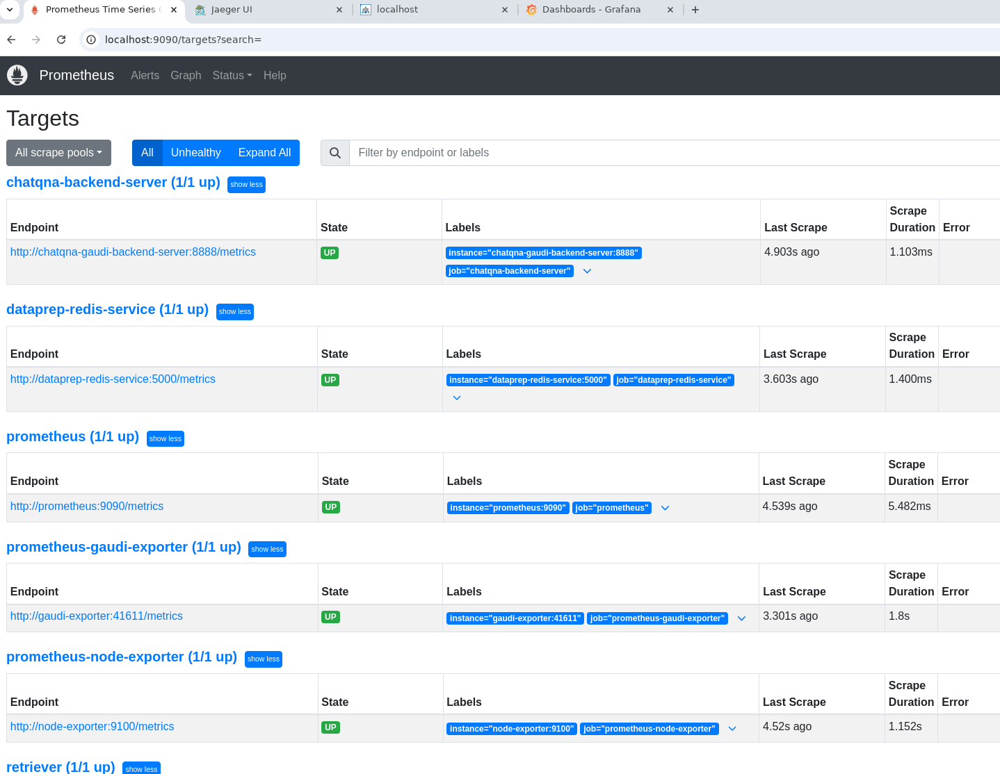
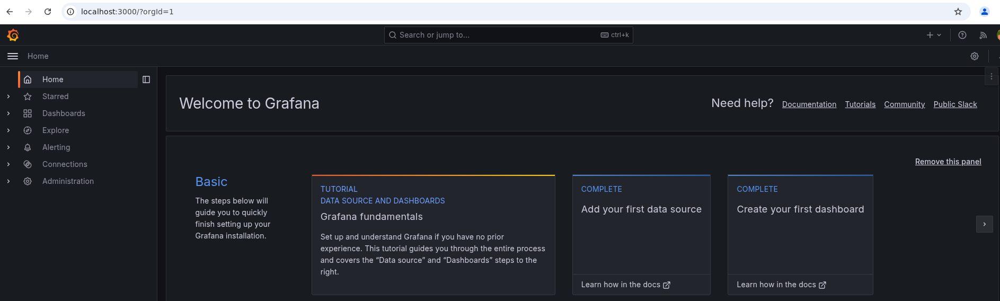
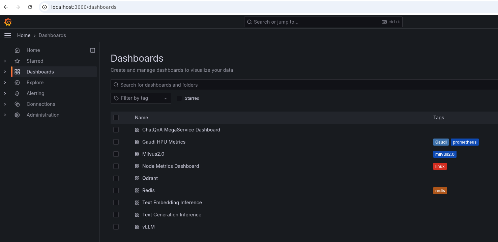
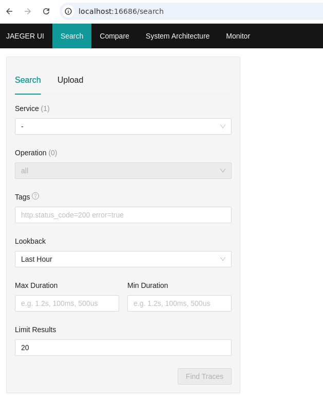
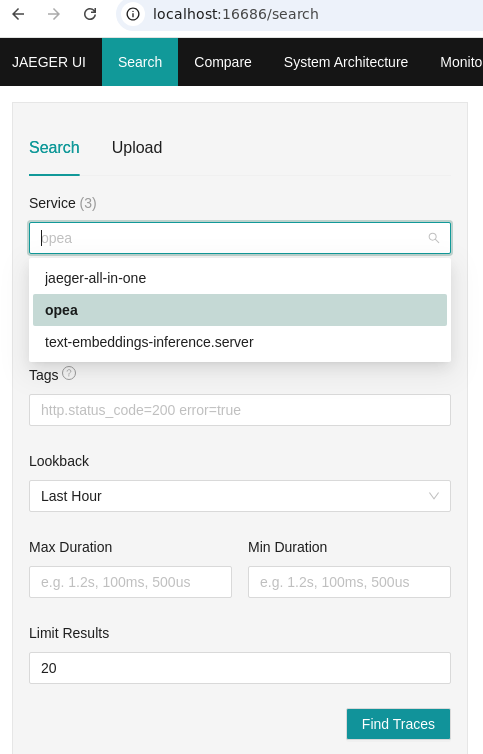
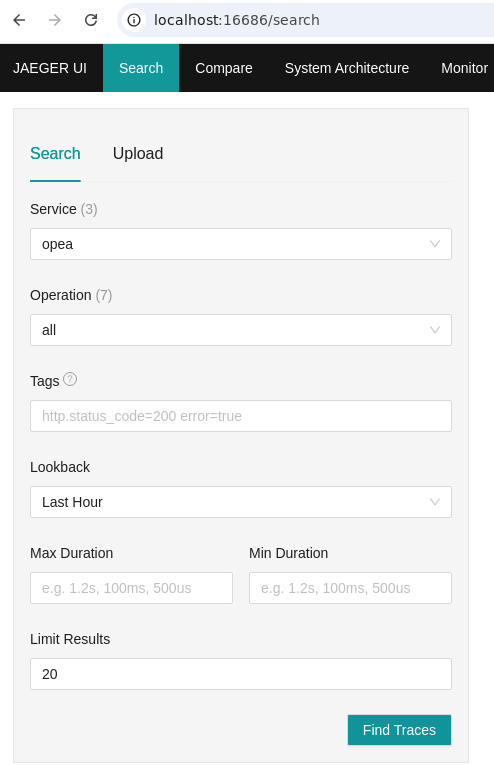

.. _OpenTelemetry_OPEA_Guide:

OpenTelemetry on OPEA Guide
#############################

Overview
********
OpenTelemetry (also referred to as OTel) is an open source observability framework made up of a collection of tools, APIs, and SDKs.
OTel enables developers to instrument, generate, collect, and export telemetry data for analysis and to understand software performance and behavior.
The telemetry data can come in the form of traces, metrics, and logs.
OPEA integrates OpenTelemetry's metrics and tracing capabilities to enhance its telemetry support, providing users with valuable insights into system performance.

How It Works
************
OPEA Comps offers telemetry functionalities for metrics and tracing by integrating with tools such as Prometheus, Grafana, and Jaeger. Below is a brief introduction to the workflows of those tools:

The majority of OPEA's micro and mega services are equipped to support OpenTelemetry metrics, which are exported in Prometheus format via the /metrics endpoint.
For further guidance, please refer to the section on `Telemetry Metrics <https://github.com/opea-project/GenAIComps/tree/main/comps/cores/telemetry#metrics>`_.
Prometheus plays a crucial role in collecting metrics from OPEA service endpoints, while Grafana leverages Prometheus as a data source to visualize these metrics on pre-configured dashboards.

OPEA also supports OpenTelemetry tracing, with several OPEA GenAIExamples instrumented to trace key functions such as microservice execution and LLM generations.
Additionally, HuggingFace's Text Embedding Inference and Text Generation Inference services are enabled for select OPEA GenAIExamples.
The Jaeger UI monitors trace events from OPEA microservices, TEI, and TGI. Once Jaeger endpoints are configured in OPEA microservices, TEI, and TGI,
trace data will automatically be reported and visualized in the Jaeger UI.

How to Monitor
****************

OpenTelemetry metrics and tracing currently can be visualized through one of three primary monitoring UI web pages.

1. Prometheus
+++++++++++++++

The Prometheus UI provides insights into which services have active metrics endpoints.
By default, Prometheus operates on port 9090.
You can access the Prometheus UI web page using the following URL.

.. code-block:: bash

   http://${host_ip}:9090/targets

Services with accessible metrics endpoints will be marked as "up" in Prometheus.
If a service is marked as "down," Grafana Dashboards will be unable to display the associated metrics information.

2. Grafana
+++++++++++++++

The Grafana UI displays telemetry metrics through pre-defined dashboards, providing a clear visualization of data.
For OPEA examples, Grafana is configured by default to use Prometheus as its data source, eliminating the need for manual setup.
The Grafana UI web page can be accessed using the following URL.

.. code-block:: bash

   http://${host_ip}:3000

To view the pre-defined dashboards, click on the "Dashboard" tab located on the left-hand side of the Grafana UI.
This will allow you to explore the available dashboards to visualize telemetry metrics. They also serve as examples that you can customize.

Detailed explanations for understanding each dashboard are provided within the telemetry sections of the respective GenAIExamples.
These sections offer insights into how to interpret the data and utilize the dashboards effectively for monitoring and analysis.

.. toctree::
   :maxdepth: 1

   ChatQnA <deploy/ChatQnA>
   AgentQnA <deploy/AgentQnA>

3. Jaeger
+++++++++++++++

The Jaeger UI is instrumental in understanding function tracing for each request, providing visibility into the execution flow and timing of microservices.
OPEA traces the execution time for each microservice and monitors key functions within them.
By default, Jaeger operates on port 16686.
The Jaeger UI web page could be accessed using the following URL.

.. code-block:: bash

   http://${host_ip}:16686

Traces will only appear in the Jaeger UI if the relevant functions have been executed.
Therefore, without running the example, the UI will not display any trace data.

Once the example is run, refresh the Jaeger UI webpage, and the OPEA service should appear under the "Services" tab,
indicating that trace data is being captured and displayed.

Select "opea" as the service, then click the "Find Traces" button to view the trace data associated with the service's execution.

All traces will be displayed on the UI.
The diagram in the upper right corner provides a visual representation of all requests along the timeline. Meanwhile,
the diagrams in the lower right corner illustrate all spans within each request, offering detailed insights into the execution flow and timing.

.. image:: assets/jaeger_ui_opea_chatqna_1req.png
  :width: 800
  :alt: Alternative text

Detailed explanations for understanding each Jaeger diagrams are provided within the telemetry sections of the respective GenAIExamples.
These sections offer insights into how to interpret the data and utilize the dashboards effectively for monitoring and analysis.

.. toctree::
   :maxdepth: 1

   ChatQnA <deploy/ChatQnA>
   AgentQnA <deploy/AgentQnA>

Code Instrumentations for OPEA Tracing
****************************************

Enabling OPEA OpenTelemetry tracing for a function is straightforward.
First, import opea_telemetry, and then apply the Python decorator @opea_telemetry to the function you wish to trace.
Below is an example of how to trace your_func using OPEA tracing:

.. code-block:: python

   from comps import opea_telemetry

   @opea_telemetry
   async def your_func():
      pass

OpenTelemetry on GenAIExamples
******************************

In the OpenTelemetry-enabled GenAIExamples, OpenTelemetry Metrics is activated by default, while OpenTelemetry Tracing is initially disabled.
Similarly, the Telemetry UI services, including Grafana, Prometheus, and Jaeger, are also disabled by default.
To enable OTel tracing along with Grafana, Prometheus, and Jaeger you need to include an additional telemetry Docker Compose YAML file.
For instance, adding compose.telemetry.yaml alongside compose.yaml will activate all telemetry features for the example.

.. code-block:: bash

   source ./set_env.sh
   docker compose -f compose.yaml -f compose.telemetry.yaml up -d

Below are the GenAIExamples that include support for Grafana, Prometheus, and Jaeger services.

.. toctree::
   :maxdepth: 1

   ChatQnA <deploy/ChatQnA>
   AgentQnA <deploy/AgentQnA>
