# OpenTelemetry on AgentQnA Application

Each microservice in AgentQnA is instrumented with opea_telemetry, enabling Jaeger to provide a detailed time breakdown across microservices for each request.  
Additionally, AgentQnA features a pre-defined Grafana dashboard for its Agent services like the React Agent service, alongside a vLLM Grafana dashboard.  
A dashboard for monitoring CPU statistics is also available, offering comprehensive insights into system performance and resource utilization.  

# Table of contents

1. [Telemetry Tracing with Jaeger on Gaudi](#telemetry-tracing-with-jaeger-on-gaudi)
2. [Telemetry Metrics with Grafana on Gaudi](#telemetry-metrics-with-grafana-on-gaudi)

## Telemetry Tracing with Jaeger on Gaudi

Initially, all agents in the example are set up.  
In the scenario below, the React Agent, SQL Agent, and RAG Agent are utilized within the AgentQnA example.  
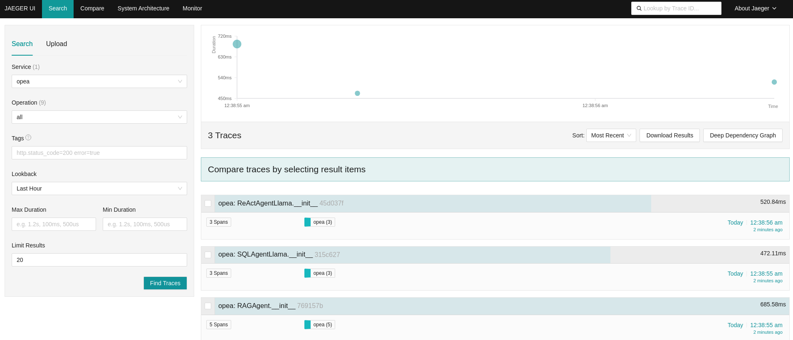  

By expanding the React Agent, the ReactAgentNodeLlama is identified as the core function implementing the ReactAgent.   
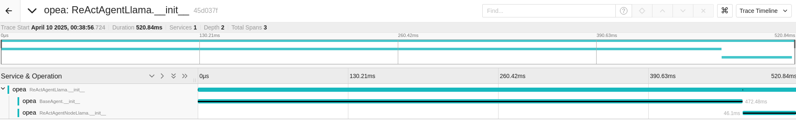  

Follow the steps in [AgentQnA validate services session](https://github.com/opea-project/GenAIExamples/tree/main/AgentQnA#validate-services) to test the AgentQnA application with some pre-defined questions.
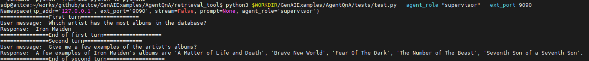  

Once the agents respond to the two questions, four traces will be displayed along the timeline.  
Initially, the ReActAgentNodeLlama from the React Agent is invoked for each question, followed by a call to the AgentNodeLlama from the SQL Agent.   
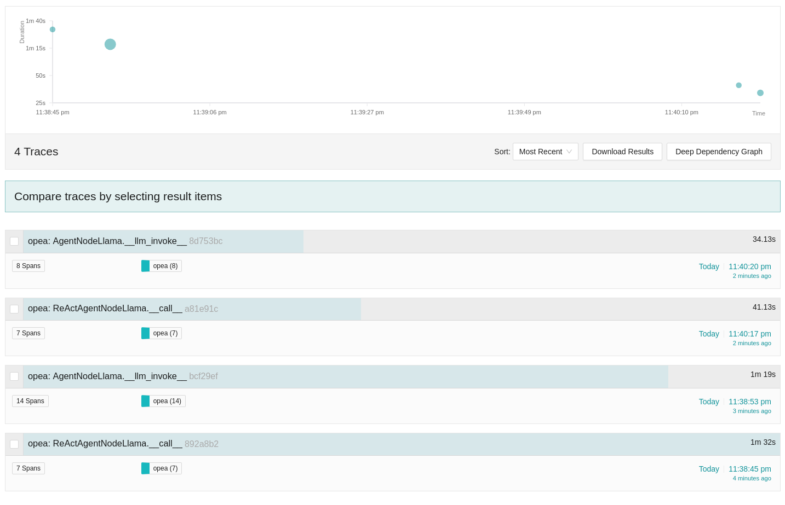

For the first question, the ReActAgentNodeLlama is invoked initially.  
Upon expanding the function, it utilizes a language model (LLM) for reasoning to decide which actions to take.  
Subsequently, it calls the 'search_sql_database' tool. After obtaining results from the 'search_sql_database',  
the function employs the LLM again to reason whether additional actions are necessary or if it can conclude the process.    
  

In the AgentNodeLlama trace, the 'search_sql_database' tool retrieves data from the SQL database.  
Within each AgentNodeLlama __call__ function, the language model (LLM) is then employed to reason about the next steps,  
determining how to proceed based on the data obtained.  
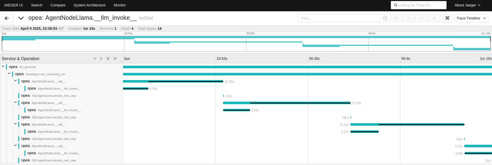  

For the second question, the ReActAgentNodeLlama is invoked first, following a similar process follow as in the first question.  
The 'search_sql_database' tool is called to retrieve relevant data, and the language model (LLM) is used to reason through the subsequent steps.   
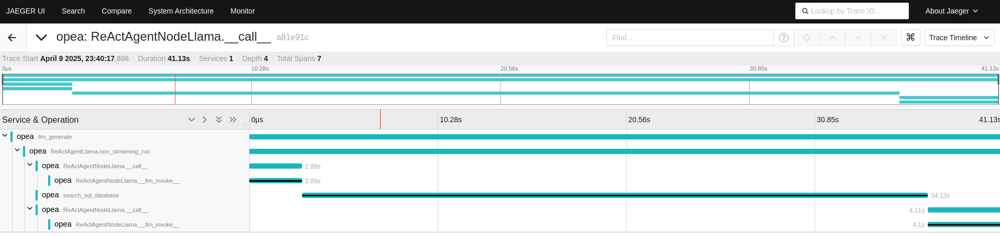    

Fewer reasoning steps are required to answer the second question compared to the first.  
By tracing these functions, it becomes easier to understand the number of reasoning steps involved across the different questions.  
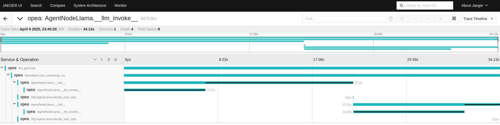  

The OPEA Agent components allow for the integration of new tools into the React Agent when existing tools fail to provide answers.  
We demonstrate how the React Agent utilizes different tools to obtain optimal answers by modifying a pre-defined question.  
The modification leaves the React Agent unable to find answers in both the SQL and RAG databases.  
Consequently, the React Agent must employ the newly added web search tool to address the question regarding the most streamed albums on Spotify in 2024.   

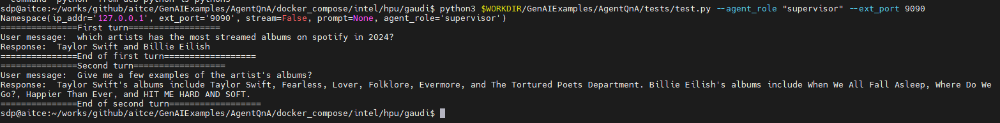

After the agents respond to the two questions, four traces are displayed along the timeline.  
For the first question, the ReActAgentNodeLlama from the React Agent is invoked as an 'opea: llm_generate' trace, while the SQL Agent is not called.  
In contrast, for the second question, the ReActAgentNodeLlama from the React Agent is called first, followed by two calls to the AgentNodeLlama from the SQL Agent.  
The SQL Agent's traces contain more spans because it continues reasoning extensively, as no answer can be found in the SQL database.  
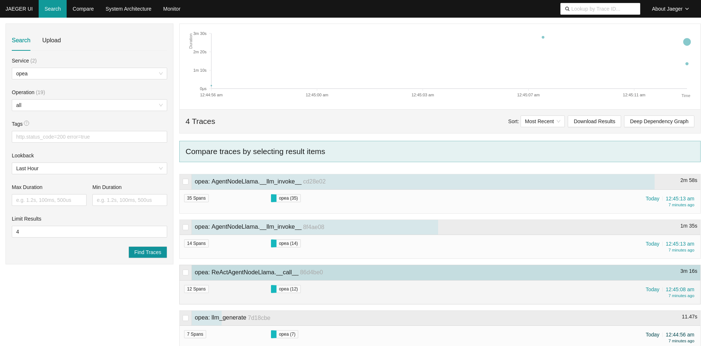  

For the first question, the llm_generate function from the React Agent is called initially.  
Upon expanding the function, it utilizes a language model (LLM) for reasoning to determine the appropriate actions, opting to use the 'search_web_base' tool instead of 'search_sql_database'. 
Since the answer is available only on the web and not in the SQL database, the React Agent retrieves results from 'search_web_base'.   
It then employs the LLM to reason whether additional actions are necessary or if it can conclude the process.   
If the React Agent were to use other tools instead of 'search_web_base', additional reasoning steps would be required.   
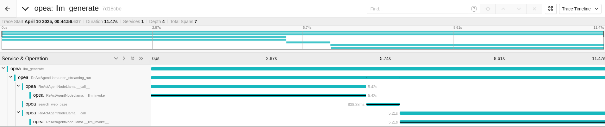   

For the second question, the React Agent initially utilized the 'search_sql_database' tool instead of 'search_web_base'.  
The SQL Agent spent approximately two minutes on reasoning, but it was unable to find an answer.  
After the 'search_sql_database' tool failed to provide an answer, the React Agent switched to the 'search_web_base' tool, quickly locating the answer.    
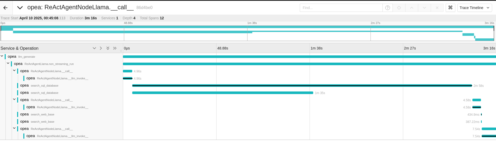  

By examining the AgentNodeLlama trace from the SQL Agent, it is evident that numerous reasoning steps occurred due to the inability to find a suitable answer in the SQL database.  
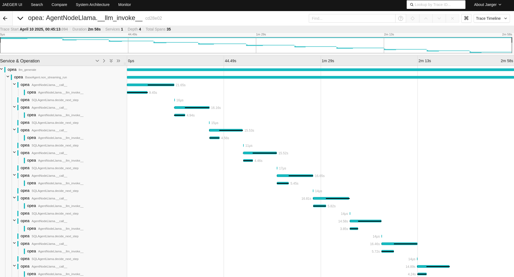

## Telemetry Metrics with Grafana on Gaudi

The AgentQnA application offers several useful dashboards that provide valuable insights into its performance and operations.  
These dashboards are designed to help monitor various aspects of the application, such as service execution times, resource utilization, and system health,  
enabling users to effectively manage and optimize the application.  

### AgentQnA MicroServices Dashboard

This dashboard provides metrics for services within the AgentQnA microservices.
By clicking the job_name, supported service names such as supervisor-react-agent, worker-rag-agent and worker-sql-agent will be shown.  
Select one of the supported services from the list.  
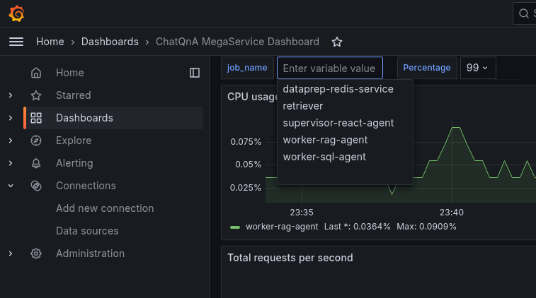

The supervisor-react-agent service is highlighted with its average response time displayed across multiple runs on React Agent.
Additionally, the dashboard presents CPU and memory usage statistics for the React Agent,
offering a comprehensive view of its performance and resource consumption.
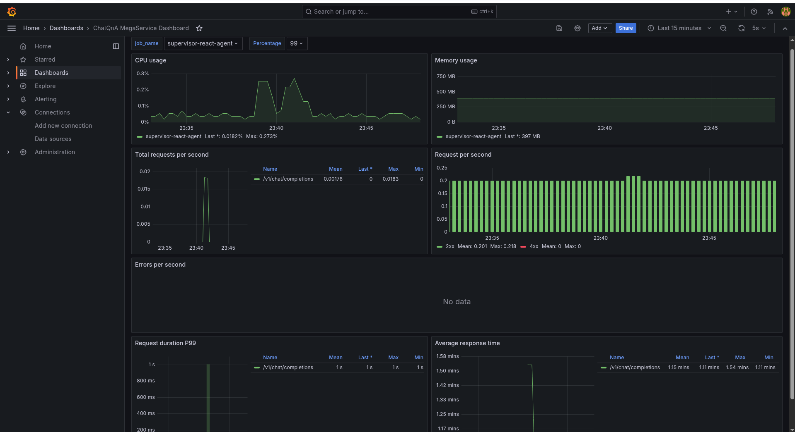

Similarly, the average response time latency for the worker-sql-agent will be displayed on its dashboard.  
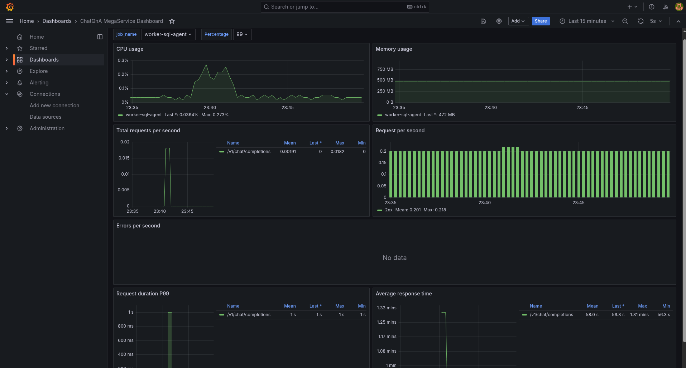  

### LLM Dashboard  

This dashboard presents metrics for the LLM service, including key performance indicators such as request latency, time per output token latency,
and time to first token latency, among others.
These metrics offer valuable insights into the efficiency and responsiveness of the LLM service,
helping to identify areas for optimization and ensuring smooth operation.

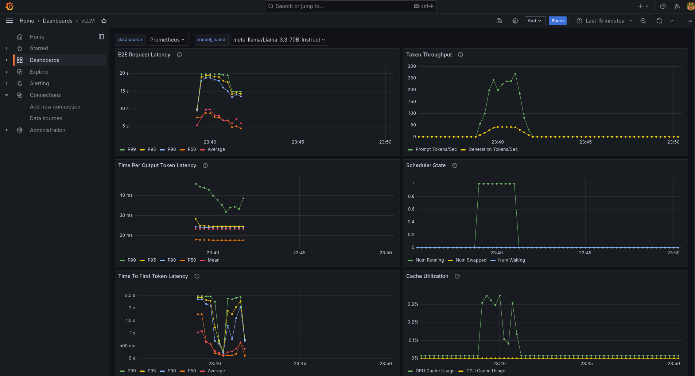  

The dashboard also displays metrics for request prompt length and output length.  
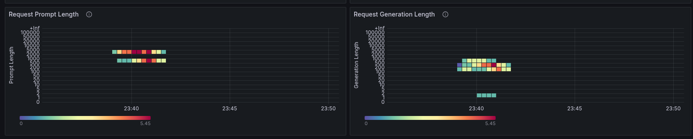  
