# OpenTelemetry on ChatQnA Application

Each microservice in ChatQnA is instrumented with opea_telemetry, enabling Jaeger to provide a detailed time breakdown across microservices for each request.
Additionally, ChatQnA features a pre-defined Grafana dashboard for its megaservice, alongside a vLLM Grafana dashboard.
A dashboard for monitoring CPU statistics is also available, offering comprehensive insights into system performance and resource utilization.

## Table of contents

1. [Telemetry Tracing with Jaeger on Gaudi](#telemetry-tracing-with-jaeger-on-gaudi)
2. [Telemetry Metrics with Grafana on Gaudi](#telemetry-metrics-with-grafana-on-gaudi)

## Telemetry Tracing with Jaeger on Gaudi

After ChatQnA processes a question, two traces should appear along the timeline.
The trace for opea: ServiceOrchestrator.schedule runs on the CPU and includes seven spans, one of which represents the LLM service running on CPU.
For LLM functions executed on Gaudi, stream requests are displayed under opea: llm_generate_stream.
This trace contains two spans: one for the first token and another for all subsequent tokens.

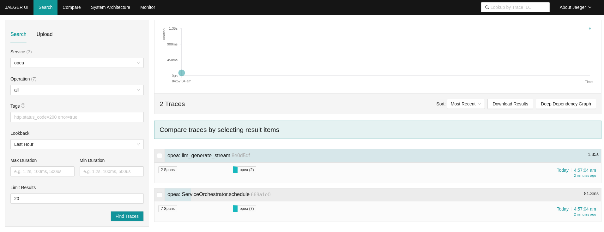

The first trace along the timeline is opea: ServiceOrchestrator.schedule, which runs on the CPU.

It provides insights into the orchestration and scheduling of services within the ChatQnA megaservice, highlighting the execution flow during the process.

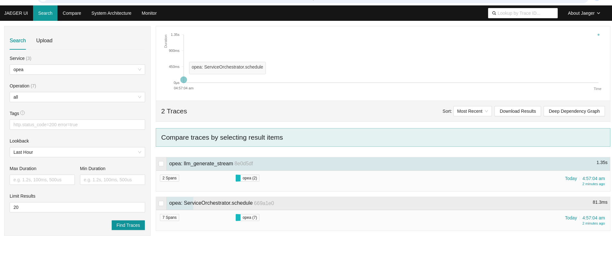

Clicking on the opea: ServiceOrchestrator.schedule trace will expand to reveal seven spans along the timeline.
The first span represents the main schedule function, which has minimal self-execution time, indicated in black.
The second span corresponds to the embedding microservice execution time, taking 33.72 ms as shown in the diagram.
Following the embedding is the retriever span, which took only 3.13 ms.
The last span captures the LLM functions on the CPU, with an execution time of 41.99 ms.
These spans provide a detailed breakdown of the execution flow and timing for each component within the service orchestration.

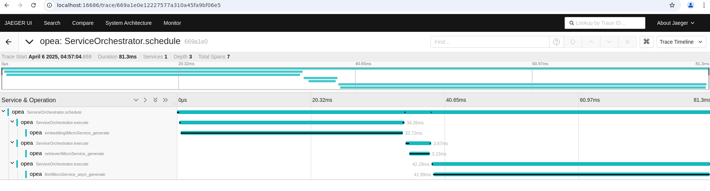

The second trace following the schedule trace is opea: llm_generate_stream, which operates on Gaudi, as depicted in the diagram.
This trace provides insights into the execution of LLM functions on Gaudi,
highlighting the processing of stream requests and the associated spans for token generation.

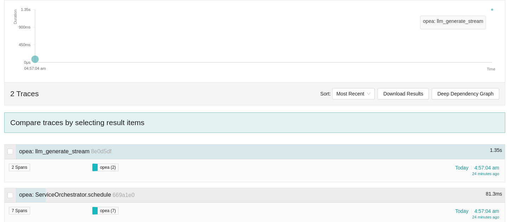

Clicking on the opea: llm_generate_stream trace will expand to reveal two spans along the timeline.
The first span represents the execution time for the first token, which took 15.12 ms in this run.
The second span captures the execution time for all subsequent tokens, taking 920 ms as shown in the diagram.

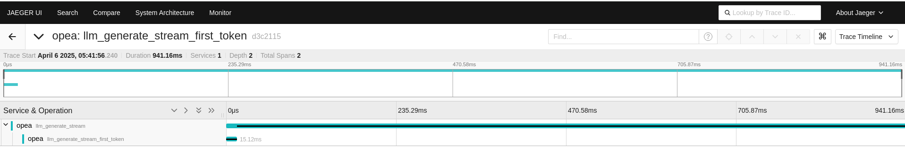

Overall, the traces on the CPU consist of seven spans and are represented as larger circles.
In contrast, the traces on Gaudi have two spans and are depicted as smaller circles.
The diagrams below illustrate a run with 16 user requests, resulting in a total of 32 traces.
In this scenario, the larger circles, representing CPU traces, took less time than the smaller circles,
indicating that the requests required more processing time on Gaudi compared to the CPU.

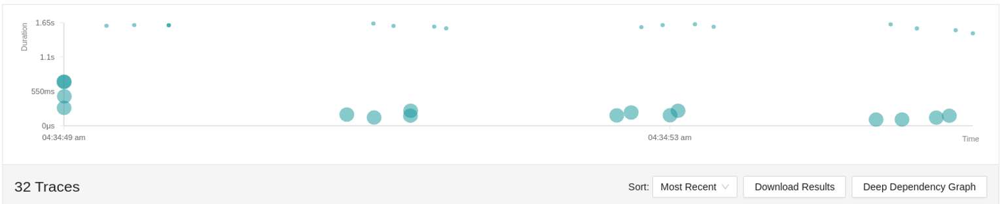.

## Telemetry Metrics with Grafana on Gaudi

The ChatQnA application offers several useful dashboards that provide valuable insights into its performance and operations.
These dashboards are designed to help monitor various aspects of the application, such as service execution times, resource utilization, and system health,
enabling users to effectively manage and optimize the application.

### ChatQnA MegaService Dashboard

This dashboard provides metrics for services within the ChatQnA megaservice.
The chatqna-backend-server service, which functions as the megaservice,
is highlighted with its average response time displayed across multiple runs.
Additionally, the dashboard presents CPU and memory usage statistics for the megaservice,
offering a comprehensive view of its performance and resource consumption.

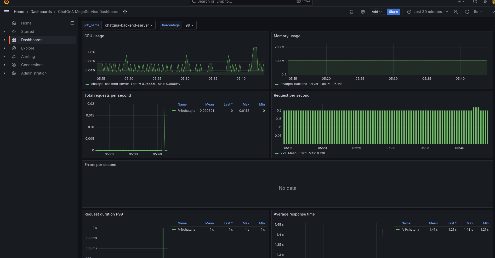

The dashboard can also display metrics for the dataprep-redis-service and the retriever service.
These metrics provide insights into the performance and resource utilization of these services,
allowing for a more comprehensive understanding of the ChatQnA application's overall operation.

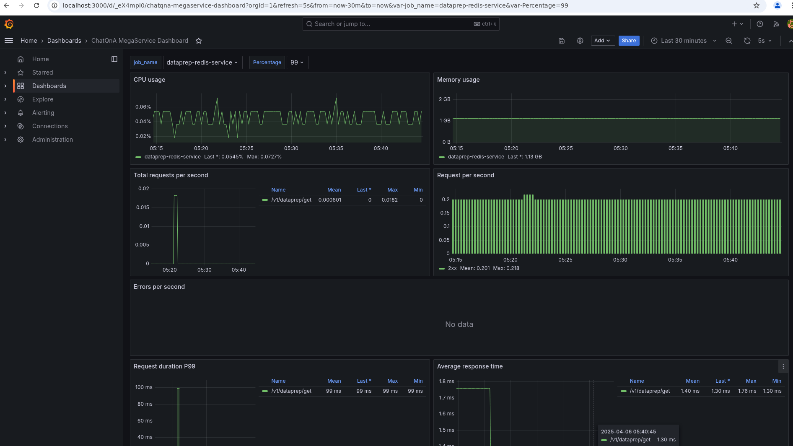

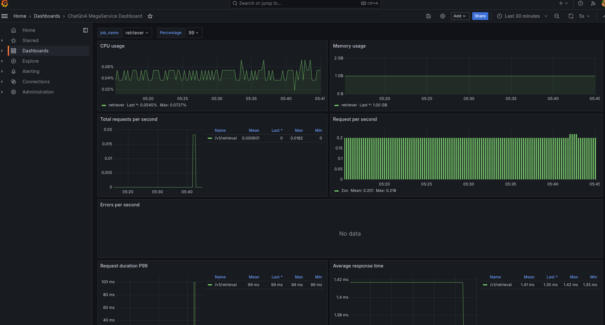

### LLM Dashboard

This dashboard presents metrics for the LLM service, including key performance indicators such as request latency, time per output token latency,
and time to first token latency, among others.
These metrics offer valuable insights into the efficiency and responsiveness of the LLM service,
helping to identify areas for optimization and ensuring smooth operation.

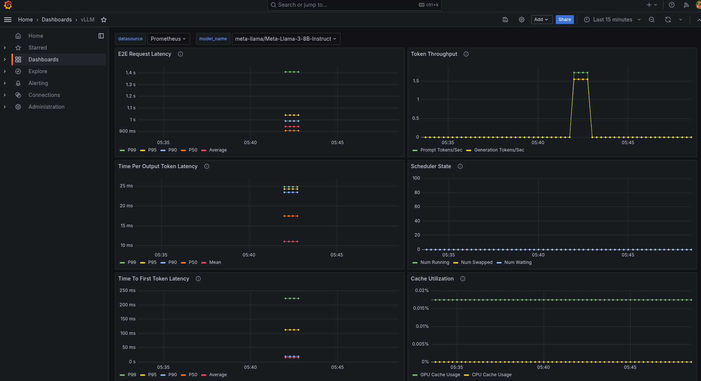

The dashboard also displays metrics for request prompt length and output length.

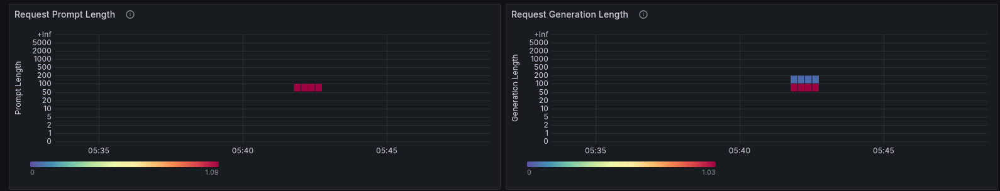
